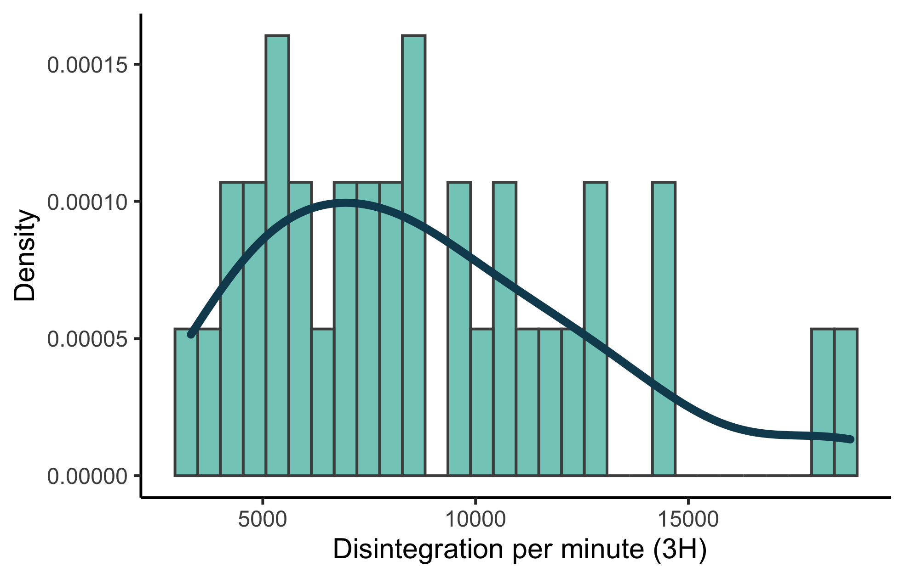
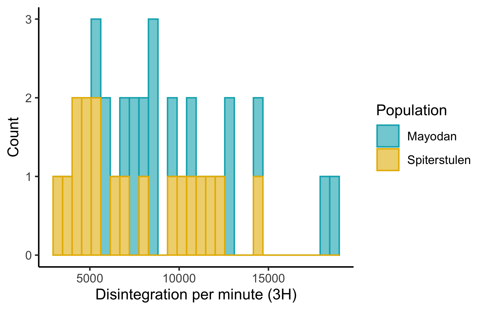
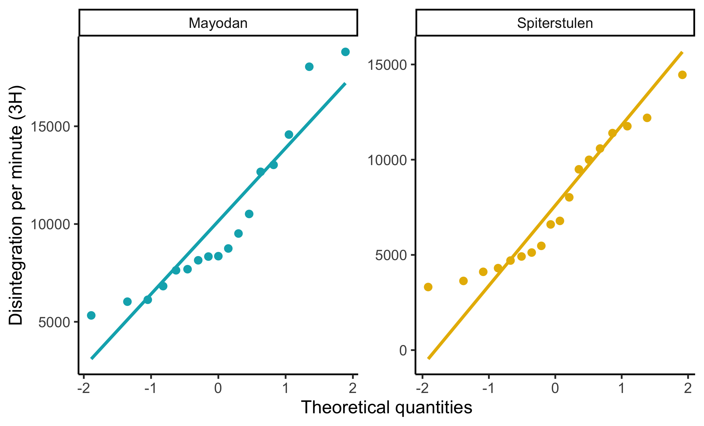
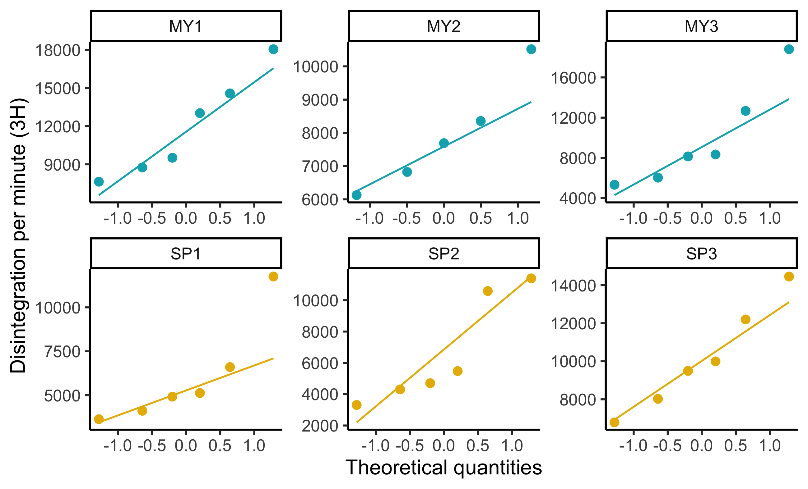
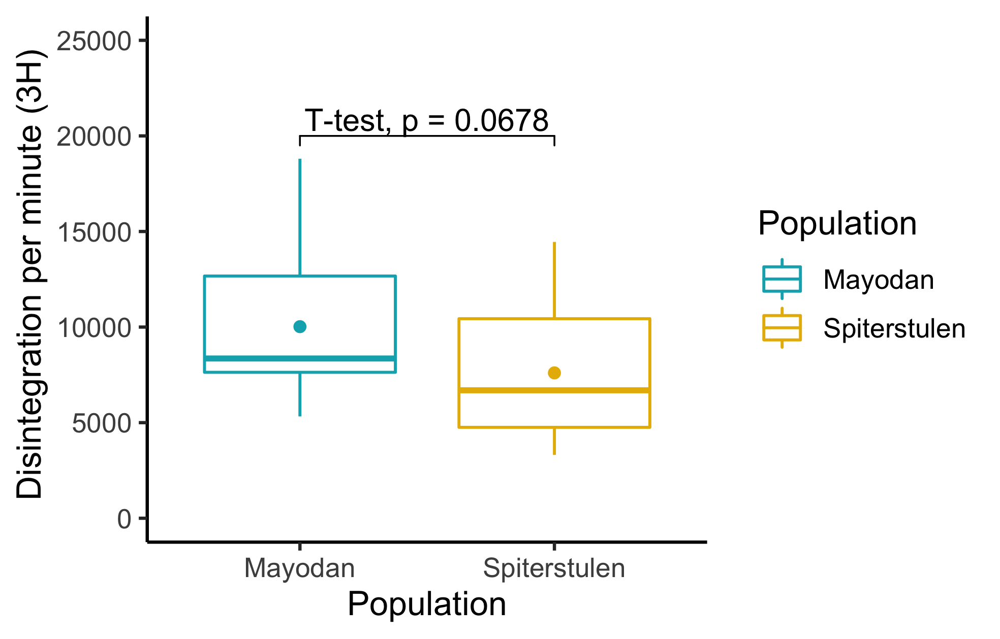
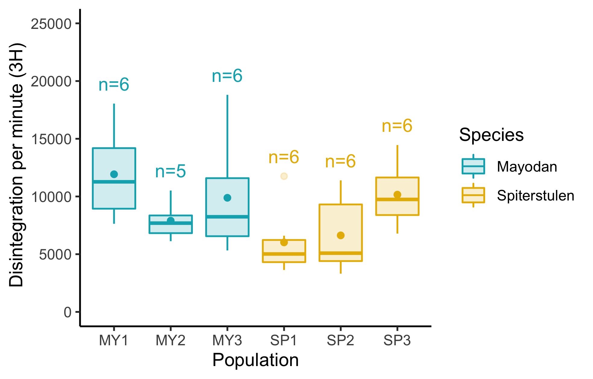
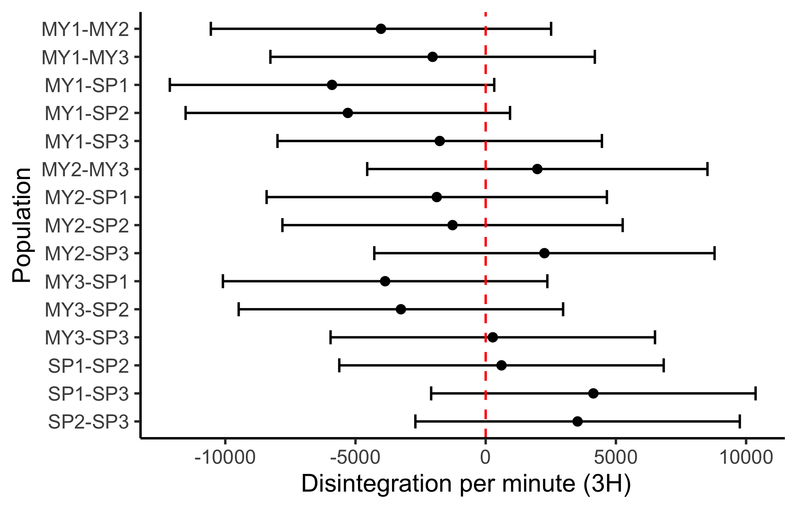

# Section 01 - Prepare 
## Loading Packages


```r
knitr::opts_chunk$set(echo = TRUE)

library(tidyverse)
library(rstatix)
library(emmeans)
library(ggpubr)
library(readxl)
library(kableExtra) #I use it to format html tables
library(sjPlot)
#devtools::install_github("haozhu233/kableExtra")
```


## Read data

**auxin.data** has datashet on Sheet1, rom A2: L37. Remarks says possible 
outliers or contaminated data are; MY2:1 (row number 7), 12, and 24


```r
path<- "../data/"

adata<- readxl::read_excel(path = paste0(path, "/auxin_tranportData.xls"),sheet = "Sheet1",
                    range = "A1:L37",col_names = TRUE)

str(adata)
```

```
## tibble [36 × 12] (S3: tbl_df/tbl/data.frame)
##  $ SAMPLE                : num [1:36] 1 2 3 4 5 6 7 8 9 10 ...
##  $ POPULATION            : chr [1:36] "MY" "MY" "MY" "MY" ...
##  $ Individual            : chr [1:36] "MY1" "MY1" "MY1" "MY1" ...
##  $ TIME                  : num [1:36] 2 2 2 2 2 2 2 2 2 2 ...
##  $ H#                    : num [1:36] 90 84 80 78.2 78.9 78.3 81 83.9 79.2 80.6 ...
##  $ CPM_3H                : num [1:36] 3671 5202 3118 7443 5929 ...
##  $ % ERROR               : num [1:36] 2.33 1.96 2.53 1.64 1.83 2.36 20 2.18 2.52 2.42 ...
##  $ 3H_DPM                : num [1:36] 9515 13026 7634 18046 14576 ...
##  $ 3H eff-1              : num [1:36] 38.6 39.9 40.8 41.2 41.1 ...
##  $ LUMEX                 : num [1:36] 0.01 0 0 0 0 0 0.11 0 0 0 ...
##  $ ELAPSED TIME          : num [1:36] 2.76 5.61 8.46 11.21 14.18 ...
##  $ fmol = SA * 2.22 / DPM: num [1:36] 0.00583 0.00426 0.00727 0.00308 0.00381 ...
```

There are some inconsistent name variable names, lets change them.


```r
names(adata)<- c("sample", "population", "popID", "time", "hourZero", "cpm3H",
                 "perError", "dpm3H", "eff-13H", "lumex", "elapTime", "fmol"
                 )

# change character to factor

adata$population<- factor(adata$population,
                     labels =  c("Mayodan","Spiterstulen"),
                     levels =  c("MY", "SP")
                     )

# create replicate column for easyness
 ## first remove observation with high error rate

adata<- adata[-7,] # removing errenous observation

## create replicates
adata<- adata %>% group_by(population) %>% mutate(sid = 1:n())

head(adata[,c(2, 13)], 10) %>% kbl() %>% kable_styling(full_width = FALSE)
```

<table class="table" style="width: auto !important; margin-left: auto; margin-right: auto;">
 <thead>
  <tr>
   <th style="text-align:left;"> population </th>
   <th style="text-align:right;"> sid </th>
  </tr>
 </thead>
<tbody>
  <tr>
   <td style="text-align:left;"> Mayodan </td>
   <td style="text-align:right;"> 1 </td>
  </tr>
  <tr>
   <td style="text-align:left;"> Mayodan </td>
   <td style="text-align:right;"> 2 </td>
  </tr>
  <tr>
   <td style="text-align:left;"> Mayodan </td>
   <td style="text-align:right;"> 3 </td>
  </tr>
  <tr>
   <td style="text-align:left;"> Mayodan </td>
   <td style="text-align:right;"> 4 </td>
  </tr>
  <tr>
   <td style="text-align:left;"> Mayodan </td>
   <td style="text-align:right;"> 5 </td>
  </tr>
  <tr>
   <td style="text-align:left;"> Mayodan </td>
   <td style="text-align:right;"> 6 </td>
  </tr>
  <tr>
   <td style="text-align:left;"> Mayodan </td>
   <td style="text-align:right;"> 7 </td>
  </tr>
  <tr>
   <td style="text-align:left;"> Mayodan </td>
   <td style="text-align:right;"> 8 </td>
  </tr>
  <tr>
   <td style="text-align:left;"> Mayodan </td>
   <td style="text-align:right;"> 9 </td>
  </tr>
  <tr>
   <td style="text-align:left;"> Mayodan </td>
   <td style="text-align:right;"> 10 </td>
  </tr>
</tbody>
</table>

```r
tail(adata[, c(2,13)], 10) %>% kbl() %>% kable_styling(full_width = FALSE)
```

<table class="table" style="width: auto !important; margin-left: auto; margin-right: auto;">
 <thead>
  <tr>
   <th style="text-align:left;"> population </th>
   <th style="text-align:right;"> sid </th>
  </tr>
 </thead>
<tbody>
  <tr>
   <td style="text-align:left;"> Spiterstulen </td>
   <td style="text-align:right;"> 9 </td>
  </tr>
  <tr>
   <td style="text-align:left;"> Spiterstulen </td>
   <td style="text-align:right;"> 10 </td>
  </tr>
  <tr>
   <td style="text-align:left;"> Spiterstulen </td>
   <td style="text-align:right;"> 11 </td>
  </tr>
  <tr>
   <td style="text-align:left;"> Spiterstulen </td>
   <td style="text-align:right;"> 12 </td>
  </tr>
  <tr>
   <td style="text-align:left;"> Spiterstulen </td>
   <td style="text-align:right;"> 13 </td>
  </tr>
  <tr>
   <td style="text-align:left;"> Spiterstulen </td>
   <td style="text-align:right;"> 14 </td>
  </tr>
  <tr>
   <td style="text-align:left;"> Spiterstulen </td>
   <td style="text-align:right;"> 15 </td>
  </tr>
  <tr>
   <td style="text-align:left;"> Spiterstulen </td>
   <td style="text-align:right;"> 16 </td>
  </tr>
  <tr>
   <td style="text-align:left;"> Spiterstulen </td>
   <td style="text-align:right;"> 17 </td>
  </tr>
  <tr>
   <td style="text-align:left;"> Spiterstulen </td>
   <td style="text-align:right;"> 18 </td>
  </tr>
</tbody>
</table>

```r
table(adata$population) %>% kbl() %>% kable_paper("hover", full_width = FALSE)
```

<table class=" lightable-paper lightable-hover" style='font-family: "Arial Narrow", arial, helvetica, sans-serif; width: auto !important; margin-left: auto; margin-right: auto;'>
 <thead>
  <tr>
   <th style="text-align:left;"> Var1 </th>
   <th style="text-align:right;"> Freq </th>
  </tr>
 </thead>
<tbody>
  <tr>
   <td style="text-align:left;"> Mayodan </td>
   <td style="text-align:right;"> 17 </td>
  </tr>
  <tr>
   <td style="text-align:left;"> Spiterstulen </td>
   <td style="text-align:right;"> 18 </td>
  </tr>
</tbody>
</table>

```r
adata<- adata %>% mutate(species = as.factor(popID))
table(adata$species) %>% kbl() %>% kable_paper("hover", full_width = FALSE)
```

<table class=" lightable-paper lightable-hover" style='font-family: "Arial Narrow", arial, helvetica, sans-serif; width: auto !important; margin-left: auto; margin-right: auto;'>
 <thead>
  <tr>
   <th style="text-align:left;"> Var1 </th>
   <th style="text-align:right;"> Freq </th>
  </tr>
 </thead>
<tbody>
  <tr>
   <td style="text-align:left;"> MY1 </td>
   <td style="text-align:right;"> 6 </td>
  </tr>
  <tr>
   <td style="text-align:left;"> MY2 </td>
   <td style="text-align:right;"> 5 </td>
  </tr>
  <tr>
   <td style="text-align:left;"> MY3 </td>
   <td style="text-align:right;"> 6 </td>
  </tr>
  <tr>
   <td style="text-align:left;"> SP1 </td>
   <td style="text-align:right;"> 6 </td>
  </tr>
  <tr>
   <td style="text-align:left;"> SP2 </td>
   <td style="text-align:right;"> 6 </td>
  </tr>
  <tr>
   <td style="text-align:left;"> SP3 </td>
   <td style="text-align:right;"> 6 </td>
  </tr>
</tbody>
</table>

# Section 02 - Summary Statistics


Now the data are cleaned, lets look at summary statistics

## For Population

The difference in mean is around 2400 
<table class="table" style="width: auto !important; margin-left: auto; margin-right: auto;">
 <thead>
  <tr>
   <th style="text-align:left;"> population </th>
   <th style="text-align:right;"> mean </th>
   <th style="text-align:right;"> sd </th>
   <th style="text-align:right;"> IQR </th>
   <th style="text-align:right;"> %25 Q </th>
   <th style="text-align:right;"> %50 Q </th>
   <th style="text-align:right;"> %75 Q </th>
  </tr>
 </thead>
<tbody>
  <tr>
   <td style="text-align:left;"> Mayodan </td>
   <td style="text-align:right;"> 10022.045 </td>
   <td style="text-align:right;"> 4062.547 </td>
   <td style="text-align:right;"> 5036.40 </td>
   <td style="text-align:right;"> 7634.050 </td>
   <td style="text-align:right;"> 8356.310 </td>
   <td style="text-align:right;"> 12670.45 </td>
  </tr>
  <tr>
   <td style="text-align:left;"> Spiterstulen </td>
   <td style="text-align:right;"> 7603.797 </td>
   <td style="text-align:right;"> 3458.120 </td>
   <td style="text-align:right;"> 5681.84 </td>
   <td style="text-align:right;"> 4756.292 </td>
   <td style="text-align:right;"> 6693.175 </td>
   <td style="text-align:right;"> 10438.13 </td>
  </tr>
</tbody>
</table>

## For Population and Species

```
## `summarise()` has grouped output by 'population'. You can override using the
## `.groups` argument.
```

<table class="table" style="width: auto !important; margin-left: auto; margin-right: auto;">
 <thead>
  <tr>
   <th style="text-align:left;"> population </th>
   <th style="text-align:left;"> species </th>
   <th style="text-align:right;"> mean </th>
   <th style="text-align:right;"> sd </th>
   <th style="text-align:right;"> IQR </th>
   <th style="text-align:right;"> %25 Q </th>
   <th style="text-align:right;"> %50 Q </th>
   <th style="text-align:right;"> %75 Q </th>
  </tr>
 </thead>
<tbody>
  <tr>
   <td style="text-align:left;"> Mayodan </td>
   <td style="text-align:left;"> MY1 </td>
   <td style="text-align:right;"> 11924.397 </td>
   <td style="text-align:right;"> 4000.068 </td>
   <td style="text-align:right;"> 5247.302 </td>
   <td style="text-align:right;"> 8941.145 </td>
   <td style="text-align:right;"> 11270.455 </td>
   <td style="text-align:right;"> 14188.448 </td>
  </tr>
  <tr>
   <td style="text-align:left;"> Mayodan </td>
   <td style="text-align:left;"> MY2 </td>
   <td style="text-align:right;"> 7902.842 </td>
   <td style="text-align:right;"> 1687.814 </td>
   <td style="text-align:right;"> 1532.450 </td>
   <td style="text-align:right;"> 6823.860 </td>
   <td style="text-align:right;"> 7690.500 </td>
   <td style="text-align:right;"> 8356.310 </td>
  </tr>
  <tr>
   <td style="text-align:left;"> Mayodan </td>
   <td style="text-align:left;"> MY3 </td>
   <td style="text-align:right;"> 9885.695 </td>
   <td style="text-align:right;"> 5067.361 </td>
   <td style="text-align:right;"> 5028.375 </td>
   <td style="text-align:right;"> 6558.535 </td>
   <td style="text-align:right;"> 8241.130 </td>
   <td style="text-align:right;"> 11586.910 </td>
  </tr>
  <tr>
   <td style="text-align:left;"> Spiterstulen </td>
   <td style="text-align:left;"> SP1 </td>
   <td style="text-align:right;"> 6023.430 </td>
   <td style="text-align:right;"> 2987.290 </td>
   <td style="text-align:right;"> 1918.622 </td>
   <td style="text-align:right;"> 4312.285 </td>
   <td style="text-align:right;"> 5019.435 </td>
   <td style="text-align:right;"> 6230.908 </td>
  </tr>
  <tr>
   <td style="text-align:left;"> Spiterstulen </td>
   <td style="text-align:left;"> SP2 </td>
   <td style="text-align:right;"> 6629.805 </td>
   <td style="text-align:right;"> 3459.220 </td>
   <td style="text-align:right;"> 4903.932 </td>
   <td style="text-align:right;"> 4404.555 </td>
   <td style="text-align:right;"> 5088.970 </td>
   <td style="text-align:right;"> 9308.487 </td>
  </tr>
  <tr>
   <td style="text-align:left;"> Spiterstulen </td>
   <td style="text-align:left;"> SP3 </td>
   <td style="text-align:right;"> 10158.155 </td>
   <td style="text-align:right;"> 2793.555 </td>
   <td style="text-align:right;"> 3254.927 </td>
   <td style="text-align:right;"> 8390.907 </td>
   <td style="text-align:right;"> 9743.830 </td>
   <td style="text-align:right;"> 11645.835 </td>
  </tr>
</tbody>
</table>

# Section 03 - Check Assumptions for Parametric analysis

## Overall Histogram

```r
grDevices::png(filename = "plots/hist_all.png",  width = 12.5, height = 8, units = 'cm', res = 400)

# data = adata
(HistoPmani <- ggplot(data = adata,aes(x = dpm3H))+
 geom_histogram(mapping = aes(y = ..density..),
                   #breaks = (seq(-3,4, by = 1)),
                   colour = "gray30",
                   fill = "#00a896",
                alpha = 0.6)+
  geom_density(color = "#114b5f", size = 1.5) +
  xlab(" Disintegration per minute (3H)") +
  ylab("Density") +
theme_classic()
)
```

```
## `stat_bin()` using `bins = 30`. Pick better value with `binwidth`.
```

```r
dev.off()
```

```
## quartz_off_screen 
##                 2
```

```r

```


## For population

### Histogram

```r
grDevices::png(filename = "plots/hist_pop.png",  width = 12.5, height = 8, units = 'cm', res = 400)

# data = adata
(HistoPmani <- ggplot(data = adata,aes(x = dpm3H, fill = population, color = population))+
   geom_histogram(
                  #breaks = (seq(-3,4, by = 1)),
                  alpha = 0.6
                ) +
    xlab("Disintegration per minute (3H)") +
    ylab("Count") + 
    scale_fill_manual("Population",values = c("#00AFBB", "#E7B800")) +
    scale_color_manual("Population",values = c("#00AFBB", "#E7B800")) +
    theme_classic()
)
```

```
## `stat_bin()` using `bins = 30`. Pick better value with `binwidth`.
```

```r
dev.off()
```

```
## quartz_off_screen 
##                 2
```

```r

```


### Outliers

No outliers identified.

```r
#----------- outlier
(adata %>% group_by(population) %>% 
  identify_outliers(dpm3H)) %>% kbl %>% kable_styling()
```

<table class="table" style="margin-left: auto; margin-right: auto;">
 <thead>
  <tr>
   <th style="text-align:left;"> population </th>
   <th style="text-align:right;"> sample </th>
   <th style="text-align:left;"> popID </th>
   <th style="text-align:right;"> time </th>
   <th style="text-align:right;"> hourZero </th>
   <th style="text-align:right;"> cpm3H </th>
   <th style="text-align:right;"> perError </th>
   <th style="text-align:right;"> dpm3H </th>
   <th style="text-align:right;"> eff-13H </th>
   <th style="text-align:right;"> lumex </th>
   <th style="text-align:right;"> elapTime </th>
   <th style="text-align:right;"> fmol </th>
   <th style="text-align:right;"> sid </th>
   <th style="text-align:left;"> species </th>
   <th style="text-align:left;"> is.outlier </th>
   <th style="text-align:left;"> is.extreme </th>
  </tr>
 </thead>
<tbody>
  <tr>

  </tr>
</tbody>
</table>

```r
# no outliers
```

### Normality

Distribution for Mayodan seems to non-normal, while for Spiterstulen is more or less normal accroding to the Shapiro-test and graphs.

```r
#--------- Normality

# normality of dat can be checked with shapiro.test() test 
kable(adata %>% group_by(population) %>% 
  shapiro_test(dpm3H)) %>% kable_styling(full_width = FALSE)
```

<table class="table" style="width: auto !important; margin-left: auto; margin-right: auto;">
 <thead>
  <tr>
   <th style="text-align:left;"> population </th>
   <th style="text-align:left;"> variable </th>
   <th style="text-align:right;"> statistic </th>
   <th style="text-align:right;"> p </th>
  </tr>
 </thead>
<tbody>
  <tr>
   <td style="text-align:left;"> Mayodan </td>
   <td style="text-align:left;"> dpm3H </td>
   <td style="text-align:right;"> 0.8751653 </td>
   <td style="text-align:right;"> 0.0265700 </td>
  </tr>
  <tr>
   <td style="text-align:left;"> Spiterstulen </td>
   <td style="text-align:left;"> dpm3H </td>
   <td style="text-align:right;"> 0.9172804 </td>
   <td style="text-align:right;"> 0.1157017 </td>
  </tr>
</tbody>
</table>

```r
grDevices::png(filename = "plots/qq_pop.png",  width = 16.5, height = 10, units = 'cm', res = 400)

#-------- QQ plot
adata %>% ggplot(aes(sample = dpm3H, color = population), alpha = 0.8)+
  geom_qq(  geom = "point",
            position = "identity",
            distribution = stats::qnorm,
            size = 2)+
  scale_color_manual("Population",values = c("#00AFBB", "#E7B800")) +
  stat_qq_line(size = 1)+
  facet_wrap(vars(population),scales = "free")+
  xlab("Theoretical quantities") +
  ylab("Disintegration per minute (3H)") +
  theme_classic(12) +
  theme(
    legend.position = "none"
  )

dev.off()
```

```
## quartz_off_screen 
##                 2
```

```r

```


### Homogenity

Check Homogenity with Levene's test. This test for homogenity is less sensitive with the non-normal distributions.

From the output above we can see that the p-value is not less than the significance level of 0.05. This means that there is no evidence to suggest that the variance across groups is statistically significantly different. Therefore, we can assume the homogeneity of variances in the different treatment groups.

```r
#------- Homogeneity of variances: Levene's test

adata<- adata %>%  ungroup()

(adata %>%  levene_test(dpm3H~population)) %>% kbl() %>% kable_styling(full_width = F)
```

<table class="table" style="width: auto !important; margin-left: auto; margin-right: auto;">
 <thead>
  <tr>
   <th style="text-align:right;"> df1 </th>
   <th style="text-align:right;"> df2 </th>
   <th style="text-align:right;"> statistic </th>
   <th style="text-align:right;"> p </th>
  </tr>
 </thead>
<tbody>
  <tr>
   <td style="text-align:right;"> 1 </td>
   <td style="text-align:right;"> 33 </td>
   <td style="text-align:right;"> 0.0001666 </td>
   <td style="text-align:right;"> 0.9897792 </td>
  </tr>
</tbody>
</table>

```r
# observations have equal variances
```

## For Species

### Outliers

```r
#----------- outlier
adata %>% group_by(species) %>% 
  identify_outliers(dpm3H) %>% kbl() %>% kable_styling(full_width = F)
```

<table class="table" style="width: auto !important; margin-left: auto; margin-right: auto;">
 <thead>
  <tr>
   <th style="text-align:left;"> species </th>
   <th style="text-align:right;"> sample </th>
   <th style="text-align:left;"> population </th>
   <th style="text-align:left;"> popID </th>
   <th style="text-align:right;"> time </th>
   <th style="text-align:right;"> hourZero </th>
   <th style="text-align:right;"> cpm3H </th>
   <th style="text-align:right;"> perError </th>
   <th style="text-align:right;"> dpm3H </th>
   <th style="text-align:right;"> eff-13H </th>
   <th style="text-align:right;"> lumex </th>
   <th style="text-align:right;"> elapTime </th>
   <th style="text-align:right;"> fmol </th>
   <th style="text-align:right;"> sid </th>
   <th style="text-align:left;"> is.outlier </th>
   <th style="text-align:left;"> is.extreme </th>
  </tr>
 </thead>
<tbody>
  <tr>
   <td style="text-align:left;"> SP1 </td>
   <td style="text-align:right;"> 21 </td>
   <td style="text-align:left;"> Spiterstulen </td>
   <td style="text-align:left;"> SP1 </td>
   <td style="text-align:right;"> 2 </td>
   <td style="text-align:right;"> 76.3 </td>
   <td style="text-align:right;"> 4299 </td>
   <td style="text-align:right;"> 2.02 </td>
   <td style="text-align:right;"> 11757.36 </td>
   <td style="text-align:right;"> 41.67 </td>
   <td style="text-align:right;"> 0 </td>
   <td style="text-align:right;"> 60.21 </td>
   <td style="text-align:right;"> 0.0047204 </td>
   <td style="text-align:right;"> 3 </td>
   <td style="text-align:left;"> TRUE </td>
   <td style="text-align:left;"> FALSE </td>
  </tr>
</tbody>
</table>

```r
# one outlier
```


```r
# This code to delete outlier but we ignore it

#adata<- adata[-adata$sample[adata$sample == 21],] # I don't know but using
# 21 deleted sample 22
```

### Normality

Distributions are normal except of SP1 and SP2.

```r
#--------- Normality

# normality of dat can be checked with shapiro.test() test 
adata %>% group_by(species) %>% 
  shapiro_test(dpm3H) %>% kbl() %>% kable_styling(full_width = F)
```

<table class="table" style="width: auto !important; margin-left: auto; margin-right: auto;">
 <thead>
  <tr>
   <th style="text-align:left;"> species </th>
   <th style="text-align:left;"> variable </th>
   <th style="text-align:right;"> statistic </th>
   <th style="text-align:right;"> p </th>
  </tr>
 </thead>
<tbody>
  <tr>
   <td style="text-align:left;"> MY1 </td>
   <td style="text-align:left;"> dpm3H </td>
   <td style="text-align:right;"> 0.9330092 </td>
   <td style="text-align:right;"> 0.6035324 </td>
  </tr>
  <tr>
   <td style="text-align:left;"> MY2 </td>
   <td style="text-align:left;"> dpm3H </td>
   <td style="text-align:right;"> 0.9479259 </td>
   <td style="text-align:right;"> 0.7223655 </td>
  </tr>
  <tr>
   <td style="text-align:left;"> MY3 </td>
   <td style="text-align:left;"> dpm3H </td>
   <td style="text-align:right;"> 0.8664216 </td>
   <td style="text-align:right;"> 0.2123100 </td>
  </tr>
  <tr>
   <td style="text-align:left;"> SP1 </td>
   <td style="text-align:left;"> dpm3H </td>
   <td style="text-align:right;"> 0.7909549 </td>
   <td style="text-align:right;"> 0.0486558 </td>
  </tr>
  <tr>
   <td style="text-align:left;"> SP2 </td>
   <td style="text-align:left;"> dpm3H </td>
   <td style="text-align:right;"> 0.8257984 </td>
   <td style="text-align:right;"> 0.0989931 </td>
  </tr>
  <tr>
   <td style="text-align:left;"> SP3 </td>
   <td style="text-align:left;"> dpm3H </td>
   <td style="text-align:right;"> 0.9683243 </td>
   <td style="text-align:right;"> 0.8809949 </td>
  </tr>
</tbody>
</table>

```r
# when observation # & removed the Mayodan species is not longer normal

grDevices::png(filename = "plots/qq_species.png",  width = 16.5, height = 10, units = 'cm', res = 400)

#-------- QQ plot
adata %>% ggplot(aes(sample = dpm3H, color = population))+
  geom_qq(  geom = "point",
            position = "identity",
            distribution = stats::qnorm,
            size = 2)+
  scale_color_manual("Population",values = c("#00AFBB", "#E7B800")) +
  xlab("Theoretical quantities") +
  ylab("Disintegration per minute (3H)") +
  stat_qq_line()+
  facet_wrap(vars(species),scales = "free") +
  theme_classic(12) + 
  theme(
    legend.position = "none",
  )

dev.off()
```

```
## quartz_off_screen 
##                 2
```

```r

```


### Homogenty

P-value is not below 0.05, hence, groups are homogenous.

```r
#------- Homogeneity of variances: Levene's test

adata %>% levene_test(dpm3H~species) %>% kbl() %>% kable_styling(full_width = F)
```

<table class="table" style="width: auto !important; margin-left: auto; margin-right: auto;">
 <thead>
  <tr>
   <th style="text-align:right;"> df1 </th>
   <th style="text-align:right;"> df2 </th>
   <th style="text-align:right;"> statistic </th>
   <th style="text-align:right;"> p </th>
  </tr>
 </thead>
<tbody>
  <tr>
   <td style="text-align:right;"> 5 </td>
   <td style="text-align:right;"> 29 </td>
   <td style="text-align:right;"> 0.6746619 </td>
   <td style="text-align:right;"> 0.6459666 </td>
  </tr>
</tbody>
</table>

```r
# observations have equal variances
```


# Section 04 - Compare Populations

## Box Plot and T-Test

On the 10% level we can say that groups have different means. 

```r
# H0:  mu(popSP): mu(popMY)
# H1:  Not so

(ptest<- adata %>% 
  t_test(dpm3H ~ population, paired = FALSE)) %>% kbl() %>% kable_styling(full_width = F)
```

<table class="table" style="width: auto !important; margin-left: auto; margin-right: auto;">
 <thead>
  <tr>
   <th style="text-align:left;"> .y. </th>
   <th style="text-align:left;"> group1 </th>
   <th style="text-align:left;"> group2 </th>
   <th style="text-align:right;"> n1 </th>
   <th style="text-align:right;"> n2 </th>
   <th style="text-align:right;"> statistic </th>
   <th style="text-align:right;"> df </th>
   <th style="text-align:right;"> p </th>
  </tr>
 </thead>
<tbody>
  <tr>
   <td style="text-align:left;"> dpm3H </td>
   <td style="text-align:left;"> Mayodan </td>
   <td style="text-align:left;"> Spiterstulen </td>
   <td style="text-align:right;"> 17 </td>
   <td style="text-align:right;"> 18 </td>
   <td style="text-align:right;"> 1.8911 </td>
   <td style="text-align:right;"> 31.50515 </td>
   <td style="text-align:right;"> 0.0678 </td>
  </tr>
</tbody>
</table>

```r
# the means  dpm-3h of SP  is not statistically different from mean of dpm-3h MY at 5% level

# create statistical plot

grDevices::png(filename = "plots/box_pop.png",  width = 12.5, height = 8, units = 'cm', res = 400)

(boxplot<- adata %>% ggplot(aes(x = population, y = dpm3H, color = population))+
  geom_boxplot(stat = "boxplot", alpha = 0.4)+
  stat_summary(geom = "point", fun =  "mean", show.legend = FALSE)+
  xlab( "Population")+
  ylab(" Disintegration per minute (3H)")+
  scale_y_continuous(limits = c(0, 25000))+
  scale_color_manual("Population",values = c("#00AFBB", "#E7B800"))+
  stat_pvalue_manual(ptest,label = "T-test, p = {p}", y.position = 20000) +
  theme_classic(12) +
  theme(#panel.border = element_blank(), # will equivalent to theme_clasifc()
        panel.grid.major = element_blank(),
        panel.grid.minor = element_blank(),
        axis.line = element_line(colour = "black"))
)

dev.off()
```

```
## quartz_off_screen 
##                 2
```

```r

```


## Wilcoxon test

Wilcoxon test is usually used to compare means when the assumption of the normal distribution is violated.

The results are pretty the same as for T-test. Though p-value seems to be closer to 0.05 level this time.

```r
(wtest <- adata %>% 
  wilcox_test(dpm3H ~ population, paired = FALSE)) %>% kbl() %>% kable_styling(full_width = F)
```

<table class="table" style="width: auto !important; margin-left: auto; margin-right: auto;">
 <thead>
  <tr>
   <th style="text-align:left;"> .y. </th>
   <th style="text-align:left;"> group1 </th>
   <th style="text-align:left;"> group2 </th>
   <th style="text-align:right;"> n1 </th>
   <th style="text-align:right;"> n2 </th>
   <th style="text-align:right;"> statistic </th>
   <th style="text-align:right;"> p </th>
  </tr>
 </thead>
<tbody>
  <tr>
   <td style="text-align:left;"> dpm3H </td>
   <td style="text-align:left;"> Mayodan </td>
   <td style="text-align:left;"> Spiterstulen </td>
   <td style="text-align:right;"> 17 </td>
   <td style="text-align:right;"> 18 </td>
   <td style="text-align:right;"> 210 </td>
   <td style="text-align:right;"> 0.0616 </td>
  </tr>
</tbody>
</table>


# Section 05 - Compare species

## Boxplots

In all cases means for Mayodan plants are a bit higher that those of Spiterstulen.

```r
grDevices::png(filename = "plots/box_species.png",  width = 12.5, height = 8, units = 'cm', res = 400)

( bplot_species<- adata %>% 
    group_by(species) %>% mutate(N=n()) %>% 
    mutate(N=ifelse(dpm3H==max(dpm3H,na.rm=T),paste0('n=',N),NA)) %>%
    ggplot(aes(x = species, y = dpm3H, color = population, fill = population, label = N))+
    geom_boxplot(stat = "boxplot", show.legend = TRUE, alpha = 0.2)+
    geom_text(vjust = -1, hjust = 0.5, show.legend = FALSE) +
    stat_summary(geom = "point", fun =  "mean", show.legend = FALSE)+
    xlab( "Population")+
    ylab(" Disintegration per minute (3H)")+
    scale_y_continuous(limits = c(0, 25000))+
    scale_fill_manual("Species",values = c("#00AFBB", "#E7B800"))+
    scale_color_manual("Species",values = c("#00AFBB", "#E7B800"))+
    theme(#panel.border = element_blank(), # will equivalent to theme_clasifc()
      panel.grid.major = element_blank(),
      panel.grid.minor = element_blank(),
      axis.line = element_line(colour = "black"))+
    #stat_pvalue_manual(pwcs,label = "T-test, p.adj = {p.adj}",hide.ns = TRUE) +
    theme_classic()
  )
```

```
## Warning: Removed 29 rows containing missing values (geom_text).
```

```r
dev.off()
```

```
## quartz_off_screen 
##                 2
```

```r

```


## Anova by Species

H0:  mu(species1)= mu(species2)  = ... = mu(species5)
H1:  at least one mean is not equal

Classic anova suggests that on 10% level there's a significant difference within groups.

```r
# H0:  mu(species1)= mu(species2)  = ... = mu(species5)
# H1:  at least one mean is not equal 

# possible two way interaction

# adata %>% anova_test(dv = dpm3H, wid = sp_id, within = c(species))

(sp_test<- adata %>% anova_test(dpm3H ~ species,type = 3)) %>% 
  kbl() %>% kable_styling(full_width = FALSE)
```

```
## Coefficient covariances computed by hccm()
```

<table class="table" style="width: auto !important; margin-left: auto; margin-right: auto;">
 <thead>
  <tr>
   <th style="text-align:left;"> Effect </th>
   <th style="text-align:right;"> DFn </th>
   <th style="text-align:right;"> DFd </th>
   <th style="text-align:right;"> F </th>
   <th style="text-align:right;"> p </th>
   <th style="text-align:left;"> p&lt;.05 </th>
   <th style="text-align:right;"> ges </th>
  </tr>
 </thead>
<tbody>
  <tr>
   <td style="text-align:left;"> species </td>
   <td style="text-align:right;"> 5 </td>
   <td style="text-align:right;"> 29 </td>
   <td style="text-align:right;"> 2.479 </td>
   <td style="text-align:right;"> 0.055 </td>
   <td style="text-align:left;">  </td>
   <td style="text-align:right;"> 0.299 </td>
  </tr>
</tbody>
</table>

```r
#------------ global anova by specis is significant
```

We can also run anova with adjusted p-values, but the output is the same,

```r
sp_anova<-  adata %>% 
  anova_test(
    dv        = dpm3H,
    wid       = sample,
    between   = species,
    type = 3)
```

```
## Coefficient covariances computed by hccm()
```

```r
# extract the anova and adjust p-value
main.spChange <- get_anova_table(sp_anova) %>% 
  adjust_pvalue(method = "fdr")

main.spChange %>%
  kbl() %>%
  kable_styling(full_width = FALSE)
```

<table class="table" style="width: auto !important; margin-left: auto; margin-right: auto;">
 <thead>
  <tr>
   <th style="text-align:left;"> Effect </th>
   <th style="text-align:right;"> DFn </th>
   <th style="text-align:right;"> DFd </th>
   <th style="text-align:right;"> F </th>
   <th style="text-align:right;"> p </th>
   <th style="text-align:left;"> p&lt;.05 </th>
   <th style="text-align:right;"> ges </th>
   <th style="text-align:right;"> p.adj </th>
  </tr>
 </thead>
<tbody>
  <tr>
   <td style="text-align:left;"> species </td>
   <td style="text-align:right;"> 5 </td>
   <td style="text-align:right;"> 29 </td>
   <td style="text-align:right;"> 2.479 </td>
   <td style="text-align:right;"> 0.055 </td>
   <td style="text-align:left;">  </td>
   <td style="text-align:right;"> 0.299 </td>
   <td style="text-align:right;"> 0.055 </td>
  </tr>
</tbody>
</table>


## Tukey post-hoc test

We run Tukey test to compare each pair of factors.

The only pair to have a significant difference (on 10% level) is MY1-SP1.

```r
#------------------- which groups are significant??

# Pairwise comparisons
pwcs<- adata %>% tukey_hsd(dpm3H ~ species)

pwcs %>% 
  mutate(estimate = cell_spec(round(estimate, 2), color = ifelse(estimate >= 0, "black","red")),
         conf.low = cell_spec(round(conf.low, 2), color = ifelse(conf.low >= 0, "black", "red")),
         p.adj = cell_spec(round(p.adj, 4), bold = ifelse(p.adj >= 0.1, FALSE, TRUE))) %>%
  kbl(escape = FALSE) %>% 
  kable_styling(full_width = FALSE)
```

<table class="table" style="width: auto !important; margin-left: auto; margin-right: auto;">
 <thead>
  <tr>
   <th style="text-align:left;"> term </th>
   <th style="text-align:left;"> group1 </th>
   <th style="text-align:left;"> group2 </th>
   <th style="text-align:right;"> null.value </th>
   <th style="text-align:left;"> estimate </th>
   <th style="text-align:left;"> conf.low </th>
   <th style="text-align:right;"> conf.high </th>
   <th style="text-align:left;"> p.adj </th>
   <th style="text-align:left;"> p.adj.signif </th>
  </tr>
 </thead>
<tbody>
  <tr>
   <td style="text-align:left;"> species </td>
   <td style="text-align:left;"> MY1 </td>
   <td style="text-align:left;"> MY2 </td>
   <td style="text-align:right;"> 0 </td>
   <td style="text-align:left;"> <span style="     color: red !important;">-4021.55</span> </td>
   <td style="text-align:left;"> <span style="     color: red !important;">-10554.78</span> </td>
   <td style="text-align:right;"> 2511.6750 </td>
   <td style="text-align:left;"> <span style="     ">0.436</span> </td>
   <td style="text-align:left;"> ns </td>
  </tr>
  <tr>
   <td style="text-align:left;"> species </td>
   <td style="text-align:left;"> MY1 </td>
   <td style="text-align:left;"> MY3 </td>
   <td style="text-align:right;"> 0 </td>
   <td style="text-align:left;"> <span style="     color: red !important;">-2038.7</span> </td>
   <td style="text-align:left;"> <span style="     color: red !important;">-8267.89</span> </td>
   <td style="text-align:right;"> 4190.4884 </td>
   <td style="text-align:left;"> <span style="     ">0.915</span> </td>
   <td style="text-align:left;"> ns </td>
  </tr>
  <tr>
   <td style="text-align:left;"> species </td>
   <td style="text-align:left;"> MY1 </td>
   <td style="text-align:left;"> SP1 </td>
   <td style="text-align:right;"> 0 </td>
   <td style="text-align:left;"> <span style="     color: red !important;">-5900.97</span> </td>
   <td style="text-align:left;"> <span style="     color: red !important;">-12130.16</span> </td>
   <td style="text-align:right;"> 328.2234 </td>
   <td style="text-align:left;"> <span style=" font-weight: bold;    ">0.0713</span> </td>
   <td style="text-align:left;"> ns </td>
  </tr>
  <tr>
   <td style="text-align:left;"> species </td>
   <td style="text-align:left;"> MY1 </td>
   <td style="text-align:left;"> SP2 </td>
   <td style="text-align:right;"> 0 </td>
   <td style="text-align:left;"> <span style="     color: red !important;">-5294.59</span> </td>
   <td style="text-align:left;"> <span style="     color: red !important;">-11523.78</span> </td>
   <td style="text-align:right;"> 934.5984 </td>
   <td style="text-align:left;"> <span style="     ">0.132</span> </td>
   <td style="text-align:left;"> ns </td>
  </tr>
  <tr>
   <td style="text-align:left;"> species </td>
   <td style="text-align:left;"> MY1 </td>
   <td style="text-align:left;"> SP3 </td>
   <td style="text-align:right;"> 0 </td>
   <td style="text-align:left;"> <span style="     color: red !important;">-1766.24</span> </td>
   <td style="text-align:left;"> <span style="     color: red !important;">-7995.43</span> </td>
   <td style="text-align:right;"> 4462.9484 </td>
   <td style="text-align:left;"> <span style="     ">0.952</span> </td>
   <td style="text-align:left;"> ns </td>
  </tr>
  <tr>
   <td style="text-align:left;"> species </td>
   <td style="text-align:left;"> MY2 </td>
   <td style="text-align:left;"> MY3 </td>
   <td style="text-align:right;"> 0 </td>
   <td style="text-align:left;"> <span style="     color: black !important;">1982.85</span> </td>
   <td style="text-align:left;"> <span style="     color: red !important;">-4550.38</span> </td>
   <td style="text-align:right;"> 8516.0827 </td>
   <td style="text-align:left;"> <span style="     ">0.937</span> </td>
   <td style="text-align:left;"> ns </td>
  </tr>
  <tr>
   <td style="text-align:left;"> species </td>
   <td style="text-align:left;"> MY2 </td>
   <td style="text-align:left;"> SP1 </td>
   <td style="text-align:right;"> 0 </td>
   <td style="text-align:left;"> <span style="     color: red !important;">-1879.41</span> </td>
   <td style="text-align:left;"> <span style="     color: red !important;">-8412.64</span> </td>
   <td style="text-align:right;"> 4653.8177 </td>
   <td style="text-align:left;"> <span style="     ">0.949</span> </td>
   <td style="text-align:left;"> ns </td>
  </tr>
  <tr>
   <td style="text-align:left;"> species </td>
   <td style="text-align:left;"> MY2 </td>
   <td style="text-align:left;"> SP2 </td>
   <td style="text-align:right;"> 0 </td>
   <td style="text-align:left;"> <span style="     color: red !important;">-1273.04</span> </td>
   <td style="text-align:left;"> <span style="     color: red !important;">-7806.27</span> </td>
   <td style="text-align:right;"> 5260.1927 </td>
   <td style="text-align:left;"> <span style="     ">0.991</span> </td>
   <td style="text-align:left;"> ns </td>
  </tr>
  <tr>
   <td style="text-align:left;"> species </td>
   <td style="text-align:left;"> MY2 </td>
   <td style="text-align:left;"> SP3 </td>
   <td style="text-align:right;"> 0 </td>
   <td style="text-align:left;"> <span style="     color: black !important;">2255.31</span> </td>
   <td style="text-align:left;"> <span style="     color: red !important;">-4277.92</span> </td>
   <td style="text-align:right;"> 8788.5427 </td>
   <td style="text-align:left;"> <span style="     ">0.896</span> </td>
   <td style="text-align:left;"> ns </td>
  </tr>
  <tr>
   <td style="text-align:left;"> species </td>
   <td style="text-align:left;"> MY3 </td>
   <td style="text-align:left;"> SP1 </td>
   <td style="text-align:right;"> 0 </td>
   <td style="text-align:left;"> <span style="     color: red !important;">-3862.27</span> </td>
   <td style="text-align:left;"> <span style="     color: red !important;">-10091.46</span> </td>
   <td style="text-align:right;"> 2366.9251 </td>
   <td style="text-align:left;"> <span style="     ">0.428</span> </td>
   <td style="text-align:left;"> ns </td>
  </tr>
  <tr>
   <td style="text-align:left;"> species </td>
   <td style="text-align:left;"> MY3 </td>
   <td style="text-align:left;"> SP2 </td>
   <td style="text-align:right;"> 0 </td>
   <td style="text-align:left;"> <span style="     color: red !important;">-3255.89</span> </td>
   <td style="text-align:left;"> <span style="     color: red !important;">-9485.08</span> </td>
   <td style="text-align:right;"> 2973.3001 </td>
   <td style="text-align:left;"> <span style="     ">0.609</span> </td>
   <td style="text-align:left;"> ns </td>
  </tr>
  <tr>
   <td style="text-align:left;"> species </td>
   <td style="text-align:left;"> MY3 </td>
   <td style="text-align:left;"> SP3 </td>
   <td style="text-align:right;"> 0 </td>
   <td style="text-align:left;"> <span style="     color: black !important;">272.46</span> </td>
   <td style="text-align:left;"> <span style="     color: red !important;">-5956.73</span> </td>
   <td style="text-align:right;"> 6501.6501 </td>
   <td style="text-align:left;"> <span style="     ">1</span> </td>
   <td style="text-align:left;"> ns </td>
  </tr>
  <tr>
   <td style="text-align:left;"> species </td>
   <td style="text-align:left;"> SP1 </td>
   <td style="text-align:left;"> SP2 </td>
   <td style="text-align:right;"> 0 </td>
   <td style="text-align:left;"> <span style="     color: black !important;">606.38</span> </td>
   <td style="text-align:left;"> <span style="     color: red !important;">-5622.82</span> </td>
   <td style="text-align:right;"> 6835.5651 </td>
   <td style="text-align:left;"> <span style="     ">1</span> </td>
   <td style="text-align:left;"> ns </td>
  </tr>
  <tr>
   <td style="text-align:left;"> species </td>
   <td style="text-align:left;"> SP1 </td>
   <td style="text-align:left;"> SP3 </td>
   <td style="text-align:right;"> 0 </td>
   <td style="text-align:left;"> <span style="     color: black !important;">4134.73</span> </td>
   <td style="text-align:left;"> <span style="     color: red !important;">-2094.47</span> </td>
   <td style="text-align:right;"> 10363.9151 </td>
   <td style="text-align:left;"> <span style="     ">0.354</span> </td>
   <td style="text-align:left;"> ns </td>
  </tr>
  <tr>
   <td style="text-align:left;"> species </td>
   <td style="text-align:left;"> SP2 </td>
   <td style="text-align:left;"> SP3 </td>
   <td style="text-align:right;"> 0 </td>
   <td style="text-align:left;"> <span style="     color: black !important;">3528.35</span> </td>
   <td style="text-align:left;"> <span style="     color: red !important;">-2700.84</span> </td>
   <td style="text-align:right;"> 9757.5401 </td>
   <td style="text-align:left;"> <span style="     ">0.526</span> </td>
   <td style="text-align:left;"> ns </td>
  </tr>
</tbody>
</table>

```r
#Visualize comparison
grDevices::png(filename = "plots/tukey_species.png",  width = 12.5, height = 8, units = 'cm', res = 400)

pwcs %>% 
  mutate(comparison = factor(paste0(group1,"-",group2), levels = rev(paste0(group1,"-",group2)))) %>%
  ggplot(aes(x = estimate, y = comparison)) +
  geom_point() +
  geom_errorbar(aes(x = estimate, y = comparison,
                    xmax = conf.high, xmin = conf.low),
                width = 0.5) +
  #scale_y_discrete(limits = rev(levels(species))) +
  geom_vline(xintercept = 0, linetype = "dashed", color = "red") +
  ylab( "Population")+
  xlab(" Disintegration per minute (3H)")+
  theme(#panel.border = element_blank(), # will equivalent to theme_clasifc()
      panel.grid.major = element_blank(),
      panel.grid.minor = element_blank(),
      axis.line = element_line(colour = "black"))+
  theme_classic()

dev.off()
```

```
## quartz_off_screen 
##                 2
```

```r

```


```r
pwcs<- pwcs %>% add_xy_position(x = "species")
```

## Pairwise comparison

To compare with the results of Tukey test, we run usually pairwise comparison.

It also shows that pair M1-SP1 is significant. In addition, mean difference for MY1-SP2 is also significant.
However, if take a look on the adjusted p-value, all the pairs do not have statistically significant difference. Though, the pairs discussed above are the closest to pass 10% level.

```r
adata %>% pairwise_t_test(formula = dpm3H ~species, p.adjust.method = "fdr") %>% 
  mutate(p = cell_spec(round(p, 5), bold = ifelse(p.signif == "ns", FALSE, TRUE)),
         p.signif = cell_spec(p.signif, bold = ifelse(p.signif == "ns", FALSE, TRUE))) %>%
  kbl(escape = FALSE) %>%
  kable_styling(full_width = FALSE)
```

<table class="table" style="width: auto !important; margin-left: auto; margin-right: auto;">
 <thead>
  <tr>
   <th style="text-align:left;"> .y. </th>
   <th style="text-align:left;"> group1 </th>
   <th style="text-align:left;"> group2 </th>
   <th style="text-align:right;"> n1 </th>
   <th style="text-align:right;"> n2 </th>
   <th style="text-align:left;"> p </th>
   <th style="text-align:left;"> p.signif </th>
   <th style="text-align:right;"> p.adj </th>
   <th style="text-align:left;"> p.adj.signif </th>
  </tr>
 </thead>
<tbody>
  <tr>
   <td style="text-align:left;"> dpm3H </td>
   <td style="text-align:left;"> MY1 </td>
   <td style="text-align:left;"> MY2 </td>
   <td style="text-align:right;"> 6 </td>
   <td style="text-align:right;"> 5 </td>
   <td style="text-align:left;"> <span style="     ">0.0707</span> </td>
   <td style="text-align:left;"> <span style="     ">ns</span> </td>
   <td style="text-align:right;"> 0.212 </td>
   <td style="text-align:left;"> ns </td>
  </tr>
  <tr>
   <td style="text-align:left;"> dpm3H </td>
   <td style="text-align:left;"> MY1 </td>
   <td style="text-align:left;"> MY3 </td>
   <td style="text-align:right;"> 6 </td>
   <td style="text-align:right;"> 6 </td>
   <td style="text-align:left;"> <span style="     ">0.327</span> </td>
   <td style="text-align:left;"> <span style="     ">ns</span> </td>
   <td style="text-align:right;"> 0.493 </td>
   <td style="text-align:left;"> ns </td>
  </tr>
  <tr>
   <td style="text-align:left;"> dpm3H </td>
   <td style="text-align:left;"> MY2 </td>
   <td style="text-align:left;"> MY3 </td>
   <td style="text-align:right;"> 5 </td>
   <td style="text-align:right;"> 6 </td>
   <td style="text-align:left;"> <span style="     ">0.362</span> </td>
   <td style="text-align:left;"> <span style="     ">ns</span> </td>
   <td style="text-align:right;"> 0.493 </td>
   <td style="text-align:left;"> ns </td>
  </tr>
  <tr>
   <td style="text-align:left;"> dpm3H </td>
   <td style="text-align:left;"> MY1 </td>
   <td style="text-align:left;"> SP1 </td>
   <td style="text-align:right;"> 6 </td>
   <td style="text-align:right;"> 6 </td>
   <td style="text-align:left;"> <span style=" font-weight: bold;    ">0.00726</span> </td>
   <td style="text-align:left;"> <span style=" font-weight: bold;    ">**</span> </td>
   <td style="text-align:right;"> 0.109 </td>
   <td style="text-align:left;"> ns </td>
  </tr>
  <tr>
   <td style="text-align:left;"> dpm3H </td>
   <td style="text-align:left;"> MY2 </td>
   <td style="text-align:left;"> SP1 </td>
   <td style="text-align:right;"> 5 </td>
   <td style="text-align:right;"> 6 </td>
   <td style="text-align:left;"> <span style="     ">0.388</span> </td>
   <td style="text-align:left;"> <span style="     ">ns</span> </td>
   <td style="text-align:right;"> 0.493 </td>
   <td style="text-align:left;"> ns </td>
  </tr>
  <tr>
   <td style="text-align:left;"> dpm3H </td>
   <td style="text-align:left;"> MY3 </td>
   <td style="text-align:left;"> SP1 </td>
   <td style="text-align:right;"> 6 </td>
   <td style="text-align:right;"> 6 </td>
   <td style="text-align:left;"> <span style="     ">0.0688</span> </td>
   <td style="text-align:left;"> <span style="     ">ns</span> </td>
   <td style="text-align:right;"> 0.212 </td>
   <td style="text-align:left;"> ns </td>
  </tr>
  <tr>
   <td style="text-align:left;"> dpm3H </td>
   <td style="text-align:left;"> MY1 </td>
   <td style="text-align:left;"> SP2 </td>
   <td style="text-align:right;"> 6 </td>
   <td style="text-align:right;"> 6 </td>
   <td style="text-align:left;"> <span style=" font-weight: bold;    ">0.0148</span> </td>
   <td style="text-align:left;"> <span style=" font-weight: bold;    ">*</span> </td>
   <td style="text-align:right;"> 0.111 </td>
   <td style="text-align:left;"> ns </td>
  </tr>
  <tr>
   <td style="text-align:left;"> dpm3H </td>
   <td style="text-align:left;"> MY2 </td>
   <td style="text-align:left;"> SP2 </td>
   <td style="text-align:right;"> 5 </td>
   <td style="text-align:right;"> 6 </td>
   <td style="text-align:left;"> <span style="     ">0.557</span> </td>
   <td style="text-align:left;"> <span style="     ">ns</span> </td>
   <td style="text-align:right;"> 0.643 </td>
   <td style="text-align:left;"> ns </td>
  </tr>
  <tr>
   <td style="text-align:left;"> dpm3H </td>
   <td style="text-align:left;"> MY3 </td>
   <td style="text-align:left;"> SP2 </td>
   <td style="text-align:right;"> 6 </td>
   <td style="text-align:right;"> 6 </td>
   <td style="text-align:left;"> <span style="     ">0.122</span> </td>
   <td style="text-align:left;"> <span style="     ">ns</span> </td>
   <td style="text-align:right;"> 0.261 </td>
   <td style="text-align:left;"> ns </td>
  </tr>
  <tr>
   <td style="text-align:left;"> dpm3H </td>
   <td style="text-align:left;"> SP1 </td>
   <td style="text-align:left;"> SP2 </td>
   <td style="text-align:right;"> 6 </td>
   <td style="text-align:right;"> 6 </td>
   <td style="text-align:left;"> <span style="     ">0.769</span> </td>
   <td style="text-align:left;"> <span style="     ">ns</span> </td>
   <td style="text-align:right;"> 0.824 </td>
   <td style="text-align:left;"> ns </td>
  </tr>
  <tr>
   <td style="text-align:left;"> dpm3H </td>
   <td style="text-align:left;"> MY1 </td>
   <td style="text-align:left;"> SP3 </td>
   <td style="text-align:right;"> 6 </td>
   <td style="text-align:right;"> 6 </td>
   <td style="text-align:left;"> <span style="     ">0.394</span> </td>
   <td style="text-align:left;"> <span style="     ">ns</span> </td>
   <td style="text-align:right;"> 0.493 </td>
   <td style="text-align:left;"> ns </td>
  </tr>
  <tr>
   <td style="text-align:left;"> dpm3H </td>
   <td style="text-align:left;"> MY2 </td>
   <td style="text-align:left;"> SP3 </td>
   <td style="text-align:right;"> 5 </td>
   <td style="text-align:right;"> 6 </td>
   <td style="text-align:left;"> <span style="     ">0.301</span> </td>
   <td style="text-align:left;"> <span style="     ">ns</span> </td>
   <td style="text-align:right;"> 0.493 </td>
   <td style="text-align:left;"> ns </td>
  </tr>
  <tr>
   <td style="text-align:left;"> dpm3H </td>
   <td style="text-align:left;"> MY3 </td>
   <td style="text-align:left;"> SP3 </td>
   <td style="text-align:right;"> 6 </td>
   <td style="text-align:right;"> 6 </td>
   <td style="text-align:left;"> <span style="     ">0.895</span> </td>
   <td style="text-align:left;"> <span style="     ">ns</span> </td>
   <td style="text-align:right;"> 0.895 </td>
   <td style="text-align:left;"> ns </td>
  </tr>
  <tr>
   <td style="text-align:left;"> dpm3H </td>
   <td style="text-align:left;"> SP1 </td>
   <td style="text-align:left;"> SP3 </td>
   <td style="text-align:right;"> 6 </td>
   <td style="text-align:right;"> 6 </td>
   <td style="text-align:left;"> <span style="     ">0.0523</span> </td>
   <td style="text-align:left;"> <span style="     ">ns</span> </td>
   <td style="text-align:right;"> 0.212 </td>
   <td style="text-align:left;"> ns </td>
  </tr>
  <tr>
   <td style="text-align:left;"> dpm3H </td>
   <td style="text-align:left;"> SP2 </td>
   <td style="text-align:left;"> SP3 </td>
   <td style="text-align:right;"> 6 </td>
   <td style="text-align:right;"> 6 </td>
   <td style="text-align:left;"> <span style="     ">0.0949</span> </td>
   <td style="text-align:left;"> <span style="     ">ns</span> </td>
   <td style="text-align:right;"> 0.237 </td>
   <td style="text-align:left;"> ns </td>
  </tr>
</tbody>
</table>

## Regression

If we ran a regression then on 10% level, MY2 can be considered to have a lower average.

```r
tab_model(lm(dpm3H ~ species, data = adata))
```

<table style="border-collapse:collapse; border:none;">
<tr>
<th style="border-top: double; text-align:center; font-style:normal; font-weight:bold; padding:0.2cm;  text-align:left; ">&nbsp;</th>
<th colspan="3" style="border-top: double; text-align:center; font-style:normal; font-weight:bold; padding:0.2cm; ">dpm3H</th>
</tr>
<tr>
<td style=" text-align:center; border-bottom:1px solid; font-style:italic; font-weight:normal;  text-align:left; ">Predictors</td>
<td style=" text-align:center; border-bottom:1px solid; font-style:italic; font-weight:normal;  ">Estimates</td>
<td style=" text-align:center; border-bottom:1px solid; font-style:italic; font-weight:normal;  ">CI</td>
<td style=" text-align:center; border-bottom:1px solid; font-style:italic; font-weight:normal;  ">p</td>
</tr>
<tr>
<td style=" padding:0.2cm; text-align:left; vertical-align:top; text-align:left; ">(Intercept)</td>
<td style=" padding:0.2cm; text-align:left; vertical-align:top; text-align:center;  ">11924.40</td>
<td style=" padding:0.2cm; text-align:left; vertical-align:top; text-align:center;  ">8969.27&nbsp;&ndash;&nbsp;14879.52</td>
<td style=" padding:0.2cm; text-align:left; vertical-align:top; text-align:center;  "><strong>&lt;0.001</strong></td>
</tr>
<tr>
<td style=" padding:0.2cm; text-align:left; vertical-align:top; text-align:left; ">species [MY2]</td>
<td style=" padding:0.2cm; text-align:left; vertical-align:top; text-align:center;  ">&#45;4021.55</td>
<td style=" padding:0.2cm; text-align:left; vertical-align:top; text-align:center;  ">&#45;8404.71&nbsp;&ndash;&nbsp;361.60</td>
<td style=" padding:0.2cm; text-align:left; vertical-align:top; text-align:center;  ">0.071</td>
</tr>
<tr>
<td style=" padding:0.2cm; text-align:left; vertical-align:top; text-align:left; ">species [MY3]</td>
<td style=" padding:0.2cm; text-align:left; vertical-align:top; text-align:center;  ">&#45;2038.70</td>
<td style=" padding:0.2cm; text-align:left; vertical-align:top; text-align:center;  ">&#45;6217.88&nbsp;&ndash;&nbsp;2140.47</td>
<td style=" padding:0.2cm; text-align:left; vertical-align:top; text-align:center;  ">0.327</td>
</tr>
<tr>
<td style=" padding:0.2cm; text-align:left; vertical-align:top; text-align:left; ">species [SP1]</td>
<td style=" padding:0.2cm; text-align:left; vertical-align:top; text-align:center;  ">&#45;5900.97</td>
<td style=" padding:0.2cm; text-align:left; vertical-align:top; text-align:center;  ">&#45;10080.14&nbsp;&ndash;&nbsp;-1721.79</td>
<td style=" padding:0.2cm; text-align:left; vertical-align:top; text-align:center;  "><strong>0.007</strong></td>
</tr>
<tr>
<td style=" padding:0.2cm; text-align:left; vertical-align:top; text-align:left; ">species [SP2]</td>
<td style=" padding:0.2cm; text-align:left; vertical-align:top; text-align:center;  ">&#45;5294.59</td>
<td style=" padding:0.2cm; text-align:left; vertical-align:top; text-align:center;  ">&#45;9473.77&nbsp;&ndash;&nbsp;-1115.42</td>
<td style=" padding:0.2cm; text-align:left; vertical-align:top; text-align:center;  "><strong>0.015</strong></td>
</tr>
<tr>
<td style=" padding:0.2cm; text-align:left; vertical-align:top; text-align:left; ">species [SP3]</td>
<td style=" padding:0.2cm; text-align:left; vertical-align:top; text-align:center;  ">&#45;1766.24</td>
<td style=" padding:0.2cm; text-align:left; vertical-align:top; text-align:center;  ">&#45;5945.42&nbsp;&ndash;&nbsp;2412.93</td>
<td style=" padding:0.2cm; text-align:left; vertical-align:top; text-align:center;  ">0.394</td>
</tr>
<tr>
<td style=" padding:0.2cm; text-align:left; vertical-align:top; text-align:left; padding-top:0.1cm; padding-bottom:0.1cm; border-top:1px solid;">Observations</td>
<td style=" padding:0.2cm; text-align:left; vertical-align:top; padding-top:0.1cm; padding-bottom:0.1cm; text-align:left; border-top:1px solid;" colspan="3">35</td>
</tr>
<tr>
<td style=" padding:0.2cm; text-align:left; vertical-align:top; text-align:left; padding-top:0.1cm; padding-bottom:0.1cm;">R<sup>2</sup> / R<sup>2</sup> adjusted</td>
<td style=" padding:0.2cm; text-align:left; vertical-align:top; padding-top:0.1cm; padding-bottom:0.1cm; text-align:left;" colspan="3">0.299 / 0.179</td>
</tr>

</table>


# Section 06 - Nested Analysis

Let's create ids first

```r
## create replicates
adata<- adata %>% group_by(population, species) %>% mutate(sp_id = 1:n()) %>% ungroup()
```

## Population/Species

Population seems significant

```r
adata %>% anova_test(dpm3H ~ population/species) %>% kbl() %>% kable_styling()
```

```
## Coefficient covariances computed by hccm()
```

```
## Note: model has aliased coefficients
##       sums of squares computed by model comparison
```

<table class="table" style="margin-left: auto; margin-right: auto;">
 <thead>
  <tr>
   <th style="text-align:left;"> Effect </th>
   <th style="text-align:right;"> DFn </th>
   <th style="text-align:right;"> DFd </th>
   <th style="text-align:right;"> F </th>
   <th style="text-align:right;"> p </th>
   <th style="text-align:left;"> p&lt;.05 </th>
   <th style="text-align:right;"> ges </th>
  </tr>
 </thead>
<tbody>
  <tr>
   <td style="text-align:left;"> population </td>
   <td style="text-align:right;"> 1 </td>
   <td style="text-align:right;"> 29 </td>
   <td style="text-align:right;"> 4.082 </td>
   <td style="text-align:right;"> 0.053 </td>
   <td style="text-align:left;">  </td>
   <td style="text-align:right;"> 0.123 </td>
  </tr>
  <tr>
   <td style="text-align:left;"> population:species </td>
   <td style="text-align:right;"> 4 </td>
   <td style="text-align:right;"> 29 </td>
   <td style="text-align:right;"> 2.078 </td>
   <td style="text-align:right;"> 0.110 </td>
   <td style="text-align:left;">  </td>
   <td style="text-align:right;"> 0.223 </td>
  </tr>
</tbody>
</table>


## Population/ids

Population seems significant

```r
adata %>% anova_test(dpm3H ~ population/sp_id) %>% kbl() %>% kable_styling()
```

```
## Coefficient covariances computed by hccm()
```

<table class="table" style="margin-left: auto; margin-right: auto;">
 <thead>
  <tr>
   <th style="text-align:left;"> Effect </th>
   <th style="text-align:right;"> DFn </th>
   <th style="text-align:right;"> DFd </th>
   <th style="text-align:right;"> F </th>
   <th style="text-align:right;"> p </th>
   <th style="text-align:left;"> p&lt;.05 </th>
   <th style="text-align:right;"> ges </th>
  </tr>
 </thead>
<tbody>
  <tr>
   <td style="text-align:left;"> population </td>
   <td style="text-align:right;"> 1 </td>
   <td style="text-align:right;"> 31 </td>
   <td style="text-align:right;"> 3.533 </td>
   <td style="text-align:right;"> 0.070 </td>
   <td style="text-align:left;">  </td>
   <td style="text-align:right;"> 0.102 </td>
  </tr>
  <tr>
   <td style="text-align:left;"> population:sp_id </td>
   <td style="text-align:right;"> 2 </td>
   <td style="text-align:right;"> 31 </td>
   <td style="text-align:right;"> 0.650 </td>
   <td style="text-align:right;"> 0.529 </td>
   <td style="text-align:left;">  </td>
   <td style="text-align:right;"> 0.040 </td>
  </tr>
</tbody>
</table>

## Species/ids

Species seems significant

```r
adata %>% anova_test(dpm3H ~ species/sp_id) %>% kbl() %>% kable_styling()
```

```
## Coefficient covariances computed by hccm()
```

<table class="table" style="margin-left: auto; margin-right: auto;">
 <thead>
  <tr>
   <th style="text-align:left;"> Effect </th>
   <th style="text-align:right;"> DFn </th>
   <th style="text-align:right;"> DFd </th>
   <th style="text-align:right;"> F </th>
   <th style="text-align:right;"> p </th>
   <th style="text-align:left;"> p&lt;.05 </th>
   <th style="text-align:right;"> ges </th>
  </tr>
 </thead>
<tbody>
  <tr>
   <td style="text-align:left;"> species </td>
   <td style="text-align:right;"> 5 </td>
   <td style="text-align:right;"> 23 </td>
   <td style="text-align:right;"> 2.337 </td>
   <td style="text-align:right;"> 0.074 </td>
   <td style="text-align:left;">  </td>
   <td style="text-align:right;"> 0.337 </td>
  </tr>
  <tr>
   <td style="text-align:left;"> species:sp_id </td>
   <td style="text-align:right;"> 6 </td>
   <td style="text-align:right;"> 23 </td>
   <td style="text-align:right;"> 0.725 </td>
   <td style="text-align:right;"> 0.634 </td>
   <td style="text-align:left;">  </td>
   <td style="text-align:right;"> 0.159 </td>
  </tr>
</tbody>
</table>

Interaction effect when species is nested within the population is not significant, therefore, you can rely on species effect on dpm or population effect on dpm


# Section 07 - Mixed Models

I run some mixed models more for interest. But bot sure whether there's a need to include them in the final text.

## Population + random id

```r
dglme_pop<- lme4::lmer(dpm3H~population +(1|sp_id), data = adata)

anova(dglme_pop, type = 3)
```

```
## Warning in anova.merMod(dglme_pop, type = 3): additional arguments ignored:
## 'type'
```

```
## Analysis of Variance Table
##            npar   Sum Sq  Mean Sq F value
## population    1 49208406 49208406   3.821
```

```r
tab_model(dglme_pop)
```

<table style="border-collapse:collapse; border:none;">
<tr>
<th style="border-top: double; text-align:center; font-style:normal; font-weight:bold; padding:0.2cm;  text-align:left; ">&nbsp;</th>
<th colspan="3" style="border-top: double; text-align:center; font-style:normal; font-weight:bold; padding:0.2cm; ">dpm3H</th>
</tr>
<tr>
<td style=" text-align:center; border-bottom:1px solid; font-style:italic; font-weight:normal;  text-align:left; ">Predictors</td>
<td style=" text-align:center; border-bottom:1px solid; font-style:italic; font-weight:normal;  ">Estimates</td>
<td style=" text-align:center; border-bottom:1px solid; font-style:italic; font-weight:normal;  ">CI</td>
<td style=" text-align:center; border-bottom:1px solid; font-style:italic; font-weight:normal;  ">p</td>
</tr>
<tr>
<td style=" padding:0.2cm; text-align:left; vertical-align:top; text-align:left; ">(Intercept)</td>
<td style=" padding:0.2cm; text-align:left; vertical-align:top; text-align:center;  ">9978.37</td>
<td style=" padding:0.2cm; text-align:left; vertical-align:top; text-align:center;  ">7935.38&nbsp;&ndash;&nbsp;12021.36</td>
<td style=" padding:0.2cm; text-align:left; vertical-align:top; text-align:center;  "><strong>&lt;0.001</strong></td>
</tr>
<tr>
<td style=" padding:0.2cm; text-align:left; vertical-align:top; text-align:left; ">population [Spiterstulen]</td>
<td style=" padding:0.2cm; text-align:left; vertical-align:top; text-align:center;  ">&#45;2374.57</td>
<td style=" padding:0.2cm; text-align:left; vertical-align:top; text-align:center;  ">&#45;4852.13&nbsp;&ndash;&nbsp;102.99</td>
<td style=" padding:0.2cm; text-align:left; vertical-align:top; text-align:center;  ">0.060</td>
</tr>
<tr>
<td colspan="4" style="font-weight:bold; text-align:left; padding-top:.8em;">Random Effects</td>
</tr>

<tr>
<td style=" padding:0.2cm; text-align:left; vertical-align:top; text-align:left; padding-top:0.1cm; padding-bottom:0.1cm;">&sigma;<sup>2</sup></td>
<td style=" padding:0.2cm; text-align:left; vertical-align:top; padding-top:0.1cm; padding-bottom:0.1cm; text-align:left;" colspan="3">12878440.40</td>
</tr>

<tr>
<td style=" padding:0.2cm; text-align:left; vertical-align:top; text-align:left; padding-top:0.1cm; padding-bottom:0.1cm;">&tau;<sub>00</sub> <sub>sp_id</sub></td>
<td style=" padding:0.2cm; text-align:left; vertical-align:top; padding-top:0.1cm; padding-bottom:0.1cm; text-align:left;" colspan="3">1459162.29</td>

<tr>
<td style=" padding:0.2cm; text-align:left; vertical-align:top; text-align:left; padding-top:0.1cm; padding-bottom:0.1cm;">ICC</td>
<td style=" padding:0.2cm; text-align:left; vertical-align:top; padding-top:0.1cm; padding-bottom:0.1cm; text-align:left;" colspan="3">0.10</td>

<tr>
<td style=" padding:0.2cm; text-align:left; vertical-align:top; text-align:left; padding-top:0.1cm; padding-bottom:0.1cm;">N <sub>sp_id</sub></td>
<td style=" padding:0.2cm; text-align:left; vertical-align:top; padding-top:0.1cm; padding-bottom:0.1cm; text-align:left;" colspan="3">6</td>
<tr>
<td style=" padding:0.2cm; text-align:left; vertical-align:top; text-align:left; padding-top:0.1cm; padding-bottom:0.1cm; border-top:1px solid;">Observations</td>
<td style=" padding:0.2cm; text-align:left; vertical-align:top; padding-top:0.1cm; padding-bottom:0.1cm; text-align:left; border-top:1px solid;" colspan="3">35</td>
</tr>
<tr>
<td style=" padding:0.2cm; text-align:left; vertical-align:top; text-align:left; padding-top:0.1cm; padding-bottom:0.1cm;">Marginal R<sup>2</sup> / Conditional R<sup>2</sup></td>
<td style=" padding:0.2cm; text-align:left; vertical-align:top; padding-top:0.1cm; padding-bottom:0.1cm; text-align:left;" colspan="3">0.092 / 0.184</td>
</tr>

</table>

## Species + random id

```r
dglme_s<- lme4::lmer(dpm3H~species +(1|sp_id), data = adata)

anova(dglme_s, type = 3)
```

```
## Warning in anova.merMod(dglme_s, type = 3): additional arguments ignored: 'type'
```

```
## Analysis of Variance Table
##         npar    Sum Sq  Mean Sq F value
## species    5 157639502 31527900  3.0684
```

```r
tab_model(dglme_s)
```

<table style="border-collapse:collapse; border:none;">
<tr>
<th style="border-top: double; text-align:center; font-style:normal; font-weight:bold; padding:0.2cm;  text-align:left; ">&nbsp;</th>
<th colspan="3" style="border-top: double; text-align:center; font-style:normal; font-weight:bold; padding:0.2cm; ">dpm3H</th>
</tr>
<tr>
<td style=" text-align:center; border-bottom:1px solid; font-style:italic; font-weight:normal;  text-align:left; ">Predictors</td>
<td style=" text-align:center; border-bottom:1px solid; font-style:italic; font-weight:normal;  ">Estimates</td>
<td style=" text-align:center; border-bottom:1px solid; font-style:italic; font-weight:normal;  ">CI</td>
<td style=" text-align:center; border-bottom:1px solid; font-style:italic; font-weight:normal;  ">p</td>
</tr>
<tr>
<td style=" padding:0.2cm; text-align:left; vertical-align:top; text-align:left; ">(Intercept)</td>
<td style=" padding:0.2cm; text-align:left; vertical-align:top; text-align:center;  ">11924.40</td>
<td style=" padding:0.2cm; text-align:left; vertical-align:top; text-align:center;  ">8956.67&nbsp;&ndash;&nbsp;14892.12</td>
<td style=" padding:0.2cm; text-align:left; vertical-align:top; text-align:center;  "><strong>&lt;0.001</strong></td>
</tr>
<tr>
<td style=" padding:0.2cm; text-align:left; vertical-align:top; text-align:left; ">species [MY2]</td>
<td style=" padding:0.2cm; text-align:left; vertical-align:top; text-align:center;  ">&#45;4276.36</td>
<td style=" padding:0.2cm; text-align:left; vertical-align:top; text-align:center;  ">&#45;8277.97&nbsp;&ndash;&nbsp;-274.75</td>
<td style=" padding:0.2cm; text-align:left; vertical-align:top; text-align:center;  "><strong>0.037</strong></td>
</tr>
<tr>
<td style=" padding:0.2cm; text-align:left; vertical-align:top; text-align:left; ">species [MY3]</td>
<td style=" padding:0.2cm; text-align:left; vertical-align:top; text-align:center;  ">&#45;2038.70</td>
<td style=" padding:0.2cm; text-align:left; vertical-align:top; text-align:center;  ">&#45;5835.99&nbsp;&ndash;&nbsp;1758.58</td>
<td style=" padding:0.2cm; text-align:left; vertical-align:top; text-align:center;  ">0.280</td>
</tr>
<tr>
<td style=" padding:0.2cm; text-align:left; vertical-align:top; text-align:left; ">species [SP1]</td>
<td style=" padding:0.2cm; text-align:left; vertical-align:top; text-align:center;  ">&#45;5900.97</td>
<td style=" padding:0.2cm; text-align:left; vertical-align:top; text-align:center;  ">&#45;9698.25&nbsp;&ndash;&nbsp;-2103.68</td>
<td style=" padding:0.2cm; text-align:left; vertical-align:top; text-align:center;  "><strong>0.004</strong></td>
</tr>
<tr>
<td style=" padding:0.2cm; text-align:left; vertical-align:top; text-align:left; ">species [SP2]</td>
<td style=" padding:0.2cm; text-align:left; vertical-align:top; text-align:center;  ">&#45;5294.59</td>
<td style=" padding:0.2cm; text-align:left; vertical-align:top; text-align:center;  ">&#45;9091.88&nbsp;&ndash;&nbsp;-1497.31</td>
<td style=" padding:0.2cm; text-align:left; vertical-align:top; text-align:center;  "><strong>0.008</strong></td>
</tr>
<tr>
<td style=" padding:0.2cm; text-align:left; vertical-align:top; text-align:left; ">species [SP3]</td>
<td style=" padding:0.2cm; text-align:left; vertical-align:top; text-align:center;  ">&#45;1766.24</td>
<td style=" padding:0.2cm; text-align:left; vertical-align:top; text-align:center;  ">&#45;5563.53&nbsp;&ndash;&nbsp;2031.04</td>
<td style=" padding:0.2cm; text-align:left; vertical-align:top; text-align:center;  ">0.348</td>
</tr>
<tr>
<td colspan="4" style="font-weight:bold; text-align:left; padding-top:.8em;">Random Effects</td>
</tr>

<tr>
<td style=" padding:0.2cm; text-align:left; vertical-align:top; text-align:left; padding-top:0.1cm; padding-bottom:0.1cm;">&sigma;<sup>2</sup></td>
<td style=" padding:0.2cm; text-align:left; vertical-align:top; padding-top:0.1cm; padding-bottom:0.1cm; text-align:left;" colspan="3">10275073.13</td>
</tr>

<tr>
<td style=" padding:0.2cm; text-align:left; vertical-align:top; text-align:left; padding-top:0.1cm; padding-bottom:0.1cm;">&tau;<sub>00</sub> <sub>sp_id</sub></td>
<td style=" padding:0.2cm; text-align:left; vertical-align:top; padding-top:0.1cm; padding-bottom:0.1cm; text-align:left;" colspan="3">2276979.65</td>

<tr>
<td style=" padding:0.2cm; text-align:left; vertical-align:top; text-align:left; padding-top:0.1cm; padding-bottom:0.1cm;">ICC</td>
<td style=" padding:0.2cm; text-align:left; vertical-align:top; padding-top:0.1cm; padding-bottom:0.1cm; text-align:left;" colspan="3">0.18</td>

<tr>
<td style=" padding:0.2cm; text-align:left; vertical-align:top; text-align:left; padding-top:0.1cm; padding-bottom:0.1cm;">N <sub>sp_id</sub></td>
<td style=" padding:0.2cm; text-align:left; vertical-align:top; padding-top:0.1cm; padding-bottom:0.1cm; text-align:left;" colspan="3">6</td>
<tr>
<td style=" padding:0.2cm; text-align:left; vertical-align:top; text-align:left; padding-top:0.1cm; padding-bottom:0.1cm; border-top:1px solid;">Observations</td>
<td style=" padding:0.2cm; text-align:left; vertical-align:top; padding-top:0.1cm; padding-bottom:0.1cm; text-align:left; border-top:1px solid;" colspan="3">35</td>
</tr>
<tr>
<td style=" padding:0.2cm; text-align:left; vertical-align:top; text-align:left; padding-top:0.1cm; padding-bottom:0.1cm;">Marginal R<sup>2</sup> / Conditional R<sup>2</sup></td>
<td style=" padding:0.2cm; text-align:left; vertical-align:top; padding-top:0.1cm; padding-bottom:0.1cm; text-align:left;" colspan="3">0.270 / 0.402</td>
</tr>

</table>

## population/species + random id

```r
dglme_pops<- lme4::lmer(dpm3H~population/species +(1|sp_id), data = adata)
```

```
## fixed-effect model matrix is rank deficient so dropping 6 columns / coefficients
```

```r
anova(dglme_pops, type = 3)
```

```
## Warning in anova.merMod(dglme_pops, type = 3): additional arguments ignored:
## 'type'
```

```
## Analysis of Variance Table
##                    npar    Sum Sq  Mean Sq F value
## population            1  48361860 48361860  4.7067
## population:species    4 109277642 27319411  2.6588
```

```r
tab_model(dglme_pops)
```

<table style="border-collapse:collapse; border:none;">
<tr>
<th style="border-top: double; text-align:center; font-style:normal; font-weight:bold; padding:0.2cm;  text-align:left; ">&nbsp;</th>
<th colspan="3" style="border-top: double; text-align:center; font-style:normal; font-weight:bold; padding:0.2cm; ">dpm3H</th>
</tr>
<tr>
<td style=" text-align:center; border-bottom:1px solid; font-style:italic; font-weight:normal;  text-align:left; ">Predictors</td>
<td style=" text-align:center; border-bottom:1px solid; font-style:italic; font-weight:normal;  ">Estimates</td>
<td style=" text-align:center; border-bottom:1px solid; font-style:italic; font-weight:normal;  ">CI</td>
<td style=" text-align:center; border-bottom:1px solid; font-style:italic; font-weight:normal;  ">p</td>
</tr>
<tr>
<td style=" padding:0.2cm; text-align:left; vertical-align:top; text-align:left; ">(Intercept)</td>
<td style=" padding:0.2cm; text-align:left; vertical-align:top; text-align:center;  ">11924.40</td>
<td style=" padding:0.2cm; text-align:left; vertical-align:top; text-align:center;  ">8956.67&nbsp;&ndash;&nbsp;14892.12</td>
<td style=" padding:0.2cm; text-align:left; vertical-align:top; text-align:center;  "><strong>&lt;0.001</strong></td>
</tr>
<tr>
<td style=" padding:0.2cm; text-align:left; vertical-align:top; text-align:left; ">population [Spiterstulen]</td>
<td style=" padding:0.2cm; text-align:left; vertical-align:top; text-align:center;  ">&#45;1766.24</td>
<td style=" padding:0.2cm; text-align:left; vertical-align:top; text-align:center;  ">&#45;5563.53&nbsp;&ndash;&nbsp;2031.04</td>
<td style=" padding:0.2cm; text-align:left; vertical-align:top; text-align:center;  ">0.348</td>
</tr>
<tr>
<td style=" padding:0.2cm; text-align:left; vertical-align:top; text-align:left; ">population [Mayodan] *<br>speciesMY2</td>
<td style=" padding:0.2cm; text-align:left; vertical-align:top; text-align:center;  ">&#45;4276.36</td>
<td style=" padding:0.2cm; text-align:left; vertical-align:top; text-align:center;  ">&#45;8277.97&nbsp;&ndash;&nbsp;-274.75</td>
<td style=" padding:0.2cm; text-align:left; vertical-align:top; text-align:center;  "><strong>0.037</strong></td>
</tr>
<tr>
<td style=" padding:0.2cm; text-align:left; vertical-align:top; text-align:left; ">population [Mayodan] *<br>speciesMY3</td>
<td style=" padding:0.2cm; text-align:left; vertical-align:top; text-align:center;  ">&#45;2038.70</td>
<td style=" padding:0.2cm; text-align:left; vertical-align:top; text-align:center;  ">&#45;5835.99&nbsp;&ndash;&nbsp;1758.58</td>
<td style=" padding:0.2cm; text-align:left; vertical-align:top; text-align:center;  ">0.280</td>
</tr>
<tr>
<td style=" padding:0.2cm; text-align:left; vertical-align:top; text-align:left; ">population [Spiterstulen]<br>* speciesSP1</td>
<td style=" padding:0.2cm; text-align:left; vertical-align:top; text-align:center;  ">&#45;4134.73</td>
<td style=" padding:0.2cm; text-align:left; vertical-align:top; text-align:center;  ">&#45;7932.01&nbsp;&ndash;&nbsp;-337.44</td>
<td style=" padding:0.2cm; text-align:left; vertical-align:top; text-align:center;  "><strong>0.034</strong></td>
</tr>
<tr>
<td style=" padding:0.2cm; text-align:left; vertical-align:top; text-align:left; ">population [Spiterstulen]<br>* speciesSP2</td>
<td style=" padding:0.2cm; text-align:left; vertical-align:top; text-align:center;  ">&#45;3528.35</td>
<td style=" padding:0.2cm; text-align:left; vertical-align:top; text-align:center;  ">&#45;7325.64&nbsp;&ndash;&nbsp;268.94</td>
<td style=" padding:0.2cm; text-align:left; vertical-align:top; text-align:center;  ">0.067</td>
</tr>
<tr>
<td colspan="4" style="font-weight:bold; text-align:left; padding-top:.8em;">Random Effects</td>
</tr>

<tr>
<td style=" padding:0.2cm; text-align:left; vertical-align:top; text-align:left; padding-top:0.1cm; padding-bottom:0.1cm;">&sigma;<sup>2</sup></td>
<td style=" padding:0.2cm; text-align:left; vertical-align:top; padding-top:0.1cm; padding-bottom:0.1cm; text-align:left;" colspan="3">10275073.13</td>
</tr>

<tr>
<td style=" padding:0.2cm; text-align:left; vertical-align:top; text-align:left; padding-top:0.1cm; padding-bottom:0.1cm;">&tau;<sub>00</sub> <sub>sp_id</sub></td>
<td style=" padding:0.2cm; text-align:left; vertical-align:top; padding-top:0.1cm; padding-bottom:0.1cm; text-align:left;" colspan="3">2276979.65</td>

<tr>
<td style=" padding:0.2cm; text-align:left; vertical-align:top; text-align:left; padding-top:0.1cm; padding-bottom:0.1cm;">ICC</td>
<td style=" padding:0.2cm; text-align:left; vertical-align:top; padding-top:0.1cm; padding-bottom:0.1cm; text-align:left;" colspan="3">0.18</td>

<tr>
<td style=" padding:0.2cm; text-align:left; vertical-align:top; text-align:left; padding-top:0.1cm; padding-bottom:0.1cm;">N <sub>sp_id</sub></td>
<td style=" padding:0.2cm; text-align:left; vertical-align:top; padding-top:0.1cm; padding-bottom:0.1cm; text-align:left;" colspan="3">6</td>
<tr>
<td style=" padding:0.2cm; text-align:left; vertical-align:top; text-align:left; padding-top:0.1cm; padding-bottom:0.1cm; border-top:1px solid;">Observations</td>
<td style=" padding:0.2cm; text-align:left; vertical-align:top; padding-top:0.1cm; padding-bottom:0.1cm; text-align:left; border-top:1px solid;" colspan="3">35</td>
</tr>
<tr>
<td style=" padding:0.2cm; text-align:left; vertical-align:top; text-align:left; padding-top:0.1cm; padding-bottom:0.1cm;">Marginal R<sup>2</sup> / Conditional R<sup>2</sup></td>
<td style=" padding:0.2cm; text-align:left; vertical-align:top; padding-top:0.1cm; padding-bottom:0.1cm; text-align:left;" colspan="3">0.270 / 0.402</td>
</tr>

</table>


```r
sessionInfo()
```

```
## R version 4.1.2 (2021-11-01)
## Platform: x86_64-apple-darwin17.0 (64-bit)
## Running under: macOS Big Sur 10.16
## 
## Matrix products: default
## BLAS:   /Library/Frameworks/R.framework/Versions/4.1/Resources/lib/libRblas.0.dylib
## LAPACK: /Library/Frameworks/R.framework/Versions/4.1/Resources/lib/libRlapack.dylib
## 
## locale:
## [1] en_US.UTF-8/en_US.UTF-8/en_US.UTF-8/C/en_US.UTF-8/en_US.UTF-8
## 
## attached base packages:
## [1] stats     graphics  grDevices utils     datasets  methods   base     
## 
## other attached packages:
##  [1] sjPlot_2.8.10    kableExtra_1.3.4 readxl_1.3.1     ggpubr_0.4.0    
##  [5] emmeans_1.7.2    rstatix_0.7.0    forcats_0.5.1    stringr_1.4.0   
##  [9] dplyr_1.0.8      purrr_0.3.4      readr_2.1.2      tidyr_1.2.0     
## [13] tibble_3.1.6     ggplot2_3.3.5    tidyverse_1.3.1 
## 
## loaded via a namespace (and not attached):
##  [1] nlme_3.1-153       fs_1.5.2           lubridate_1.8.0    insight_0.16.0    
##  [5] webshot_0.5.2      httr_1.4.2         tools_4.1.2        backports_1.4.1   
##  [9] bslib_0.3.1        utf8_1.2.2         R6_2.5.1           sjlabelled_1.1.8  
## [13] DBI_1.1.2          colorspace_2.0-3   withr_2.5.0        tidyselect_1.1.2  
## [17] rematch_1.0.1      compiler_4.1.2     performance_0.8.0  cli_3.2.0         
## [21] rvest_1.0.2        xml2_1.3.3         labeling_0.4.2     bayestestR_0.11.5 
## [25] sass_0.4.0         scales_1.1.1       mvtnorm_1.1-3      systemfonts_1.0.4 
## [29] digest_0.6.29      minqa_1.2.4        rmarkdown_2.13     svglite_2.1.0     
## [33] pkgconfig_2.0.3    htmltools_0.5.2    lme4_1.1-28        highr_0.9         
## [37] dbplyr_2.1.1       fastmap_1.1.0      rlang_1.0.2        rstudioapi_0.13   
## [41] farver_2.1.0       jquerylib_0.1.4    generics_0.1.2     jsonlite_1.8.0    
## [45] car_3.0-12         magrittr_2.0.2     Matrix_1.3-4       parameters_0.17.0 
## [49] Rcpp_1.0.8.2       munsell_0.5.0      fansi_1.0.2        abind_1.4-5       
## [53] lifecycle_1.0.1    stringi_1.7.6      yaml_2.3.5         carData_3.0-5     
## [57] MASS_7.3-54        grid_4.1.2         sjmisc_2.8.9       crayon_1.5.0      
## [61] lattice_0.20-45    ggeffects_1.1.1    haven_2.4.3        splines_4.1.2     
## [65] sjstats_0.18.1     hms_1.1.1          knitr_1.37         pillar_1.7.0      
## [69] boot_1.3-28        estimability_1.3   ggsignif_0.6.3     effectsize_0.6.0.1
## [73] reprex_2.0.1       glue_1.6.2         evaluate_0.15      modelr_0.1.8      
## [77] png_0.1-7          nloptr_2.0.0       vctrs_0.3.8        tzdb_0.2.0        
## [81] cellranger_1.1.0   gtable_0.3.0       assertthat_0.2.1   datawizard_0.3.0  
## [85] xfun_0.30          xtable_1.8-4       broom_0.7.12       viridisLite_0.4.0 
## [89] ellipsis_0.3.2
```
