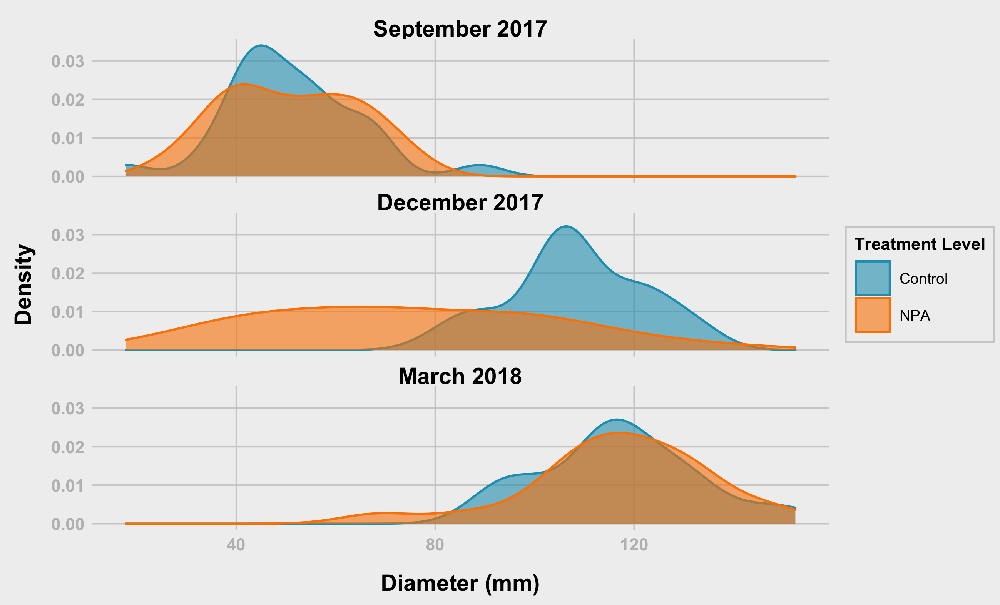
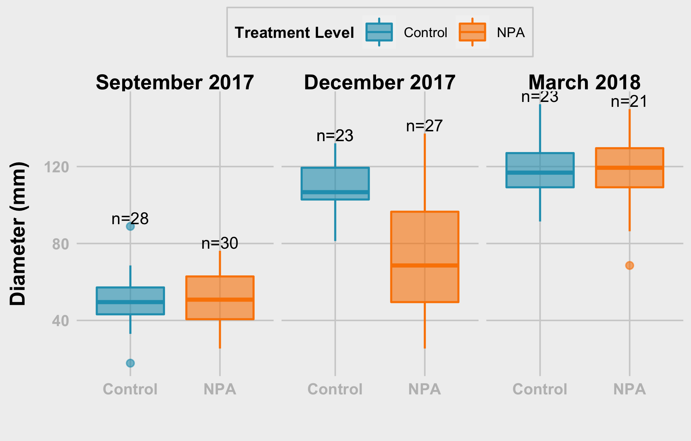
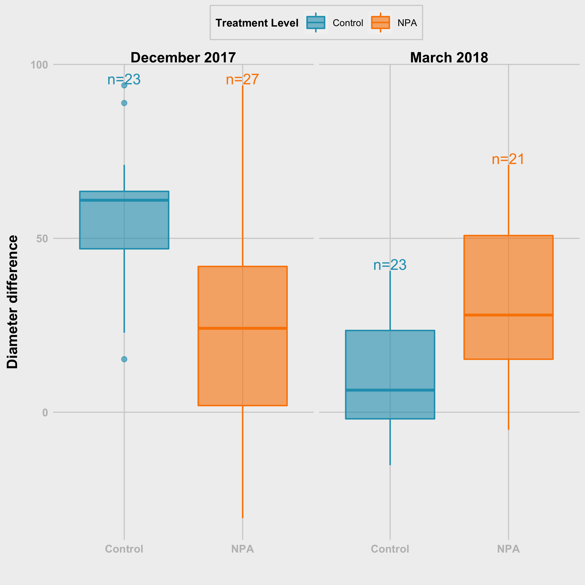
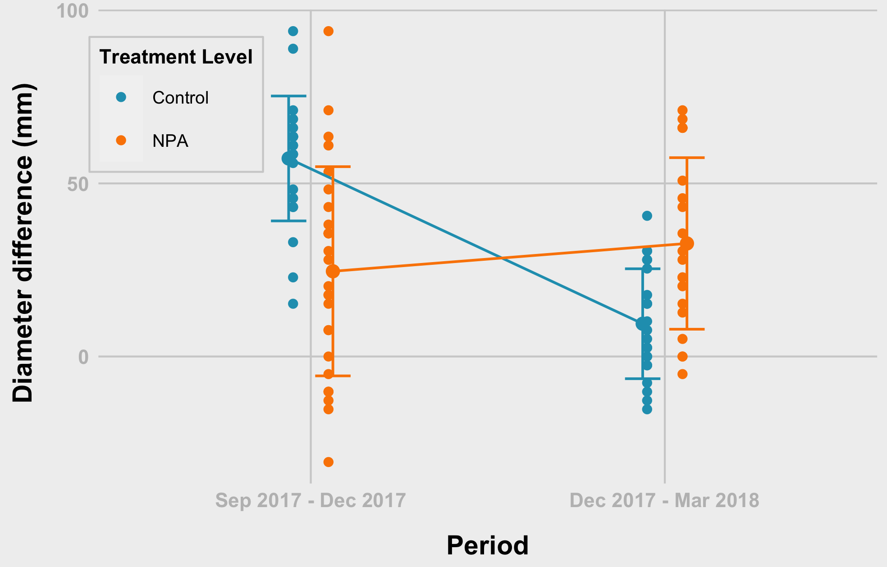
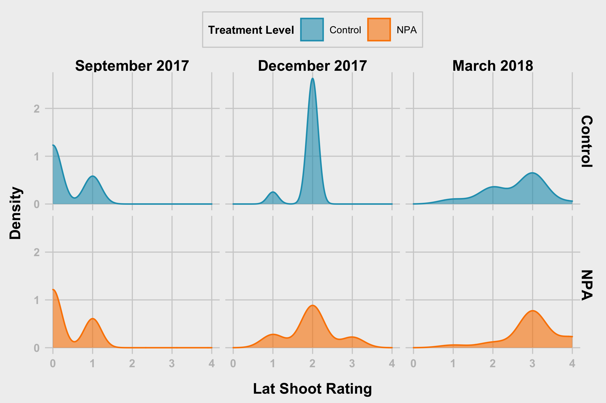
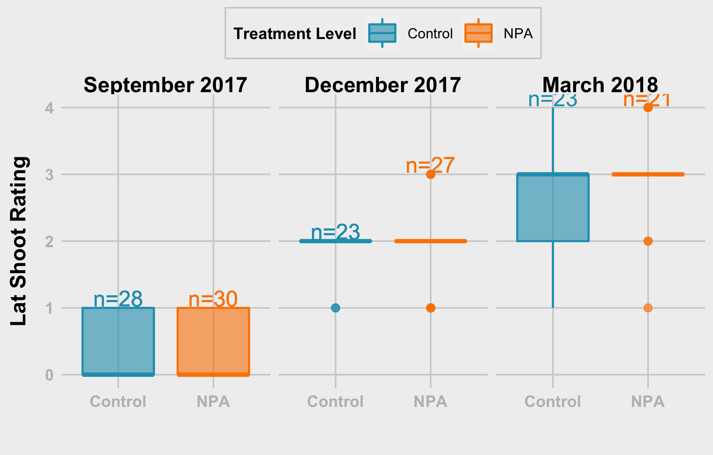

# Section 01 - Get Data and Prepare the data

I downloaded data and placed on my computer. You should change the path for the data
following packges are necessary for your work
1. `tidyverse`
2. `car`
3. `nlme`
4. `lme4`
5. `rstatix`

When I am using function from specific packages I am using namespace atleast at the first time of its usage


```r
library(tidyr)
library(dplyr)
```

```
## 
## Attaching package: 'dplyr'
```

```
## The following objects are masked from 'package:stats':
## 
##     filter, lag
```

```
## The following objects are masked from 'package:base':
## 
##     intersect, setdiff, setequal, union
```

```r
library(ggplot2)
library(rstatix)
```

```
## 
## Attaching package: 'rstatix'
```

```
## The following object is masked from 'package:stats':
## 
##     filter
```


## 1.1 Upload Packages

```r
##--------- set working directory

path<- "../data/"


sep2017<- readxl::read_excel(path = paste0(path, "/09_18_2017_Data.xlsx"), sheet = "Sheet1", na = "NA")
dec2017<- readxl::read_excel(path = paste0(path, "/12_18_2017_Data.xlsx"), sheet = "Sheet1", na = "NA")
mar2018<- readxl::read_excel(path = paste0(path, "/03_28_2018_Data.xlsx"), sheet = "Sheet1", na = "NA")
```

## 1.2 Check Data Structures

### September 2017

```r
str(sep2017)
```

```
## tibble [59 × 15] (S3: tbl_df/tbl/data.frame)
##  $ Date            : chr [1:59] "09_18_2017" "09_18_2017" "09_18_2017" "09_18_2017" ...
##  $ Plant_ID        : chr [1:59] "M-14-08-A" "M-14-08-B" "M-14-08-C" "M-14-08-D" ...
##  $ Family          : num [1:59] 8 8 8 8 8 8 8 8 8 8 ...
##  $ Diameter(inches): num [1:59] 2.2 2.5 2.6 1.7 1.5 3 2.7 3.5 1.7 2.7 ...
##  $ Lat_Shoot_R     : num [1:59] 0 0 0 0 1 0 1 0 0 0 ...
##  $ Inflorescence   : num [1:59] 0 0 0 0 1 0 0 0 0 0 ...
##  $ Leaf_Shape      : num [1:59] 3 3 3 3 3 3 3 3 3 3 ...
##  $ Trichomes_int   : num [1:59] 2 2 2 3 2 1 2 2 2 2 ...
##  $ TreatmentLevel  : chr [1:59] "Auxin" "Auxin" "Control" "Control" ...
##  $ Treatment       : chr [1:59] "Aux_Drop" "Aux_Spray" "DMSO" "Water" ...
##  $ Population      : chr [1:59] "My" "My" "My" "My" ...
##  $ Bolting         : num [1:59] 0 0 0 0 1 0 0 0 0 0 ...
##  $ Flowering       : num [1:59] 0 0 0 0 1 0 0 0 0 0 ...
##  $ Remarks_01      : chr [1:59] NA NA NA NA ...
##  $ Remarks_02      : chr [1:59] NA NA NA NA ...
```

### December 2017 

```r
str(dec2017)
```

```
## tibble [59 × 15] (S3: tbl_df/tbl/data.frame)
##  $ Date            : chr [1:59] "12_18_2017" "12_18_2017" "12_18_2017" "12_18_2017" ...
##  $ Plant_ID        : chr [1:59] "M-14-08-A" "M-14-08-B" "M-14-08-C" "M-14-08-D" ...
##  $ Family          : num [1:59] 8 8 8 8 8 8 8 8 8 8 ...
##  $ Diameter(inches): num [1:59] NA 3.7 NA 4.2 2.6 3.7 4 5.2 5.4 3.4 ...
##  $ Lat_Shoot_R     : chr [1:59] NA "2" NA "2" ...
##  $ Inflorescence   : num [1:59] NA 1 NA 4 7 0 0 1 0 1 ...
##  $ Leaf_Shape      : chr [1:59] NA "2" NA "3" ...
##  $ Trichomes_int   : chr [1:59] NA "1" NA "1" ...
##  $ TreatmentLevel  : chr [1:59] "Auxin" "Auxin" "Control" "Control" ...
##  $ Treatment       : chr [1:59] "Aux_Drop" "Aux_Spray" "DMSO" "Water" ...
##  $ Population      : chr [1:59] "My" "My" "My" "My" ...
##  $ Bolting         : num [1:59] NA 1 NA 1 1 0 0 1 0 1 ...
##  $ Flowering       : num [1:59] NA 1 NA 1 1 0 0 1 0 1 ...
##  $ Remarks_01      : chr [1:59] "Missing - I think we extracted RNA out of it ??" "LCU" NA "Foliage out of frame" ...
##  $ Remarks_02      : chr [1:59] NA NA NA NA ...
```

### October 2018

```r
str(mar2018)
```

```
## tibble [59 × 15] (S3: tbl_df/tbl/data.frame)
##  $ Date            : chr [1:59] "03_28_2018" "03_28_2018" "03_28_2018" "03_28_2018" ...
##  $ Plant_ID        : chr [1:59] "M-14-08-A" "M-14-08-B" "M-14-08-C" "M-14-08-D" ...
##  $ Family          : num [1:59] 8 8 8 8 8 8 8 8 8 8 ...
##  $ Diameter(inches): num [1:59] NA 4.2 NA 3.6 3.4 4.6 5.2 4.7 5.2 5.2 ...
##  $ Lat_Shoot_R     : num [1:59] NA 3 NA 3 3 3 4 3 4 4 ...
##  $ Inflorescence   : num [1:59] NA 3 NA 5 6 0 0 0 3 0 ...
##  $ Leaf_Shape      : num [1:59] NA 2 NA 3 3 2 3 3 3 3 ...
##  $ Trichomes_int   : num [1:59] NA 2 NA 1 2 1 1 1 1 1 ...
##  $ TreatmentLevel  : chr [1:59] "Auxin" "Auxin" "Control" "Control" ...
##  $ Treatment       : chr [1:59] "Aux_Drop" "Aux_Spray" "DMSO" "Water" ...
##  $ Population      : chr [1:59] "My" "My" "My" "My" ...
##  $ Bolting         : num [1:59] NA 1 NA 1 1 0 0 0 1 0 ...
##  $ Flowering       : num [1:59] NA 1 NA 1 1 0 0 0 1 0 ...
##  $ Remarks_01      : chr [1:59] NA NA NA NA ...
##  $ Remarks_02      : logi [1:59] NA NA NA NA NA NA ...
```

## Prepare the data

### ID's & Column for Month

```r
# ID's
sep2017$id<- row.names(sep2017)
dec2017$id<- row.names(dec2017)
mar2018$id<- row.names(mar2018)

# Month column
sep2017$Month <- "Sep"
dec2017$Month <- "Dec"
mar2018$Month <- "Mar"
```

### Combine the sets & and change column names

```r
fdata<- rbind(sep2017,dec2017,mar2018)

# changing the name when necessary
names(fdata)<- c("date", "plantID", "family", "diaIn", "latShootRating", 
                 "inflorescence", "leafShape", "trichomesInt", "treatmentLevel", 
                 "treatment", "population", "bolting", "flowering", "remarks_01", 
                 "remarks_02", "id", "month")
```

### Convert inches to mm

```r
fdata$diaIn <- fdata$diaIn * 25.4

fdata <- fdata %>%
  mutate(treatmentLevel = replace(treatmentLevel, treatmentLevel == "Auxin", "NPA"))
```

### Get rid of unnecessary columns and check the amount of missing values in each column

```r
library(tidyverse)
```

```
## ── Attaching packages ─────────────────────────────────────── tidyverse 1.3.1 ──
```

```
## ✓ tibble  3.1.6     ✓ stringr 1.4.0
## ✓ readr   2.1.2     ✓ forcats 0.5.1
## ✓ purrr   0.3.4
```

```
## ── Conflicts ────────────────────────────────────────── tidyverse_conflicts() ──
## x rstatix::filter() masks dplyr::filter(), stats::filter()
## x dplyr::lag()      masks stats::lag()
```

```r
mvdata<- fdata %>% select( - c(remarks_01, remarks_02))

mvdata %>% summarise_all(funs(sum(is.na(.))))
```

```
## Warning: `funs()` was deprecated in dplyr 0.8.0.
## Please use a list of either functions or lambdas: 
## 
##   # Simple named list: 
##   list(mean = mean, median = median)
## 
##   # Auto named with `tibble::lst()`: 
##   tibble::lst(mean, median)
## 
##   # Using lambdas
##   list(~ mean(., trim = .2), ~ median(., na.rm = TRUE))
## This warning is displayed once every 8 hours.
## Call `lifecycle::last_lifecycle_warnings()` to see where this warning was generated.
```

```
## # A tibble: 1 × 15
##    date plantID family diaIn latShootRating inflorescence leafShape trichomesInt
##   <int>   <int>  <int> <int>          <int>         <int>     <int>        <int>
## 1     0       0      0    25             25            25        25           25
## # … with 7 more variables: treatmentLevel <int>, treatment <int>,
## #   population <int>, bolting <int>, flowering <int>, id <int>, month <int>
```

### Delete rows with missing values

```r
fndata <- mvdata %>% drop_na()

#fndata <- fdata %>%  mutate(across(where(is.character), ~na_if(., "NA")))
```

### Specify correct data types

```r
# Not numeric variables
char_var<- c("date","plantID","treatmentLevel","treatment","population", "month", "family")

# Numeric variables
num_var<- names(fndata[, !(names(fndata) %in% char_var)])

#convert characters to numeric vector
fndata[, num_var]<- sapply(fndata[, num_var], as.numeric)
```

```
## Warning in lapply(X = X, FUN = FUN, ...): NAs introduced by coercion

## Warning in lapply(X = X, FUN = FUN, ...): NAs introduced by coercion

## Warning in lapply(X = X, FUN = FUN, ...): NAs introduced by coercion
```

```r
#convert characters to factors
fndata$dateFac   <- factor(fndata$date,       labels =  c("September 2017", "December 2017", "March 2018" ),
                           levels =  c("09_18_2017", "12_18_2017", "03_28_2018" ))

fndata$treatment <- factor(fndata$treatment,  labels =  c("NPA Drop", "NPA Spray", "DMSO", "Water"))

fndata$treatmentLevel <- as.factor(fndata$treatmentLevel)

fndata$plantID<- as.factor(fndata$plantID)

# Check 
sapply(fndata, class)
```

```
##           date        plantID         family          diaIn latShootRating 
##    "character"       "factor"      "numeric"      "numeric"      "numeric" 
##  inflorescence      leafShape   trichomesInt treatmentLevel      treatment 
##      "numeric"      "numeric"      "numeric"       "factor"       "factor" 
##     population        bolting      flowering             id          month 
##    "character"      "numeric"      "numeric"      "numeric"    "character" 
##        dateFac 
##       "factor"
```


```r
fdata %>% distinct(plantID)
```

```
## # A tibble: 59 × 1
##    plantID  
##    <chr>    
##  1 M-14-08-A
##  2 M-14-08-B
##  3 M-14-08-C
##  4 M-14-08-D
##  5 M-14-08-E
##  6 M-14-08-F
##  7 M-14-08-G
##  8 M-14-08-H
##  9 M-14-08-I
## 10 M-14-08-J
## # … with 49 more rows
```


```r
fdata %>% select(plantID, diaIn, month) %>%
  pivot_wider(names_from = "month", values_from = "diaIn") %>%
  mutate(check = ifelse(!is.na(Sep) & !is.na(Dec) & !is.na(Mar), 1, 0)) %>%
  filter(check == 1)
```

```
## # A tibble: 42 × 5
##    plantID     Sep   Dec   Mar check
##    <chr>     <dbl> <dbl> <dbl> <dbl>
##  1 M-14-08-B  63.5  94.0 107.      1
##  2 M-14-08-D  43.2 107.   91.4     1
##  3 M-14-08-E  38.1  66.0  86.4     1
##  4 M-14-08-F  76.2  94.0 117.      1
##  5 M-14-08-G  68.6 102.  132.      1
##  6 M-14-08-H  88.9 132.  119.      1
##  7 M-14-08-I  43.2 137.  132.      1
##  8 M-14-08-J  68.6  86.4 132.      1
##  9 M-14-08-K  50.8 122.  114.      1
## 10 M-14-08-L  61.0 107.  114.      1
## # … with 32 more rows
```


```r
fdata %>% group_by(month) %>%
  summarise(count = n(),
            na = sum(is.na(diaIn))) %>%
  mutate(clean = count - na)
```

```
## # A tibble: 3 × 4
##   month count    na clean
##   <chr> <int> <int> <int>
## 1 Dec      59     9    50
## 2 Mar      59    15    44
## 3 Sep      59     1    58
```


```r
fdata %>% select(plantID, diaIn, month) %>%
  pivot_wider(names_from = "month", values_from = "diaIn") %>%
  mutate(check = ifelse(!is.na(Sep) & !is.na(Dec) & !is.na(Mar), 1, 0)) %>%
  filter(check == 1) %>%
  mutate(dc_change = ifelse(Dec - Sep < 0, 1, 0),
         md_change = ifelse(Mar - Dec < 0, 1, 0)) %>%
  filter(md_change == 1)
```

```
## # A tibble: 7 × 7
##   plantID     Sep   Dec   Mar check dc_change md_change
##   <chr>     <dbl> <dbl> <dbl> <dbl>     <dbl>     <dbl>
## 1 M-14-08-D  43.2  107.  91.4     1         0         1
## 2 M-14-08-H  88.9  132. 119.      1         0         1
## 3 M-14-08-I  43.2  137. 132.      1         0         1
## 4 M-14-08-K  50.8  122. 114.      1         0         1
## 5 M-14-16-E  53.3  117. 114.      1         0         1
## 6 M-14-21-A  55.9  104. 102.      1         0         1
## 7 M-14-21-E  53.3  122. 112.      1         0         1
```


# Section 02 - Summary statistics

### Choose variables of interest

```r
# extract variables that are important
sel_var<- c("date", "plantID", "treatment", "treatmentLevel","diaIn",
            "latShootRatio", "inflorescence", "leafShape"  )

#---------- mean
# mean_diaInflo<- fndata %>% select(sel_var) %>% 
#   group_by(treatment) %>% 
#   summarise_at(.vars = vars(diaIn, inflorescence),.funs = c(mean = "mean"))
# 
# sd_diaInflo<- fndata %>% select(sel_var) %>% 
#   group_by(treatment) %>% 
#   summarise_at(.vars = vars(diaIn, inflorescence),.funs = c(sd = "mean"))
# 
# sumdat<- cbind(mean_diaInflo, sd_diaInflo[, 2:3])

# Stats for Diameter
mean_diaInflo<- fndata %>% 
  group_by(treatment) %>% 
  summarise(mean = mean(diaIn, na.rm = TRUE),
            sd   = sd(diaIn, na.rm = TRUE)
  )

# Stats for inflorescence
mean_inflo<- fndata %>% 
  group_by(treatment) %>% 
  summarise(
    mean = mean(inflorescence, na.rm = TRUE),
    sd   = sd(inflorescence, na.rm = TRUE)
  )

# Stats for Lat_Shoot
mean_latShoot<- fndata %>% 
  group_by(treatment) %>% 
  summarise(mean = mean(latShootRating, na.rm = TRUE),
            sd   = sd(latShootRating, na.rm = TRUE)
  )

#------- apply variable name and combine
mean_diaInflo$var <- "Diameter"
mean_inflo$var    <- "Inflorescence"
mean_latShoot$var <- "LatShoot"


sumdata<- rbind(mean_diaInflo,mean_inflo, mean_latShoot)
sumdata
```

```
## # A tibble: 12 × 4
##    treatment   mean     sd var          
##    <fct>      <dbl>  <dbl> <chr>        
##  1 NPA Drop  82.0   35.1   Diameter     
##  2 NPA Spray 70.5   31.4   Diameter     
##  3 DMSO      90.0   35.1   Diameter     
##  4 Water     88.7   32.4   Diameter     
##  5 NPA Drop   1.33   2.02  Inflorescence
##  6 NPA Spray  0.583  0.996 Inflorescence
##  7 DMSO       0.973  1.86  Inflorescence
##  8 Water      1.46   2.09  Inflorescence
##  9 NPA Drop   1.68   1.23  LatShoot     
## 10 NPA Spray  1.51   1.29  LatShoot     
## 11 DMSO       1.49   1.12  LatShoot     
## 12 Water      1.54   1.10  LatShoot
```


```r
library(sjPlot)
```


# Section 03 - Plots and Anlysis

### Theme Function

```r
theme_538 <- function(base_size = 8, base_family = "Arial") {
  theme_grey(base_size = base_size, base_family = base_family) %+replace%
    theme(
      # drop minor gridlines and axis-ticks
      panel.grid.minor = element_blank(),
      axis.ticks = element_blank(),
      # change font elements/family
      text = element_text(family = "Arial", size = base_size),
      axis.text = element_text(face = "bold", color = "grey", size = base_size),
      axis.title = element_text(face = "bold", size = rel(1.33)),
      axis.title.x = element_text(margin = margin(0.3, 0, 0, 0, unit = "cm")),
      axis.title.y = element_text(margin = margin(0, 0.3, 0, 0, unit = "cm"), angle =90),
      plot.title = element_text(face = "bold", size = rel(1.67), hjust = 0),
      plot.title.position = "plot",
      plot.subtitle = element_text(size = 12, margin = margin(0.2, 0, 1, 0, unit = "cm"), hjust = 0),
      plot.caption = element_text(size = 8, margin = margin(1, 0, 0, 0, unit = "cm"), hjust = 1),
      # change plot colors for the background/panel elements
      plot.background = element_rect(fill = "#f0f0f0", color = NA),
      panel.background = element_rect(fill = "#f0f0f0", color = NA),
      panel.grid.major =  element_line(color = "#d0d0d0"),
      panel.border = element_blank(),
      # shrinks margin and simplify the strip/facet elements
      strip.background = element_blank(),
      strip.text = element_text(size = rel(1.33), face = "bold")
    )
}
```


# Analysis of diameter by treatment level

### Diameter - Treatment Level (tl) -  Density Function

```r
grDevices::png(filename = "plots/hist_diam_tl.png",  width = 16.5, height = 10, units = 'cm', res = 400)

hist_diam <- fndata %>%
  ggplot(aes(diaIn, fill = treatmentLevel, colour = treatmentLevel)) +
  geom_density(alpha = 0.6) +
  scale_fill_manual("Treatment Level", values = c("#219ebc","#fb8500")) +
  scale_colour_manual("Treatment Level", values = c("#219ebc","#fb8500")) + 
  facet_wrap(~dateFac, nrow = 3) + 
  labs(x = "Diameter (mm)", y = "Density") +
  #coord_flip() + 
  theme_538() +
  theme(
    #legend.position = "top",
    legend.background = element_rect(fill = "#f0f0f0", color = "#d0d0d0"),
    legend.title = element_text(size = 8, face = "bold"),
    legend.title.align = 0.5,
    legend.text = element_text(size=7),
    plot.margin = margin(0.3, 0.1, 0.2, 0.2, unit = "cm"),
    )
hist_diam  

dev.off()
```

```
## quartz_off_screen 
##                 2
```

```r

```


### Diameter - Treatment Level (tl) -  Density Function version 2

```r
grDevices::png(filename = "plots/hist_diam2.png",  width = 16.5, height = 10, units = 'cm', res = 400)

hist_diam2 <- fndata %>%
  ggplot(aes(diaIn, fill = treatmentLevel, colour = treatmentLevel)) +
  geom_density(alpha = 0.6) +
  scale_fill_manual("Treatment Level", values = c("#219ebc","#fb8500")) +
  scale_colour_manual("Treatment Level", values = c("#219ebc","#fb8500")) + 
  facet_grid(treatmentLevel ~ dateFac) + 
  labs(x = "Diameter (mm)", y = "Density") +
  #coord_flip() + 
  theme_538() +
  theme(
    legend.position = "top",
    legend.background = element_rect(fill = "#f0f0f0", color = "#d0d0d0"),
    legend.title = element_text(family = "Arial", size = 8, face = "bold"),
    legend.title.align = 0.5,
    legend.text = element_text(size=7),
    plot.margin = margin(0.3, 0.3, 0.2, 0.2, unit = "cm"),
    )
  

hist_diam2

dev.off()
```

```
## quartz_off_screen 
##                 2
```

```r
knitr::include_graphics("plots/hist_diam2.png")
```


### Diameter - Treatment Level (tl) - Boxplot

```r
grDevices::png(filename = "plots/violin_diam.png",  width = 12.5, height = 8, units = 'cm', res = 400)

violin_diam <- fndata %>%
  group_by(treatmentLevel, dateFac) %>% mutate(N=n()) %>%
  mutate(N=ifelse(diaIn==max(diaIn,na.rm=T),paste0('n=',N),NA)) %>%
  ggplot(aes(x = treatmentLevel, y = diaIn, fill = treatmentLevel, colour = treatmentLevel, label = N)) +
  #geom_violin(alpha = 0.6) +
  geom_boxplot(#width = 0.1, 
               alpha = 0.6) +
  geom_text(vjust = -0.2, hjust = 0.5, show.legend = FALSE, colour = "black", size = 3) +
  scale_fill_manual("Treatment Level", values = c("#219ebc", "#fb8500")) +
  scale_colour_manual("Treatment Level", values = c("#219ebc", "#fb8500")) +
  facet_wrap(~dateFac, nrow = 1, ncol = 3) + 
  labs(x = "Treatment Level", y = "Diameter (mm)") +
  xlab("") +
  #coord_flip() +
  theme_538() +
  theme(
    legend.position = "top",
    legend.background = element_rect(fill = "#f0f0f0", color = "#d0d0d0"),
    legend.title = element_text(family = "Arial", size = 8, face = "bold"),
    legend.title.align = 0.5,
    legend.text = element_text(size=7),
    #axis.text.x = element_text(angle = 45, vjust = 0.5, hjust=1)
    )
  

violin_diam
```

```
## Warning: Removed 145 rows containing missing values (geom_text).
```

```r
dev.off()
```

```
## quartz_off_screen 
##                 2
```

```r

```


## Diameter - Treatment Level (tl) -  Points

```r
grDevices::png(filename = "plots/dots_diam_tl.png",  width = 12.5, height = 8, units = 'cm', res = 400)

dots_diam_tl <- fndata %>% ggplot(aes(x = dateFac, y = diaIn, group = treatmentLevel, color = treatmentLevel))+
  #geom_point()
  geom_point(size = 2,shape = 20, position = position_dodge(0.2 ))+
  #geom_line(position = position_dodge(0.25 ))+
  stat_summary(fun =  mean, size = 2, geom = "point", 
               position = position_dodge(0.25), show.legend = FALSE)+
  
  stat_summary(fun = mean, size = 0.5, geom = "line",
               position = position_dodge(0.25), show.legend = FALSE)+
    
  stat_summary(fun.data = mean_sdl, fun.args = list(mult=1), 
               geom = "errorbar", width=0.2,
               position = position_dodge(0.25), show.legend = FALSE) +
  
  theme_bw(base_size = 14,base_family = "Serif")+
  xlab(" Treatment Level Date and Month")+
  ylab(" Diameter (mm)")+
  # labs(fill = "Treatment")
  # guides(fill=guide_legend(title = "Treatment"))
  scale_color_manual("Treatment Level",values = c("#219ebc","#fb8500"))+
  theme_538() + 
  theme(
    legend.position = c(0.2, 0.8),
    legend.background = element_rect(fill = "#f0f0f0", color = "#d0d0d0"),
    legend.title = element_text(family = "Arial", size = 8, face = "bold"),
    legend.title.align = 0.5,
    legend.text = element_text(size=7)
  )
  
dots_diam_tl

dev.off()
```

```
## quartz_off_screen 
##                 2
```

```r
knitr::include_graphics("plots/dots_diam_tl.png")
```


### Diameter - Treatment Level (tl) - Checking for Normality
Shapiro-Test for each group p-values is less than 0.05, hence, we reject hypothesis about normal distribution.

```r
fndata %>% group_by(treatmentLevel) %>% 
  shapiro_test(diaIn)
```

```
## # A tibble: 2 × 4
##   treatmentLevel variable statistic        p
##   <fct>          <chr>        <dbl>    <dbl>
## 1 Control        diaIn        0.929 0.000463
## 2 NPA            diaIn        0.938 0.000857
```

### Diameter - Treatment Level (tl) - Checking for Normality by Month
If we divide by both month and treatment, distribution can be assumed to be normal

```r
fndata %>% group_by(treatmentLevel, dateFac) %>%
  shapiro_test(diaIn) %>%
  left_join(fndata %>% 
              group_by(treatmentLevel, dateFac) %>%
              summarise(n = n()),
            by = c("treatmentLevel", "dateFac"))
```

```
## `summarise()` has grouped output by 'treatmentLevel'. You can override using
## the `.groups` argument.
```

```
## # A tibble: 6 × 6
##   treatmentLevel dateFac        variable statistic     p     n
##   <fct>          <fct>          <chr>        <dbl> <dbl> <int>
## 1 Control        September 2017 diaIn        0.958 0.318    28
## 2 Control        December 2017  diaIn        0.954 0.352    23
## 3 Control        March 2018     diaIn        0.970 0.689    23
## 4 NPA            September 2017 diaIn        0.969 0.505    30
## 5 NPA            December 2017  diaIn        0.976 0.771    27
## 6 NPA            March 2018     diaIn        0.960 0.515    21
```


### Lat Shoot Rating - Treatment Level (tl) - Wilcox test - Whole data


```r
ph_lsr_tl <- fndata %>% 
  wilcox_test(
    latShootRating~treatmentLevel, paired = FALSE, # due to sample difference
    p.adjust.method = "holm"       # with treatment not so much of difference
  )

print(ph_lsr_tl)
```

```
## # A tibble: 1 × 7
##   .y.            group1  group2    n1    n2 statistic     p
## * <chr>          <chr>   <chr>  <int> <int>     <dbl> <dbl>
## 1 latShootRating Control NPA       74    78      2707 0.685
```


### Lat Shoot Rating - Treatment Level (tl) - Wilcox test - For September 2017

```r
  ph_lsr_tl_sep <- fndata %>% 
  filter(dateFac == "September 2017") %>%
  wilcox_test(
    latShootRating~treatmentLevel, paired = FALSE, # due to sample difference
    #p.adjust.method = "holm"       # with treatment not so much of difference
  )

print(ph_lsr_tl_sep)
```

```
## # A tibble: 1 × 7
##   .y.            group1  group2    n1    n2 statistic     p
## * <chr>          <chr>   <chr>  <int> <int>     <dbl> <dbl>
## 1 latShootRating Control NPA       28    30       415 0.931
```

### Lat Shoot Rating - Treatment Level (tl) - Wilcox test - For December 2017

```r
ph_lsr_tl_dec <- fndata %>% 
  filter(dateFac == "December 2017") %>%
  wilcox_test(
    latShootRating~treatmentLevel, paired = FALSE, # due to sample difference
    #p.adjust.method = "holm"       # with treatment not so much of difference
  )

# print
print(ph_lsr_tl_dec)
```

```
## # A tibble: 1 × 7
##   .y.            group1  group2    n1    n2 statistic     p
## * <chr>          <chr>   <chr>  <int> <int>     <dbl> <dbl>
## 1 latShootRating Control NPA       23    27       278   0.8
```

### Lat Shoot Rating - Treatment Level (tl) - Wilcox test - For March 2018

```r
ph_lsr_tl_mar <- fndata %>% 
  filter(dateFac == "March 2018") %>%
  wilcox_test(
    latShootRating~treatmentLevel, paired = FALSE, # due to sample difference
    #p.adjust.method = "holm"       # with treatment not so much of difference
  )

# print
print(ph_lsr_tl_mar)
```

```
## # A tibble: 1 × 7
##   .y.            group1  group2    n1    n2 statistic      p
## * <chr>          <chr>   <chr>  <int> <int>     <dbl>  <dbl>
## 1 latShootRating Control NPA       23    21       164 0.0378
```


### Diameter - Treatment Level (tl) - Pairwise T-test

```r
ph_diam_tl <- fndata %>% 
  pairwise_t_test(
    diaIn~treatmentLevel, paired = FALSE, # due to sample difference
    p.adjust.method = "holm"       # with treatment not so much of difference
  )

print(ph_diam_tl)
```

```
## # A tibble: 1 × 9
##   .y.   group1  group2    n1    n2      p p.signif  p.adj p.adj.signif
## * <chr> <chr>   <chr>  <int> <int>  <dbl> <chr>     <dbl> <chr>       
## 1 diaIn Control NPA       74    78 0.0217 *        0.0217 *
```


```r
t.test(diaIn ~ treatmentLevel, data = subset(fndata, dateFac == "September 2017"))
```

```
## 
## 	Welch Two Sample t-test
## 
## data:  diaIn by treatmentLevel
## t = -0.021957, df = 55.661, p-value = 0.9826
## alternative hypothesis: true difference in means between group Control and group NPA is not equal to 0
## 95 percent confidence interval:
##  -7.252435  7.095197
## sample estimates:
## mean in group Control     mean in group NPA 
##              50.89071              50.96933
```


```r
t.test(diaIn ~ treatmentLevel, data = subset(fndata, dateFac == "December 2017"))
```

```
## 
## 	Welch Two Sample t-test
## 
## data:  diaIn by treatmentLevel
## t = 5.4849, df = 38.171, p-value = 2.858e-06
## alternative hypothesis: true difference in means between group Control and group NPA is not equal to 0
## 95 percent confidence interval:
##  21.65272 46.98045
## sample estimates:
## mean in group Control     mean in group NPA 
##             108.44696              74.13037
```


```r
t.test(diaIn ~ treatmentLevel, data = subset(fndata, dateFac == "March 2018"))
```

```
## 
## 	Welch Two Sample t-test
## 
## data:  diaIn by treatmentLevel
## t = 0.065866, df = 39.756, p-value = 0.9478
## alternative hypothesis: true difference in means between group Control and group NPA is not equal to 0
## 95 percent confidence interval:
##  -10.14890  10.83254
## sample estimates:
## mean in group Control     mean in group NPA 
##              117.0609              116.7190
```


```r
t.test(diaIn ~ treatmentLevel, data = subset(fndata, dateFac == "December 2017"), alternative = "less")
```

```
## 
## 	Welch Two Sample t-test
## 
## data:  diaIn by treatmentLevel
## t = 5.4849, df = 38.171, p-value = 1
## alternative hypothesis: true difference in means between group Control and group NPA is less than 0
## 95 percent confidence interval:
##      -Inf 44.86367
## sample estimates:
## mean in group Control     mean in group NPA 
##             108.44696              74.13037
```


### Diameter - Treatment Level (tl) - Pairwise T-test - For September 2017

```r
ph_diam_tl_sep <- fndata %>% 
  filter(dateFac == "September 2017") %>%
  pairwise_t_test(
    diaIn~treatmentLevel, paired = FALSE, # due to sample difference
    p.adjust.method = "holm"       # with treatment not so much of difference
  )

print(ph_diam_tl_sep)
```

```
## # A tibble: 1 × 9
##   .y.   group1  group2    n1    n2     p p.signif p.adj p.adj.signif
## * <chr> <chr>   <chr>  <int> <int> <dbl> <chr>    <dbl> <chr>       
## 1 diaIn Control NPA       28    30 0.983 ns       0.983 ns
```

```r
ttest_diam_tl <- t.test(subset(fndata, fndata$treatmentLevel == "Control")$diaIn,
       subset(fndata, fndata$treatmentLevel == "NPA")$diaIn)
```


### Diameter - Treatment Level (tl) - Pairwise T-test - For December 2017

```r
ph_diam_tl_dec <- fndata %>% 
  filter(dateFac == "December 2017") %>%
  pairwise_t_test(
    diaIn~treatmentLevel, paired = FALSE, # due to sample difference
    p.adjust.method = "holm"       # with treatment not so much of difference
  )


print(ph_diam_tl_dec)
```

```
## # A tibble: 1 × 9
##   .y.   group1  group2    n1    n2          p p.signif      p.adj p.adj.signif
## * <chr> <chr>   <chr>  <int> <int>      <dbl> <chr>         <dbl> <chr>       
## 1 diaIn Control NPA       23    27 0.00000398 ****     0.00000398 ****
```

### Diameter - Treatment Level (tl) - Pairwise T-test - For March 2018

```r
ph_diam_tl_mar <- fndata %>% 
  filter(dateFac == "March 2018") %>%
  pairwise_t_test(
    diaIn~treatmentLevel, paired = FALSE, # due to sample difference
    p.adjust.method = "holm"       # with treatment not so much of difference
  )

print(ph_diam_tl_mar)
```

```
## # A tibble: 1 × 9
##   .y.   group1  group2    n1    n2     p p.signif p.adj p.adj.signif
## * <chr> <chr>   <chr>  <int> <int> <dbl> <chr>    <dbl> <chr>       
## 1 diaIn Control NPA       23    21 0.947 ns       0.947 ns
```


### Diameter - Treatment Level (tl) - repeated Anova

```r
aov_diam_tl <- aov(diaIn~treatmentLevel*dateFac + Error(id), data = fndata)
summary(aov_diam_tl)
```

```
## 
## Error: id
##                Df Sum Sq Mean Sq
## treatmentLevel  1   1385    1385
## 
## Error: Within
##                         Df Sum Sq Mean Sq F value   Pr(>F)    
## treatmentLevel           1   6164    6164   18.83 2.67e-05 ***
## dateFac                  2 110943   55472  169.43  < 2e-16 ***
## treatmentLevel:dateFac   2   9802    4901   14.97 1.23e-06 ***
## Residuals              145  47473     327                     
## ---
## Signif. codes:  0 '***' 0.001 '**' 0.01 '*' 0.05 '.' 0.1 ' ' 1
```

### Diameter - Treatment Level (tl) - Mixed effects for repeated data 1

```r
lme1_diam_tl<- nlme::lme(diaIn~1, random = ~1|treatmentLevel, method = "REML", na.action = na.omit,
          data = fndata)

summary(lme1_diam_tl)
```

```
## Linear mixed-effects model fit by REML
##   Data: fndata 
##        AIC      BIC   logLik
##   1502.914 1511.966 -748.457
## 
## Random effects:
##  Formula: ~1 | treatmentLevel
##         (Intercept) Residual
## StdDev:    8.075647 33.63356
## 
## Fixed effects:  diaIn ~ 1 
##                Value Std.Error  DF  t-value p-value
## (Intercept) 82.98637  6.328858 150 13.11238       0
## 
## Standardized Within-Group Residuals:
##        Min         Q1        Med         Q3        Max 
## -2.0919150 -0.9558991  0.0226398  0.8533578  2.1414862 
## 
## Number of Observations: 152
## Number of Groups: 2
```

### Diameter - Treatment Level (tl) - Mixed effects for repeated data 2

```r
lme2_diam_tl<- nlme::lme(diaIn~treatmentLevel, random = ~1|dateFac,
                method = "REML", na.action = na.omit,
                data = fndata)
summary(lme2_diam_tl)
```

```
## Linear mixed-effects model fit by REML
##   Data: fndata 
##       AIC      BIC   logLik
##   1348.67 1360.713 -670.335
## 
## Random effects:
##  Formula: ~1 | dateFac
##         (Intercept) Residual
## StdDev:    32.85491 19.85049
## 
## Fixed effects:  diaIn ~ treatmentLevel 
##                       Value Std.Error  DF   t-value p-value
## (Intercept)        91.68937  19.10921 148  4.798176   0e+00
## treatmentLevelNPA -11.33137   3.22524 148 -3.513344   6e-04
##  Correlation: 
##                   (Intr)
## treatmentLevelNPA -0.086
## 
## Standardized Within-Group Residuals:
##        Min         Q1        Med         Q3        Max 
## -2.9859241 -0.5687867 -0.0318547  0.5828219  2.6441622 
## 
## Number of Observations: 152
## Number of Groups: 3
```

### Diameter - Treatment Level (tl) - Mixed effects for repeated data 3

```r
lme3_diam_tl<- nlme::lme(diaIn~treatmentLevel*dateFac, random = ~1|id,
                method = "REML", na.action = na.omit,
                data = fndata)

summary(lme3_diam_tl)
```

```
## Linear mixed-effects model fit by REML
##   Data: fndata 
##        AIC     BIC    logLik
##   1292.891 1316.76 -638.4455
## 
## Random effects:
##  Formula: ~1 | id
##         (Intercept) Residual
## StdDev:    8.180073 16.31426
## 
## Fixed effects:  diaIn ~ treatmentLevel * dateFac 
##                                            Value Std.Error DF   t-value p-value
## (Intercept)                             50.89071  3.448958 89 14.755388  0.0000
## treatmentLevelNPA                       -0.09914  4.793093 57 -0.020683  0.9836
## dateFacDecember 2017                    57.34944  4.634271 89 12.375072  0.0000
## dateFacMarch 2018                       65.91481  4.634271 89 14.223338  0.0000
## treatmentLevelNPA:dateFacDecember 2017 -33.95370  6.366296 89 -5.333353  0.0000
## treatmentLevelNPA:dateFacMarch 2018     -1.53743  6.622397 89 -0.232156  0.8169
##  Correlation: 
##                                        (Intr) trLNPA dFD201 dFM201 tLNPA:FD2
## treatmentLevelNPA                      -0.720                               
## dateFacDecember 2017                   -0.595  0.428                        
## dateFacMarch 2018                      -0.595  0.428  0.457                 
## treatmentLevelNPA:dateFacDecember 2017  0.433 -0.604 -0.728 -0.333          
## treatmentLevelNPA:dateFacMarch 2018     0.416 -0.581 -0.320 -0.700  0.451   
## 
## Standardized Within-Group Residuals:
##         Min          Q1         Med          Q3         Max 
## -2.22981773 -0.56215951 -0.04678512  0.57431222  3.22508844 
## 
## Number of Observations: 152
## Number of Groups: 59
```

### Diameter - Treatment Level (tl) - Mixed effects for repeated data 4

```r
lme4_diam_tl <- nlme::lme(diaIn~treatmentLevel, random = ~1|id,
                method = "REML", na.action = na.omit,
                data = fndata)

lme4_diam_tl
```

```
## Linear mixed-effects model fit by REML
##   Data: fndata 
##   Log-restricted-likelihood: -744.4998
##   Fixed: diaIn ~ treatmentLevel 
##       (Intercept) treatmentLevelNPA 
##          89.34622         -12.65775 
## 
## Random effects:
##  Formula: ~1 | id
##         (Intercept) Residual
## StdDev: 0.001739356 33.63356
## 
## Number of Observations: 152
## Number of Groups: 59
```

### Diameter - Treatment Level (tl) - Mixed effects for repeated data 5

```r
dglme_diam_tl<- lme4::lmer(diaIn~treatmentLevel*dateFac +(1|id), data = fndata)

anova(dglme_diam_tl, type = 3)
```

```
## Warning in anova.merMod(dglme_diam_tl, type = 3): additional arguments ignored:
## 'type'
```

```
## Analysis of Variance Table
##                        npar Sum Sq Mean Sq F value
## treatmentLevel            1   3728    3728  14.008
## dateFac                   2 105750   52875 198.663
## treatmentLevel:dateFac    2   9153    4577  17.195
```

```r
summary(dglme_diam_tl)
```

```
## Linear mixed model fit by REML ['lmerMod']
## Formula: diaIn ~ treatmentLevel * dateFac + (1 | id)
##    Data: fndata
## 
## REML criterion at convergence: 1276.9
## 
## Scaled residuals: 
##     Min      1Q  Median      3Q     Max 
## -2.2298 -0.5622 -0.0468  0.5743  3.2251 
## 
## Random effects:
##  Groups   Name        Variance Std.Dev.
##  id       (Intercept)  66.91    8.18   
##  Residual             266.16   16.31   
## Number of obs: 152, groups:  id, 59
## 
## Fixed effects:
##                                         Estimate Std. Error t value
## (Intercept)                             50.89071    3.44896  14.755
## treatmentLevelNPA                       -0.09914    4.79309  -0.021
## dateFacDecember 2017                    57.34944    4.63427  12.375
## dateFacMarch 2018                       65.91481    4.63427  14.223
## treatmentLevelNPA:dateFacDecember 2017 -33.95370    6.36630  -5.333
## treatmentLevelNPA:dateFacMarch 2018     -1.53743    6.62240  -0.232
## 
## Correlation of Fixed Effects:
##             (Intr) trLNPA dFD201 dFM201 tLNPA:FD2
## trtmntLvNPA -0.720                               
## dtFcDcm2017 -0.595  0.428                        
## dtFcMrc2018 -0.595  0.428  0.457                 
## tLNPA:FD201  0.433 -0.604 -0.728 -0.333          
## tLNPA:FM201  0.416 -0.581 -0.320 -0.700  0.451
```


```r
dglme_diam_tl<- lme4::lmer(diaIn~treatmentLevel*dateFac +(1|id), data = fndata)

anova(dglme_diam_tl, type = 3)
```

```
## Warning in anova.merMod(dglme_diam_tl, type = 3): additional arguments ignored:
## 'type'
```

```
## Analysis of Variance Table
##                        npar Sum Sq Mean Sq F value
## treatmentLevel            1   3728    3728  14.008
## dateFac                   2 105750   52875 198.663
## treatmentLevel:dateFac    2   9153    4577  17.195
```

```r
summary(dglme_diam_tl)
```

```
## Linear mixed model fit by REML ['lmerMod']
## Formula: diaIn ~ treatmentLevel * dateFac + (1 | id)
##    Data: fndata
## 
## REML criterion at convergence: 1276.9
## 
## Scaled residuals: 
##     Min      1Q  Median      3Q     Max 
## -2.2298 -0.5622 -0.0468  0.5743  3.2251 
## 
## Random effects:
##  Groups   Name        Variance Std.Dev.
##  id       (Intercept)  66.91    8.18   
##  Residual             266.16   16.31   
## Number of obs: 152, groups:  id, 59
## 
## Fixed effects:
##                                         Estimate Std. Error t value
## (Intercept)                             50.89071    3.44896  14.755
## treatmentLevelNPA                       -0.09914    4.79309  -0.021
## dateFacDecember 2017                    57.34944    4.63427  12.375
## dateFacMarch 2018                       65.91481    4.63427  14.223
## treatmentLevelNPA:dateFacDecember 2017 -33.95370    6.36630  -5.333
## treatmentLevelNPA:dateFacMarch 2018     -1.53743    6.62240  -0.232
## 
## Correlation of Fixed Effects:
##             (Intr) trLNPA dFD201 dFM201 tLNPA:FD2
## trtmntLvNPA -0.720                               
## dtFcDcm2017 -0.595  0.428                        
## dtFcMrc2018 -0.595  0.428  0.457                 
## tLNPA:FD201  0.433 -0.604 -0.728 -0.333          
## tLNPA:FM201  0.416 -0.581 -0.320 -0.700  0.451
```

```r
plot(as.vector(predict(dglme_diam_tl, fndata)), fndata$diaIn)
```

<!-- -->

```r
tab_model(dglme_diam_tl, file = "diam_tl.doc")
```

<table style="border-collapse:collapse; border:none;">
<tr>
<th style="border-top: double; text-align:center; font-style:normal; font-weight:bold; padding:0.2cm;  text-align:left; ">&nbsp;</th>
<th colspan="3" style="border-top: double; text-align:center; font-style:normal; font-weight:bold; padding:0.2cm; ">diaIn</th>
</tr>
<tr>
<td style=" text-align:center; border-bottom:1px solid; font-style:italic; font-weight:normal;  text-align:left; ">Predictors</td>
<td style=" text-align:center; border-bottom:1px solid; font-style:italic; font-weight:normal;  ">Estimates</td>
<td style=" text-align:center; border-bottom:1px solid; font-style:italic; font-weight:normal;  ">CI</td>
<td style=" text-align:center; border-bottom:1px solid; font-style:italic; font-weight:normal;  ">p</td>
</tr>
<tr>
<td style=" padding:0.2cm; text-align:left; vertical-align:top; text-align:left; ">(Intercept)</td>
<td style=" padding:0.2cm; text-align:left; vertical-align:top; text-align:center;  ">50.89</td>
<td style=" padding:0.2cm; text-align:left; vertical-align:top; text-align:center;  ">44.07&nbsp;&ndash;&nbsp;57.71</td>
<td style=" padding:0.2cm; text-align:left; vertical-align:top; text-align:center;  "><strong>&lt;0.001</strong></td>
</tr>
<tr>
<td style=" padding:0.2cm; text-align:left; vertical-align:top; text-align:left; ">treatmentLevel [NPA]</td>
<td style=" padding:0.2cm; text-align:left; vertical-align:top; text-align:center;  ">&#45;0.10</td>
<td style=" padding:0.2cm; text-align:left; vertical-align:top; text-align:center;  ">&#45;9.57&nbsp;&ndash;&nbsp;9.37</td>
<td style=" padding:0.2cm; text-align:left; vertical-align:top; text-align:center;  ">0.984</td>
</tr>
<tr>
<td style=" padding:0.2cm; text-align:left; vertical-align:top; text-align:left; ">dateFac [December 2017]</td>
<td style=" padding:0.2cm; text-align:left; vertical-align:top; text-align:center;  ">57.35</td>
<td style=" padding:0.2cm; text-align:left; vertical-align:top; text-align:center;  ">48.19&nbsp;&ndash;&nbsp;66.51</td>
<td style=" padding:0.2cm; text-align:left; vertical-align:top; text-align:center;  "><strong>&lt;0.001</strong></td>
</tr>
<tr>
<td style=" padding:0.2cm; text-align:left; vertical-align:top; text-align:left; ">dateFac [March 2018]</td>
<td style=" padding:0.2cm; text-align:left; vertical-align:top; text-align:center;  ">65.91</td>
<td style=" padding:0.2cm; text-align:left; vertical-align:top; text-align:center;  ">56.75&nbsp;&ndash;&nbsp;75.07</td>
<td style=" padding:0.2cm; text-align:left; vertical-align:top; text-align:center;  "><strong>&lt;0.001</strong></td>
</tr>
<tr>
<td style=" padding:0.2cm; text-align:left; vertical-align:top; text-align:left; ">treatmentLevel [NPA] *<br>dateFac [December 2017]</td>
<td style=" padding:0.2cm; text-align:left; vertical-align:top; text-align:center;  ">&#45;33.95</td>
<td style=" padding:0.2cm; text-align:left; vertical-align:top; text-align:center;  ">&#45;46.54&nbsp;&ndash;&nbsp;-21.37</td>
<td style=" padding:0.2cm; text-align:left; vertical-align:top; text-align:center;  "><strong>&lt;0.001</strong></td>
</tr>
<tr>
<td style=" padding:0.2cm; text-align:left; vertical-align:top; text-align:left; ">treatmentLevel [NPA] *<br>dateFac [March 2018]</td>
<td style=" padding:0.2cm; text-align:left; vertical-align:top; text-align:center;  ">&#45;1.54</td>
<td style=" padding:0.2cm; text-align:left; vertical-align:top; text-align:center;  ">&#45;14.63&nbsp;&ndash;&nbsp;11.55</td>
<td style=" padding:0.2cm; text-align:left; vertical-align:top; text-align:center;  ">0.817</td>
</tr>
<tr>
<td colspan="4" style="font-weight:bold; text-align:left; padding-top:.8em;">Random Effects</td>
</tr>

<tr>
<td style=" padding:0.2cm; text-align:left; vertical-align:top; text-align:left; padding-top:0.1cm; padding-bottom:0.1cm;">&sigma;<sup>2</sup></td>
<td style=" padding:0.2cm; text-align:left; vertical-align:top; padding-top:0.1cm; padding-bottom:0.1cm; text-align:left;" colspan="3">266.16</td>
</tr>

<tr>
<td style=" padding:0.2cm; text-align:left; vertical-align:top; text-align:left; padding-top:0.1cm; padding-bottom:0.1cm;">&tau;<sub>00</sub> <sub>id</sub></td>
<td style=" padding:0.2cm; text-align:left; vertical-align:top; padding-top:0.1cm; padding-bottom:0.1cm; text-align:left;" colspan="3">66.91</td>

<tr>
<td style=" padding:0.2cm; text-align:left; vertical-align:top; text-align:left; padding-top:0.1cm; padding-bottom:0.1cm;">ICC</td>
<td style=" padding:0.2cm; text-align:left; vertical-align:top; padding-top:0.1cm; padding-bottom:0.1cm; text-align:left;" colspan="3">0.20</td>

<tr>
<td style=" padding:0.2cm; text-align:left; vertical-align:top; text-align:left; padding-top:0.1cm; padding-bottom:0.1cm;">N <sub>id</sub></td>
<td style=" padding:0.2cm; text-align:left; vertical-align:top; padding-top:0.1cm; padding-bottom:0.1cm; text-align:left;" colspan="3">59</td>
<tr>
<td style=" padding:0.2cm; text-align:left; vertical-align:top; text-align:left; padding-top:0.1cm; padding-bottom:0.1cm; border-top:1px solid;">Observations</td>
<td style=" padding:0.2cm; text-align:left; vertical-align:top; padding-top:0.1cm; padding-bottom:0.1cm; text-align:left; border-top:1px solid;" colspan="3">152</td>
</tr>
<tr>
<td style=" padding:0.2cm; text-align:left; vertical-align:top; text-align:left; padding-top:0.1cm; padding-bottom:0.1cm;">Marginal R<sup>2</sup> / Conditional R<sup>2</sup></td>
<td style=" padding:0.2cm; text-align:left; vertical-align:top; padding-top:0.1cm; padding-bottom:0.1cm; text-align:left;" colspan="3">0.713 / 0.770</td>
</tr>

</table>


```r
summary(aov(diaIn ~ treatmentLevel*dateFac, data = fndata))
```

```
##                         Df Sum Sq Mean Sq F value   Pr(>F)    
## treatmentLevel           1   6084    6084    18.3 3.40e-05 ***
## dateFac                  2 111364   55682   167.5  < 2e-16 ***
## treatmentLevel:dateFac   2   9773    4886    14.7 1.53e-06 ***
## Residuals              146  48545     333                     
## ---
## Signif. codes:  0 '***' 0.001 '**' 0.01 '*' 0.05 '.' 0.1 ' ' 1
```


```r
summary(lm(diaIn ~ treatmentLevel*dateFac, data = fndata))
```

```
## 
## Call:
## lm(formula = diaIn ~ treatmentLevel * dateFac, data = fndata)
## 
## Residuals:
##     Min      1Q  Median      3Q     Max 
## -48.730 -10.270  -0.994  12.492  63.030 
## 
## Coefficients:
##                                         Estimate Std. Error t value Pr(>|t|)
## (Intercept)                             50.89071    3.44603  14.768  < 2e-16
## treatmentLevelNPA                        0.07862    4.79151   0.016    0.987
## dateFacDecember 2017                    57.55624    5.13145  11.216  < 2e-16
## dateFacMarch 2018                       66.17016    5.13145  12.895  < 2e-16
## treatmentLevelNPA:dateFacDecember 2017 -34.39521    7.05196  -4.877 2.78e-06
## treatmentLevelNPA:dateFacMarch 2018     -0.42044    7.29717  -0.058    0.954
##                                           
## (Intercept)                            ***
## treatmentLevelNPA                         
## dateFacDecember 2017                   ***
## dateFacMarch 2018                      ***
## treatmentLevelNPA:dateFacDecember 2017 ***
## treatmentLevelNPA:dateFacMarch 2018       
## ---
## Signif. codes:  0 '***' 0.001 '**' 0.01 '*' 0.05 '.' 0.1 ' ' 1
## 
## Residual standard error: 18.23 on 146 degrees of freedom
## Multiple R-squared:  0.7238,	Adjusted R-squared:  0.7143 
## F-statistic: 76.52 on 5 and 146 DF,  p-value: < 2.2e-16
```


### 

```r
library(sjPlot)
tab_model(dglme_diam_tl, file = "test.doc")
```

<table style="border-collapse:collapse; border:none;">
<tr>
<th style="border-top: double; text-align:center; font-style:normal; font-weight:bold; padding:0.2cm;  text-align:left; ">&nbsp;</th>
<th colspan="3" style="border-top: double; text-align:center; font-style:normal; font-weight:bold; padding:0.2cm; ">diaIn</th>
</tr>
<tr>
<td style=" text-align:center; border-bottom:1px solid; font-style:italic; font-weight:normal;  text-align:left; ">Predictors</td>
<td style=" text-align:center; border-bottom:1px solid; font-style:italic; font-weight:normal;  ">Estimates</td>
<td style=" text-align:center; border-bottom:1px solid; font-style:italic; font-weight:normal;  ">CI</td>
<td style=" text-align:center; border-bottom:1px solid; font-style:italic; font-weight:normal;  ">p</td>
</tr>
<tr>
<td style=" padding:0.2cm; text-align:left; vertical-align:top; text-align:left; ">(Intercept)</td>
<td style=" padding:0.2cm; text-align:left; vertical-align:top; text-align:center;  ">50.89</td>
<td style=" padding:0.2cm; text-align:left; vertical-align:top; text-align:center;  ">44.07&nbsp;&ndash;&nbsp;57.71</td>
<td style=" padding:0.2cm; text-align:left; vertical-align:top; text-align:center;  "><strong>&lt;0.001</strong></td>
</tr>
<tr>
<td style=" padding:0.2cm; text-align:left; vertical-align:top; text-align:left; ">treatmentLevel [NPA]</td>
<td style=" padding:0.2cm; text-align:left; vertical-align:top; text-align:center;  ">&#45;0.10</td>
<td style=" padding:0.2cm; text-align:left; vertical-align:top; text-align:center;  ">&#45;9.57&nbsp;&ndash;&nbsp;9.37</td>
<td style=" padding:0.2cm; text-align:left; vertical-align:top; text-align:center;  ">0.984</td>
</tr>
<tr>
<td style=" padding:0.2cm; text-align:left; vertical-align:top; text-align:left; ">dateFac [December 2017]</td>
<td style=" padding:0.2cm; text-align:left; vertical-align:top; text-align:center;  ">57.35</td>
<td style=" padding:0.2cm; text-align:left; vertical-align:top; text-align:center;  ">48.19&nbsp;&ndash;&nbsp;66.51</td>
<td style=" padding:0.2cm; text-align:left; vertical-align:top; text-align:center;  "><strong>&lt;0.001</strong></td>
</tr>
<tr>
<td style=" padding:0.2cm; text-align:left; vertical-align:top; text-align:left; ">dateFac [March 2018]</td>
<td style=" padding:0.2cm; text-align:left; vertical-align:top; text-align:center;  ">65.91</td>
<td style=" padding:0.2cm; text-align:left; vertical-align:top; text-align:center;  ">56.75&nbsp;&ndash;&nbsp;75.07</td>
<td style=" padding:0.2cm; text-align:left; vertical-align:top; text-align:center;  "><strong>&lt;0.001</strong></td>
</tr>
<tr>
<td style=" padding:0.2cm; text-align:left; vertical-align:top; text-align:left; ">treatmentLevel [NPA] *<br>dateFac [December 2017]</td>
<td style=" padding:0.2cm; text-align:left; vertical-align:top; text-align:center;  ">&#45;33.95</td>
<td style=" padding:0.2cm; text-align:left; vertical-align:top; text-align:center;  ">&#45;46.54&nbsp;&ndash;&nbsp;-21.37</td>
<td style=" padding:0.2cm; text-align:left; vertical-align:top; text-align:center;  "><strong>&lt;0.001</strong></td>
</tr>
<tr>
<td style=" padding:0.2cm; text-align:left; vertical-align:top; text-align:left; ">treatmentLevel [NPA] *<br>dateFac [March 2018]</td>
<td style=" padding:0.2cm; text-align:left; vertical-align:top; text-align:center;  ">&#45;1.54</td>
<td style=" padding:0.2cm; text-align:left; vertical-align:top; text-align:center;  ">&#45;14.63&nbsp;&ndash;&nbsp;11.55</td>
<td style=" padding:0.2cm; text-align:left; vertical-align:top; text-align:center;  ">0.817</td>
</tr>
<tr>
<td colspan="4" style="font-weight:bold; text-align:left; padding-top:.8em;">Random Effects</td>
</tr>

<tr>
<td style=" padding:0.2cm; text-align:left; vertical-align:top; text-align:left; padding-top:0.1cm; padding-bottom:0.1cm;">&sigma;<sup>2</sup></td>
<td style=" padding:0.2cm; text-align:left; vertical-align:top; padding-top:0.1cm; padding-bottom:0.1cm; text-align:left;" colspan="3">266.16</td>
</tr>

<tr>
<td style=" padding:0.2cm; text-align:left; vertical-align:top; text-align:left; padding-top:0.1cm; padding-bottom:0.1cm;">&tau;<sub>00</sub> <sub>id</sub></td>
<td style=" padding:0.2cm; text-align:left; vertical-align:top; padding-top:0.1cm; padding-bottom:0.1cm; text-align:left;" colspan="3">66.91</td>

<tr>
<td style=" padding:0.2cm; text-align:left; vertical-align:top; text-align:left; padding-top:0.1cm; padding-bottom:0.1cm;">ICC</td>
<td style=" padding:0.2cm; text-align:left; vertical-align:top; padding-top:0.1cm; padding-bottom:0.1cm; text-align:left;" colspan="3">0.20</td>

<tr>
<td style=" padding:0.2cm; text-align:left; vertical-align:top; text-align:left; padding-top:0.1cm; padding-bottom:0.1cm;">N <sub>id</sub></td>
<td style=" padding:0.2cm; text-align:left; vertical-align:top; padding-top:0.1cm; padding-bottom:0.1cm; text-align:left;" colspan="3">59</td>
<tr>
<td style=" padding:0.2cm; text-align:left; vertical-align:top; text-align:left; padding-top:0.1cm; padding-bottom:0.1cm; border-top:1px solid;">Observations</td>
<td style=" padding:0.2cm; text-align:left; vertical-align:top; padding-top:0.1cm; padding-bottom:0.1cm; text-align:left; border-top:1px solid;" colspan="3">152</td>
</tr>
<tr>
<td style=" padding:0.2cm; text-align:left; vertical-align:top; text-align:left; padding-top:0.1cm; padding-bottom:0.1cm;">Marginal R<sup>2</sup> / Conditional R<sup>2</sup></td>
<td style=" padding:0.2cm; text-align:left; vertical-align:top; padding-top:0.1cm; padding-bottom:0.1cm; text-align:left;" colspan="3">0.713 / 0.770</td>
</tr>

</table>

```r
tab_model(lme3_diam_tl, file = "test2.doc")
```

<table style="border-collapse:collapse; border:none;">
<tr>
<th style="border-top: double; text-align:center; font-style:normal; font-weight:bold; padding:0.2cm;  text-align:left; ">&nbsp;</th>
<th colspan="3" style="border-top: double; text-align:center; font-style:normal; font-weight:bold; padding:0.2cm; ">diaIn</th>
</tr>
<tr>
<td style=" text-align:center; border-bottom:1px solid; font-style:italic; font-weight:normal;  text-align:left; ">Predictors</td>
<td style=" text-align:center; border-bottom:1px solid; font-style:italic; font-weight:normal;  ">Estimates</td>
<td style=" text-align:center; border-bottom:1px solid; font-style:italic; font-weight:normal;  ">CI</td>
<td style=" text-align:center; border-bottom:1px solid; font-style:italic; font-weight:normal;  ">p</td>
</tr>
<tr>
<td style=" padding:0.2cm; text-align:left; vertical-align:top; text-align:left; ">(Intercept)</td>
<td style=" padding:0.2cm; text-align:left; vertical-align:top; text-align:center;  ">50.89</td>
<td style=" padding:0.2cm; text-align:left; vertical-align:top; text-align:center;  ">44.04&nbsp;&ndash;&nbsp;57.74</td>
<td style=" padding:0.2cm; text-align:left; vertical-align:top; text-align:center;  "><strong>&lt;0.001</strong></td>
</tr>
<tr>
<td style=" padding:0.2cm; text-align:left; vertical-align:top; text-align:left; ">treatmentLevel [NPA]</td>
<td style=" padding:0.2cm; text-align:left; vertical-align:top; text-align:center;  ">&#45;0.10</td>
<td style=" padding:0.2cm; text-align:left; vertical-align:top; text-align:center;  ">&#45;9.70&nbsp;&ndash;&nbsp;9.50</td>
<td style=" padding:0.2cm; text-align:left; vertical-align:top; text-align:center;  ">0.984</td>
</tr>
<tr>
<td style=" padding:0.2cm; text-align:left; vertical-align:top; text-align:left; ">dateFac [December 2017]</td>
<td style=" padding:0.2cm; text-align:left; vertical-align:top; text-align:center;  ">57.35</td>
<td style=" padding:0.2cm; text-align:left; vertical-align:top; text-align:center;  ">48.14&nbsp;&ndash;&nbsp;66.56</td>
<td style=" padding:0.2cm; text-align:left; vertical-align:top; text-align:center;  "><strong>&lt;0.001</strong></td>
</tr>
<tr>
<td style=" padding:0.2cm; text-align:left; vertical-align:top; text-align:left; ">dateFac [March 2018]</td>
<td style=" padding:0.2cm; text-align:left; vertical-align:top; text-align:center;  ">65.91</td>
<td style=" padding:0.2cm; text-align:left; vertical-align:top; text-align:center;  ">56.71&nbsp;&ndash;&nbsp;75.12</td>
<td style=" padding:0.2cm; text-align:left; vertical-align:top; text-align:center;  "><strong>&lt;0.001</strong></td>
</tr>
<tr>
<td style=" padding:0.2cm; text-align:left; vertical-align:top; text-align:left; ">treatmentLevel [NPA] *<br>dateFac [December 2017]</td>
<td style=" padding:0.2cm; text-align:left; vertical-align:top; text-align:center;  ">&#45;33.95</td>
<td style=" padding:0.2cm; text-align:left; vertical-align:top; text-align:center;  ">&#45;46.60&nbsp;&ndash;&nbsp;-21.30</td>
<td style=" padding:0.2cm; text-align:left; vertical-align:top; text-align:center;  "><strong>&lt;0.001</strong></td>
</tr>
<tr>
<td style=" padding:0.2cm; text-align:left; vertical-align:top; text-align:left; ">treatmentLevel [NPA] *<br>dateFac [March 2018]</td>
<td style=" padding:0.2cm; text-align:left; vertical-align:top; text-align:center;  ">&#45;1.54</td>
<td style=" padding:0.2cm; text-align:left; vertical-align:top; text-align:center;  ">&#45;14.70&nbsp;&ndash;&nbsp;11.62</td>
<td style=" padding:0.2cm; text-align:left; vertical-align:top; text-align:center;  ">0.817</td>
</tr>
<tr>
<td colspan="4" style="font-weight:bold; text-align:left; padding-top:.8em;">Random Effects</td>
</tr>

<tr>
<td style=" padding:0.2cm; text-align:left; vertical-align:top; text-align:left; padding-top:0.1cm; padding-bottom:0.1cm;">&sigma;<sup>2</sup></td>
<td style=" padding:0.2cm; text-align:left; vertical-align:top; padding-top:0.1cm; padding-bottom:0.1cm; text-align:left;" colspan="3">266.16</td>
</tr>

<tr>
<td style=" padding:0.2cm; text-align:left; vertical-align:top; text-align:left; padding-top:0.1cm; padding-bottom:0.1cm;">&tau;<sub>00</sub> <sub>id</sub></td>
<td style=" padding:0.2cm; text-align:left; vertical-align:top; padding-top:0.1cm; padding-bottom:0.1cm; text-align:left;" colspan="3">66.91</td>

<tr>
<td style=" padding:0.2cm; text-align:left; vertical-align:top; text-align:left; padding-top:0.1cm; padding-bottom:0.1cm;">N <sub>id</sub></td>
<td style=" padding:0.2cm; text-align:left; vertical-align:top; padding-top:0.1cm; padding-bottom:0.1cm; text-align:left;" colspan="3">59</td>
<tr>
<td style=" padding:0.2cm; text-align:left; vertical-align:top; text-align:left; padding-top:0.1cm; padding-bottom:0.1cm; border-top:1px solid;">Observations</td>
<td style=" padding:0.2cm; text-align:left; vertical-align:top; padding-top:0.1cm; padding-bottom:0.1cm; text-align:left; border-top:1px solid;" colspan="3">152</td>
</tr>
<tr>
<td style=" padding:0.2cm; text-align:left; vertical-align:top; text-align:left; padding-top:0.1cm; padding-bottom:0.1cm;">Marginal R<sup>2</sup> / Conditional R<sup>2</sup></td>
<td style=" padding:0.2cm; text-align:left; vertical-align:top; padding-top:0.1cm; padding-bottom:0.1cm; text-align:left;" colspan="3">0.756 / NA</td>
</tr>

</table>


# Analysis of Diameter chnage by treatment level and stage

### Difference in Diameter between December 2017 and September 2017

```r
diff_sep_dec <- fndata %>% 
  filter(dateFac == "December 2017") %>%
  left_join(fndata %>% filter(dateFac == "September 2017") %>% 
              select(plantID, diaIn),
            by = "plantID",
            suffix = c("_Dec", "_Sep")) %>% 
  mutate(period = "sep_dec",
         dia_diff = diaIn_Dec - diaIn_Sep)

head(diff_sep_dec %>% select(plantID, diaIn_Dec, diaIn_Sep, dia_diff))
```

```
## # A tibble: 6 × 4
##   plantID   diaIn_Dec diaIn_Sep dia_diff
##   <fct>         <dbl>     <dbl>    <dbl>
## 1 M-14-08-B      94.0      63.5     30.5
## 2 M-14-08-D     107.       43.2     63.5
## 3 M-14-08-E      66.0      38.1     27.9
## 4 M-14-08-F      94.0      76.2     17.8
## 5 M-14-08-G     102.       68.6     33.0
## 6 M-14-08-H     132.       88.9     43.2
```

### Difference in Diameter between March 2018 and December 2017

```r
diff_dec_mar <- fndata %>% 
  filter(dateFac == "March 2018") %>%
  left_join(fndata %>% filter(dateFac == "December 2017") %>% 
              select(plantID, diaIn),
            by = "plantID",
            suffix = c("_Mar", "_Dec")) %>% 
  mutate(period = "dec_mar",
         dia_diff = diaIn_Mar - diaIn_Dec)

head(diff_dec_mar %>% select(plantID, diaIn_Mar, diaIn_Dec, dia_diff))
```

```
## # A tibble: 6 × 4
##   plantID   diaIn_Mar diaIn_Dec dia_diff
##   <fct>         <dbl>     <dbl>    <dbl>
## 1 M-14-08-B     107.       94.0     12.7
## 2 M-14-08-D      91.4     107.     -15.2
## 3 M-14-08-E      86.4      66.0     20.3
## 4 M-14-08-F     117.       94.0     22.9
## 5 M-14-08-G     132.      102.      30.5
## 6 M-14-08-H     119.      132.     -12.7
```

### Diff_Data

```r
data_diff <- rbind(diff_sep_dec %>% select(plantID, id, dia_diff, period, treatment, treatmentLevel, dateFac, family),
                   diff_dec_mar %>% select(plantID, id, dia_diff, period, treatment, treatmentLevel, dateFac, family))
```

### Diameter difference - Treatment Level (tl) -  Density Function

```r
grDevices::png(filename = "plots/hist_diam_diff_tl.png",  width = 16.5, height = 10, units = 'cm', res = 400)

hist_diam_diff_tl <- data_diff %>%
  ggplot(aes(y = dia_diff, fill = treatmentLevel, colour = treatmentLevel)) +
  geom_density(alpha = 0.6) +
  scale_fill_manual("Treatment Level", values = c("#219ebc","#fb8500")) +
  scale_colour_manual("Treatment Level", values = c("#219ebc","#fb8500")) + 
  facet_wrap(~dateFac, nrow = 2) + 
  labs(x = "Density", y = "Diameter difference (mm)") +
  coord_flip() + 
  theme_538() +
  theme(
    #legend.position = "top",
    legend.background = element_rect(fill = "#f0f0f0", color = "#d0d0d0"),
    legend.title = element_text(family = "Arial", size = 8, face = "bold"),
    legend.title.align = 0.5,
    legend.text = element_text(size=7),
    plot.margin = margin(0.3, 0.1, 0.2, 0.2, unit = "cm"),
    )
  

hist_diam_diff_tl
```

```
## Warning: Removed 2 rows containing non-finite values (stat_density).
```

```r
dev.off()
```

```
## quartz_off_screen 
##                 2
```

```r
knitr::include_graphics("plots/hist_diam_diff_tl.png")
```


### Diameter difference - Treatment Level (tl) -  Density Function version 2

```r
grDevices::png(filename = "plots/hist_diam_diff_tl2.png",  width = 6, height = 4, units = 'in', res = 400)

hist_diam_diff_tl2 <- data_diff %>%
  ggplot(aes(y = dia_diff, fill = treatmentLevel, colour = treatmentLevel)) +
  geom_density(alpha = 0.6) +
  scale_fill_manual("Treatment Level", values = c("#219ebc","#fb8500")) +
  scale_colour_manual("Treatment Level", values = c("#219ebc","#fb8500")) + 
  facet_grid(treatmentLevel ~ dateFac) + 
  labs(x = "Density", y = "Diameter difference (mm)") +
  coord_flip() + 
  theme_538() +
  theme(
    legend.position = "top",
    legend.background = element_rect(fill = "#f0f0f0", color = "#d0d0d0"),
    legend.title = element_text(family = "Arial", size = 8, face = "bold"),
    legend.title.align = 0.5,
    legend.text = element_text(size=7),
    plot.margin = margin(0.3, 0.3, 0.2, 0.2, unit = "cm"),
    )
  

hist_diam_diff_tl2
```

```
## Warning: Removed 2 rows containing non-finite values (stat_density).
```

```r
dev.off()
```

```
## quartz_off_screen 
##                 2
```

```r
knitr::include_graphics("plots/hist_diam_diff_tl2.png")
```


### Diameter difference - Treatment Level (tl) - Boxplot

```r
grDevices::png(filename = "plots/violin_diam_diff_tl.png",  width = 6, height = 6, units = 'in', res = 400)

violin_diam_diff_tl <- data_diff %>%
  group_by(treatmentLevel, dateFac) %>% mutate(N=n()) %>%
  mutate(N=ifelse(dia_diff==max(dia_diff,na.rm=T),paste0('n=',N),NA)) %>%
  ggplot(aes(x = treatmentLevel, y = dia_diff, fill = treatmentLevel, colour = treatmentLevel, label = N)) +
  #geom_violin(alpha = 0.6) +
  geom_boxplot(#width = 0.1, 
               alpha = 0.6) +
  geom_text(vjust = -0.1, hjust = 0.5, show.legend = FALSE) +
  scale_fill_manual("Treatment Level", values = c("#219ebc","#fb8500")) +
  scale_colour_manual("Treatment Level", values = c("#219ebc","#fb8500")) +
  facet_wrap(~dateFac, nrow = 2, ncol = 2) + 
  labs(x = "Treatment Level", y = "Diameter difference") +
  xlab("") +
  #coord_flip() +
  theme_538() +
  theme(
    legend.position = "top",
    legend.background = element_rect(fill = "#f0f0f0", color = "#d0d0d0"),
    legend.title = element_text(family = "Arial", size = 8, face = "bold"),
    legend.title.align = 0.5,
    legend.text = element_text(size=7)
    )
  

violin_diam_diff_tl
```

```
## Warning: Removed 2 rows containing non-finite values (stat_boxplot).
```

```
## Warning: Removed 90 rows containing missing values (geom_text).
```

```r
dev.off()
```

```
## quartz_off_screen 
##                 2
```

```r

```


## Diameter difference - Treatment Level (tl) -  Points

```r
grDevices::png(filename = "plots/dots_diam_diff_tl.png",  width = 12.5, height = 8, units = 'cm', res = 400)

dots_diam_diff_tl<- data_diff %>% ggplot(aes(x = dateFac, y = dia_diff, group = treatmentLevel, color = treatmentLevel))+
  #geom_point()
  geom_point(size = 2,shape = 20, position = position_dodge(0.2 ))+
  #geom_line(position = position_dodge(0.25 ))+
  stat_summary(fun =  mean, size = 2, geom = "point", 
               position = position_dodge(0.25), show.legend = FALSE)+
  
  stat_summary(fun = mean, size = 0.5, geom = "line",
               position = position_dodge(0.25), show.legend = FALSE)+
    
  stat_summary(fun.data = mean_sdl, fun.args = list(mult=1), 
               geom = "errorbar", width=0.2,
               position = position_dodge(0.25), show.legend = FALSE) +
  
  theme_bw(base_size = 14,base_family = "Serif") +
  xlab("Period")+
  ylab(" Diameter difference (mm)")+
  # labs(fill = "Treatment")
  # guides(fill=guide_legend(title = "Treatment"))
  scale_color_manual("Treatment Level",values = c("#219ebc","#fb8500"))+
  scale_x_discrete(labels = c("Sep 2017 - Dec 2017", "Dec 2017 - Mar 2018")) +
  theme_538() + 
  theme(
    legend.position = c(0.1, 0.8),
    legend.background = element_rect(fill = "#f0f0f0", color = "#d0d0d0"),
    legend.title = element_text(family = "Arial", size = 8, face = "bold"),
    legend.title.align = 0.5,
    legend.text = element_text(size=7),
  )
  
dots_diam_diff_tl
```

```
## Warning: Removed 2 rows containing non-finite values (stat_summary).
## Removed 2 rows containing non-finite values (stat_summary).
## Removed 2 rows containing non-finite values (stat_summary).
```

```
## Warning: Removed 2 rows containing missing values (geom_point).
```

```r
dev.off()
```

```
## quartz_off_screen 
##                 2
```

```r

```


### Diameter difference - Treatment Level (tl) - Checking for Normality

Shapiro-Test for each group p-values is less than 0.05, hence, we reject hypothesis about normal distribution.

```r
data_diff %>% group_by(treatmentLevel) %>% 
  shapiro_test(dia_diff)
```

```
## # A tibble: 2 × 4
##   treatmentLevel variable statistic      p
##   <fct>          <chr>        <dbl>  <dbl>
## 1 Control        dia_diff     0.949 0.0475
## 2 NPA            dia_diff     0.984 0.740
```

### Diameter difference - Treatment Level (tl) - Checking for Normality by Month

If we divide by both month and treatment, distribution can be assumed to be normal

```r
data_diff %>% group_by(treatmentLevel, dateFac) %>%
  shapiro_test(dia_diff) %>%
  left_join(data_diff %>% 
              group_by(treatmentLevel, dateFac) %>%
              summarise(n = n()),
            by = c("treatmentLevel", "dateFac"))
```

```
## `summarise()` has grouped output by 'treatmentLevel'. You can override using
## the `.groups` argument.
```

```
## # A tibble: 4 × 6
##   treatmentLevel dateFac       variable statistic     p     n
##   <fct>          <fct>         <chr>        <dbl> <dbl> <int>
## 1 Control        December 2017 dia_diff     0.929 0.105    23
## 2 Control        March 2018    dia_diff     0.957 0.425    23
## 3 NPA            December 2017 dia_diff     0.984 0.944    27
## 4 NPA            March 2018    dia_diff     0.929 0.129    21
```

### Diameter difference - Treatment Level (tl) - Pairwise T-test

```r
ph_diam_diff_tl <- data_diff %>% 
  pairwise_t_test(
    dia_diff~treatmentLevel, paired = FALSE, # due to sample difference
    p.adjust.method = "holm"       # with treatment not so much of difference
  )

print(ph_diam_diff_tl)
```

```
## # A tibble: 1 × 9
##   .y.      group1  group2    n1    n2     p p.signif p.adj p.adj.signif
## * <chr>    <chr>   <chr>  <int> <int> <dbl> <chr>    <dbl> <chr>       
## 1 dia_diff Control NPA       46    48 0.347 ns       0.347 ns
```


```r
t.test(dia_diff ~ treatmentLevel, data = subset(data_diff, dateFac == "December 2017"))
```

```
## 
## 	Welch Two Sample t-test
## 
## data:  dia_diff by treatmentLevel
## t = 4.6429, df = 41.543, p-value = 3.429e-05
## alternative hypothesis: true difference in means between group Control and group NPA is not equal to 0
## 95 percent confidence interval:
##  18.41794 46.75557
## sample estimates:
## mean in group Control     mean in group NPA 
##              57.20522              24.61846
```


```r
t.test(dia_diff ~ treatmentLevel, data = subset(data_diff, dateFac == "December 2017"), alternative = "greater")
```

```
## 
## 	Welch Two Sample t-test
## 
## data:  dia_diff by treatmentLevel
## t = 4.6429, df = 41.543, p-value = 1.715e-05
## alternative hypothesis: true difference in means between group Control and group NPA is greater than 0
## 95 percent confidence interval:
##  20.7788     Inf
## sample estimates:
## mean in group Control     mean in group NPA 
##              57.20522              24.61846
```


```r
t.test(dia_diff ~ treatmentLevel, data = subset(data_diff, dateFac == "March 2018"))
```

```
## 
## 	Welch Two Sample t-test
## 
## data:  dia_diff by treatmentLevel
## t = -3.6358, df = 33.806, p-value = 0.000912
## alternative hypothesis: true difference in means between group Control and group NPA is not equal to 0
## 95 percent confidence interval:
##  -36.15465 -10.22509
## sample estimates:
## mean in group Control     mean in group NPA 
##              9.467273             32.657143
```


```r
t.test(dia_diff ~ treatmentLevel, data = subset(data_diff, dateFac == "March 2018"), alternative = "less")
```

```
## 
## 	Welch Two Sample t-test
## 
## data:  dia_diff by treatmentLevel
## t = -3.6358, df = 33.806, p-value = 0.000456
## alternative hypothesis: true difference in means between group Control and group NPA is less than 0
## 95 percent confidence interval:
##      -Inf -12.4031
## sample estimates:
## mean in group Control     mean in group NPA 
##              9.467273             32.657143
```

### Diameter difference - Treatment Level (tl) - Pairwise T-test - For December 2017

```r
ph_diam_diff_tl_dec <- data_diff %>% 
  filter(dateFac == "December 2017") %>%
  pairwise_t_test(
    dia_diff~treatmentLevel, paired = FALSE, # due to sample difference
    p.adjust.method = "holm"       # with treatment not so much of difference
  )

print(ph_diam_diff_tl_dec)
```

```
## # A tibble: 1 × 9
##   .y.      group1  group2    n1    n2         p p.signif     p.adj p.adj.signif
## * <chr>    <chr>   <chr>  <int> <int>     <dbl> <chr>        <dbl> <chr>       
## 1 dia_diff Control NPA       23    27 0.0000435 ****     0.0000435 ****
```

### Diameter difference - Treatment Level (tl) - Pairwise T-test - For March 2018

```r
ph_diam_diff_tl_mar <- data_diff %>% 
  filter(dateFac == "March 2018") %>%
  pairwise_t_test(
    dia_diff~treatmentLevel, paired = FALSE, # due to sample difference
    p.adjust.method = "holm"       # with treatment not so much of difference
  )

print(ph_diam_diff_tl_mar)
```

```
## # A tibble: 1 × 9
##   .y.      group1  group2    n1    n2        p p.signif    p.adj p.adj.signif
## * <chr>    <chr>   <chr>  <int> <int>    <dbl> <chr>       <dbl> <chr>       
## 1 dia_diff Control NPA       23    21 0.000688 ***      0.000688 ***
```


### Diameter difference - Treatment Level - repeated Anova

```r
diam_diff_tl_aov <- aov(dia_diff~treatmentLevel*dateFac + Error(id), data = data_diff)
summary(diam_diff_tl_aov)
```

```
## 
## Error: id
##                Df Sum Sq Mean Sq
## treatmentLevel  1  836.2   836.2
## 
## Error: Within
##                        Df Sum Sq Mean Sq F value   Pr(>F)    
## treatmentLevel          1    688     688   1.278  0.26140    
## dateFac                 1   8463    8463  15.726  0.00015 ***
## treatmentLevel:dateFac  1  17853   17853  33.174 1.25e-07 ***
## Residuals              87  46821     538                     
## ---
## Signif. codes:  0 '***' 0.001 '**' 0.01 '*' 0.05 '.' 0.1 ' ' 1
```

### Diameter difference - Treatment Level - Mixed effects for repeated data 1

```r
diam_tl_lme1<- nlme::lme(dia_diff~1, random = ~1|treatmentLevel, method = "REML", na.action = na.omit,
          data = data_diff)

summary(diam_tl_lme1)
```

```
## Linear mixed-effects model fit by REML
##   Data: data_diff 
##        AIC      BIC    logLik
##   879.3653 886.8979 -436.6826
## 
## Random effects:
##  Formula: ~1 | treatmentLevel
##         (Intercept) Residual
## StdDev:  0.00472455 28.64351
## 
## Fixed effects:  dia_diff ~ 1 
##                Value Std.Error DF  t-value p-value
## (Intercept) 30.97696  2.986294 90 10.37304       0
## 
## Standardized Within-Group Residuals:
##         Min          Q1         Med          Q3         Max 
## -2.14558053 -0.81543625 -0.06168786  0.95808935  2.19955765 
## 
## Number of Observations: 92
## Number of Groups: 2
```

### Diameter difference - Treatment Level - Mixed effects for repeated data 2

```r
diam_diff_tl_lme2<- nlme::lme(dia_diff~treatmentLevel, random = ~1|dateFac,
                method = "REML", na.action = na.omit,
                data = data_diff)
summary(diam_diff_tl_lme2)
```

```
## Linear mixed-effects model fit by REML
##   Data: data_diff 
##       AIC      BIC   logLik
##   867.392 877.3913 -429.696
## 
## Random effects:
##  Formula: ~1 | dateFac
##         (Intercept) Residual
## StdDev:    13.11611 27.09236
## 
## Fixed effects:  dia_diff ~ treatmentLevel 
##                      Value Std.Error DF   t-value p-value
## (Intercept)       33.66956 10.115869 89  3.328390  0.0013
## treatmentLevelNPA -6.40295  5.655082 89 -1.132247  0.2606
##  Correlation: 
##                   (Intr)
## treatmentLevelNPA -0.285
## 
## Standardized Within-Group Residuals:
##         Min          Q1         Med          Q3         Max 
## -2.45886633 -0.72675465  0.04731653  0.70335572  2.13504912 
## 
## Number of Observations: 92
## Number of Groups: 2
```

### Diameter difference - Treatment - Mixed effects for repeated data 3

```r
diam_diff_tl_lme3<- nlme::lme(dia_diff~treatmentLevel*dateFac, random = ~1|id,
                method = "REML", na.action = na.omit,
                data = data_diff)

plot(as.vector(predict(diam_diff_tl_lme3, data_diff)), data_diff$dia_diff)
```

<!-- -->

```r
summary(diam_diff_tl_lme3)
```

```
## Linear mixed-effects model fit by REML
##   Data: data_diff 
##        AIC      BIC    logLik
##   827.9753 842.8394 -407.9877
## 
## Random effects:
##  Formula: ~1 | id
##         (Intercept) Residual
## StdDev: 0.001499869 23.24515
## 
## Fixed effects:  dia_diff ~ treatmentLevel * dateFac 
##                                         Value Std.Error DF   t-value p-value
## (Intercept)                          57.20522  4.846949 48 11.802314       0
## treatmentLevelNPA                   -32.58676  6.653955 48 -4.897352       0
## dateFacMarch 2018                   -47.73794  6.932077 40 -6.886528       0
## treatmentLevelNPA:dateFacMarch 2018  55.77663  9.724517 40  5.735671       0
##  Correlation: 
##                                     (Intr) trLNPA dFM201
## treatmentLevelNPA                   -0.728              
## dateFacMarch 2018                   -0.699  0.509       
## treatmentLevelNPA:dateFacMarch 2018  0.498 -0.684 -0.713
## 
## Standardized Within-Group Residuals:
##         Min          Q1         Med          Q3         Max 
## -2.37032055 -0.60336096  0.04103027  0.56646339  2.98391417 
## 
## Number of Observations: 92
## Number of Groups: 50
```

### Diameter difference - Treatment - Mixed effects for repeated data 4

```r
diam_diff_tl_lme4<- nlme::lme(dia_diff~treatmentLevel, random = ~1|id,
                method = "REML", na.action = na.omit,
                data = data_diff)

diam_diff_tl_lme4
```

```
## Linear mixed-effects model fit by REML
##   Data: data_diff 
##   Log-restricted-likelihood: -433.528
##   Fixed: dia_diff ~ treatmentLevel 
##       (Intercept) treatmentLevelNPA 
##         33.866667         -5.656454 
## 
## Random effects:
##  Formula: ~1 | id
##         (Intercept) Residual
## StdDev: 0.001539914 28.65997
## 
## Number of Observations: 92
## Number of Groups: 50
```

### Diameter difference - Treatment - Mixed effects for repeated data 5

```r
dglme_diam_diff_tl<- lme4::lmer(dia_diff~treatmentLevel*dateFac +(1|id), data = data_diff)
```

```
## boundary (singular) fit: see help('isSingular')
```

```r
anova(dglme_diam_diff_tl, type = 3)
```

```
## Warning in anova.merMod(dglme_diam_diff_tl, type = 3): additional arguments
## ignored: 'type'
```

```
## Analysis of Variance Table
##                        npar  Sum Sq Mean Sq F value
## treatmentLevel            1   735.5   735.5  1.3613
## dateFac                   1  8599.8  8599.8 15.9157
## treatmentLevel:dateFac    1 17776.0 17776.0 32.8979
```

```r
summary(dglme_diam_diff_tl)
```

```
## Linear mixed model fit by REML ['lmerMod']
## Formula: dia_diff ~ treatmentLevel * dateFac + (1 | id)
##    Data: data_diff
## 
## REML criterion at convergence: 816
## 
## Scaled residuals: 
##      Min       1Q   Median       3Q      Max 
## -2.37032 -0.60336  0.04103  0.56646  2.98391 
## 
## Random effects:
##  Groups   Name        Variance Std.Dev.
##  id       (Intercept)   0.0     0.00   
##  Residual             540.3    23.25   
## Number of obs: 92, groups:  id, 50
## 
## Fixed effects:
##                                     Estimate Std. Error t value
## (Intercept)                           57.205      4.847  11.802
## treatmentLevelNPA                    -32.587      6.654  -4.897
## dateFacMarch 2018                    -47.738      6.932  -6.887
## treatmentLevelNPA:dateFacMarch 2018   55.777      9.725   5.736
## 
## Correlation of Fixed Effects:
##             (Intr) trLNPA dFM201
## trtmntLvNPA -0.728              
## dtFcMrc2018 -0.699  0.509       
## tLNPA:FM201  0.498 -0.684 -0.713
## optimizer (nloptwrap) convergence code: 0 (OK)
## boundary (singular) fit: see help('isSingular')
```

```r
sjPlot::tab_model(dglme_diam_diff_tl, file = "diam_diff_tl.doc")
```

<table style="border-collapse:collapse; border:none;">
<tr>
<th style="border-top: double; text-align:center; font-style:normal; font-weight:bold; padding:0.2cm;  text-align:left; ">&nbsp;</th>
<th colspan="3" style="border-top: double; text-align:center; font-style:normal; font-weight:bold; padding:0.2cm; ">dia_diff</th>
</tr>
<tr>
<td style=" text-align:center; border-bottom:1px solid; font-style:italic; font-weight:normal;  text-align:left; ">Predictors</td>
<td style=" text-align:center; border-bottom:1px solid; font-style:italic; font-weight:normal;  ">Estimates</td>
<td style=" text-align:center; border-bottom:1px solid; font-style:italic; font-weight:normal;  ">CI</td>
<td style=" text-align:center; border-bottom:1px solid; font-style:italic; font-weight:normal;  ">p</td>
</tr>
<tr>
<td style=" padding:0.2cm; text-align:left; vertical-align:top; text-align:left; ">(Intercept)</td>
<td style=" padding:0.2cm; text-align:left; vertical-align:top; text-align:center;  ">57.21</td>
<td style=" padding:0.2cm; text-align:left; vertical-align:top; text-align:center;  ">47.57&nbsp;&ndash;&nbsp;66.84</td>
<td style=" padding:0.2cm; text-align:left; vertical-align:top; text-align:center;  "><strong>&lt;0.001</strong></td>
</tr>
<tr>
<td style=" padding:0.2cm; text-align:left; vertical-align:top; text-align:left; ">treatmentLevel [NPA]</td>
<td style=" padding:0.2cm; text-align:left; vertical-align:top; text-align:center;  ">&#45;32.59</td>
<td style=" padding:0.2cm; text-align:left; vertical-align:top; text-align:center;  ">&#45;45.81&nbsp;&ndash;&nbsp;-19.36</td>
<td style=" padding:0.2cm; text-align:left; vertical-align:top; text-align:center;  "><strong>&lt;0.001</strong></td>
</tr>
<tr>
<td style=" padding:0.2cm; text-align:left; vertical-align:top; text-align:left; ">dateFac [March 2018]</td>
<td style=" padding:0.2cm; text-align:left; vertical-align:top; text-align:center;  ">&#45;47.74</td>
<td style=" padding:0.2cm; text-align:left; vertical-align:top; text-align:center;  ">&#45;61.52&nbsp;&ndash;&nbsp;-33.96</td>
<td style=" padding:0.2cm; text-align:left; vertical-align:top; text-align:center;  "><strong>&lt;0.001</strong></td>
</tr>
<tr>
<td style=" padding:0.2cm; text-align:left; vertical-align:top; text-align:left; ">treatmentLevel [NPA] *<br>dateFac [March 2018]</td>
<td style=" padding:0.2cm; text-align:left; vertical-align:top; text-align:center;  ">55.78</td>
<td style=" padding:0.2cm; text-align:left; vertical-align:top; text-align:center;  ">36.44&nbsp;&ndash;&nbsp;75.11</td>
<td style=" padding:0.2cm; text-align:left; vertical-align:top; text-align:center;  "><strong>&lt;0.001</strong></td>
</tr>
<tr>
<td colspan="4" style="font-weight:bold; text-align:left; padding-top:.8em;">Random Effects</td>
</tr>

<tr>
<td style=" padding:0.2cm; text-align:left; vertical-align:top; text-align:left; padding-top:0.1cm; padding-bottom:0.1cm;">&sigma;<sup>2</sup></td>
<td style=" padding:0.2cm; text-align:left; vertical-align:top; padding-top:0.1cm; padding-bottom:0.1cm; text-align:left;" colspan="3">540.34</td>
</tr>

<tr>
<td style=" padding:0.2cm; text-align:left; vertical-align:top; text-align:left; padding-top:0.1cm; padding-bottom:0.1cm;">&tau;<sub>00</sub> <sub>id</sub></td>
<td style=" padding:0.2cm; text-align:left; vertical-align:top; padding-top:0.1cm; padding-bottom:0.1cm; text-align:left;" colspan="3">0.00</td>

<tr>
<td style=" padding:0.2cm; text-align:left; vertical-align:top; text-align:left; padding-top:0.1cm; padding-bottom:0.1cm;">N <sub>id</sub></td>
<td style=" padding:0.2cm; text-align:left; vertical-align:top; padding-top:0.1cm; padding-bottom:0.1cm; text-align:left;" colspan="3">50</td>
<tr>
<td style=" padding:0.2cm; text-align:left; vertical-align:top; text-align:left; padding-top:0.1cm; padding-bottom:0.1cm; border-top:1px solid;">Observations</td>
<td style=" padding:0.2cm; text-align:left; vertical-align:top; padding-top:0.1cm; padding-bottom:0.1cm; text-align:left; border-top:1px solid;" colspan="3">92</td>
</tr>
<tr>
<td style=" padding:0.2cm; text-align:left; vertical-align:top; text-align:left; padding-top:0.1cm; padding-bottom:0.1cm;">Marginal R<sup>2</sup> / Conditional R<sup>2</sup></td>
<td style=" padding:0.2cm; text-align:left; vertical-align:top; padding-top:0.1cm; padding-bottom:0.1cm; text-align:left;" colspan="3">0.355 / NA</td>
</tr>

</table>


```r
summary(lm(dia_diff ~ treatmentLevel*dateFac, data = data_diff))
```

```
## 
## Call:
## lm(formula = dia_diff ~ treatmentLevel * dateFac, data = data_diff)
## 
## Residuals:
##     Min      1Q  Median      3Q     Max 
## -55.098 -14.025   0.954  13.168  69.362 
## 
## Coefficients:
##                                     Estimate Std. Error t value Pr(>|t|)    
## (Intercept)                           57.205      4.847  11.802  < 2e-16 ***
## treatmentLevelNPA                    -32.587      6.654  -4.897 4.38e-06 ***
## dateFacMarch 2018                    -47.738      6.932  -6.887 8.14e-10 ***
## treatmentLevelNPA:dateFacMarch 2018   55.777      9.725   5.736 1.35e-07 ***
## ---
## Signif. codes:  0 '***' 0.001 '**' 0.01 '*' 0.05 '.' 0.1 ' ' 1
## 
## Residual standard error: 23.25 on 88 degrees of freedom
##   (2 observations deleted due to missingness)
## Multiple R-squared:  0.3631,	Adjusted R-squared:  0.3414 
## F-statistic: 16.72 on 3 and 88 DF,  p-value: 1.108e-08
```


```r
shapiro.test(residuals(dglme_diam_diff_tl))
```

```
## 
## 	Shapiro-Wilk normality test
## 
## data:  residuals(dglme_diam_diff_tl)
## W = 0.99047, p-value = 0.7529
```


```r
plot(fitted(dglme_diam_diff_tl), resid(dglme_diam_diff_tl, type = "pearson"))# this will create the plot
abline(0,0, col="red")
```

<!-- -->


```r
qqnorm(resid(dglme_diam_diff_tl)) 
qqline(resid(dglme_diam_diff_tl), col = "red") # add a perfect fit line
```

<!-- -->


# Analysis of Lat Shoot Rating with treatment levels

### Lat Shoot Rating - Treatment Level (tl) -  Density Function

```r
grDevices::png(filename = "plots/hist_lsr_tl.png",  width = 16.5, height = 10, units = 'cm', res = 400)

hist_lsr <- fndata %>%
  ggplot(aes(latShootRating, fill = treatmentLevel, colour = treatmentLevel)) +
  geom_density(alpha = 0.6) +
  scale_fill_manual("Treatment Level", values = c("#219ebc", "#fb8500")) +
  scale_colour_manual("Treatment Level", values = c("#219ebc", "#fb8500")) + 
  facet_wrap(~dateFac, nrow = 3) + 
  labs(x = "Lat Shoot Rating", y = "Density") +
  #coord_flip() + 
  theme_538() +
  theme(
    #legend.position = "top",
    legend.background = element_rect(fill = "#f0f0f0", color = "#d0d0d0"),
    legend.title = element_text(family = "Arial", size = 8, face = "bold"),
    legend.title.align = 0.5,
    legend.text = element_text(size=7),
    plot.margin = margin(0.3, 0.1, 0.2, 0.2, unit = "cm"),
    )
  

hist_lsr
```

```
## Warning: Removed 2 rows containing non-finite values (stat_density).
```

```r
dev.off()
```

```
## quartz_off_screen 
##                 2
```

```r
knitr::include_graphics("plots/hist_lsr_tl.png")
```


### Lat Shoot Rating - Treatment Level (tl) -  Density Function version 2

```r
grDevices::png(filename = "plots/hist_lsr2.png",  width = 6, height = 4, units = 'in', res = 400)

hist_lsr2 <- fndata %>%
  ggplot(aes(latShootRating, fill = treatmentLevel, colour = treatmentLevel)) +
  geom_density(alpha = 0.6) +
  scale_fill_manual("Treatment Level", values = c("#219ebc","#fb8500" )) +
  scale_colour_manual("Treatment Level", values = c("#219ebc","#fb8500")) + 
  facet_grid(treatmentLevel ~ dateFac) + 
  labs(x = "Lat Shoot Rating", y = "Density") +
  #coord_flip() + 
  theme_538() +
  theme(
    legend.position = "top",
    legend.background = element_rect(fill = "#f0f0f0", color = "#d0d0d0"),
    legend.title = element_text(family = "Arial", size = 8, face = "bold"),
    legend.title.align = 0.5,
    legend.text = element_text(size=7),
    plot.margin = margin(0.3, 0.3, 0.2, 0.2, unit = "cm"),
    )
  

hist_lsr2
```

```
## Warning: Removed 2 rows containing non-finite values (stat_density).
```

```r
dev.off()
```

```
## quartz_off_screen 
##                 2
```

```r

```


### Lat Shoot Rating - Treatment Level (tl) - Boxplot

```r
grDevices::png(filename = "plots/violin_lsr.png",  width = 12.5, height = 8, units = 'cm', res = 400)

violin_lsr <- fndata %>%
  group_by(treatmentLevel, dateFac) %>% mutate(N=n()) %>%
  mutate(N=ifelse(latShootRating==max(latShootRating,na.rm=T),paste0('n=',N),NA)) %>%
  ggplot(aes(x = treatmentLevel, y = latShootRating, fill = treatmentLevel, colour = treatmentLevel, label = N)) +
  #geom_violin(alpha = 0.6) +
  geom_boxplot(#width = 0.1, 
               alpha = 0.6) +
  geom_text(vjust = -0.1, hjust = 0.5, show.legend = FALSE) +
  scale_fill_manual("Treatment Level", values = c("#219ebc","#fb8500" )) +
  scale_colour_manual("Treatment Level", values = c("#219ebc","#fb8500" )) +
  facet_wrap(~dateFac, nrow = 1, ncol = 3) + 
  labs(x = "Treatment Level", y = "Lat Shoot Rating") +
  xlab("") +
  #coord_flip() +
  theme_538() +
  theme(
    legend.position = "top",
    legend.background = element_rect(fill = "#f0f0f0", color = "#d0d0d0"),
    legend.title = element_text(family = "Arial", size = 8, face = "bold"),
    legend.title.align = 0.5,
    legend.text = element_text(size=7)
    )
  

violin_lsr
```

```
## Warning: Removed 2 rows containing non-finite values (stat_boxplot).
```

```
## Warning: Removed 103 rows containing missing values (geom_text).
```

```r
dev.off()
```

```
## quartz_off_screen 
##                 2
```

```r

```


# Lat Shoot Rating - Treatment Level (tl) -  Points

```r
grDevices::png(filename = "plots/dots_lsr_tl.png",  width = 12.5, height = 8, units = 'cm', res = 400)

dots_lsr_tl <- fndata %>% ggplot(aes(x = dateFac, y = latShootRating, group = treatmentLevel, color = treatmentLevel))+
  #geom_point()
  geom_point(size = 2,shape = 20, 
             position = position_dodge(0.2)) +
             #position = "jitter") +
             
  geom_jitter(width = 0.2) +
  #geom_line(position = position_dodge(0.25 ))+
  stat_summary(fun =  mean, size = 2, geom = "point", 
               position = position_dodge(0.25), show.legend = FALSE)+
  
  stat_summary(fun = mean, size = 0.5, geom = "line",
               position = position_dodge(0.25), show.legend = FALSE)+
    
  stat_summary(fun.data = mean_sdl, fun.args = list(mult=1), 
               geom = "errorbar", width=0.2,
               position = position_dodge(0.25), show.legend = FALSE) +
  
  theme_bw(base_size = 14,base_family = "Serif")+
  xlab("Month")+
  ylab(" Lat Shoot Rating")+
  # labs(fill = "Treatment")
  # guides(fill=guide_legend(title = "Treatment"))
  scale_color_manual("Treatment Level",values = c("#219ebc","#fb8500"))+
  theme_538() + 
  theme(
    legend.position = c(0.2, 0.8),
    legend.background = element_rect(fill = "#f0f0f0", color = "#d0d0d0"),
    legend.title = element_text(family = "Arial", size = 8, face = "bold"),
    legend.title.align = 0.5,
    legend.text = element_text(size=7)
  )
  
dots_lsr_tl
```

```
## Warning: Removed 2 rows containing non-finite values (stat_summary).
## Removed 2 rows containing non-finite values (stat_summary).
## Removed 2 rows containing non-finite values (stat_summary).
```

```
## Warning: Removed 2 rows containing missing values (geom_point).
## Removed 2 rows containing missing values (geom_point).
```

```r
dev.off()
```

```
## quartz_off_screen 
##                 2
```

```r
knitr::include_graphics("plots/dots_lsr_tl.png")
```


```r
table(fndata$treatmentLevel, fndata$latShootRating, fndata$dateFac)
```

```
## , ,  = September 2017
## 
##          
##            0  1  2  3  4
##   Control 19  9  0  0  0
##   NPA     20 10  0  0  0
## 
## , ,  = December 2017
## 
##          
##            0  1  2  3  4
##   Control  0  2 21  0  0
##   NPA      0  5 16  4  0
## 
## , ,  = March 2018
## 
##          
##            0  1  2  3  4
##   Control  0  2  7 13  1
##   NPA      0  1  2 14  4
```


### Lat Shoot Rating - Treatment Level (tl) - Checking for Normality

Shapiro-Test for each group p-values is less than 0.05, hence, we reject hypothesis about normal distribution.

```r
fndata %>% group_by(treatmentLevel) %>% 
  shapiro_test(latShootRating)
```

```
## # A tibble: 2 × 4
##   treatmentLevel variable       statistic          p
##   <fct>          <chr>              <dbl>      <dbl>
## 1 Control        latShootRating     0.873 0.00000220
## 2 NPA            latShootRating     0.887 0.00000571
```

### Lat Shoot Rating - Treatment Level (tl) - Checking for Normality by Month

If we divide by both month and treatment, distribution can be assumed to be normal

```r
fndata %>% group_by(treatmentLevel, dateFac) %>%
  shapiro_test(latShootRating) %>%
  left_join(fndata %>% 
              group_by(treatmentLevel, dateFac) %>%
              summarise(n = n()),
            by = c("treatmentLevel", "dateFac"))
```

```
## `summarise()` has grouped output by 'treatmentLevel'. You can override using
## the `.groups` argument.
```

```
## # A tibble: 6 × 6
##   treatmentLevel dateFac        variable       statistic             p     n
##   <fct>          <fct>          <chr>              <dbl>         <dbl> <int>
## 1 Control        September 2017 latShootRating     0.591 0.000000112      28
## 2 Control        December 2017  latShootRating     0.324 0.00000000257    23
## 3 Control        March 2018     latShootRating     0.808 0.000521         23
## 4 NPA            September 2017 latShootRating     0.597 0.0000000664     30
## 5 NPA            December 2017  latShootRating     0.770 0.0000753        27
## 6 NPA            March 2018     latShootRating     0.762 0.000182         21
```

### Lat Shoot Rating - Treatment Level (tl) - Pairwise T-test

```r
ph_lsr_tl <- fndata %>% 
  pairwise_t_test(
    latShootRating~treatmentLevel, paired = FALSE, # due to sample difference
    p.adjust.method = "holm"       # with treatment not so much of difference
  )

# print
print(ph_lsr_tl)
```

```
## # A tibble: 1 × 9
##   .y.            group1  group2    n1    n2     p p.signif p.adj p.adj.signif
## * <chr>          <chr>   <chr>  <int> <int> <dbl> <chr>    <dbl> <chr>       
## 1 latShootRating Control NPA       74    78 0.635 ns       0.635 ns
```

### Lat Shoot Rating - Treatment Level (tl) - Pairwise T-test - For September 2017

```r
ph_lsr_tl_sep <- fndata %>% 
  filter(dateFac == "September 2017") %>%
  pairwise_t_test(
    latShootRating~treatmentLevel, paired = FALSE, # due to sample difference
    p.adjust.method = "holm"       # with treatment not so much of difference
  )

# print
print(ph_lsr_tl_sep)
```

```
## # A tibble: 1 × 9
##   .y.            group1  group2    n1    n2     p p.signif p.adj p.adj.signif
## * <chr>          <chr>   <chr>  <int> <int> <dbl> <chr>    <dbl> <chr>       
## 1 latShootRating Control NPA       28    30 0.925 ns       0.925 ns
```


### Lat Shoot Rating - Treatment Level (tl) - Pairwise T-test - For December 2017

```r
ph_lsr_tl_dec <- fndata %>% 
  filter(dateFac == "December 2017") %>%
  pairwise_t_test(
    latShootRating~treatmentLevel, paired = FALSE, # due to sample difference
    p.adjust.method = "holm"       # with treatment not so much of difference
  )

# print
print(ph_lsr_tl_dec)
```

```
## # A tibble: 1 × 9
##   .y.            group1  group2    n1    n2     p p.signif p.adj p.adj.signif
## * <chr>          <chr>   <chr>  <int> <int> <dbl> <chr>    <dbl> <chr>       
## 1 latShootRating Control NPA       23    27 0.739 ns       0.739 ns
```

### Lat Shoot Rating - Treatment Level (tl) - Pairwise T-test - For March 2018

```r
ph_lsr_tl_mar <- fndata %>% 
  filter(dateFac == "March 2018") %>%
  pairwise_t_test(
    latShootRating~treatmentLevel, paired = FALSE, # due to sample difference
    p.adjust.method = "holm"       # with treatment not so much of difference
  )

# print
print(ph_lsr_tl_mar)
```

```
## # A tibble: 1 × 9
##   .y.            group1  group2    n1    n2      p p.signif  p.adj p.adj.signif
## * <chr>          <chr>   <chr>  <int> <int>  <dbl> <chr>     <dbl> <chr>       
## 1 latShootRating Control NPA       23    21 0.0513 ns       0.0513 ns
```


### Lat Shoot Rating - Treatment Level (tl) - repeated Anova

```r
aov_lsr_tl <- aov(latShootRating~treatmentLevel*dateFac + Error(id), data = fndata)
summary(aov_lsr_tl)
```

```
## 
## Error: id
##                Df Sum Sq Mean Sq
## treatmentLevel  1  2.039   2.039
## 
## Error: Within
##                         Df Sum Sq Mean Sq F value Pr(>F)    
## treatmentLevel           1   0.29    0.29   0.934  0.336    
## dateFac                  2 159.53   79.76 260.188 <2e-16 ***
## treatmentLevel:dateFac   2   1.27    0.63   2.071  0.130    
## Residuals              143  43.84    0.31                   
## ---
## Signif. codes:  0 '***' 0.001 '**' 0.01 '*' 0.05 '.' 0.1 ' ' 1
```

### Lat Shoot Rating - Treatment Level (tl) - Mixed effects for repeated data 1

```r
lme1_lsr_tl<- nlme::lme(latShootRating~1, random = ~1|treatmentLevel, method = "REML", na.action = na.omit,
          data = fndata)

summary(lme1_lsr_tl)
```

```
## Linear mixed-effects model fit by REML
##   Data: fndata 
##        AIC      BIC    logLik
##   482.8126 491.8245 -238.4063
## 
## Random effects:
##  Formula: ~1 | treatmentLevel
##          (Intercept) Residual
## StdDev: 4.159296e-05 1.178556
## 
## Fixed effects:  latShootRating ~ 1 
##             Value  Std.Error  DF  t-value p-value
## (Intercept)  1.56 0.09622867 148 16.21139       0
## 
## Standardized Within-Group Residuals:
##        Min         Q1        Med         Q3        Max 
## -1.3236542 -1.3236541  0.3733383  0.3733384  2.0703308 
## 
## Number of Observations: 150
## Number of Groups: 2
```

### Lat Shoot Rating - Treatment Level (tl) - Mixed effects for repeated data 2

```r
lme2_lsr_tl<- nlme::lme(latShootRating~treatmentLevel, random = ~1|dateFac,
                method = "REML", na.action = na.omit,
                data = fndata)
summary(lme2_lsr_tl)
```

```
## Linear mixed-effects model fit by REML
##   Data: fndata 
##        AIC      BIC    logLik
##   278.2916 290.2804 -135.1458
## 
## Random effects:
##  Formula: ~1 | dateFac
##         (Intercept)  Residual
## StdDev:    1.243003 0.5643842
## 
## Fixed effects:  latShootRating ~ treatmentLevel 
##                       Value Std.Error  DF  t-value p-value
## (Intercept)       1.6046080 0.7206536 146 2.226601  0.0275
## treatmentLevelNPA 0.1468735 0.0922381 146 1.592330  0.1135
##  Correlation: 
##                   (Intr)
## treatmentLevelNPA -0.065
## 
## Standardized Within-Group Residuals:
##        Min         Q1        Med         Q3        Max 
## -3.2679537 -0.7145537  0.2482230  0.5359686  2.3078113 
## 
## Number of Observations: 150
## Number of Groups: 3
```

### Lat Shoot Rating - Treatment Level (tl) - Mixed effects for repeated data 3

```r
lme3_lsr_tl<- nlme::lme(latShootRating~treatmentLevel*dateFac, random = ~1|id,
                method = "REML", na.action = na.omit,
                data = fndata)

summary(lme3_lsr_tl)
```

```
## Linear mixed-effects model fit by REML
##   Data: fndata 
##        AIC      BIC    logLik
##   276.6366 300.3951 -130.3183
## 
## Random effects:
##  Formula: ~1 | id
##         (Intercept)  Residual
## StdDev:   0.1406257 0.5424349
## 
## Fixed effects:  latShootRating ~ treatmentLevel * dateFac 
##                                            Value Std.Error DF   t-value p-value
## (Intercept)                            0.3214286 0.1058994 87  3.035225  0.0032
## treatmentLevelNPA                      0.0080294 0.1472387 57  0.054533  0.9567
## dateFacDecember 2017                   1.5883970 0.1531116 87 10.374115  0.0000
## dateFacMarch 2018                      2.2396727 0.1531116 87 14.627717  0.0000
## treatmentLevelNPA:dateFacDecember 2017 0.0447227 0.2125862 87  0.210374  0.8339
## treatmentLevelNPA:dateFacMarch 2018    0.4306424 0.2181217 87  1.974322  0.0515
##  Correlation: 
##                                        (Intr) trLNPA dFD201 dFM201 tLNPA:FD2
## treatmentLevelNPA                      -0.719                               
## dateFacDecember 2017                   -0.648  0.466                        
## dateFacMarch 2018                      -0.648  0.466  0.453                 
## treatmentLevelNPA:dateFacDecember 2017  0.467 -0.650 -0.720 -0.326          
## treatmentLevelNPA:dateFacMarch 2018     0.455 -0.633 -0.318 -0.702  0.444   
## 
## Standardized Within-Group Residuals:
##         Min          Q1         Med          Q3         Max 
## -3.45034339 -0.57727919  0.01323663  0.68460257  2.42502819 
## 
## Number of Observations: 150
## Number of Groups: 59
```

### Lat Shoot Rating - Treatment Level (tl) - Mixed effects for repeated data 4

```r
lme4_lsr_tl <- nlme::lme(latShootRating~treatmentLevel, random = ~1|id,
                method = "REML", na.action = na.omit,
                data = fndata)

lme4_lsr_tl
```

```
## Linear mixed-effects model fit by REML
##   Data: fndata 
##   Log-restricted-likelihood: -239.0205
##   Fixed: latShootRating ~ treatmentLevel 
##       (Intercept) treatmentLevelNPA 
##        1.51351351        0.09174964 
## 
## Random effects:
##  Formula: ~1 | id
##         (Intercept) Residual
## StdDev: 3.59383e-05 1.181628
## 
## Number of Observations: 150
## Number of Groups: 59
```

### Lat Shoot Rating - Treatment Level (tl) - Mixed effects for repeated data 5

```r
dglme_lsr_tl<- lme4::lmer(latShootRating~treatmentLevel*dateFac +(1|id), data = fndata)


anova(dglme_lsr_tl, type = 3)
```

```
## Warning in anova.merMod(dglme_lsr_tl, type = 3): additional arguments ignored:
## 'type'
```

```
## Analysis of Variance Table
##                        npar  Sum Sq Mean Sq  F value
## treatmentLevel            1   0.246   0.246   0.8348
## dateFac                   2 158.447  79.224 269.2520
## treatmentLevel:dateFac    2   1.310   0.655   2.2260
```

```r
summary(dglme_lsr_tl)
```

```
## Linear mixed model fit by REML ['lmerMod']
## Formula: latShootRating ~ treatmentLevel * dateFac + (1 | id)
##    Data: fndata
## 
## REML criterion at convergence: 260.6
## 
## Scaled residuals: 
##     Min      1Q  Median      3Q     Max 
## -3.4503 -0.5773  0.0132  0.6846  2.4250 
## 
## Random effects:
##  Groups   Name        Variance Std.Dev.
##  id       (Intercept) 0.01978  0.1406  
##  Residual             0.29424  0.5424  
## Number of obs: 150, groups:  id, 59
## 
## Fixed effects:
##                                        Estimate Std. Error t value
## (Intercept)                            0.321429   0.105899   3.035
## treatmentLevelNPA                      0.008029   0.147239   0.055
## dateFacDecember 2017                   1.588397   0.153112  10.374
## dateFacMarch 2018                      2.239673   0.153112  14.628
## treatmentLevelNPA:dateFacDecember 2017 0.044723   0.212586   0.210
## treatmentLevelNPA:dateFacMarch 2018    0.430642   0.218122   1.974
## 
## Correlation of Fixed Effects:
##             (Intr) trLNPA dFD201 dFM201 tLNPA:FD2
## trtmntLvNPA -0.719                               
## dtFcDcm2017 -0.648  0.466                        
## dtFcMrc2018 -0.648  0.466  0.453                 
## tLNPA:FD201  0.467 -0.650 -0.720 -0.326          
## tLNPA:FM201  0.455 -0.633 -0.318 -0.702  0.444
```


```r
table(fndata$dateFac, fndata$latShootRating, fndata$treatmentLevel)
```

```
## , ,  = Control
## 
##                 
##                   0  1  2  3  4
##   September 2017 19  9  0  0  0
##   December 2017   0  2 21  0  0
##   March 2018      0  2  7 13  1
## 
## , ,  = NPA
## 
##                 
##                   0  1  2  3  4
##   September 2017 20 10  0  0  0
##   December 2017   0  5 16  4  0
##   March 2018      0  1  2 14  4
```

```r
# five counts are only five
```


```r
library(lme4)
```

```
## Loading required package: Matrix
```

```
## 
## Attaching package: 'Matrix'
```

```
## The following objects are masked from 'package:tidyr':
## 
##     expand, pack, unpack
```

```r
library(car)
```

```
## Loading required package: carData
```

```
## 
## Attaching package: 'car'
```

```
## The following object is masked from 'package:purrr':
## 
##     some
```

```
## The following object is masked from 'package:dplyr':
## 
##     recode
```


```r
ls1<- lme4::glmer(latShootRating~treatment*dateFac +(1|id), family = "poisson", 
            data = fndata,
            control = glmerControl(check.conv.singular = .makeCC(
              action = "ignore",  tol = 1e-4)))


car::Anova(ls1, type = "III") # sequantial sums of square
```

```
## Analysis of Deviance Table (Type III Wald chisquare tests)
## 
## Response: latShootRating
##                     Chisq Df Pr(>Chisq)    
## (Intercept)        5.0374  1    0.02481 *  
## treatment          0.5172  3    0.91510    
## dateFac           20.8448  2  2.976e-05 ***
## treatment:dateFac  1.0625  6    0.98313    
## ---
## Signif. codes:  0 '***' 0.001 '**' 0.01 '*' 0.05 '.' 0.1 ' ' 1
```

```r
# Interaction effects are not significant
```


```r
ls2<- lme4::glmer(latShootRating~treatmentLevel +(1|id), 
                  family = "poisson", 
                  data   = fndata,
                  control = glmerControl(check.conv.singular = .makeCC(
                    action = "ignore",  tol = 1e-4)))
# difference between model 2 (ls2) and ls1
```

#### since interaction is not significant

```r
summary(ls2)
```

```
## Generalized linear mixed model fit by maximum likelihood (Laplace
##   Approximation) [glmerMod]
##  Family: poisson  ( log )
## Formula: latShootRating ~ treatmentLevel + (1 | id)
##    Data: fndata
## Control: glmerControl(check.conv.singular = .makeCC(action = "ignore",  
##     tol = 1e-04))
## 
##      AIC      BIC   logLik deviance df.resid 
##    472.3    481.4   -233.2    466.3      147 
## 
## Scaled residuals: 
##     Min      1Q  Median      3Q     Max 
## -1.2670 -1.2303  0.3115  0.3954  2.0211 
## 
## Random effects:
##  Groups Name        Variance Std.Dev.
##  id     (Intercept) 0        0       
## Number of obs: 150, groups:  id, 59
## 
## Fixed effects:
##                   Estimate Std. Error z value Pr(>|z|)    
## (Intercept)        0.41443    0.09449   4.386 1.15e-05 ***
## treatmentLevelNPA  0.05885    0.13086   0.450    0.653    
## ---
## Signif. codes:  0 '***' 0.001 '**' 0.01 '*' 0.05 '.' 0.1 ' ' 1
## 
## Correlation of Fixed Effects:
##             (Intr)
## trtmntLvNPA -0.722
```


```r
anova(ls2, ls1) # model 1
```

```
## Data: fndata
## Models:
## ls2: latShootRating ~ treatmentLevel + (1 | id)
## ls1: latShootRating ~ treatment * dateFac + (1 | id)
##     npar    AIC    BIC  logLik deviance Chisq Df Pr(>Chisq)    
## ls2    3 472.32 481.36 -233.16   466.32                        
## ls1   13 369.52 408.66 -171.76   343.52 122.8 10  < 2.2e-16 ***
## ---
## Signif. codes:  0 '***' 0.001 '**' 0.01 '*' 0.05 '.' 0.1 ' ' 1
```

#### model 1 (ls1) estimates

```r
mm     <- model.matrix(ls1)
sumls1 <- summary(ls1)
bhat   <- cbind(sumls1$coef[,1])
elogod <- as.data.frame( mm %*% bhat)
```


```r
nadat<-  na.omit(fndata[, c("treatmentLevel", "dateFac", "latShootRating", "diaIn")])
estmean<- cbind(elogod$V1, nadat)
  
estavg <-  estmean %>% 
  group_by(treatmentLevel, dateFac) %>%
  summarise(mean = mean(latShootRating),
            sd = sd(latShootRating))
```

```
## `summarise()` has grouped output by 'treatmentLevel'. You can override using
## the `.groups` argument.
```

```r
estavg
```

```
## # A tibble: 6 × 4
## # Groups:   treatmentLevel [2]
##   treatmentLevel dateFac         mean    sd
##   <fct>          <fct>          <dbl> <dbl>
## 1 Control        September 2017 0.321 0.476
## 2 Control        December 2017  1.91  0.288
## 3 Control        March 2018     2.57  0.728
## 4 NPA            September 2017 0.333 0.479
## 5 NPA            December 2017  1.96  0.611
## 6 NPA            March 2018     3     0.707
```


```r
ls0<- lme4::glmer(latShootRating~0+treatment +(1|id), 
                        family = "poisson", 
                        data   = fndata,
                        control = glmerControl(check.conv.singular = .makeCC(
                          action = "ignore",  tol = 1e-4)))
lcom<- rbind(c(-1, -1, 1,1)) # null beta == 0 NPA vs DMSO+Water 

linearHypothesis(ls0, lcom)
```

```
## Linear hypothesis test
## 
## Hypothesis:
## - treatmentNPA Drop - treatmentNPA Spray  + treatmentDMSO  + treatmentWater = 0
## 
## Model 1: restricted model
## Model 2: latShootRating ~ 0 + treatment + (1 | id)
## 
##   Df  Chisq Pr(>Chisq)
## 1                     
## 2  1 0.1655     0.6841
```


```r
summary(ls0)
```

```
## Generalized linear mixed model fit by maximum likelihood (Laplace
##   Approximation) [glmerMod]
##  Family: poisson  ( log )
## Formula: latShootRating ~ 0 + treatment + (1 | id)
##    Data: fndata
## Control: glmerControl(check.conv.singular = .makeCC(action = "ignore",  
##     tol = 1e-04))
## 
##      AIC      BIC   logLik deviance df.resid 
##      476      491     -233      466      145 
## 
## Scaled residuals: 
##     Min      1Q  Median      3Q     Max 
## -1.2973 -1.2192  0.2444  0.4212  2.0616 
## 
## Random effects:
##  Groups Name        Variance Std.Dev.
##  id     (Intercept) 0        0       
## Number of obs: 150, groups:  id, 59
## 
## Fixed effects:
##                    Estimate Std. Error z value Pr(>|z|)    
## treatmentNPA Drop    0.5205     0.1204   4.324 1.53e-05 ***
## treatmentNPA Spray   0.4149     0.1374   3.021  0.00252 ** 
## treatmentDMSO        0.3964     0.1348   2.940  0.00328 ** 
## treatmentWater       0.4321     0.1325   3.263  0.00110 ** 
## ---
## Signif. codes:  0 '***' 0.001 '**' 0.01 '*' 0.05 '.' 0.1 ' ' 1
## 
## Correlation of Fixed Effects:
##             trNPAD trNPAS trDMSO
## trtmntNPASp 0.000               
## tretmntDMSO 0.000  0.000        
## treatmntWtr 0.000  0.000  0.000
```


```r
ls0<- lme4::glmer(latShootRating~treatmentLevel*dateFac +(1|id), 
                        family = "poisson", 
                        data   = fndata,
                        control = glmerControl(check.conv.singular = .makeCC(
                          action = "ignore",  tol = 1e-4)))

sjPlot::tab_model(ls0, file = "lsr_tl.doc")
```

<table style="border-collapse:collapse; border:none;">
<tr>
<th style="border-top: double; text-align:center; font-style:normal; font-weight:bold; padding:0.2cm;  text-align:left; ">&nbsp;</th>
<th colspan="3" style="border-top: double; text-align:center; font-style:normal; font-weight:bold; padding:0.2cm; ">latShootRating</th>
</tr>
<tr>
<td style=" text-align:center; border-bottom:1px solid; font-style:italic; font-weight:normal;  text-align:left; ">Predictors</td>
<td style=" text-align:center; border-bottom:1px solid; font-style:italic; font-weight:normal;  ">Incidence Rate Ratios</td>
<td style=" text-align:center; border-bottom:1px solid; font-style:italic; font-weight:normal;  ">CI</td>
<td style=" text-align:center; border-bottom:1px solid; font-style:italic; font-weight:normal;  ">p</td>
</tr>
<tr>
<td style=" padding:0.2cm; text-align:left; vertical-align:top; text-align:left; ">(Intercept)</td>
<td style=" padding:0.2cm; text-align:left; vertical-align:top; text-align:center;  ">0.32</td>
<td style=" padding:0.2cm; text-align:left; vertical-align:top; text-align:center;  ">0.17&nbsp;&ndash;&nbsp;0.62</td>
<td style=" padding:0.2cm; text-align:left; vertical-align:top; text-align:center;  "><strong>0.001</strong></td>
</tr>
<tr>
<td style=" padding:0.2cm; text-align:left; vertical-align:top; text-align:left; ">treatmentLevel [NPA]</td>
<td style=" padding:0.2cm; text-align:left; vertical-align:top; text-align:center;  ">1.04</td>
<td style=" padding:0.2cm; text-align:left; vertical-align:top; text-align:center;  ">0.42&nbsp;&ndash;&nbsp;2.55</td>
<td style=" padding:0.2cm; text-align:left; vertical-align:top; text-align:center;  ">0.937</td>
</tr>
<tr>
<td style=" padding:0.2cm; text-align:left; vertical-align:top; text-align:left; ">dateFac [December 2017]</td>
<td style=" padding:0.2cm; text-align:left; vertical-align:top; text-align:center;  ">5.95</td>
<td style=" padding:0.2cm; text-align:left; vertical-align:top; text-align:center;  ">2.91&nbsp;&ndash;&nbsp;12.19</td>
<td style=" padding:0.2cm; text-align:left; vertical-align:top; text-align:center;  "><strong>&lt;0.001</strong></td>
</tr>
<tr>
<td style=" padding:0.2cm; text-align:left; vertical-align:top; text-align:left; ">dateFac [March 2018]</td>
<td style=" padding:0.2cm; text-align:left; vertical-align:top; text-align:center;  ">7.98</td>
<td style=" padding:0.2cm; text-align:left; vertical-align:top; text-align:center;  ">3.96&nbsp;&ndash;&nbsp;16.09</td>
<td style=" padding:0.2cm; text-align:left; vertical-align:top; text-align:center;  "><strong>&lt;0.001</strong></td>
</tr>
<tr>
<td style=" padding:0.2cm; text-align:left; vertical-align:top; text-align:left; ">treatmentLevel [NPA] *<br>dateFac [December 2017]</td>
<td style=" padding:0.2cm; text-align:left; vertical-align:top; text-align:center;  ">0.99</td>
<td style=" padding:0.2cm; text-align:left; vertical-align:top; text-align:center;  ">0.37&nbsp;&ndash;&nbsp;2.65</td>
<td style=" padding:0.2cm; text-align:left; vertical-align:top; text-align:center;  ">0.981</td>
</tr>
<tr>
<td style=" padding:0.2cm; text-align:left; vertical-align:top; text-align:left; ">treatmentLevel [NPA] *<br>dateFac [March 2018]</td>
<td style=" padding:0.2cm; text-align:left; vertical-align:top; text-align:center;  ">1.13</td>
<td style=" padding:0.2cm; text-align:left; vertical-align:top; text-align:center;  ">0.43&nbsp;&ndash;&nbsp;2.97</td>
<td style=" padding:0.2cm; text-align:left; vertical-align:top; text-align:center;  ">0.808</td>
</tr>
<tr>
<td colspan="4" style="font-weight:bold; text-align:left; padding-top:.8em;">Random Effects</td>
</tr>

<tr>
<td style=" padding:0.2cm; text-align:left; vertical-align:top; text-align:left; padding-top:0.1cm; padding-bottom:0.1cm;">&sigma;<sup>2</sup></td>
<td style=" padding:0.2cm; text-align:left; vertical-align:top; padding-top:0.1cm; padding-bottom:0.1cm; text-align:left;" colspan="3">0.50</td>
</tr>

<tr>
<td style=" padding:0.2cm; text-align:left; vertical-align:top; text-align:left; padding-top:0.1cm; padding-bottom:0.1cm;">&tau;<sub>00</sub> <sub>id</sub></td>
<td style=" padding:0.2cm; text-align:left; vertical-align:top; padding-top:0.1cm; padding-bottom:0.1cm; text-align:left;" colspan="3">0.00</td>

<tr>
<td style=" padding:0.2cm; text-align:left; vertical-align:top; text-align:left; padding-top:0.1cm; padding-bottom:0.1cm;">N <sub>id</sub></td>
<td style=" padding:0.2cm; text-align:left; vertical-align:top; padding-top:0.1cm; padding-bottom:0.1cm; text-align:left;" colspan="3">59</td>
<tr>
<td style=" padding:0.2cm; text-align:left; vertical-align:top; text-align:left; padding-top:0.1cm; padding-bottom:0.1cm; border-top:1px solid;">Observations</td>
<td style=" padding:0.2cm; text-align:left; vertical-align:top; padding-top:0.1cm; padding-bottom:0.1cm; text-align:left; border-top:1px solid;" colspan="3">150</td>
</tr>
<tr>
<td style=" padding:0.2cm; text-align:left; vertical-align:top; text-align:left; padding-top:0.1cm; padding-bottom:0.1cm;">Marginal R<sup>2</sup> / Conditional R<sup>2</sup></td>
<td style=" padding:0.2cm; text-align:left; vertical-align:top; padding-top:0.1cm; padding-bottom:0.1cm; text-align:left;" colspan="3">0.652 / NA</td>
</tr>

</table>

```r
summary(ls0)
```

```
## Generalized linear mixed model fit by maximum likelihood (Laplace
##   Approximation) [glmerMod]
##  Family: poisson  ( log )
## Formula: latShootRating ~ treatmentLevel * dateFac + (1 | id)
##    Data: fndata
## Control: glmerControl(check.conv.singular = .makeCC(action = "ignore",  
##     tol = 1e-04))
## 
##      AIC      BIC   logLik deviance df.resid 
##    358.4    379.5   -172.2    344.4      143 
## 
## Scaled residuals: 
##      Min       1Q   Median       3Q      Max 
## -1.15470 -0.56695  0.02857  0.27146  1.19689 
## 
## Random effects:
##  Groups Name        Variance Std.Dev.
##  id     (Intercept) 0        0       
## Number of obs: 150, groups:  id, 59
## 
## Fixed effects:
##                                        Estimate Std. Error z value Pr(>|z|)    
## (Intercept)                            -1.13498    0.33334  -3.405 0.000662 ***
## treatmentLevelNPA                       0.03637    0.45947   0.079 0.936912    
## dateFacDecember 2017                    1.78368    0.36584   4.876 1.09e-06 ***
## dateFacMarch 2018                       2.07702    0.35786   5.804 6.47e-09 ***
## treatmentLevelNPA:dateFacDecember 2017 -0.01212    0.50423  -0.024 0.980826    
## treatmentLevelNPA:dateFacMarch 2018     0.12020    0.49390   0.243 0.807717    
## ---
## Signif. codes:  0 '***' 0.001 '**' 0.01 '*' 0.05 '.' 0.1 ' ' 1
## 
## Correlation of Fixed Effects:
##             (Intr) trLNPA dFD201 dFM201 tLNPA:FD2
## trtmntLvNPA -0.725                               
## dtFcDcm2017 -0.911  0.661                        
## dtFcMrc2018 -0.931  0.676  0.849                 
## tLNPA:FD201  0.661 -0.911 -0.726 -0.616          
## tLNPA:FM201  0.675 -0.930 -0.615 -0.725  0.848
```


# Analysis of Inflorescence treatment level

### inflorescence - Treatment Level (tl) - Density Function

```r
grDevices::png(filename = "plots/hist_infl_tl.png",  width = 16.5, height = 10, units = 'cm', res = 400)

hist_infl <- fndata %>%
  ggplot(aes(inflorescence, fill = treatmentLevel, colour = treatmentLevel)) +
  geom_density(alpha = 0.6) +
  scale_fill_manual("Treatment Level", values = c("#219ebc", "#fb8500")) +
  scale_colour_manual("Treatment Level", values = c("#219ebc", "#fb8500")) + 
  facet_wrap(~dateFac, nrow = 3) + 
  labs(x = "inflorescence", y = "Density") +
  #coord_flip() + 
  theme_538() +
  theme(
    #legend.position = "top",
    legend.background = element_rect(fill = "#f0f0f0", color = "#d0d0d0"),
    legend.title = element_text(family = "Arial", size = 8, face = "bold"),
    legend.title.align = 0.5,
    legend.text = element_text(size=7),
    plot.margin = margin(0.3, 0.1, 0.2, 0.2, unit = "cm"),
    )
  

hist_infl

dev.off()
```

```
## quartz_off_screen 
##                 2
```

```r
knitr::include_graphics("plots/hist_infl_tl.png")
```


### inflorescence - Treatment Level (tl) -  Density Function version 2

```r
grDevices::png(filename = "plots/hist_infl2.png",  width = 6, height = 4, units = 'in', res = 400)

hist_infl2 <- fndata %>%
  ggplot(aes(inflorescence, fill = treatmentLevel, colour = treatmentLevel)) +
  geom_density(alpha = 0.6) +
  scale_fill_manual("Treatment Level", values = c("#219ebc", "#fb8500")) +
  scale_colour_manual("Treatment Level", values = c("#219ebc", "#fb8500")) + 
  facet_grid(treatmentLevel ~ dateFac) + 
  labs(x = "inflorescence", y = "Density") +
  #coord_flip() + 
  theme_538() +
  theme(
    legend.position = "top",
    legend.background = element_rect(fill = "#f0f0f0", color = "#d0d0d0"),
    legend.title = element_text(family = "Arial", size = 8, face = "bold"),
    legend.title.align = 0.5,
    legend.text = element_text(size=7),
    plot.margin = margin(0.3, 0.3, 0.2, 0.2, unit = "cm"),
    )
  

hist_infl2

dev.off()
```

```
## quartz_off_screen 
##                 2
```

```r
knitr::include_graphics("plots/hist_infl2.png")
```


### inflorescence - Treatment Level (tl) - Boxplot

```r
grDevices::png(filename = "plots/violin_infl.png",  width = 6, height = 6, units = 'in', res = 400)

violin_infl <- fndata %>%
  group_by(treatmentLevel, dateFac) %>% mutate(N=n()) %>%
  mutate(N=ifelse(inflorescence==max(inflorescence,na.rm=T),paste0('n=',N),NA)) %>%
  ggplot(aes(x = treatmentLevel, y = inflorescence, fill = treatmentLevel, colour = treatmentLevel, label = N)) +
  #geom_violin(alpha = 0.6) +
  geom_boxplot(#width = 0.1, 
               alpha = 0.6) +
  geom_text(vjust = -0.1, hjust = 0.5, show.legend = FALSE) +
  scale_fill_manual("Treatment Level", values = c("#219ebc", "#fb8500")) +
  scale_colour_manual("Treatment Level", values = c("#219ebc", "#fb8500")) +
  facet_wrap(~dateFac, nrow = 2, ncol = 2) + 
  labs(x = "Treatment Level", y = "inflorescence") +
  xlab("") +
  #coord_flip() +
  theme_538() +
  theme(
    legend.position = "top",
    legend.background = element_rect(fill = "#f0f0f0", color = "#d0d0d0"),
    legend.title = element_text(family = "Arial", size = 8, face = "bold"),
    legend.title.align = 0.5,
    legend.text = element_text(size=7)
    )
  

violin_infl
```

```
## Warning: Removed 144 rows containing missing values (geom_text).
```

```r
dev.off()
```

```
## quartz_off_screen 
##                 2
```

```r
knitr::include_graphics("plots/violin_infl.png")
```


## inflorescence - Treatment Level (tl) -  Points

```r
grDevices::png(filename = "plots/dots_infl_tl.png",  width = 12.5, height = 8, units = 'cm', res = 400)

dots_infl_tl <- fndata %>% ggplot(aes(x = dateFac, y = inflorescence, group = treatmentLevel, color = treatmentLevel))+
  #geom_point()
  geom_point(size = 2,shape = 20, 
             position = position_dodge(0.2)) +
             #position = "jitter") +
             
  geom_jitter(width = 0.2) +
  #geom_line(position = position_dodge(0.25 ))+
  stat_summary(fun =  mean, size = 2, geom = "point", 
               position = position_dodge(0.25), show.legend = FALSE)+
  
  stat_summary(fun = mean, size = 0.5, geom = "line",
               position = position_dodge(0.25), show.legend = FALSE)+
    
  stat_summary(fun.data = mean_sdl, fun.args = list(mult=1), 
               geom = "errorbar", width=0.2,
               position = position_dodge(0.25), show.legend = FALSE) +
  
  theme_bw(base_size = 14,base_family = "Serif")+
  xlab("Month")+
  ylab("Inflorescence")+
  # labs(fill = "Treatment")
  # guides(fill=guide_legend(title = "Treatment"))
  scale_color_manual("Treatment Level",values = c("#219ebc", "#fb8500"))+
  theme_538() + 
  theme(
    legend.position = c(0.2, 0.8),
    legend.background = element_rect(fill = "#f0f0f0", color = "#d0d0d0"),
    legend.title = element_text(family = "Arial", size = 8, face = "bold"),
    legend.title.align = 0.5,
    legend.text = element_text(size=7)
  )
  
dots_infl_tl

dev.off()
```

```
## quartz_off_screen 
##                 2
```

```r
knitr::include_graphics("plots/dots_infl_tl.png")
```


```r
table(fndata$treatmentLevel, fndata$inflorescence, fndata$dateFac)
```

```
## , ,  = September 2017
## 
##          
##            0  1  2  3  4  5  6  7  8  9
##   Control 27  1  0  0  0  0  0  0  0  0
##   NPA     28  2  0  0  0  0  0  0  0  0
## 
## , ,  = December 2017
## 
##          
##            0  1  2  3  4  5  6  7  8  9
##   Control  5 16  1  0  1  0  0  0  0  0
##   NPA     12 10  2  2  0  0  0  1  0  0
## 
## , ,  = March 2018
## 
##          
##            0  1  2  3  4  5  6  7  8  9
##   Control  5  4  3  3  2  3  0  0  2  1
##   NPA      6  4  2  3  1  3  2  0  0  0
```


### inflorescence - Treatment Level (tl) - Checking for Normality

Shapiro-Test for each group p-values is less than 0.05, hence, we reject hypothesis about normal distribution.

```r
fndata %>% group_by(treatmentLevel) %>% 
  shapiro_test(inflorescence)
```

```
## # A tibble: 2 × 4
##   treatmentLevel variable      statistic        p
##   <fct>          <chr>             <dbl>    <dbl>
## 1 Control        inflorescence     0.652 5.76e-12
## 2 NPA            inflorescence     0.652 2.69e-12
```

### inflorescence - Treatment Level (tl) - Checking for Normality by Month

If we divide by both month and treatment, distribution can be assumed to be normal

```r
fndata %>% group_by(treatmentLevel, dateFac) %>%
  shapiro_test(inflorescence) %>%
  left_join(fndata %>% 
              group_by(treatmentLevel, dateFac) %>%
              summarise(n = n()),
            by = c("treatmentLevel", "dateFac"))
```

```
## `summarise()` has grouped output by 'treatmentLevel'. You can override using
## the `.groups` argument.
```

```
## # A tibble: 6 × 6
##   treatmentLevel dateFac        variable      statistic        p     n
##   <fct>          <fct>          <chr>             <dbl>    <dbl> <int>
## 1 Control        September 2017 inflorescence     0.188 2.25e-11    28
## 2 Control        December 2017  inflorescence     0.639 2.49e- 6    23
## 3 Control        March 2018     inflorescence     0.885 1.28e- 2    23
## 4 NPA            September 2017 inflorescence     0.275 4.40e-11    30
## 5 NPA            December 2017  inflorescence     0.655 9.75e- 7    27
## 6 NPA            March 2018     inflorescence     0.872 1.06e- 2    21
```

### Inflorescence - Treatment Level (tl) - Wilcox test - Whole data

```r
ph_infl_tl <- fndata %>% 
  wilcox_test(
    inflorescence~treatmentLevel, paired = FALSE, # due to sample difference
    #p.adjust.method = "holm"       # with treatment not so much of difference
  )

# print
print(ph_infl_tl)
```

```
## # A tibble: 1 × 7
##   .y.           group1  group2    n1    n2 statistic     p
## * <chr>         <chr>   <chr>  <int> <int>     <dbl> <dbl>
## 1 inflorescence Control NPA       74    78     3116. 0.352
```

### Inflorescence - Treatment Level (tl) - Wilcox test - For September 2017

```r
ph_infl_tl_sep <- fndata %>% 
  filter(dateFac == "September 2017") %>%
  wilcox_test(
    inflorescence~treatmentLevel, paired = FALSE, # due to sample difference
    #p.adjust.method = "holm"       # with treatment not so much of difference
  )

# print
print(ph_infl_tl_sep)
```

```
## # A tibble: 1 × 7
##   .y.           group1  group2    n1    n2 statistic     p
## * <chr>         <chr>   <chr>  <int> <int>     <dbl> <dbl>
## 1 inflorescence Control NPA       28    30       407 0.612
```


### Inflorescence - Treatment Level (tl) - Wilcox Test - For December 2017

```r
ph_infl_tl_dec <- fndata %>% 
  filter(dateFac == "December 2017") %>%
  wilcox_test(
    inflorescence~treatmentLevel, paired = FALSE, # due to sample difference
    #p.adjust.method = "holm"       # with treatment not so much of difference
  )

# print
print(ph_infl_tl_dec)
```

```
## # A tibble: 1 × 7
##   .y.           group1  group2    n1    n2 statistic     p
## * <chr>         <chr>   <chr>  <int> <int>     <dbl> <dbl>
## 1 inflorescence Control NPA       23    27       351  0.39
```

### Inflorescence - Treatment Level (tl) - Wilcox Test - For March 2018

```r
ph_infl_tl_mar <- fndata %>% 
  filter(dateFac == "March 2018") %>%
  wilcox_test(
    inflorescence~treatmentLevel, paired = FALSE, # due to sample difference
    p.adjust.method = "holm"       # with treatment not so much of difference
  )

# print
print(ph_infl_tl_mar)
```

```
## # A tibble: 1 × 7
##   .y.           group1  group2    n1    n2 statistic     p
## * <chr>         <chr>   <chr>  <int> <int>     <dbl> <dbl>
## 1 inflorescence Control NPA       23    21       267 0.551
```

### inflorescence - Treatment Level (tl) - Pairwise T-test

```r
ph_infl_tl <- fndata %>% 
  pairwise_t_test(
    inflorescence~treatmentLevel, paired = FALSE, # due to sample difference
    p.adjust.method = "holm"       # with treatment not so much of difference
  )

print(ph_infl_tl)
```

```
## # A tibble: 1 × 9
##   .y.           group1  group2    n1    n2     p p.signif p.adj p.adj.signif
## * <chr>         <chr>   <chr>  <int> <int> <dbl> <chr>    <dbl> <chr>       
## 1 inflorescence Control NPA       74    78  0.44 ns        0.44 ns
```

### inflorescence - Treatment Level (tl) - Pairwise T-test - For September 2017

```r
ph_infl_tl_sep <- fndata %>% 
  filter(dateFac == "September 2017") %>%
  pairwise_t_test(
    inflorescence~treatmentLevel, paired = FALSE, # due to sample difference
    p.adjust.method = "holm"       # with treatment not so much of difference
  )

print(ph_infl_tl_sep)
```

```
## # A tibble: 1 × 9
##   .y.           group1  group2    n1    n2     p p.signif p.adj p.adj.signif
## * <chr>         <chr>   <chr>  <int> <int> <dbl> <chr>    <dbl> <chr>       
## 1 inflorescence Control NPA       28    30 0.602 ns       0.602 ns
```


### inflorescence - Treatment Level (tl) - Pairwise T-test - For December 2017

```r
ph_infl_tl_dec <- fndata %>% 
  filter(dateFac == "December 2017") %>%
  pairwise_t_test(
    inflorescence~treatmentLevel, paired = FALSE, # due to sample difference
    p.adjust.method = "holm"       # with treatment not so much of difference
  )

print(ph_infl_tl_dec)
```

```
## # A tibble: 1 × 9
##   .y.           group1  group2    n1    n2     p p.signif p.adj p.adj.signif
## * <chr>         <chr>   <chr>  <int> <int> <dbl> <chr>    <dbl> <chr>       
## 1 inflorescence Control NPA       23    27 0.902 ns       0.902 ns
```

### inflorescence - Treatment Level (tl) - Pairwise T-test - For March 2018

```r
ph_infl_tl_mar <- fndata %>% 
  filter(dateFac == "March 2018") %>%
  pairwise_t_test(
    inflorescence~treatmentLevel, paired = FALSE, # due to sample difference
    p.adjust.method = "holm"       # with treatment not so much of difference
  )

print(ph_infl_tl_mar)
```

```
## # A tibble: 1 × 9
##   .y.           group1  group2    n1    n2     p p.signif p.adj p.adj.signif
## * <chr>         <chr>   <chr>  <int> <int> <dbl> <chr>    <dbl> <chr>       
## 1 inflorescence Control NPA       23    21 0.405 ns       0.405 ns
```


### inflorescence - Treatment Level (tl) - repeated Anova

```r
aov_infl_tl <- aov(inflorescence~treatmentLevel*dateFac + Error(id), data = fndata)
summary(aov_infl_tl)
```

```
## 
## Error: id
##                Df Sum Sq Mean Sq
## treatmentLevel  1  5.678   5.678
## 
## Error: Within
##                         Df Sum Sq Mean Sq F value   Pr(>F)    
## treatmentLevel           1    2.1    2.08   0.923    0.338    
## dateFac                  2  162.9   81.43  36.069 1.93e-13 ***
## treatmentLevel:dateFac   2    3.5    1.76   0.780    0.460    
## Residuals              145  327.4    2.26                     
## ---
## Signif. codes:  0 '***' 0.001 '**' 0.01 '*' 0.05 '.' 0.1 ' ' 1
```

### inflorescence - Treatment Level (tl) - Mixed effects for repeated data 1

```r
lme1_infl_tl<- nlme::lme(inflorescence~1, random = ~1|treatmentLevel, method = "REML", na.action = na.omit,
          data = fndata)

summary(lme1_infl_tl)
```

```
## Linear mixed-effects model fit by REML
##   Data: fndata 
##        AIC    BIC    logLik
##   620.7981 629.85 -307.3991
## 
## Random effects:
##  Formula: ~1 | treatmentLevel
##          (Intercept) Residual
## StdDev: 0.0001007376  1.82245
## 
## Fixed effects:  inflorescence ~ 1 
##                Value Std.Error  DF  t-value p-value
## (Intercept) 1.098684 0.1478202 150 7.432571       0
## 
## Standardized Within-Group Residuals:
##        Min         Q1        Med         Q3        Max 
## -0.6028612 -0.6028612 -0.6028612 -0.0541492  4.3355468 
## 
## Number of Observations: 152
## Number of Groups: 2
```

### inflorescence - Treatment Level (tl) - Mixed effects for repeated data 2

```r
lme2_infl_tl<- nlme::lme(inflorescence~treatmentLevel, random = ~1|dateFac,
                method = "REML", na.action = na.omit,
                data = fndata)
summary(lme2_infl_tl)
```

```
## Linear mixed-effects model fit by REML
##   Data: fndata 
##        AIC      BIC    logLik
##   572.2522 584.2948 -282.1261
## 
## Random effects:
##  Formula: ~1 | dateFac
##         (Intercept) Residual
## StdDev:    1.274864 1.505264
## 
## Fixed effects:  inflorescence ~ treatmentLevel 
##                        Value Std.Error  DF    t-value p-value
## (Intercept)        1.2927103 0.7566396 148  1.7084887  0.0896
## treatmentLevelNPA -0.1578806 0.2445636 148 -0.6455604  0.5196
##  Correlation: 
##                   (Intr)
## treatmentLevelNPA -0.165
## 
## Standardized Within-Group Residuals:
##         Min          Q1         Med          Q3         Max 
## -1.75790247 -0.42923170 -0.04745044  0.05743521  4.22111597 
## 
## Number of Observations: 152
## Number of Groups: 3
```

### inflorescence - Treatment Level (tl) - Mixed effects for repeated data 3

```r
lme3_infl_tl<- nlme::lme(inflorescence~treatmentLevel*dateFac, random = ~1|id,
                method = "REML", na.action = na.omit,
                data = fndata)

summary(lme3_infl_tl)
```

```
## Linear mixed-effects model fit by REML
##   Data: fndata 
##        AIC      BIC    logLik
##   566.2813 590.1502 -275.1407
## 
## Random effects:
##  Formula: ~1 | id
##         (Intercept) Residual
## StdDev:   0.5850967 1.386565
## 
## Fixed effects:  inflorescence ~ treatmentLevel * dateFac 
##                                             Value Std.Error DF   t-value
## (Intercept)                             0.0357143 0.2844104 89  0.125573
## treatmentLevelNPA                       0.0164818 0.3953355 57  0.041691
## dateFacDecember 2017                    0.9201663 0.3929882 89  2.341460
## dateFacMarch 2018                       2.8764384 0.3929882 89  7.319401
## treatmentLevelNPA:dateFacDecember 2017  0.0320669 0.5399057 89  0.059394
## treatmentLevelNPA:dateFacMarch 2018    -0.6268446 0.5610031 89 -1.117364
##                                        p-value
## (Intercept)                             0.9004
## treatmentLevelNPA                       0.9669
## dateFacDecember 2017                    0.0214
## dateFacMarch 2018                       0.0000
## treatmentLevelNPA:dateFacDecember 2017  0.9528
## treatmentLevelNPA:dateFacMarch 2018     0.2668
##  Correlation: 
##                                        (Intr) trLNPA dFD201 dFM201 tLNPA:FD2
## treatmentLevelNPA                      -0.719                               
## dateFacDecember 2017                   -0.614  0.442                        
## dateFacMarch 2018                      -0.614  0.442  0.456                 
## treatmentLevelNPA:dateFacDecember 2017  0.447 -0.623 -0.728 -0.332          
## treatmentLevelNPA:dateFacMarch 2018     0.430 -0.600 -0.319 -0.701  0.450   
## 
## Standardized Within-Group Residuals:
##         Min          Q1         Med          Q3         Max 
## -1.85720393 -0.45234317 -0.02420875  0.19193507  3.88030553 
## 
## Number of Observations: 152
## Number of Groups: 59
```

### inflorescence - Treatment Level (tl) - Mixed effects for repeated data 4

```r
lme4_infl_tl <- nlme::lme(inflorescence~treatmentLevel, random = ~1|id,
                method = "REML", na.action = na.omit,
                data = fndata)

lme4_infl_tl
```

```
## Linear mixed-effects model fit by REML
##   Data: fndata 
##   Log-restricted-likelihood: -307.3983
##   Fixed: inflorescence ~ treatmentLevel 
##       (Intercept) treatmentLevelNPA 
##         1.2162162        -0.2290367 
## 
## Random effects:
##  Formula: ~1 | id
##          (Intercept) Residual
## StdDev: 0.0001900058 1.824879
## 
## Number of Observations: 152
## Number of Groups: 59
```

### inflorescence - Treatment Level (tl) - Mixed effects for repeated data 5

```r
dglme_infl_tl<- lme4::lmer(inflorescence~treatmentLevel*dateFac +(1|id), data = fndata)


anova(dglme_infl_tl, type = 3)
```

```
## Warning in anova.merMod(dglme_infl_tl, type = 3): additional arguments ignored:
## 'type'
```

```
## Analysis of Variance Table
##                        npar  Sum Sq Mean Sq F value
## treatmentLevel            1   1.333   1.333  0.6933
## dateFac                   2 162.945  81.472 42.3770
## treatmentLevel:dateFac    2   3.163   1.581  0.8225
```

```r
summary(dglme_infl_tl)
```

```
## Linear mixed model fit by REML ['lmerMod']
## Formula: inflorescence ~ treatmentLevel * dateFac + (1 | id)
##    Data: fndata
## 
## REML criterion at convergence: 550.3
## 
## Scaled residuals: 
##     Min      1Q  Median      3Q     Max 
## -1.8572 -0.4523 -0.0242  0.1919  3.8803 
## 
## Random effects:
##  Groups   Name        Variance Std.Dev.
##  id       (Intercept) 0.3423   0.5851  
##  Residual             1.9226   1.3866  
## Number of obs: 152, groups:  id, 59
## 
## Fixed effects:
##                                        Estimate Std. Error t value
## (Intercept)                             0.03571    0.28441   0.126
## treatmentLevelNPA                       0.01648    0.39534   0.042
## dateFacDecember 2017                    0.92017    0.39299   2.341
## dateFacMarch 2018                       2.87644    0.39299   7.319
## treatmentLevelNPA:dateFacDecember 2017  0.03207    0.53991   0.059
## treatmentLevelNPA:dateFacMarch 2018    -0.62684    0.56100  -1.117
## 
## Correlation of Fixed Effects:
##             (Intr) trLNPA dFD201 dFM201 tLNPA:FD2
## trtmntLvNPA -0.719                               
## dtFcDcm2017 -0.614  0.442                        
## dtFcMrc2018 -0.614  0.442  0.456                 
## tLNPA:FD201  0.447 -0.623 -0.728 -0.332          
## tLNPA:FM201  0.430 -0.600 -0.319 -0.701  0.450
```


```r
table(fndata$dateFac, fndata$inflorescence, fndata$treatmentLevel)
```

```
## , ,  = Control
## 
##                 
##                   0  1  2  3  4  5  6  7  8  9
##   September 2017 27  1  0  0  0  0  0  0  0  0
##   December 2017   5 16  1  0  1  0  0  0  0  0
##   March 2018      5  4  3  3  2  3  0  0  2  1
## 
## , ,  = NPA
## 
##                 
##                   0  1  2  3  4  5  6  7  8  9
##   September 2017 28  2  0  0  0  0  0  0  0  0
##   December 2017  12 10  2  2  0  0  0  1  0  0
##   March 2018      6  4  2  3  1  3  2  0  0  0
```

```r
# five counts are only five
```


```r
library(lme4)
library(car)
```


```r
ls1<- lme4::glmer(inflorescence~treatment*dateFac +(1|id), family = "poisson", 
            data = fndata,
            control = glmerControl(check.conv.singular = .makeCC(
              action = "ignore",  tol = 1e-4)))
```

```
## Warning in checkConv(attr(opt, "derivs"), opt$par, ctrl = control$checkConv, : Model is nearly unidentifiable: large eigenvalue ratio
##  - Rescale variables?
```

```r
car::Anova(ls1, type = "III") # sequantial sums of square
```

```
## Analysis of Deviance Table (Type III Wald chisquare tests)
## 
## Response: inflorescence
##                     Chisq Df Pr(>Chisq)    
## (Intercept)        9.4536  1   0.002107 ** 
## treatment          0.2087  3   0.976167    
## dateFac           26.8657  2  1.466e-06 ***
## treatment:dateFac  4.0427  6   0.670894    
## ---
## Signif. codes:  0 '***' 0.001 '**' 0.01 '*' 0.05 '.' 0.1 ' ' 1
```

```r
# Interaction effects are not significant
```


```r
ls2<- lme4::glmer(inflorescence~treatmentLevel +(1|id), 
                  family = "poisson", 
                  data   = fndata,
                  control = glmerControl(check.conv.singular = .makeCC(
                    action = "ignore",  tol = 1e-4)))
# difference between model 2 (ls2) and ls1
```

### since interaction is not significant

```r
summary(ls2)
```

```
## Generalized linear mixed model fit by maximum likelihood (Laplace
##   Approximation) [glmerMod]
##  Family: poisson  ( log )
## Formula: inflorescence ~ treatmentLevel + (1 | id)
##    Data: fndata
## Control: glmerControl(check.conv.singular = .makeCC(action = "ignore",  
##     tol = 1e-04))
## 
##      AIC      BIC   logLik deviance df.resid 
##    508.5    517.5   -251.2    502.5      149 
## 
## Scaled residuals: 
##    Min     1Q Median     3Q    Max 
## -1.623 -0.884 -0.680  0.496  3.923 
## 
## Random effects:
##  Groups Name        Variance Std.Dev.
##  id     (Intercept) 0.4973   0.7052  
## Number of obs: 152, groups:  id, 59
## 
## Fixed effects:
##                   Estimate Std. Error z value Pr(>|z|)
## (Intercept)       -0.07534    0.19104  -0.394    0.693
## treatmentLevelNPA -0.24092    0.25693  -0.938    0.348
## 
## Correlation of Fixed Effects:
##             (Intr)
## trtmntLvNPA -0.651
```


```r
anova(ls2, ls1) # model 1
```

```
## Data: fndata
## Models:
## ls2: inflorescence ~ treatmentLevel + (1 | id)
## ls1: inflorescence ~ treatment * dateFac + (1 | id)
##     npar    AIC    BIC  logLik deviance  Chisq Df Pr(>Chisq)    
## ls2    3 508.46 517.54 -251.23   502.46                         
## ls1   13 352.14 391.45 -163.07   326.14 176.32 10  < 2.2e-16 ***
## ---
## Signif. codes:  0 '***' 0.001 '**' 0.01 '*' 0.05 '.' 0.1 ' ' 1
```

#### model 1 (ls1) estimates

```r
mm     <- model.matrix(ls1)
sumls1 <- summary(ls1)
bhat   <- cbind(sumls1$coef[,1])
elogod <- as.data.frame( mm %*% bhat)
```


```r
nadat<-  na.omit(fndata[, c("treatmentLevel", "dateFac", "inflorescence", "diaIn")])
estmean<- cbind(elogod$V1, nadat)
  
estavg <-  estmean %>% 
  group_by(treatmentLevel, dateFac) %>%
  summarise(mean = mean(inflorescence),
            sd = sd(inflorescence))
```

```
## `summarise()` has grouped output by 'treatmentLevel'. You can override using
## the `.groups` argument.
```

```r
estavg
```

```
## # A tibble: 6 × 4
## # Groups:   treatmentLevel [2]
##   treatmentLevel dateFac          mean    sd
##   <fct>          <fct>           <dbl> <dbl>
## 1 Control        September 2017 0.0357 0.189
## 2 Control        December 2017  0.957  0.825
## 3 Control        March 2018     2.91   2.73 
## 4 NPA            September 2017 0.0667 0.254
## 5 NPA            December 2017  1      1.49 
## 6 NPA            March 2018     2.29   2.15
```


```r
ls0<- lme4::glmer(inflorescence~0+treatment +(1|id), 
                        family = "poisson", 
                        data   = fndata,
                        control = glmerControl(check.conv.singular = .makeCC(
                          action = "ignore",  tol = 1e-4)))
lcom<- rbind(c(-1, -1, 1,1)) # null beta == 0 NPA vs DMSO+Water 

linearHypothesis(ls0, lcom)
```

```
## Linear hypothesis test
## 
## Hypothesis:
## - treatmentNPA Drop - treatmentNPA Spray  + treatmentDMSO  + treatmentWater = 0
## 
## Model 1: restricted model
## Model 2: inflorescence ~ 0 + treatment + (1 | id)
## 
##   Df  Chisq Pr(>Chisq)
## 1                     
## 2  1 1.4565     0.2275
```


```r
infl0<- lme4::glmer(inflorescence~treatmentLevel*dateFac +(1|id), 
                        family = "poisson", 
                        data   = fndata,
                        control = glmerControl(check.conv.singular = .makeCC(
                          action = "ignore",  tol = 1e-4)))

sjPlot::tab_model(infl0, file = "infl_tl.doc")
```

<table style="border-collapse:collapse; border:none;">
<tr>
<th style="border-top: double; text-align:center; font-style:normal; font-weight:bold; padding:0.2cm;  text-align:left; ">&nbsp;</th>
<th colspan="3" style="border-top: double; text-align:center; font-style:normal; font-weight:bold; padding:0.2cm; ">inflorescence</th>
</tr>
<tr>
<td style=" text-align:center; border-bottom:1px solid; font-style:italic; font-weight:normal;  text-align:left; ">Predictors</td>
<td style=" text-align:center; border-bottom:1px solid; font-style:italic; font-weight:normal;  ">Incidence Rate Ratios</td>
<td style=" text-align:center; border-bottom:1px solid; font-style:italic; font-weight:normal;  ">CI</td>
<td style=" text-align:center; border-bottom:1px solid; font-style:italic; font-weight:normal;  ">p</td>
</tr>
<tr>
<td style=" padding:0.2cm; text-align:left; vertical-align:top; text-align:left; ">(Intercept)</td>
<td style=" padding:0.2cm; text-align:left; vertical-align:top; text-align:center;  ">0.03</td>
<td style=" padding:0.2cm; text-align:left; vertical-align:top; text-align:center;  ">0.00&nbsp;&ndash;&nbsp;0.21</td>
<td style=" padding:0.2cm; text-align:left; vertical-align:top; text-align:center;  "><strong>&lt;0.001</strong></td>
</tr>
<tr>
<td style=" padding:0.2cm; text-align:left; vertical-align:top; text-align:left; ">treatmentLevel [NPA]</td>
<td style=" padding:0.2cm; text-align:left; vertical-align:top; text-align:center;  ">1.77</td>
<td style=" padding:0.2cm; text-align:left; vertical-align:top; text-align:center;  ">0.16&nbsp;&ndash;&nbsp;20.12</td>
<td style=" padding:0.2cm; text-align:left; vertical-align:top; text-align:center;  ">0.643</td>
</tr>
<tr>
<td style=" padding:0.2cm; text-align:left; vertical-align:top; text-align:left; ">dateFac [December 2017]</td>
<td style=" padding:0.2cm; text-align:left; vertical-align:top; text-align:center;  ">26.67</td>
<td style=" padding:0.2cm; text-align:left; vertical-align:top; text-align:center;  ">3.58&nbsp;&ndash;&nbsp;198.46</td>
<td style=" padding:0.2cm; text-align:left; vertical-align:top; text-align:center;  "><strong>0.001</strong></td>
</tr>
<tr>
<td style=" padding:0.2cm; text-align:left; vertical-align:top; text-align:left; ">dateFac [March 2018]</td>
<td style=" padding:0.2cm; text-align:left; vertical-align:top; text-align:center;  ">81.24</td>
<td style=" padding:0.2cm; text-align:left; vertical-align:top; text-align:center;  ">11.24&nbsp;&ndash;&nbsp;587.08</td>
<td style=" padding:0.2cm; text-align:left; vertical-align:top; text-align:center;  "><strong>&lt;0.001</strong></td>
</tr>
<tr>
<td style=" padding:0.2cm; text-align:left; vertical-align:top; text-align:left; ">treatmentLevel [NPA] *<br>dateFac [December 2017]</td>
<td style=" padding:0.2cm; text-align:left; vertical-align:top; text-align:center;  ">0.58</td>
<td style=" padding:0.2cm; text-align:left; vertical-align:top; text-align:center;  ">0.05&nbsp;&ndash;&nbsp;6.84</td>
<td style=" padding:0.2cm; text-align:left; vertical-align:top; text-align:center;  ">0.664</td>
</tr>
<tr>
<td style=" padding:0.2cm; text-align:left; vertical-align:top; text-align:left; ">treatmentLevel [NPA] *<br>dateFac [March 2018]</td>
<td style=" padding:0.2cm; text-align:left; vertical-align:top; text-align:center;  ">0.44</td>
<td style=" padding:0.2cm; text-align:left; vertical-align:top; text-align:center;  ">0.04&nbsp;&ndash;&nbsp;5.07</td>
<td style=" padding:0.2cm; text-align:left; vertical-align:top; text-align:center;  ">0.513</td>
</tr>
<tr>
<td colspan="4" style="font-weight:bold; text-align:left; padding-top:.8em;">Random Effects</td>
</tr>

<tr>
<td style=" padding:0.2cm; text-align:left; vertical-align:top; text-align:left; padding-top:0.1cm; padding-bottom:0.1cm;">&sigma;<sup>2</sup></td>
<td style=" padding:0.2cm; text-align:left; vertical-align:top; padding-top:0.1cm; padding-bottom:0.1cm; text-align:left;" colspan="3">0.80</td>
</tr>

<tr>
<td style=" padding:0.2cm; text-align:left; vertical-align:top; text-align:left; padding-top:0.1cm; padding-bottom:0.1cm;">&tau;<sub>00</sub> <sub>id</sub></td>
<td style=" padding:0.2cm; text-align:left; vertical-align:top; padding-top:0.1cm; padding-bottom:0.1cm; text-align:left;" colspan="3">0.45</td>

<tr>
<td style=" padding:0.2cm; text-align:left; vertical-align:top; text-align:left; padding-top:0.1cm; padding-bottom:0.1cm;">ICC</td>
<td style=" padding:0.2cm; text-align:left; vertical-align:top; padding-top:0.1cm; padding-bottom:0.1cm; text-align:left;" colspan="3">0.36</td>

<tr>
<td style=" padding:0.2cm; text-align:left; vertical-align:top; text-align:left; padding-top:0.1cm; padding-bottom:0.1cm;">N <sub>id</sub></td>
<td style=" padding:0.2cm; text-align:left; vertical-align:top; padding-top:0.1cm; padding-bottom:0.1cm; text-align:left;" colspan="3">59</td>
<tr>
<td style=" padding:0.2cm; text-align:left; vertical-align:top; text-align:left; padding-top:0.1cm; padding-bottom:0.1cm; border-top:1px solid;">Observations</td>
<td style=" padding:0.2cm; text-align:left; vertical-align:top; padding-top:0.1cm; padding-bottom:0.1cm; text-align:left; border-top:1px solid;" colspan="3">152</td>
</tr>
<tr>
<td style=" padding:0.2cm; text-align:left; vertical-align:top; text-align:left; padding-top:0.1cm; padding-bottom:0.1cm;">Marginal R<sup>2</sup> / Conditional R<sup>2</sup></td>
<td style=" padding:0.2cm; text-align:left; vertical-align:top; padding-top:0.1cm; padding-bottom:0.1cm; text-align:left;" colspan="3">0.709 / 0.813</td>
</tr>

</table>

```r
summary(infl0)
```

```
## Generalized linear mixed model fit by maximum likelihood (Laplace
##   Approximation) [glmerMod]
##  Family: poisson  ( log )
## Formula: inflorescence ~ treatmentLevel * dateFac + (1 | id)
##    Data: fndata
## Control: glmerControl(check.conv.singular = .makeCC(action = "ignore",  
##     tol = 1e-04))
## 
##      AIC      BIC   logLik deviance df.resid 
##    350.6    371.7   -168.3    336.6      145 
## 
## Scaled residuals: 
##     Min      1Q  Median      3Q     Max 
## -1.2278 -0.3639 -0.1882  0.2132  3.4315 
## 
## Random effects:
##  Groups Name        Variance Std.Dev.
##  id     (Intercept) 0.4456   0.6676  
## Number of obs: 152, groups:  id, 59
## 
## Fixed effects:
##                                        Estimate Std. Error z value Pr(>|z|)    
## (Intercept)                             -3.5320     1.0101  -3.497 0.000471 ***
## treatmentLevelNPA                        0.5734     1.2389   0.463 0.643484    
## dateFacDecember 2017                     3.2836     1.0240   3.207 0.001343 ** 
## dateFacMarch 2018                        4.3974     1.0091   4.358 1.31e-05 ***
## treatmentLevelNPA:dateFacDecember 2017  -0.5478     1.2603  -0.435 0.663814    
## treatmentLevelNPA:dateFacMarch 2018     -0.8129     1.2435  -0.654 0.513265    
## ---
## Signif. codes:  0 '***' 0.001 '**' 0.01 '*' 0.05 '.' 0.1 ' ' 1
## 
## Correlation of Fixed Effects:
##             (Intr) trLNPA dFD201 dFM201 tLNPA:FD2
## trtmntLvNPA -0.813                               
## dtFcDcm2017 -0.967  0.788                        
## dtFcMrc2018 -0.981  0.800  0.970                 
## tLNPA:FD201  0.785 -0.961 -0.812 -0.788          
## tLNPA:FM201  0.795 -0.974 -0.787 -0.811  0.961
```


