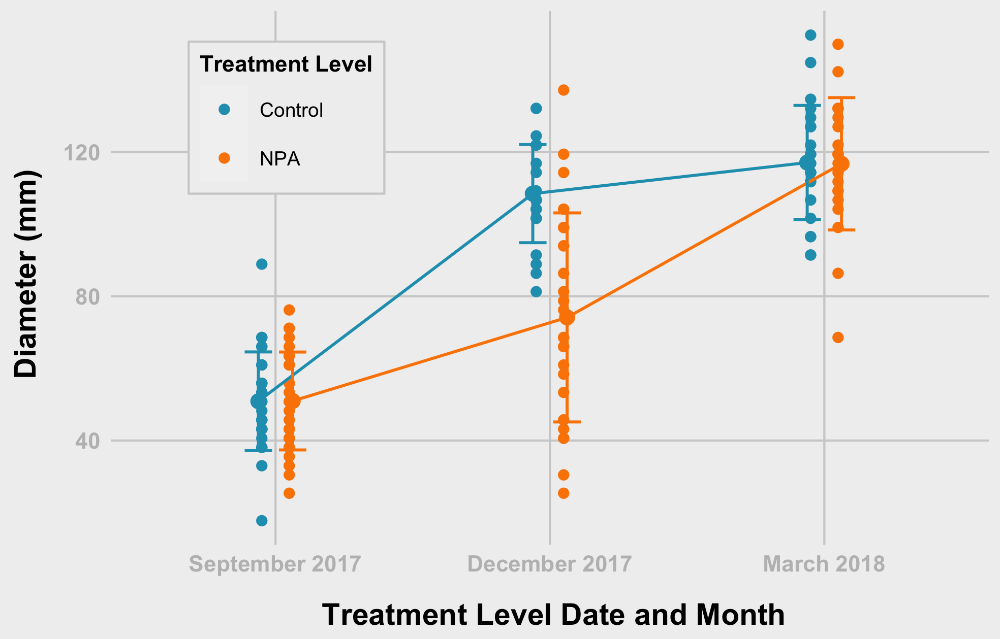

Analysis of diameter by treatment level
================
Bishwa
2022-03-22

-   [Section 01 - Get Data and Prepare the
    data](#section-01---get-data-and-prepare-the-data)
    -   [1.1 Upload Packages](#11-upload-packages)
    -   [1.2 Check Data Structures](#12-check-data-structures)
    -   [Prepare the data](#prepare-the-data)
    -   [Section 02 - Summary
        statistics](#section-02---summary-statistics)
-   [](#section)
-   [Section 03 - Plots and Anlysis](#section-03---plots-and-anlysis)
    -   [Diameter - Tretment Level](#diameter---tretment-level)
-   [Diameter - Treatment Level (tl) -
    Points](#diameter---treatment-level-tl---points)
-   [End](#end)

# Section 01 - Get Data and Prepare the data

I downloaded data and placed on my computer. You should change the path
for the data following packges are necessary for your work 1.
`tidyverse` 2. `car` 3. `nlme` 4. `lme4` 5. `rstatix`

When I am using function from specific packages I am using namespace
atleast at the first time of its usage

``` r
library(tidyr)
library(dplyr)
```

    ## 
    ## Attaching package: 'dplyr'

    ## The following objects are masked from 'package:stats':
    ## 
    ##     filter, lag

    ## The following objects are masked from 'package:base':
    ## 
    ##     intersect, setdiff, setequal, union

``` r
library(ggplot2)
library(rstatix)
```

    ## 
    ## Attaching package: 'rstatix'

    ## The following object is masked from 'package:stats':
    ## 
    ##     filter

## 1.1 Upload Packages

``` r
##--------- set working directory

path<- "../data/"


sep2017<- readxl::read_excel(path = paste0(path, "/09_18_2017_Data.xlsx"), sheet = "Sheet1", na = "NA")
dec2017<- readxl::read_excel(path = paste0(path, "/12_18_2017_Data.xlsx"), sheet = "Sheet1", na = "NA")
mar2018<- readxl::read_excel(path = paste0(path, "/03_28_2018_Data.xlsx"), sheet = "Sheet1", na = "NA")
```

## 1.2 Check Data Structures

### September 2017

``` r
str(sep2017)
```

    ## tibble [59 × 15] (S3: tbl_df/tbl/data.frame)
    ##  $ Date            : chr [1:59] "09_18_2017" "09_18_2017" "09_18_2017" "09_18_2017" ...
    ##  $ Plant_ID        : chr [1:59] "M-14-08-A" "M-14-08-B" "M-14-08-C" "M-14-08-D" ...
    ##  $ Family          : num [1:59] 8 8 8 8 8 8 8 8 8 8 ...
    ##  $ Diameter(inches): num [1:59] 2.2 2.5 2.6 1.7 1.5 3 2.7 3.5 1.7 2.7 ...
    ##  $ Lat_Shoot_R     : num [1:59] 0 0 0 0 1 0 1 0 0 0 ...
    ##  $ Inflorescence   : num [1:59] 0 0 0 0 1 0 0 0 0 0 ...
    ##  $ Leaf_Shape      : num [1:59] 3 3 3 3 3 3 3 3 3 3 ...
    ##  $ Trichomes_int   : num [1:59] 2 2 2 3 2 1 2 2 2 2 ...
    ##  $ TreatmentLevel  : chr [1:59] "Auxin" "Auxin" "Control" "Control" ...
    ##  $ Treatment       : chr [1:59] "Aux_Drop" "Aux_Spray" "DMSO" "Water" ...
    ##  $ Population      : chr [1:59] "My" "My" "My" "My" ...
    ##  $ Bolting         : num [1:59] 0 0 0 0 1 0 0 0 0 0 ...
    ##  $ Flowering       : num [1:59] 0 0 0 0 1 0 0 0 0 0 ...
    ##  $ Remarks_01      : chr [1:59] NA NA NA NA ...
    ##  $ Remarks_02      : chr [1:59] NA NA NA NA ...

### December 2017

``` r
str(dec2017)
```

    ## tibble [59 × 15] (S3: tbl_df/tbl/data.frame)
    ##  $ Date            : chr [1:59] "12_18_2017" "12_18_2017" "12_18_2017" "12_18_2017" ...
    ##  $ Plant_ID        : chr [1:59] "M-14-08-A" "M-14-08-B" "M-14-08-C" "M-14-08-D" ...
    ##  $ Family          : num [1:59] 8 8 8 8 8 8 8 8 8 8 ...
    ##  $ Diameter(inches): num [1:59] NA 3.7 NA 4.2 2.6 3.7 4 5.2 5.4 3.4 ...
    ##  $ Lat_Shoot_R     : chr [1:59] NA "2" NA "2" ...
    ##  $ Inflorescence   : num [1:59] NA 1 NA 4 7 0 0 1 0 1 ...
    ##  $ Leaf_Shape      : chr [1:59] NA "2" NA "3" ...
    ##  $ Trichomes_int   : chr [1:59] NA "1" NA "1" ...
    ##  $ TreatmentLevel  : chr [1:59] "Auxin" "Auxin" "Control" "Control" ...
    ##  $ Treatment       : chr [1:59] "Aux_Drop" "Aux_Spray" "DMSO" "Water" ...
    ##  $ Population      : chr [1:59] "My" "My" "My" "My" ...
    ##  $ Bolting         : num [1:59] NA 1 NA 1 1 0 0 1 0 1 ...
    ##  $ Flowering       : num [1:59] NA 1 NA 1 1 0 0 1 0 1 ...
    ##  $ Remarks_01      : chr [1:59] "Missing - I think we extracted RNA out of it ??" "LCU" NA "Foliage out of frame" ...
    ##  $ Remarks_02      : chr [1:59] NA NA NA NA ...

### October 2018

``` r
str(mar2018)
```

    ## tibble [59 × 15] (S3: tbl_df/tbl/data.frame)
    ##  $ Date            : chr [1:59] "03_28_2018" "03_28_2018" "03_28_2018" "03_28_2018" ...
    ##  $ Plant_ID        : chr [1:59] "M-14-08-A" "M-14-08-B" "M-14-08-C" "M-14-08-D" ...
    ##  $ Family          : num [1:59] 8 8 8 8 8 8 8 8 8 8 ...
    ##  $ Diameter(inches): num [1:59] NA 4.2 NA 3.6 3.4 4.6 5.2 4.7 5.2 5.2 ...
    ##  $ Lat_Shoot_R     : num [1:59] NA 3 NA 3 3 3 4 3 4 4 ...
    ##  $ Inflorescence   : num [1:59] NA 3 NA 5 6 0 0 0 3 0 ...
    ##  $ Leaf_Shape      : num [1:59] NA 2 NA 3 3 2 3 3 3 3 ...
    ##  $ Trichomes_int   : num [1:59] NA 2 NA 1 2 1 1 1 1 1 ...
    ##  $ TreatmentLevel  : chr [1:59] "Auxin" "Auxin" "Control" "Control" ...
    ##  $ Treatment       : chr [1:59] "Aux_Drop" "Aux_Spray" "DMSO" "Water" ...
    ##  $ Population      : chr [1:59] "My" "My" "My" "My" ...
    ##  $ Bolting         : num [1:59] NA 1 NA 1 1 0 0 0 1 0 ...
    ##  $ Flowering       : num [1:59] NA 1 NA 1 1 0 0 0 1 0 ...
    ##  $ Remarks_01      : chr [1:59] NA NA NA NA ...
    ##  $ Remarks_02      : logi [1:59] NA NA NA NA NA NA ...

## Prepare the data

### ID’s & Column for Month

``` r
# ID's
sep2017$id<- row.names(sep2017)
dec2017$id<- row.names(dec2017)
mar2018$id<- row.names(mar2018)

# Month column
sep2017$Month <- "Sep"
dec2017$Month <- "Dec"
mar2018$Month <- "Mar"
```

### Combine the sets & and change column names

``` r
fdata<- rbind(sep2017,dec2017,mar2018)

# changing the name when necessary
names(fdata)<- c("date", "plantID", "family", "diaIn", "latShootRating", 
                 "inflorescence", "leafShape", "trichomesInt", "treatmentLevel", 
                 "treatment", "population", "bolting", "flowering", "remarks_01", 
                 "remarks_02", "id", "month")
```

### Convert inches to mm

``` r
fdata$diaIn <- fdata$diaIn * 25.4

fdata <- fdata %>%
  mutate(treatmentLevel = replace(treatmentLevel, treatmentLevel == "Auxin", "NPA"))
```

### Get rid of unnecessary columns and check the amount of missing values in each column

``` r
library(tidyverse)
```

    ## ── Attaching packages ─────────────────────────────────────── tidyverse 1.3.1 ──

    ## ✓ tibble  3.1.6     ✓ stringr 1.4.0
    ## ✓ readr   2.1.2     ✓ forcats 0.5.1
    ## ✓ purrr   0.3.4

    ## ── Conflicts ────────────────────────────────────────── tidyverse_conflicts() ──
    ## x rstatix::filter() masks dplyr::filter(), stats::filter()
    ## x dplyr::lag()      masks stats::lag()

``` r
mvdata<- fdata %>% select( - c(remarks_01, remarks_02))

mvdata %>% summarise_all(funs(sum(is.na(.))))
```

    ## Warning: `funs()` was deprecated in dplyr 0.8.0.
    ## Please use a list of either functions or lambdas: 
    ## 
    ##   # Simple named list: 
    ##   list(mean = mean, median = median)
    ## 
    ##   # Auto named with `tibble::lst()`: 
    ##   tibble::lst(mean, median)
    ## 
    ##   # Using lambdas
    ##   list(~ mean(., trim = .2), ~ median(., na.rm = TRUE))
    ## This warning is displayed once every 8 hours.
    ## Call `lifecycle::last_lifecycle_warnings()` to see where this warning was generated.

    ## # A tibble: 1 × 15
    ##    date plantID family diaIn latShootRating inflorescence leafShape trichomesInt
    ##   <int>   <int>  <int> <int>          <int>         <int>     <int>        <int>
    ## 1     0       0      0    25             25            25        25           25
    ## # … with 7 more variables: treatmentLevel <int>, treatment <int>,
    ## #   population <int>, bolting <int>, flowering <int>, id <int>, month <int>

### Delete rows with missing values

``` r
fndata <- mvdata %>% drop_na()

#fndata <- fdata %>%  mutate(across(where(is.character), ~na_if(., "NA")))
```

### Specify correct data types

``` r
# Not numeric variables
char_var<- c("date","plantID","treatmentLevel","treatment","population", "month", "family")

# Numeric variables
num_var<- names(fndata[, !(names(fndata) %in% char_var)])

#convert characters to numeric vector
fndata[, num_var]<- sapply(fndata[, num_var], as.numeric)
```

    ## Warning in lapply(X = X, FUN = FUN, ...): NAs introduced by coercion

    ## Warning in lapply(X = X, FUN = FUN, ...): NAs introduced by coercion

    ## Warning in lapply(X = X, FUN = FUN, ...): NAs introduced by coercion

``` r
#convert characters to factors
fndata$dateFac   <- factor(fndata$date,       labels =  c("September 2017", "December 2017", "March 2018" ),
                           levels =  c("09_18_2017", "12_18_2017", "03_28_2018" ))

fndata$treatment <- factor(fndata$treatment,  labels =  c("NPA Drop", "NPA Spray", "DMSO", "Water"))

fndata$treatmentLevel <- as.factor(fndata$treatmentLevel)

fndata$plantID<- as.factor(fndata$plantID)

# Check 
sapply(fndata, class)
```

    ##           date        plantID         family          diaIn latShootRating 
    ##    "character"       "factor"      "numeric"      "numeric"      "numeric" 
    ##  inflorescence      leafShape   trichomesInt treatmentLevel      treatment 
    ##      "numeric"      "numeric"      "numeric"       "factor"       "factor" 
    ##     population        bolting      flowering             id          month 
    ##    "character"      "numeric"      "numeric"      "numeric"    "character" 
    ##        dateFac 
    ##       "factor"

``` r
fdata %>% distinct(plantID)
```

    ## # A tibble: 59 × 1
    ##    plantID  
    ##    <chr>    
    ##  1 M-14-08-A
    ##  2 M-14-08-B
    ##  3 M-14-08-C
    ##  4 M-14-08-D
    ##  5 M-14-08-E
    ##  6 M-14-08-F
    ##  7 M-14-08-G
    ##  8 M-14-08-H
    ##  9 M-14-08-I
    ## 10 M-14-08-J
    ## # … with 49 more rows

``` r
fdata %>% select(plantID, diaIn, month) %>%
  pivot_wider(names_from = "month", values_from = "diaIn") %>%
  mutate(check = ifelse(!is.na(Sep) & !is.na(Dec) & !is.na(Mar), 1, 0)) %>%
  filter(check == 1)
```

    ## # A tibble: 42 × 5
    ##    plantID     Sep   Dec   Mar check
    ##    <chr>     <dbl> <dbl> <dbl> <dbl>
    ##  1 M-14-08-B  63.5  94.0 107.      1
    ##  2 M-14-08-D  43.2 107.   91.4     1
    ##  3 M-14-08-E  38.1  66.0  86.4     1
    ##  4 M-14-08-F  76.2  94.0 117.      1
    ##  5 M-14-08-G  68.6 102.  132.      1
    ##  6 M-14-08-H  88.9 132.  119.      1
    ##  7 M-14-08-I  43.2 137.  132.      1
    ##  8 M-14-08-J  68.6  86.4 132.      1
    ##  9 M-14-08-K  50.8 122.  114.      1
    ## 10 M-14-08-L  61.0 107.  114.      1
    ## # … with 32 more rows

``` r
fdata %>% group_by(month) %>%
  summarise(count = n(),
            na = sum(is.na(diaIn))) %>%
  mutate(clean = count - na)
```

    ## # A tibble: 3 × 4
    ##   month count    na clean
    ##   <chr> <int> <int> <int>
    ## 1 Dec      59     9    50
    ## 2 Mar      59    15    44
    ## 3 Sep      59     1    58

``` r
fdata %>% select(plantID, diaIn, month) %>%
  pivot_wider(names_from = "month", values_from = "diaIn") %>%
  mutate(check = ifelse(!is.na(Sep) & !is.na(Dec) & !is.na(Mar), 1, 0)) %>%
  filter(check == 1) %>%
  mutate(dc_change = ifelse(Dec - Sep < 0, 1, 0),
         md_change = ifelse(Mar - Dec < 0, 1, 0)) %>%
  filter(md_change == 1)
```

    ## # A tibble: 7 × 7
    ##   plantID     Sep   Dec   Mar check dc_change md_change
    ##   <chr>     <dbl> <dbl> <dbl> <dbl>     <dbl>     <dbl>
    ## 1 M-14-08-D  43.2  107.  91.4     1         0         1
    ## 2 M-14-08-H  88.9  132. 119.      1         0         1
    ## 3 M-14-08-I  43.2  137. 132.      1         0         1
    ## 4 M-14-08-K  50.8  122. 114.      1         0         1
    ## 5 M-14-16-E  53.3  117. 114.      1         0         1
    ## 6 M-14-21-A  55.9  104. 102.      1         0         1
    ## 7 M-14-21-E  53.3  122. 112.      1         0         1

## Section 02 - Summary statistics

### Choose variables of interest

``` r
# extract variables that are important
sel_var<- c("date", "plantID", "treatment", "treatmentLevel","diaIn",
            "latShootRatio", "inflorescence", "leafShape"  )

#---------- mean
# mean_diaInflo<- fndata %>% select(sel_var) %>% 
#   group_by(treatment) %>% 
#   summarise_at(.vars = vars(diaIn, inflorescence),.funs = c(mean = "mean"))
# 
# sd_diaInflo<- fndata %>% select(sel_var) %>% 
#   group_by(treatment) %>% 
#   summarise_at(.vars = vars(diaIn, inflorescence),.funs = c(sd = "mean"))
# 
# sumdat<- cbind(mean_diaInflo, sd_diaInflo[, 2:3])

# Stats for Diameter
mean_diaInflo<- fndata %>% 
  group_by(treatment) %>% 
  summarise(mean = mean(diaIn, na.rm = TRUE),
            sd   = sd(diaIn, na.rm = TRUE)
  )

# Stats for inflorescence
mean_inflo<- fndata %>% 
  group_by(treatment) %>% 
  summarise(
    mean = mean(inflorescence, na.rm = TRUE),
    sd   = sd(inflorescence, na.rm = TRUE)
  )

# Stats for Lat_Shoot
mean_latShoot<- fndata %>% 
  group_by(treatment) %>% 
  summarise(mean = mean(latShootRating, na.rm = TRUE),
            sd   = sd(latShootRating, na.rm = TRUE)
  )

#------- apply variable name and combine
mean_diaInflo$var <- "Diameter"
mean_inflo$var    <- "Inflorescence"
mean_latShoot$var <- "LatShoot"


sumdata<- rbind(mean_diaInflo,mean_inflo, mean_latShoot)
sumdata
```

    ## # A tibble: 12 × 4
    ##    treatment   mean     sd var          
    ##    <fct>      <dbl>  <dbl> <chr>        
    ##  1 NPA Drop  82.0   35.1   Diameter     
    ##  2 NPA Spray 70.5   31.4   Diameter     
    ##  3 DMSO      90.0   35.1   Diameter     
    ##  4 Water     88.7   32.4   Diameter     
    ##  5 NPA Drop   1.33   2.02  Inflorescence
    ##  6 NPA Spray  0.583  0.996 Inflorescence
    ##  7 DMSO       0.973  1.86  Inflorescence
    ##  8 Water      1.46   2.09  Inflorescence
    ##  9 NPA Drop   1.68   1.23  LatShoot     
    ## 10 NPA Spray  1.51   1.29  LatShoot     
    ## 11 DMSO       1.49   1.12  LatShoot     
    ## 12 Water      1.54   1.10  LatShoot

# 

``` r
library(sjPlot)
```

# Section 03 - Plots and Anlysis

### Theme Function

``` r
theme_538 <- function(base_size = 8, base_family = "Arial") {
  theme_grey(base_size = base_size, base_family = base_family) %+replace%
    theme(
      # drop minor gridlines and axis-ticks
      panel.grid.minor = element_blank(),
      axis.ticks = element_blank(),
      # change font elements/family
      text = element_text(family = "Arial", size = base_size),
      axis.text = element_text(face = "bold", color = "grey", size = base_size),
      axis.title = element_text(face = "bold", size = rel(1.33)),
      axis.title.x = element_text(margin = margin(0.3, 0, 0, 0, unit = "cm")),
      axis.title.y = element_text(margin = margin(0, 0.3, 0, 0, unit = "cm"), angle =90),
      plot.title = element_text(face = "bold", size = rel(1.67), hjust = 0),
      plot.title.position = "plot",
      plot.subtitle = element_text(size = 12, margin = margin(0.2, 0, 1, 0, unit = "cm"), hjust = 0),
      plot.caption = element_text(size = 8, margin = margin(1, 0, 0, 0, unit = "cm"), hjust = 1),
      # change plot colors for the background/panel elements
      plot.background = element_rect(fill = "#f0f0f0", color = NA),
      panel.background = element_rect(fill = "#f0f0f0", color = NA),
      panel.grid.major =  element_line(color = "#d0d0d0"),
      panel.border = element_blank(),
      # shrinks margin and simplify the strip/facet elements
      strip.background = element_blank(),
      strip.text = element_text(size = rel(1.33), face = "bold")
    )
}
```

## Diameter - Tretment Level

### Diameter - Treatment Level (tl) - Density Function

``` r
grDevices::png(filename = "plots/hist_diam_tl.png",  width = 16.5, height = 10, units = 'cm', res = 400)

hist_diam <- fndata %>%
  ggplot(aes(diaIn, fill = treatmentLevel, colour = treatmentLevel)) +
  geom_density(alpha = 0.6) +
  scale_fill_manual("Treatment Level", values = c("#219ebc","#fb8500")) +
  scale_colour_manual("Treatment Level", values = c("#219ebc","#fb8500")) + 
  facet_wrap(~dateFac, nrow = 3) + 
  labs(x = "Diameter (mm)", y = "Density") +
  #coord_flip() + 
  theme_538() +
  theme(
    #legend.position = "top",
    legend.background = element_rect(fill = "#f0f0f0", color = "#d0d0d0"),
    legend.title = element_text(size = 8, face = "bold"),
    legend.title.align = 0.5,
    legend.text = element_text(size=7),
    plot.margin = margin(0.3, 0.1, 0.2, 0.2, unit = "cm"),
    )
hist_diam  

dev.off()
```

    ## quartz_off_screen 
    ##                 2

``` r
knitr::include_graphics("plots/hist_diam_tl.png")
```

<!-- -->

### Diameter - Treatment Level (tl) - Density Function version 2

``` r
grDevices::png(filename = "plots/hist_diam2.png",  width = 16.5, height = 10, units = 'cm', res = 400)

hist_diam2 <- fndata %>%
  ggplot(aes(diaIn, fill = treatmentLevel, colour = treatmentLevel)) +
  geom_density(alpha = 0.6) +
  scale_fill_manual("Treatment Level", values = c("#219ebc","#fb8500")) +
  scale_colour_manual("Treatment Level", values = c("#219ebc","#fb8500")) + 
  facet_grid(treatmentLevel ~ dateFac) + 
  labs(x = "Diameter (mm)", y = "Density") +
  #coord_flip() + 
  theme_538() +
  theme(
    legend.position = "top",
    legend.background = element_rect(fill = "#f0f0f0", color = "#d0d0d0"),
    legend.title = element_text(family = "Arial", size = 8, face = "bold"),
    legend.title.align = 0.5,
    legend.text = element_text(size=7),
    plot.margin = margin(0.3, 0.3, 0.2, 0.2, unit = "cm"),
    )
  

hist_diam2

dev.off()
```

    ## quartz_off_screen 
    ##                 2

``` r
knitr::include_graphics("plots/hist_diam2.png")
```

<!-- -->

### Diameter - Treatment Level (tl) - Boxplot

``` r
grDevices::png(filename = "plots/violin_diam.png",  width = 12.5, height = 8, units = 'cm', res = 400)

violin_diam <- fndata %>%
  group_by(treatmentLevel, dateFac) %>% mutate(N=n()) %>%
  mutate(N=ifelse(diaIn==max(diaIn,na.rm=T),paste0('n=',N),NA)) %>%
  ggplot(aes(x = treatmentLevel, y = diaIn, fill = treatmentLevel, colour = treatmentLevel, label = N)) +
  #geom_violin(alpha = 0.6) +
  geom_boxplot(#width = 0.1, 
               alpha = 0.6) +
  geom_text(vjust = -0.2, hjust = 0.5, show.legend = FALSE, colour = "black", size = 3) +
  scale_fill_manual("Treatment Level", values = c("#219ebc", "#fb8500")) +
  scale_colour_manual("Treatment Level", values = c("#219ebc", "#fb8500")) +
  facet_wrap(~dateFac, nrow = 1, ncol = 3) + 
  labs(x = "Treatment Level", y = "Diameter (mm)") +
  xlab("") +
  #coord_flip() +
  theme_538() +
  theme(
    legend.position = "top",
    legend.background = element_rect(fill = "#f0f0f0", color = "#d0d0d0"),
    legend.title = element_text(family = "Arial", size = 8, face = "bold"),
    legend.title.align = 0.5,
    legend.text = element_text(size=7),
    #axis.text.x = element_text(angle = 45, vjust = 0.5, hjust=1)
    )
  

violin_diam
```

    ## Warning: Removed 145 rows containing missing values (geom_text).

``` r
dev.off()
```

    ## quartz_off_screen 
    ##                 2

``` r
knitr::include_graphics("plots/violin_diam.png")
```

<!-- -->

# Diameter - Treatment Level (tl) - Points

``` r
grDevices::png(filename = "plots/dots_diam_tl.png",  width = 12.5, height = 8, units = 'cm', res = 400)

dots_diam_tl <- fndata %>% ggplot(aes(x = dateFac, y = diaIn, group = treatmentLevel, color = treatmentLevel))+
  #geom_point()
  geom_point(size = 2,shape = 20, position = position_dodge(0.2 ))+
  #geom_line(position = position_dodge(0.25 ))+
  stat_summary(fun =  mean, size = 2, geom = "point", 
               position = position_dodge(0.25), show.legend = FALSE)+
  
  stat_summary(fun = mean, size = 0.5, geom = "line",
               position = position_dodge(0.25), show.legend = FALSE)+
    
  stat_summary(fun.data = mean_sdl, fun.args = list(mult=1), 
               geom = "errorbar", width=0.2,
               position = position_dodge(0.25), show.legend = FALSE) +
  
  theme_bw(base_size = 14,base_family = "Serif")+
  xlab(" Treatment Level Date and Month")+
  ylab(" Diameter (mm)")+
  # labs(fill = "Treatment")
  # guides(fill=guide_legend(title = "Treatment"))
  scale_color_manual("Treatment Level",values = c("#219ebc","#fb8500"))+
  theme_538() + 
  theme(
    legend.position = c(0.2, 0.8),
    legend.background = element_rect(fill = "#f0f0f0", color = "#d0d0d0"),
    legend.title = element_text(family = "Arial", size = 8, face = "bold"),
    legend.title.align = 0.5,
    legend.text = element_text(size=7)
  )
  
dots_diam_tl

dev.off()
```

    ## quartz_off_screen 
    ##                 2

``` r

```

<!-- -->

### Diameter - Treatment Level (tl) - Checking for Normality

Shapiro-Test for each group p-values is less than 0.05, hence, we reject
hypothesis about normal distribution.

``` r
fndata %>% group_by(treatmentLevel) %>% 
  shapiro_test(diaIn)
```

    ## # A tibble: 2 × 4
    ##   treatmentLevel variable statistic        p
    ##   <fct>          <chr>        <dbl>    <dbl>
    ## 1 Control        diaIn        0.929 0.000463
    ## 2 NPA            diaIn        0.938 0.000857

### Diameter - Treatment Level (tl) - Checking for Normality by Month

If we divide by both month and treatment, distribution can be assumed to
be normal

``` r
fndata %>% group_by(treatmentLevel, dateFac) %>%
  shapiro_test(diaIn) %>%
  left_join(fndata %>% 
              group_by(treatmentLevel, dateFac) %>%
              summarise(n = n()),
            by = c("treatmentLevel", "dateFac"))
```

    ## `summarise()` has grouped output by 'treatmentLevel'. You can override using
    ## the `.groups` argument.

    ## # A tibble: 6 × 6
    ##   treatmentLevel dateFac        variable statistic     p     n
    ##   <fct>          <fct>          <chr>        <dbl> <dbl> <int>
    ## 1 Control        September 2017 diaIn        0.958 0.318    28
    ## 2 Control        December 2017  diaIn        0.954 0.352    23
    ## 3 Control        March 2018     diaIn        0.970 0.689    23
    ## 4 NPA            September 2017 diaIn        0.969 0.505    30
    ## 5 NPA            December 2017  diaIn        0.976 0.771    27
    ## 6 NPA            March 2018     diaIn        0.960 0.515    21

### Diameter - Treatment Level (tl) - Pairwise T-test

``` r
ph_diam_tl <- fndata %>% 
  pairwise_t_test(
    diaIn~treatmentLevel, paired = FALSE, # due to sample difference
    p.adjust.method = "holm"       # with treatment not so much of difference
  )

# print
print(ph_diam_tl)
```

    ## # A tibble: 1 × 9
    ##   .y.   group1  group2    n1    n2      p p.signif  p.adj p.adj.signif
    ## * <chr> <chr>   <chr>  <int> <int>  <dbl> <chr>     <dbl> <chr>       
    ## 1 diaIn Control NPA       74    78 0.0217 *        0.0217 *

``` r
t.test(diaIn ~ treatmentLevel, data = subset(fndata, dateFac == "September 2017"))
```

    ## 
    ##  Welch Two Sample t-test
    ## 
    ## data:  diaIn by treatmentLevel
    ## t = -0.021957, df = 55.661, p-value = 0.9826
    ## alternative hypothesis: true difference in means between group Control and group NPA is not equal to 0
    ## 95 percent confidence interval:
    ##  -7.252435  7.095197
    ## sample estimates:
    ## mean in group Control     mean in group NPA 
    ##              50.89071              50.96933

``` r
t.test(diaIn ~ treatmentLevel, data = subset(fndata, dateFac == "December 2017"))
```

    ## 
    ##  Welch Two Sample t-test
    ## 
    ## data:  diaIn by treatmentLevel
    ## t = 5.4849, df = 38.171, p-value = 2.858e-06
    ## alternative hypothesis: true difference in means between group Control and group NPA is not equal to 0
    ## 95 percent confidence interval:
    ##  21.65272 46.98045
    ## sample estimates:
    ## mean in group Control     mean in group NPA 
    ##             108.44696              74.13037

``` r
t.test(diaIn ~ treatmentLevel, data = subset(fndata, dateFac == "March 2018"))
```

    ## 
    ##  Welch Two Sample t-test
    ## 
    ## data:  diaIn by treatmentLevel
    ## t = 0.065866, df = 39.756, p-value = 0.9478
    ## alternative hypothesis: true difference in means between group Control and group NPA is not equal to 0
    ## 95 percent confidence interval:
    ##  -10.14890  10.83254
    ## sample estimates:
    ## mean in group Control     mean in group NPA 
    ##              117.0609              116.7190

``` r
t.test(diaIn ~ treatmentLevel, data = subset(fndata, dateFac == "December 2017"), alternative = "less")
```

    ## 
    ##  Welch Two Sample t-test
    ## 
    ## data:  diaIn by treatmentLevel
    ## t = 5.4849, df = 38.171, p-value = 1
    ## alternative hypothesis: true difference in means between group Control and group NPA is less than 0
    ## 95 percent confidence interval:
    ##      -Inf 44.86367
    ## sample estimates:
    ## mean in group Control     mean in group NPA 
    ##             108.44696              74.13037

### Diameter - Treatment Level (tl) - Pairwise T-test - For September 2017

``` r
ph_diam_tl_sep <- fndata %>% 
  filter(dateFac == "September 2017") %>%
  pairwise_t_test(
    diaIn~treatmentLevel, paired = FALSE, # due to sample difference
    p.adjust.method = "holm"       # with treatment not so much of difference
  )

# print
print(ph_diam_tl_sep)
```

    ## # A tibble: 1 × 9
    ##   .y.   group1  group2    n1    n2     p p.signif p.adj p.adj.signif
    ## * <chr> <chr>   <chr>  <int> <int> <dbl> <chr>    <dbl> <chr>       
    ## 1 diaIn Control NPA       28    30 0.983 ns       0.983 ns

``` r
ttest_diam_tl <- t.test(subset(fndata, fndata$treatmentLevel == "Control")$diaIn,
       subset(fndata, fndata$treatmentLevel == "NPA")$diaIn)
```

### Diameter - Treatment Level (tl) - Pairwise T-test - For December 2017

``` r
ph_diam_tl_dec <- fndata %>% 
  filter(dateFac == "December 2017") %>%
  pairwise_t_test(
    diaIn~treatmentLevel, paired = FALSE, # due to sample difference
    p.adjust.method = "holm"       # with treatment not so much of difference
  )

# print
print(ph_diam_tl_dec)
```

    ## # A tibble: 1 × 9
    ##   .y.   group1  group2    n1    n2          p p.signif      p.adj p.adj.signif
    ## * <chr> <chr>   <chr>  <int> <int>      <dbl> <chr>         <dbl> <chr>       
    ## 1 diaIn Control NPA       23    27 0.00000398 ****     0.00000398 ****

### Diameter - Treatment Level (tl) - Pairwise T-test - For March 2018

``` r
ph_diam_tl_mar <- fndata %>% 
  filter(dateFac == "March 2018") %>%
  pairwise_t_test(
    diaIn~treatmentLevel, paired = FALSE, # due to sample difference
    p.adjust.method = "holm"       # with treatment not so much of difference
  )

# print
print(ph_diam_tl_mar)
```

    ## # A tibble: 1 × 9
    ##   .y.   group1  group2    n1    n2     p p.signif p.adj p.adj.signif
    ## * <chr> <chr>   <chr>  <int> <int> <dbl> <chr>    <dbl> <chr>       
    ## 1 diaIn Control NPA       23    21 0.947 ns       0.947 ns

### Diameter - Treatment Level (tl) - repeated Anova

``` r
aov_diam_tl <- aov(diaIn~treatmentLevel*dateFac + Error(id), data = fndata)
summary(aov_diam_tl)
```

    ## 
    ## Error: id
    ##                Df Sum Sq Mean Sq
    ## treatmentLevel  1   1385    1385
    ## 
    ## Error: Within
    ##                         Df Sum Sq Mean Sq F value   Pr(>F)    
    ## treatmentLevel           1   6164    6164   18.83 2.67e-05 ***
    ## dateFac                  2 110943   55472  169.43  < 2e-16 ***
    ## treatmentLevel:dateFac   2   9802    4901   14.97 1.23e-06 ***
    ## Residuals              145  47473     327                     
    ## ---
    ## Signif. codes:  0 '***' 0.001 '**' 0.01 '*' 0.05 '.' 0.1 ' ' 1

### Diameter - Treatment Level (tl) - Mixed effects for repeated data 1

``` r
lme1_diam_tl<- nlme::lme(diaIn~1, random = ~1|treatmentLevel, method = "REML", na.action = na.omit,
          data = fndata)

summary(lme1_diam_tl)
```

    ## Linear mixed-effects model fit by REML
    ##   Data: fndata 
    ##        AIC      BIC   logLik
    ##   1502.914 1511.966 -748.457
    ## 
    ## Random effects:
    ##  Formula: ~1 | treatmentLevel
    ##         (Intercept) Residual
    ## StdDev:    8.075647 33.63356
    ## 
    ## Fixed effects:  diaIn ~ 1 
    ##                Value Std.Error  DF  t-value p-value
    ## (Intercept) 82.98637  6.328858 150 13.11238       0
    ## 
    ## Standardized Within-Group Residuals:
    ##        Min         Q1        Med         Q3        Max 
    ## -2.0919150 -0.9558991  0.0226398  0.8533578  2.1414862 
    ## 
    ## Number of Observations: 152
    ## Number of Groups: 2

### Diameter - Treatment Level (tl) - Mixed effects for repeated data 2

``` r
lme2_diam_tl<- nlme::lme(diaIn~treatmentLevel, random = ~1|dateFac,
                method = "REML", na.action = na.omit,
                data = fndata)
summary(lme2_diam_tl)
```

    ## Linear mixed-effects model fit by REML
    ##   Data: fndata 
    ##       AIC      BIC   logLik
    ##   1348.67 1360.713 -670.335
    ## 
    ## Random effects:
    ##  Formula: ~1 | dateFac
    ##         (Intercept) Residual
    ## StdDev:    32.85491 19.85049
    ## 
    ## Fixed effects:  diaIn ~ treatmentLevel 
    ##                       Value Std.Error  DF   t-value p-value
    ## (Intercept)        91.68937  19.10921 148  4.798176   0e+00
    ## treatmentLevelNPA -11.33137   3.22524 148 -3.513344   6e-04
    ##  Correlation: 
    ##                   (Intr)
    ## treatmentLevelNPA -0.086
    ## 
    ## Standardized Within-Group Residuals:
    ##        Min         Q1        Med         Q3        Max 
    ## -2.9859241 -0.5687867 -0.0318547  0.5828219  2.6441622 
    ## 
    ## Number of Observations: 152
    ## Number of Groups: 3

### Diameter - Treatment Level (tl) - Mixed effects for repeated data 3

``` r
lme3_diam_tl<- nlme::lme(diaIn~treatmentLevel*dateFac, random = ~1|id,
                method = "REML", na.action = na.omit,
                data = fndata)

summary(lme3_diam_tl)
```

    ## Linear mixed-effects model fit by REML
    ##   Data: fndata 
    ##        AIC     BIC    logLik
    ##   1292.891 1316.76 -638.4455
    ## 
    ## Random effects:
    ##  Formula: ~1 | id
    ##         (Intercept) Residual
    ## StdDev:    8.180073 16.31426
    ## 
    ## Fixed effects:  diaIn ~ treatmentLevel * dateFac 
    ##                                            Value Std.Error DF   t-value p-value
    ## (Intercept)                             50.89071  3.448958 89 14.755388  0.0000
    ## treatmentLevelNPA                       -0.09914  4.793093 57 -0.020683  0.9836
    ## dateFacDecember 2017                    57.34944  4.634271 89 12.375072  0.0000
    ## dateFacMarch 2018                       65.91481  4.634271 89 14.223338  0.0000
    ## treatmentLevelNPA:dateFacDecember 2017 -33.95370  6.366296 89 -5.333353  0.0000
    ## treatmentLevelNPA:dateFacMarch 2018     -1.53743  6.622397 89 -0.232156  0.8169
    ##  Correlation: 
    ##                                        (Intr) trLNPA dFD201 dFM201 tLNPA:FD2
    ## treatmentLevelNPA                      -0.720                               
    ## dateFacDecember 2017                   -0.595  0.428                        
    ## dateFacMarch 2018                      -0.595  0.428  0.457                 
    ## treatmentLevelNPA:dateFacDecember 2017  0.433 -0.604 -0.728 -0.333          
    ## treatmentLevelNPA:dateFacMarch 2018     0.416 -0.581 -0.320 -0.700  0.451   
    ## 
    ## Standardized Within-Group Residuals:
    ##         Min          Q1         Med          Q3         Max 
    ## -2.22981773 -0.56215951 -0.04678512  0.57431222  3.22508844 
    ## 
    ## Number of Observations: 152
    ## Number of Groups: 59

### Diameter - Treatment Level (tl) - Mixed effects for repeated data 4

``` r
lme4_diam_tl <- nlme::lme(diaIn~treatmentLevel, random = ~1|id,
                method = "REML", na.action = na.omit,
                data = fndata)

lme4_diam_tl
```

    ## Linear mixed-effects model fit by REML
    ##   Data: fndata 
    ##   Log-restricted-likelihood: -744.4998
    ##   Fixed: diaIn ~ treatmentLevel 
    ##       (Intercept) treatmentLevelNPA 
    ##          89.34622         -12.65775 
    ## 
    ## Random effects:
    ##  Formula: ~1 | id
    ##         (Intercept) Residual
    ## StdDev: 0.001739356 33.63356
    ## 
    ## Number of Observations: 152
    ## Number of Groups: 59

### Diameter - Treatment Level (tl) - Mixed effects for repeated data 5

``` r
dglme_diam_tl<- lme4::lmer(diaIn~treatmentLevel*dateFac +(1|id), data = fndata)

anova(dglme_diam_tl, type = 3)
```

    ## Warning in anova.merMod(dglme_diam_tl, type = 3): additional arguments ignored:
    ## 'type'

    ## Analysis of Variance Table
    ##                        npar Sum Sq Mean Sq F value
    ## treatmentLevel            1   3728    3728  14.008
    ## dateFac                   2 105750   52875 198.663
    ## treatmentLevel:dateFac    2   9153    4577  17.195

``` r
summary(dglme_diam_tl)
```

    ## Linear mixed model fit by REML ['lmerMod']
    ## Formula: diaIn ~ treatmentLevel * dateFac + (1 | id)
    ##    Data: fndata
    ## 
    ## REML criterion at convergence: 1276.9
    ## 
    ## Scaled residuals: 
    ##     Min      1Q  Median      3Q     Max 
    ## -2.2298 -0.5622 -0.0468  0.5743  3.2251 
    ## 
    ## Random effects:
    ##  Groups   Name        Variance Std.Dev.
    ##  id       (Intercept)  66.91    8.18   
    ##  Residual             266.16   16.31   
    ## Number of obs: 152, groups:  id, 59
    ## 
    ## Fixed effects:
    ##                                         Estimate Std. Error t value
    ## (Intercept)                             50.89071    3.44896  14.755
    ## treatmentLevelNPA                       -0.09914    4.79309  -0.021
    ## dateFacDecember 2017                    57.34944    4.63427  12.375
    ## dateFacMarch 2018                       65.91481    4.63427  14.223
    ## treatmentLevelNPA:dateFacDecember 2017 -33.95370    6.36630  -5.333
    ## treatmentLevelNPA:dateFacMarch 2018     -1.53743    6.62240  -0.232
    ## 
    ## Correlation of Fixed Effects:
    ##             (Intr) trLNPA dFD201 dFM201 tLNPA:FD2
    ## trtmntLvNPA -0.720                               
    ## dtFcDcm2017 -0.595  0.428                        
    ## dtFcMrc2018 -0.595  0.428  0.457                 
    ## tLNPA:FD201  0.433 -0.604 -0.728 -0.333          
    ## tLNPA:FM201  0.416 -0.581 -0.320 -0.700  0.451

``` r
dglme_diam_tl<- lme4::lmer(diaIn~treatmentLevel*dateFac +(1|id), data = fndata)

anova(dglme_diam_tl, type = 3)
```

    ## Warning in anova.merMod(dglme_diam_tl, type = 3): additional arguments ignored:
    ## 'type'

    ## Analysis of Variance Table
    ##                        npar Sum Sq Mean Sq F value
    ## treatmentLevel            1   3728    3728  14.008
    ## dateFac                   2 105750   52875 198.663
    ## treatmentLevel:dateFac    2   9153    4577  17.195

``` r
summary(dglme_diam_tl)
```

    ## Linear mixed model fit by REML ['lmerMod']
    ## Formula: diaIn ~ treatmentLevel * dateFac + (1 | id)
    ##    Data: fndata
    ## 
    ## REML criterion at convergence: 1276.9
    ## 
    ## Scaled residuals: 
    ##     Min      1Q  Median      3Q     Max 
    ## -2.2298 -0.5622 -0.0468  0.5743  3.2251 
    ## 
    ## Random effects:
    ##  Groups   Name        Variance Std.Dev.
    ##  id       (Intercept)  66.91    8.18   
    ##  Residual             266.16   16.31   
    ## Number of obs: 152, groups:  id, 59
    ## 
    ## Fixed effects:
    ##                                         Estimate Std. Error t value
    ## (Intercept)                             50.89071    3.44896  14.755
    ## treatmentLevelNPA                       -0.09914    4.79309  -0.021
    ## dateFacDecember 2017                    57.34944    4.63427  12.375
    ## dateFacMarch 2018                       65.91481    4.63427  14.223
    ## treatmentLevelNPA:dateFacDecember 2017 -33.95370    6.36630  -5.333
    ## treatmentLevelNPA:dateFacMarch 2018     -1.53743    6.62240  -0.232
    ## 
    ## Correlation of Fixed Effects:
    ##             (Intr) trLNPA dFD201 dFM201 tLNPA:FD2
    ## trtmntLvNPA -0.720                               
    ## dtFcDcm2017 -0.595  0.428                        
    ## dtFcMrc2018 -0.595  0.428  0.457                 
    ## tLNPA:FD201  0.433 -0.604 -0.728 -0.333          
    ## tLNPA:FM201  0.416 -0.581 -0.320 -0.700  0.451

``` r
plot(as.vector(predict(dglme_diam_tl, fndata)), fndata$diaIn)
```

<!-- -->

``` r
tab_model(dglme_diam_tl, file = "diam_tl.doc")
```

<table style="border-collapse:collapse; border:none;">
<tr>
<th style="border-top: double; text-align:center; font-style:normal; font-weight:bold; padding:0.2cm;  text-align:left; ">
 
</th>
<th colspan="3" style="border-top: double; text-align:center; font-style:normal; font-weight:bold; padding:0.2cm; ">
diaIn
</th>
</tr>
<tr>
<td style=" text-align:center; border-bottom:1px solid; font-style:italic; font-weight:normal;  text-align:left; ">
Predictors
</td>
<td style=" text-align:center; border-bottom:1px solid; font-style:italic; font-weight:normal;  ">
Estimates
</td>
<td style=" text-align:center; border-bottom:1px solid; font-style:italic; font-weight:normal;  ">
CI
</td>
<td style=" text-align:center; border-bottom:1px solid; font-style:italic; font-weight:normal;  ">
p
</td>
</tr>
<tr>
<td style=" padding:0.2cm; text-align:left; vertical-align:top; text-align:left; ">
(Intercept)
</td>
<td style=" padding:0.2cm; text-align:left; vertical-align:top; text-align:center;  ">
50.89
</td>
<td style=" padding:0.2cm; text-align:left; vertical-align:top; text-align:center;  ">
44.07 – 57.71
</td>
<td style=" padding:0.2cm; text-align:left; vertical-align:top; text-align:center;  ">
<strong>\<0.001</strong>
</td>
</tr>
<tr>
<td style=" padding:0.2cm; text-align:left; vertical-align:top; text-align:left; ">
treatmentLevel \[NPA\]
</td>
<td style=" padding:0.2cm; text-align:left; vertical-align:top; text-align:center;  ">
-0.10
</td>
<td style=" padding:0.2cm; text-align:left; vertical-align:top; text-align:center;  ">
-9.57 – 9.37
</td>
<td style=" padding:0.2cm; text-align:left; vertical-align:top; text-align:center;  ">
0.984
</td>
</tr>
<tr>
<td style=" padding:0.2cm; text-align:left; vertical-align:top; text-align:left; ">
dateFac [December 2017](#december-2017)
</td>
<td style=" padding:0.2cm; text-align:left; vertical-align:top; text-align:center;  ">
57.35
</td>
<td style=" padding:0.2cm; text-align:left; vertical-align:top; text-align:center;  ">
48.19 – 66.51
</td>
<td style=" padding:0.2cm; text-align:left; vertical-align:top; text-align:center;  ">
<strong>\<0.001</strong>
</td>
</tr>
<tr>
<td style=" padding:0.2cm; text-align:left; vertical-align:top; text-align:left; ">
dateFac \[March 2018\]
</td>
<td style=" padding:0.2cm; text-align:left; vertical-align:top; text-align:center;  ">
65.91
</td>
<td style=" padding:0.2cm; text-align:left; vertical-align:top; text-align:center;  ">
56.75 – 75.07
</td>
<td style=" padding:0.2cm; text-align:left; vertical-align:top; text-align:center;  ">
<strong>\<0.001</strong>
</td>
</tr>
<tr>
<td style=" padding:0.2cm; text-align:left; vertical-align:top; text-align:left; ">
treatmentLevel \[NPA\] \*<br>dateFac [December 2017](#december-2017)
</td>
<td style=" padding:0.2cm; text-align:left; vertical-align:top; text-align:center;  ">
-33.95
</td>
<td style=" padding:0.2cm; text-align:left; vertical-align:top; text-align:center;  ">
-46.54 – -21.37
</td>
<td style=" padding:0.2cm; text-align:left; vertical-align:top; text-align:center;  ">
<strong>\<0.001</strong>
</td>
</tr>
<tr>
<td style=" padding:0.2cm; text-align:left; vertical-align:top; text-align:left; ">
treatmentLevel \[NPA\] \*<br>dateFac \[March 2018\]
</td>
<td style=" padding:0.2cm; text-align:left; vertical-align:top; text-align:center;  ">
-1.54
</td>
<td style=" padding:0.2cm; text-align:left; vertical-align:top; text-align:center;  ">
-14.63 – 11.55
</td>
<td style=" padding:0.2cm; text-align:left; vertical-align:top; text-align:center;  ">
0.817
</td>
</tr>
<tr>
<td colspan="4" style="font-weight:bold; text-align:left; padding-top:.8em;">
Random Effects
</td>
</tr>
<tr>
<td style=" padding:0.2cm; text-align:left; vertical-align:top; text-align:left; padding-top:0.1cm; padding-bottom:0.1cm;">
σ<sup>2</sup>
</td>
<td style=" padding:0.2cm; text-align:left; vertical-align:top; padding-top:0.1cm; padding-bottom:0.1cm; text-align:left;" colspan="3">
266.16
</td>
</tr>
<tr>
<td style=" padding:0.2cm; text-align:left; vertical-align:top; text-align:left; padding-top:0.1cm; padding-bottom:0.1cm;">
τ<sub>00</sub> <sub>id</sub>
</td>
<td style=" padding:0.2cm; text-align:left; vertical-align:top; padding-top:0.1cm; padding-bottom:0.1cm; text-align:left;" colspan="3">
66.91
</td>
<tr>
<td style=" padding:0.2cm; text-align:left; vertical-align:top; text-align:left; padding-top:0.1cm; padding-bottom:0.1cm;">
ICC
</td>
<td style=" padding:0.2cm; text-align:left; vertical-align:top; padding-top:0.1cm; padding-bottom:0.1cm; text-align:left;" colspan="3">
0.20
</td>
<tr>
<td style=" padding:0.2cm; text-align:left; vertical-align:top; text-align:left; padding-top:0.1cm; padding-bottom:0.1cm;">
N <sub>id</sub>
</td>
<td style=" padding:0.2cm; text-align:left; vertical-align:top; padding-top:0.1cm; padding-bottom:0.1cm; text-align:left;" colspan="3">
59
</td>
<tr>
<td style=" padding:0.2cm; text-align:left; vertical-align:top; text-align:left; padding-top:0.1cm; padding-bottom:0.1cm; border-top:1px solid;">
Observations
</td>
<td style=" padding:0.2cm; text-align:left; vertical-align:top; padding-top:0.1cm; padding-bottom:0.1cm; text-align:left; border-top:1px solid;" colspan="3">
152
</td>
</tr>
<tr>
<td style=" padding:0.2cm; text-align:left; vertical-align:top; text-align:left; padding-top:0.1cm; padding-bottom:0.1cm;">
Marginal R<sup>2</sup> / Conditional R<sup>2</sup>
</td>
<td style=" padding:0.2cm; text-align:left; vertical-align:top; padding-top:0.1cm; padding-bottom:0.1cm; text-align:left;" colspan="3">
0.713 / 0.770
</td>
</tr>
</table>

``` r
summary(aov(diaIn ~ treatmentLevel*dateFac, data = fndata))
```

    ##                         Df Sum Sq Mean Sq F value   Pr(>F)    
    ## treatmentLevel           1   6084    6084    18.3 3.40e-05 ***
    ## dateFac                  2 111364   55682   167.5  < 2e-16 ***
    ## treatmentLevel:dateFac   2   9773    4886    14.7 1.53e-06 ***
    ## Residuals              146  48545     333                     
    ## ---
    ## Signif. codes:  0 '***' 0.001 '**' 0.01 '*' 0.05 '.' 0.1 ' ' 1

``` r
summary(lm(diaIn ~ treatmentLevel*dateFac, data = fndata))
```

    ## 
    ## Call:
    ## lm(formula = diaIn ~ treatmentLevel * dateFac, data = fndata)
    ## 
    ## Residuals:
    ##     Min      1Q  Median      3Q     Max 
    ## -48.730 -10.270  -0.994  12.492  63.030 
    ## 
    ## Coefficients:
    ##                                         Estimate Std. Error t value Pr(>|t|)
    ## (Intercept)                             50.89071    3.44603  14.768  < 2e-16
    ## treatmentLevelNPA                        0.07862    4.79151   0.016    0.987
    ## dateFacDecember 2017                    57.55624    5.13145  11.216  < 2e-16
    ## dateFacMarch 2018                       66.17016    5.13145  12.895  < 2e-16
    ## treatmentLevelNPA:dateFacDecember 2017 -34.39521    7.05196  -4.877 2.78e-06
    ## treatmentLevelNPA:dateFacMarch 2018     -0.42044    7.29717  -0.058    0.954
    ##                                           
    ## (Intercept)                            ***
    ## treatmentLevelNPA                         
    ## dateFacDecember 2017                   ***
    ## dateFacMarch 2018                      ***
    ## treatmentLevelNPA:dateFacDecember 2017 ***
    ## treatmentLevelNPA:dateFacMarch 2018       
    ## ---
    ## Signif. codes:  0 '***' 0.001 '**' 0.01 '*' 0.05 '.' 0.1 ' ' 1
    ## 
    ## Residual standard error: 18.23 on 146 degrees of freedom
    ## Multiple R-squared:  0.7238, Adjusted R-squared:  0.7143 
    ## F-statistic: 76.52 on 5 and 146 DF,  p-value: < 2.2e-16

### 

``` r
library(sjPlot)
tab_model(dglme_diam_tl, file = "test.doc")
```

<table style="border-collapse:collapse; border:none;">
<tr>
<th style="border-top: double; text-align:center; font-style:normal; font-weight:bold; padding:0.2cm;  text-align:left; ">
 
</th>
<th colspan="3" style="border-top: double; text-align:center; font-style:normal; font-weight:bold; padding:0.2cm; ">
diaIn
</th>
</tr>
<tr>
<td style=" text-align:center; border-bottom:1px solid; font-style:italic; font-weight:normal;  text-align:left; ">
Predictors
</td>
<td style=" text-align:center; border-bottom:1px solid; font-style:italic; font-weight:normal;  ">
Estimates
</td>
<td style=" text-align:center; border-bottom:1px solid; font-style:italic; font-weight:normal;  ">
CI
</td>
<td style=" text-align:center; border-bottom:1px solid; font-style:italic; font-weight:normal;  ">
p
</td>
</tr>
<tr>
<td style=" padding:0.2cm; text-align:left; vertical-align:top; text-align:left; ">
(Intercept)
</td>
<td style=" padding:0.2cm; text-align:left; vertical-align:top; text-align:center;  ">
50.89
</td>
<td style=" padding:0.2cm; text-align:left; vertical-align:top; text-align:center;  ">
44.07 – 57.71
</td>
<td style=" padding:0.2cm; text-align:left; vertical-align:top; text-align:center;  ">
<strong>\<0.001</strong>
</td>
</tr>
<tr>
<td style=" padding:0.2cm; text-align:left; vertical-align:top; text-align:left; ">
treatmentLevel \[NPA\]
</td>
<td style=" padding:0.2cm; text-align:left; vertical-align:top; text-align:center;  ">
-0.10
</td>
<td style=" padding:0.2cm; text-align:left; vertical-align:top; text-align:center;  ">
-9.57 – 9.37
</td>
<td style=" padding:0.2cm; text-align:left; vertical-align:top; text-align:center;  ">
0.984
</td>
</tr>
<tr>
<td style=" padding:0.2cm; text-align:left; vertical-align:top; text-align:left; ">
dateFac [December 2017](#december-2017)
</td>
<td style=" padding:0.2cm; text-align:left; vertical-align:top; text-align:center;  ">
57.35
</td>
<td style=" padding:0.2cm; text-align:left; vertical-align:top; text-align:center;  ">
48.19 – 66.51
</td>
<td style=" padding:0.2cm; text-align:left; vertical-align:top; text-align:center;  ">
<strong>\<0.001</strong>
</td>
</tr>
<tr>
<td style=" padding:0.2cm; text-align:left; vertical-align:top; text-align:left; ">
dateFac \[March 2018\]
</td>
<td style=" padding:0.2cm; text-align:left; vertical-align:top; text-align:center;  ">
65.91
</td>
<td style=" padding:0.2cm; text-align:left; vertical-align:top; text-align:center;  ">
56.75 – 75.07
</td>
<td style=" padding:0.2cm; text-align:left; vertical-align:top; text-align:center;  ">
<strong>\<0.001</strong>
</td>
</tr>
<tr>
<td style=" padding:0.2cm; text-align:left; vertical-align:top; text-align:left; ">
treatmentLevel \[NPA\] \*<br>dateFac [December 2017](#december-2017)
</td>
<td style=" padding:0.2cm; text-align:left; vertical-align:top; text-align:center;  ">
-33.95
</td>
<td style=" padding:0.2cm; text-align:left; vertical-align:top; text-align:center;  ">
-46.54 – -21.37
</td>
<td style=" padding:0.2cm; text-align:left; vertical-align:top; text-align:center;  ">
<strong>\<0.001</strong>
</td>
</tr>
<tr>
<td style=" padding:0.2cm; text-align:left; vertical-align:top; text-align:left; ">
treatmentLevel \[NPA\] \*<br>dateFac \[March 2018\]
</td>
<td style=" padding:0.2cm; text-align:left; vertical-align:top; text-align:center;  ">
-1.54
</td>
<td style=" padding:0.2cm; text-align:left; vertical-align:top; text-align:center;  ">
-14.63 – 11.55
</td>
<td style=" padding:0.2cm; text-align:left; vertical-align:top; text-align:center;  ">
0.817
</td>
</tr>
<tr>
<td colspan="4" style="font-weight:bold; text-align:left; padding-top:.8em;">
Random Effects
</td>
</tr>
<tr>
<td style=" padding:0.2cm; text-align:left; vertical-align:top; text-align:left; padding-top:0.1cm; padding-bottom:0.1cm;">
σ<sup>2</sup>
</td>
<td style=" padding:0.2cm; text-align:left; vertical-align:top; padding-top:0.1cm; padding-bottom:0.1cm; text-align:left;" colspan="3">
266.16
</td>
</tr>
<tr>
<td style=" padding:0.2cm; text-align:left; vertical-align:top; text-align:left; padding-top:0.1cm; padding-bottom:0.1cm;">
τ<sub>00</sub> <sub>id</sub>
</td>
<td style=" padding:0.2cm; text-align:left; vertical-align:top; padding-top:0.1cm; padding-bottom:0.1cm; text-align:left;" colspan="3">
66.91
</td>
<tr>
<td style=" padding:0.2cm; text-align:left; vertical-align:top; text-align:left; padding-top:0.1cm; padding-bottom:0.1cm;">
ICC
</td>
<td style=" padding:0.2cm; text-align:left; vertical-align:top; padding-top:0.1cm; padding-bottom:0.1cm; text-align:left;" colspan="3">
0.20
</td>
<tr>
<td style=" padding:0.2cm; text-align:left; vertical-align:top; text-align:left; padding-top:0.1cm; padding-bottom:0.1cm;">
N <sub>id</sub>
</td>
<td style=" padding:0.2cm; text-align:left; vertical-align:top; padding-top:0.1cm; padding-bottom:0.1cm; text-align:left;" colspan="3">
59
</td>
<tr>
<td style=" padding:0.2cm; text-align:left; vertical-align:top; text-align:left; padding-top:0.1cm; padding-bottom:0.1cm; border-top:1px solid;">
Observations
</td>
<td style=" padding:0.2cm; text-align:left; vertical-align:top; padding-top:0.1cm; padding-bottom:0.1cm; text-align:left; border-top:1px solid;" colspan="3">
152
</td>
</tr>
<tr>
<td style=" padding:0.2cm; text-align:left; vertical-align:top; text-align:left; padding-top:0.1cm; padding-bottom:0.1cm;">
Marginal R<sup>2</sup> / Conditional R<sup>2</sup>
</td>
<td style=" padding:0.2cm; text-align:left; vertical-align:top; padding-top:0.1cm; padding-bottom:0.1cm; text-align:left;" colspan="3">
0.713 / 0.770
</td>
</tr>
</table>

``` r
tab_model(lme3_diam_tl, file = "test2.doc")
```

<table style="border-collapse:collapse; border:none;">
<tr>
<th style="border-top: double; text-align:center; font-style:normal; font-weight:bold; padding:0.2cm;  text-align:left; ">
 
</th>
<th colspan="3" style="border-top: double; text-align:center; font-style:normal; font-weight:bold; padding:0.2cm; ">
diaIn
</th>
</tr>
<tr>
<td style=" text-align:center; border-bottom:1px solid; font-style:italic; font-weight:normal;  text-align:left; ">
Predictors
</td>
<td style=" text-align:center; border-bottom:1px solid; font-style:italic; font-weight:normal;  ">
Estimates
</td>
<td style=" text-align:center; border-bottom:1px solid; font-style:italic; font-weight:normal;  ">
CI
</td>
<td style=" text-align:center; border-bottom:1px solid; font-style:italic; font-weight:normal;  ">
p
</td>
</tr>
<tr>
<td style=" padding:0.2cm; text-align:left; vertical-align:top; text-align:left; ">
(Intercept)
</td>
<td style=" padding:0.2cm; text-align:left; vertical-align:top; text-align:center;  ">
50.89
</td>
<td style=" padding:0.2cm; text-align:left; vertical-align:top; text-align:center;  ">
44.04 – 57.74
</td>
<td style=" padding:0.2cm; text-align:left; vertical-align:top; text-align:center;  ">
<strong>\<0.001</strong>
</td>
</tr>
<tr>
<td style=" padding:0.2cm; text-align:left; vertical-align:top; text-align:left; ">
treatmentLevel \[NPA\]
</td>
<td style=" padding:0.2cm; text-align:left; vertical-align:top; text-align:center;  ">
-0.10
</td>
<td style=" padding:0.2cm; text-align:left; vertical-align:top; text-align:center;  ">
-9.70 – 9.50
</td>
<td style=" padding:0.2cm; text-align:left; vertical-align:top; text-align:center;  ">
0.984
</td>
</tr>
<tr>
<td style=" padding:0.2cm; text-align:left; vertical-align:top; text-align:left; ">
dateFac [December 2017](#december-2017)
</td>
<td style=" padding:0.2cm; text-align:left; vertical-align:top; text-align:center;  ">
57.35
</td>
<td style=" padding:0.2cm; text-align:left; vertical-align:top; text-align:center;  ">
48.14 – 66.56
</td>
<td style=" padding:0.2cm; text-align:left; vertical-align:top; text-align:center;  ">
<strong>\<0.001</strong>
</td>
</tr>
<tr>
<td style=" padding:0.2cm; text-align:left; vertical-align:top; text-align:left; ">
dateFac \[March 2018\]
</td>
<td style=" padding:0.2cm; text-align:left; vertical-align:top; text-align:center;  ">
65.91
</td>
<td style=" padding:0.2cm; text-align:left; vertical-align:top; text-align:center;  ">
56.71 – 75.12
</td>
<td style=" padding:0.2cm; text-align:left; vertical-align:top; text-align:center;  ">
<strong>\<0.001</strong>
</td>
</tr>
<tr>
<td style=" padding:0.2cm; text-align:left; vertical-align:top; text-align:left; ">
treatmentLevel \[NPA\] \*<br>dateFac [December 2017](#december-2017)
</td>
<td style=" padding:0.2cm; text-align:left; vertical-align:top; text-align:center;  ">
-33.95
</td>
<td style=" padding:0.2cm; text-align:left; vertical-align:top; text-align:center;  ">
-46.60 – -21.30
</td>
<td style=" padding:0.2cm; text-align:left; vertical-align:top; text-align:center;  ">
<strong>\<0.001</strong>
</td>
</tr>
<tr>
<td style=" padding:0.2cm; text-align:left; vertical-align:top; text-align:left; ">
treatmentLevel \[NPA\] \*<br>dateFac \[March 2018\]
</td>
<td style=" padding:0.2cm; text-align:left; vertical-align:top; text-align:center;  ">
-1.54
</td>
<td style=" padding:0.2cm; text-align:left; vertical-align:top; text-align:center;  ">
-14.70 – 11.62
</td>
<td style=" padding:0.2cm; text-align:left; vertical-align:top; text-align:center;  ">
0.817
</td>
</tr>
<tr>
<td colspan="4" style="font-weight:bold; text-align:left; padding-top:.8em;">
Random Effects
</td>
</tr>
<tr>
<td style=" padding:0.2cm; text-align:left; vertical-align:top; text-align:left; padding-top:0.1cm; padding-bottom:0.1cm;">
σ<sup>2</sup>
</td>
<td style=" padding:0.2cm; text-align:left; vertical-align:top; padding-top:0.1cm; padding-bottom:0.1cm; text-align:left;" colspan="3">
266.16
</td>
</tr>
<tr>
<td style=" padding:0.2cm; text-align:left; vertical-align:top; text-align:left; padding-top:0.1cm; padding-bottom:0.1cm;">
τ<sub>00</sub> <sub>id</sub>
</td>
<td style=" padding:0.2cm; text-align:left; vertical-align:top; padding-top:0.1cm; padding-bottom:0.1cm; text-align:left;" colspan="3">
66.91
</td>
<tr>
<td style=" padding:0.2cm; text-align:left; vertical-align:top; text-align:left; padding-top:0.1cm; padding-bottom:0.1cm;">
N <sub>id</sub>
</td>
<td style=" padding:0.2cm; text-align:left; vertical-align:top; padding-top:0.1cm; padding-bottom:0.1cm; text-align:left;" colspan="3">
59
</td>
<tr>
<td style=" padding:0.2cm; text-align:left; vertical-align:top; text-align:left; padding-top:0.1cm; padding-bottom:0.1cm; border-top:1px solid;">
Observations
</td>
<td style=" padding:0.2cm; text-align:left; vertical-align:top; padding-top:0.1cm; padding-bottom:0.1cm; text-align:left; border-top:1px solid;" colspan="3">
152
</td>
</tr>
<tr>
<td style=" padding:0.2cm; text-align:left; vertical-align:top; text-align:left; padding-top:0.1cm; padding-bottom:0.1cm;">
Marginal R<sup>2</sup> / Conditional R<sup>2</sup>
</td>
<td style=" padding:0.2cm; text-align:left; vertical-align:top; padding-top:0.1cm; padding-bottom:0.1cm; text-align:left;" colspan="3">
0.756 / NA
</td>
</tr>
</table>

# End
