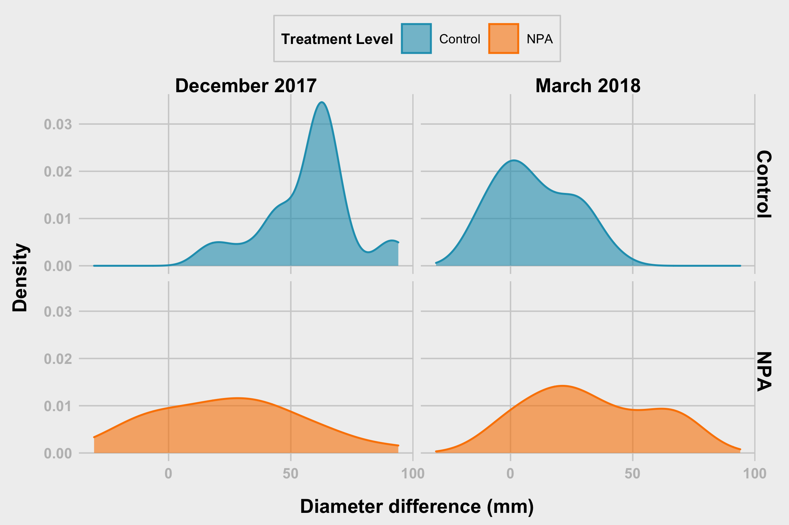

```{r setup, include=FALSE}
knitr::opts_chunk$set(echo = TRUE)
```

# Section 01 - Get Data and Prepare the data

I downloaded data and placed on my computer. You should change the path for the data
following packges are necessary for your work
1. `tidyverse`
2. `car`
3. `nlme`
4. `lme4`
5. `rstatix`

When I am using function from specific packages I am using namespace atleast at the first time of its usage

```{r}
library(tidyr)
library(dplyr)
library(ggplot2)
library(rstatix)
```


## 1.1 Upload Packages
```{r dataImport}
##--------- set working directory

path<- "../data/"


sep2017<- readxl::read_excel(path = paste0(path, "/09_18_2017_Data.xlsx"), sheet = "Sheet1", na = "NA")
dec2017<- readxl::read_excel(path = paste0(path, "/12_18_2017_Data.xlsx"), sheet = "Sheet1", na = "NA")
mar2018<- readxl::read_excel(path = paste0(path, "/03_28_2018_Data.xlsx"), sheet = "Sheet1", na = "NA")
```

## 1.2 Check Data Structures

### September 2017
```{r}
str(sep2017)
```

### December 2017 
```{r}
str(dec2017)
```

### October 2018
```{r}
str(mar2018)
```

## Prepare the data

### ID's & Column for Month
```{r}
# ID's
sep2017$id<- row.names(sep2017)
dec2017$id<- row.names(dec2017)
mar2018$id<- row.names(mar2018)

# Month column
sep2017$Month <- "Sep"
dec2017$Month <- "Dec"
mar2018$Month <- "Mar"
```

### Combine the sets & and change column names
```{r}
fdata<- rbind(sep2017,dec2017,mar2018)

# changing the name when necessary
names(fdata)<- c("date", "plantID", "family", "diaIn", "latShootRating", 
                 "inflorescence", "leafShape", "trichomesInt", "treatmentLevel", 
                 "treatment", "population", "bolting", "flowering", "remarks_01", 
                 "remarks_02", "id", "month")
```

### Convert inches to mm
```{r}
fdata$diaIn <- fdata$diaIn * 25.4

fdata <- fdata %>%
  mutate(treatmentLevel = replace(treatmentLevel, treatmentLevel == "Auxin", "NPA"))
```

### Get rid of unnecessary columns and check the amount of missing values in each column
```{r}
library(tidyverse)
mvdata<- fdata %>% select( - c(remarks_01, remarks_02))

mvdata %>% summarise_all(funs(sum(is.na(.))))
```

### Delete rows with missing values
```{r}
fndata <- mvdata %>% drop_na()

#fndata <- fdata %>%  mutate(across(where(is.character), ~na_if(., "NA")))
```

### Specify correct data types
```{r}
# Not numeric variables
char_var<- c("date","plantID","treatmentLevel","treatment","population", "month", "family")

# Numeric variables
num_var<- names(fndata[, !(names(fndata) %in% char_var)])

#convert characters to numeric vector
fndata[, num_var]<- sapply(fndata[, num_var], as.numeric)

#convert characters to factors
fndata$dateFac   <- factor(fndata$date,       labels =  c("September 2017", "December 2017", "March 2018" ),
                           levels =  c("09_18_2017", "12_18_2017", "03_28_2018" ))

fndata$treatment <- factor(fndata$treatment,  labels =  c("NPA Drop", "NPA Spray", "DMSO", "Water"))

fndata$treatmentLevel <- as.factor(fndata$treatmentLevel)

fndata$plantID<- as.factor(fndata$plantID)

# Check 
sapply(fndata, class)
```

## Section 02 - Overall Summary statistics

### Choose variables of interest
```{r pressure}
# extract variables that are important
sel_var<- c("date", "plantID", "treatment", "treatmentLevel","diaIn",
            "latShootRatio", "inflorescence", "leafShape"  )

#---------- mean
# mean_diaInflo<- fndata %>% select(sel_var) %>% 
#   group_by(treatment) %>% 
#   summarise_at(.vars = vars(diaIn, inflorescence),.funs = c(mean = "mean"))
# 
# sd_diaInflo<- fndata %>% select(sel_var) %>% 
#   group_by(treatment) %>% 
#   summarise_at(.vars = vars(diaIn, inflorescence),.funs = c(sd = "mean"))
# 
# sumdat<- cbind(mean_diaInflo, sd_diaInflo[, 2:3])

# Stats for Diameter
mean_diaInflo<- fndata %>% 
  group_by(treatment) %>% 
  summarise(mean = mean(diaIn, na.rm = TRUE),
            sd   = sd(diaIn, na.rm = TRUE)
  )

# Stats for inflorescence
mean_inflo<- fndata %>% 
  group_by(treatment) %>% 
  summarise(
    mean = mean(inflorescence, na.rm = TRUE),
    sd   = sd(inflorescence, na.rm = TRUE)
  )

# Stats for Lat_Shoot
mean_latShoot<- fndata %>% 
  group_by(treatment) %>% 
  summarise(mean = mean(latShootRating, na.rm = TRUE),
            sd   = sd(latShootRating, na.rm = TRUE)
  )

#------- apply variable name and combine
mean_diaInflo$var <- "Diameter"
mean_inflo$var    <- "Inflorescence"
mean_latShoot$var <- "LatShoot"


sumdata<- rbind(mean_diaInflo,mean_inflo, mean_latShoot)
sumdata
```

# Section 03 - Plots and Anlysis

### Theme Function
```{r}
theme_538 <- function(base_size = 8, base_family = "Arial") {
  theme_grey(base_size = base_size, base_family = base_family) %+replace%
    theme(
      # drop minor gridlines and axis-ticks
      panel.grid.minor = element_blank(),
      axis.ticks = element_blank(),
      # change font elements/family
      text = element_text(family = "Arial", size = base_size),
      axis.text = element_text(face = "bold", color = "grey", size = base_size),
      axis.title = element_text(face = "bold", size = rel(1.33)),
      axis.title.x = element_text(margin = margin(0.3, 0, 0, 0, unit = "cm")),
      axis.title.y = element_text(margin = margin(0, 0.3, 0, 0, unit = "cm"), angle =90),
      plot.title = element_text(face = "bold", size = rel(1.67), hjust = 0),
      plot.title.position = "plot",
      plot.subtitle = element_text(size = 12, margin = margin(0.2, 0, 1, 0, unit = "cm"), hjust = 0),
      plot.caption = element_text(size = 8, margin = margin(1, 0, 0, 0, unit = "cm"), hjust = 1),
      # change plot colors for the background/panel elements
      plot.background = element_rect(fill = "#f0f0f0", color = NA),
      panel.background = element_rect(fill = "#f0f0f0", color = NA),
      panel.grid.major =  element_line(color = "#d0d0d0"),
      panel.border = element_blank(),
      # shrinks margin and simplify the strip/facet elements
      strip.background = element_blank(),
      strip.text = element_text(size = rel(1.33), face = "bold")
    )
}
```

# Diameter Difference - Treatment Level

### Difference in Diameter between December 2017 and September 2017
```{r}
diff_sep_dec <- fndata %>% 
  filter(dateFac == "December 2017") %>%
  left_join(fndata %>% filter(dateFac == "September 2017") %>% 
              select(plantID, diaIn),
            by = "plantID",
            suffix = c("_Dec", "_Sep")) %>% 
  mutate(period = "sep_dec",
         dia_diff = diaIn_Dec - diaIn_Sep)

head(diff_sep_dec %>% select(plantID, diaIn_Dec, diaIn_Sep, dia_diff))
```

### Difference in Diameter between March 2018 and December 2017
```{r}
diff_dec_mar <- fndata %>% 
  filter(dateFac == "March 2018") %>%
  left_join(fndata %>% filter(dateFac == "December 2017") %>% 
              select(plantID, diaIn),
            by = "plantID",
            suffix = c("_Mar", "_Dec")) %>% 
  mutate(period = "dec_mar",
         dia_diff = diaIn_Mar - diaIn_Dec)

head(diff_dec_mar %>% select(plantID, diaIn_Mar, diaIn_Dec, dia_diff))
```

### Diff_Data
```{r}
data_diff <- rbind(diff_sep_dec %>% select(plantID, id, dia_diff, period, treatment, treatmentLevel, dateFac, family),
                   diff_dec_mar %>% select(plantID, id, dia_diff, period, treatment, treatmentLevel, dateFac, family))
```

### Diameter difference - Treatment Level (tl) -  Density Function
```{r}
grDevices::png(filename = "plots/hist_diam_diff_tl.png",  width = 16.5, height = 10, units = 'cm', res = 400)

hist_diam_diff_tl <- data_diff %>%
  ggplot(aes(y = dia_diff, fill = treatmentLevel, colour = treatmentLevel)) +
  geom_density(alpha = 0.6) +
  scale_fill_manual("Treatment Level", values = c("#219ebc","#fb8500")) +
  scale_colour_manual("Treatment Level", values = c("#219ebc","#fb8500")) + 
  facet_wrap(~dateFac, nrow = 2) + 
  labs(x = "Density", y = "Diameter difference (mm)") +
  coord_flip() + 
  theme_538() +
  theme(
    #legend.position = "top",
    legend.background = element_rect(fill = "#f0f0f0", color = "#d0d0d0"),
    legend.title = element_text(family = "Arial", size = 8, face = "bold"),
    legend.title.align = 0.5,
    legend.text = element_text(size=7),
    plot.margin = margin(0.3, 0.1, 0.2, 0.2, unit = "cm"),
    )
  

hist_diam_diff_tl

dev.off()

knitr::include_graphics("plots/hist_diam_diff_tl.png")
```

### Diameter difference - Treatment Level (tl) -  Density Function version 2
```{r}
grDevices::png(filename = "plots/hist_diam_diff_tl2.png",  width = 6, height = 4, units = 'in', res = 400)

hist_diam_diff_tl2 <- data_diff %>%
  ggplot(aes(y = dia_diff, fill = treatmentLevel, colour = treatmentLevel)) +
  geom_density(alpha = 0.6) +
  scale_fill_manual("Treatment Level", values = c("#219ebc","#fb8500")) +
  scale_colour_manual("Treatment Level", values = c("#219ebc","#fb8500")) + 
  facet_grid(treatmentLevel ~ dateFac) + 
  labs(x = "Density", y = "Diameter difference (mm)") +
  coord_flip() + 
  theme_538() +
  theme(
    legend.position = "top",
    legend.background = element_rect(fill = "#f0f0f0", color = "#d0d0d0"),
    legend.title = element_text(family = "Arial", size = 8, face = "bold"),
    legend.title.align = 0.5,
    legend.text = element_text(size=7),
    plot.margin = margin(0.3, 0.3, 0.2, 0.2, unit = "cm"),
    )
  

hist_diam_diff_tl2

dev.off()


```


### Diameter difference - Treatment Level (tl) - Boxplot
```{r}
grDevices::png(filename = "plots/violin_diam_diff_tl.png",  width = 6, height = 6, units = 'in', res = 400)

violin_diam_diff_tl <- data_diff %>%
  group_by(treatmentLevel, dateFac) %>% mutate(N=n()) %>%
  mutate(N=ifelse(dia_diff==max(dia_diff,na.rm=T),paste0('n=',N),NA)) %>%
  ggplot(aes(x = treatmentLevel, y = dia_diff, fill = treatmentLevel, colour = treatmentLevel, label = N)) +
  #geom_violin(alpha = 0.6) +
  geom_boxplot(#width = 0.1, 
               alpha = 0.6) +
  geom_text(vjust = -0.1, hjust = 0.5, show.legend = FALSE) +
  scale_fill_manual("Treatment Level", values = c("#219ebc","#fb8500")) +
  scale_colour_manual("Treatment Level", values = c("#219ebc","#fb8500")) +
  facet_wrap(~dateFac, nrow = 2, ncol = 2) + 
  labs(x = "Treatment Level", y = "Diameter difference") +
  xlab("") +
  #coord_flip() +
  theme_538() +
  theme(
    legend.position = "top",
    legend.background = element_rect(fill = "#f0f0f0", color = "#d0d0d0"),
    legend.title = element_text(family = "Arial", size = 8, face = "bold"),
    legend.title.align = 0.5,
    legend.text = element_text(size=7)
    )
  

violin_diam_diff_tl

dev.off()

knitr::include_graphics("plots/violin_diam_diff_tl.png")
```

# Diameter difference - Treatment Level (tl) -  Points
```{r}
grDevices::png(filename = "plots/dots_diam_diff_tl.png",  width = 12.5, height = 8, units = 'cm', res = 400)

dots_diam_diff_tl<- data_diff %>% ggplot(aes(x = dateFac, y = dia_diff, group = treatmentLevel, color = treatmentLevel))+
  #geom_point()
  geom_point(size = 2,shape = 20, position = position_dodge(0.2 ))+
  #geom_line(position = position_dodge(0.25 ))+
  stat_summary(fun =  mean, size = 2, geom = "point", 
               position = position_dodge(0.25), show.legend = FALSE)+
  
  stat_summary(fun = mean, size = 0.5, geom = "line",
               position = position_dodge(0.25), show.legend = FALSE)+
    
  stat_summary(fun.data = mean_sdl, fun.args = list(mult=1), 
               geom = "errorbar", width=0.2,
               position = position_dodge(0.25), show.legend = FALSE) +
  
  theme_bw(base_size = 14,base_family = "Serif") +
  xlab("Period")+
  ylab(" Diameter difference (mm)")+
  # labs(fill = "Treatment")
  # guides(fill=guide_legend(title = "Treatment"))
  scale_color_manual("Treatment Level",values = c("#219ebc","#fb8500"))+
  scale_x_discrete(labels = c("Sep 2017 - Dec 2017", "Dec 2017 - Mar 2018")) +
  theme_538() + 
  theme(
    legend.position = c(0.1, 0.8),
    legend.background = element_rect(fill = "#f0f0f0", color = "#d0d0d0"),
    legend.title = element_text(family = "Arial", size = 8, face = "bold"),
    legend.title.align = 0.5,
    legend.text = element_text(size=7),
  )
  
dots_diam_diff_tl

dev.off()

knitr::include_graphics("plots/dots_diam_diff_tl.png")
```

### Diameter difference - Treatment Level (tl) - Checking for Normality

Shapiro-Test for each group p-values is less than 0.05, hence, we reject hypothesis about normal distribution.
```{r}
data_diff %>% group_by(treatmentLevel) %>% 
  shapiro_test(dia_diff)
```

### Diameter difference - Treatment Level (tl) - Checking for Normality by Month

If we divide by both month and treatment, distribution can be assumed to be normal
```{r}
data_diff %>% group_by(treatmentLevel, dateFac) %>%
  shapiro_test(dia_diff) %>%
  left_join(data_diff %>% 
              group_by(treatmentLevel, dateFac) %>%
              summarise(n = n()),
            by = c("treatmentLevel", "dateFac"))
```

### Diameter difference - Treatment Level (tl) - Pairwise T-test
```{r}
ph_diam_diff_tl <- data_diff %>% 
  pairwise_t_test(
    dia_diff~treatmentLevel, paired = FALSE, # due to sample difference
    p.adjust.method = "holm"       # with treatment not so much of difference
  )

# print
print(ph_diam_diff_tl)
```

```{r}
t.test(dia_diff ~ treatmentLevel, data = subset(data_diff, dateFac == "December 2017"))
```

```{r}
t.test(dia_diff ~ treatmentLevel, data = subset(data_diff, dateFac == "December 2017"), alternative = "greater")
```

```{r}
t.test(dia_diff ~ treatmentLevel, data = subset(data_diff, dateFac == "March 2018"))
```

```{r}
t.test(dia_diff ~ treatmentLevel, data = subset(data_diff, dateFac == "March 2018"), alternative = "less")
```

### Diameter difference - Treatment Level (tl) - Pairwise T-test - For December 2017
```{r}
ph_diam_diff_tl_dec <- data_diff %>% 
  filter(dateFac == "December 2017") %>%
  pairwise_t_test(
    dia_diff~treatmentLevel, paired = FALSE, # due to sample difference
    p.adjust.method = "holm"       # with treatment not so much of difference
  )

# print
print(ph_diam_diff_tl_dec)
```

### Diameter difference - Treatment Level (tl) - Pairwise T-test - For March 2018
```{r}
ph_diam_diff_tl_mar <- data_diff %>% 
  filter(dateFac == "March 2018") %>%
  pairwise_t_test(
    dia_diff~treatmentLevel, paired = FALSE, # due to sample difference
    p.adjust.method = "holm"       # with treatment not so much of difference
  )

# print
print(ph_diam_diff_tl_mar)
```


### Diameter difference - Treatment Level - repeated Anova
```{r}
diam_diff_tl_aov <- aov(dia_diff~treatmentLevel*dateFac + Error(id), data = data_diff)
summary(diam_diff_tl_aov)
```

### Diameter difference - Treatment Level - Mixed effects for repeated data 1
```{r}
diam_tl_lme1<- nlme::lme(dia_diff~1, random = ~1|treatmentLevel, method = "REML", na.action = na.omit,
          data = data_diff)

summary(diam_tl_lme1)
```

### Diameter difference - Treatment Level - Mixed effects for repeated data 2
```{r}
diam_diff_tl_lme2<- nlme::lme(dia_diff~treatmentLevel, random = ~1|dateFac,
                method = "REML", na.action = na.omit,
                data = data_diff)
summary(diam_diff_tl_lme2)
```

### Diameter difference - Treatment - Mixed effects for repeated data 3
```{r}
diam_diff_tl_lme3<- nlme::lme(dia_diff~treatmentLevel*dateFac, random = ~1|id,
                method = "REML", na.action = na.omit,
                data = data_diff)

plot(as.vector(predict(diam_diff_tl_lme3, data_diff)), data_diff$dia_diff)

summary(diam_diff_tl_lme3)
```

### Diameter difference - Treatment - Mixed effects for repeated data 4
```{r}
diam_diff_tl_lme4<- nlme::lme(dia_diff~treatmentLevel, random = ~1|id,
                method = "REML", na.action = na.omit,
                data = data_diff)

diam_diff_tl_lme4
```

### Diameter difference - Treatment - Mixed effects for repeated data 5
```{r}
dglme_diam_diff_tl<- lme4::lmer(dia_diff~treatmentLevel*dateFac +(1|id), data = data_diff)

anova(dglme_diam_diff_tl, type = 3)
summary(dglme_diam_diff_tl)

sjPlot::tab_model(dglme_diam_diff_tl, file = "diam_diff_tl.doc")
```

```{r}
summary(lm(dia_diff ~ treatmentLevel*dateFac, data = data_diff))
```


```{r}
shapiro.test(residuals(dglme_diam_diff_tl))
```


```{r}
plot(fitted(dglme_diam_diff_tl), resid(dglme_diam_diff_tl, type = "pearson"))# this will create the plot
abline(0,0, col="red")
```

# End

```{r}
qqnorm(resid(dglme_diam_diff_tl)) 
qqline(resid(dglme_diam_diff_tl), col = "red") # add a perfect fit line
```

