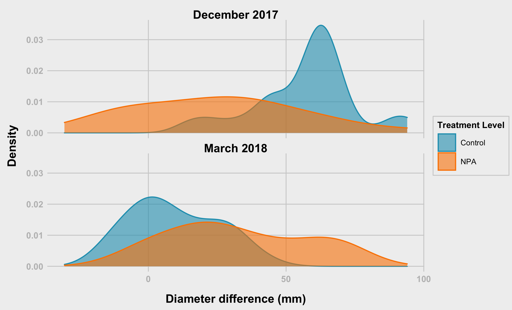

Analysis of Diameter chnage by treatment level and stage
================
Bishwa
2022-03-22

-   [Section 01 - Get Data and Prepare the
    data](#section-01---get-data-and-prepare-the-data)
    -   [1.1 Upload Packages](#11-upload-packages)
    -   [1.2 Check Data Structures](#12-check-data-structures)
    -   [Prepare the data](#prepare-the-data)
    -   [Section 02 - Overall Summary
        statistics](#section-02---overall-summary-statistics)
-   [Section 03 - Plots and Anlysis](#section-03---plots-and-anlysis)
-   [Diameter Difference - Treatment
    Level](#diameter-difference---treatment-level)
-   [Diameter difference - Treatment Level (tl) -
    Points](#diameter-difference---treatment-level-tl---points)
-   [End](#end)

# Section 01 - Get Data and Prepare the data

I downloaded data and placed on my computer. You should change the path
for the data following packges are necessary for your work 1.
`tidyverse` 2. `car` 3. `nlme` 4. `lme4` 5. `rstatix`

When I am using function from specific packages I am using namespace
atleast at the first time of its usage

``` r
library(tidyr)
library(dplyr)
```

    ## 
    ## Attaching package: 'dplyr'

    ## The following objects are masked from 'package:stats':
    ## 
    ##     filter, lag

    ## The following objects are masked from 'package:base':
    ## 
    ##     intersect, setdiff, setequal, union

``` r
library(ggplot2)
library(rstatix)
```

    ## 
    ## Attaching package: 'rstatix'

    ## The following object is masked from 'package:stats':
    ## 
    ##     filter

## 1.1 Upload Packages

``` r
##--------- set working directory

path<- "../data/"


sep2017<- readxl::read_excel(path = paste0(path, "/09_18_2017_Data.xlsx"), sheet = "Sheet1", na = "NA")
dec2017<- readxl::read_excel(path = paste0(path, "/12_18_2017_Data.xlsx"), sheet = "Sheet1", na = "NA")
mar2018<- readxl::read_excel(path = paste0(path, "/03_28_2018_Data.xlsx"), sheet = "Sheet1", na = "NA")
```

## 1.2 Check Data Structures

### September 2017

``` r
str(sep2017)
```

    ## tibble [59 × 15] (S3: tbl_df/tbl/data.frame)
    ##  $ Date            : chr [1:59] "09_18_2017" "09_18_2017" "09_18_2017" "09_18_2017" ...
    ##  $ Plant_ID        : chr [1:59] "M-14-08-A" "M-14-08-B" "M-14-08-C" "M-14-08-D" ...
    ##  $ Family          : num [1:59] 8 8 8 8 8 8 8 8 8 8 ...
    ##  $ Diameter(inches): num [1:59] 2.2 2.5 2.6 1.7 1.5 3 2.7 3.5 1.7 2.7 ...
    ##  $ Lat_Shoot_R     : num [1:59] 0 0 0 0 1 0 1 0 0 0 ...
    ##  $ Inflorescence   : num [1:59] 0 0 0 0 1 0 0 0 0 0 ...
    ##  $ Leaf_Shape      : num [1:59] 3 3 3 3 3 3 3 3 3 3 ...
    ##  $ Trichomes_int   : num [1:59] 2 2 2 3 2 1 2 2 2 2 ...
    ##  $ TreatmentLevel  : chr [1:59] "Auxin" "Auxin" "Control" "Control" ...
    ##  $ Treatment       : chr [1:59] "Aux_Drop" "Aux_Spray" "DMSO" "Water" ...
    ##  $ Population      : chr [1:59] "My" "My" "My" "My" ...
    ##  $ Bolting         : num [1:59] 0 0 0 0 1 0 0 0 0 0 ...
    ##  $ Flowering       : num [1:59] 0 0 0 0 1 0 0 0 0 0 ...
    ##  $ Remarks_01      : chr [1:59] NA NA NA NA ...
    ##  $ Remarks_02      : chr [1:59] NA NA NA NA ...

### December 2017

``` r
str(dec2017)
```

    ## tibble [59 × 15] (S3: tbl_df/tbl/data.frame)
    ##  $ Date            : chr [1:59] "12_18_2017" "12_18_2017" "12_18_2017" "12_18_2017" ...
    ##  $ Plant_ID        : chr [1:59] "M-14-08-A" "M-14-08-B" "M-14-08-C" "M-14-08-D" ...
    ##  $ Family          : num [1:59] 8 8 8 8 8 8 8 8 8 8 ...
    ##  $ Diameter(inches): num [1:59] NA 3.7 NA 4.2 2.6 3.7 4 5.2 5.4 3.4 ...
    ##  $ Lat_Shoot_R     : chr [1:59] NA "2" NA "2" ...
    ##  $ Inflorescence   : num [1:59] NA 1 NA 4 7 0 0 1 0 1 ...
    ##  $ Leaf_Shape      : chr [1:59] NA "2" NA "3" ...
    ##  $ Trichomes_int   : chr [1:59] NA "1" NA "1" ...
    ##  $ TreatmentLevel  : chr [1:59] "Auxin" "Auxin" "Control" "Control" ...
    ##  $ Treatment       : chr [1:59] "Aux_Drop" "Aux_Spray" "DMSO" "Water" ...
    ##  $ Population      : chr [1:59] "My" "My" "My" "My" ...
    ##  $ Bolting         : num [1:59] NA 1 NA 1 1 0 0 1 0 1 ...
    ##  $ Flowering       : num [1:59] NA 1 NA 1 1 0 0 1 0 1 ...
    ##  $ Remarks_01      : chr [1:59] "Missing - I think we extracted RNA out of it ??" "LCU" NA "Foliage out of frame" ...
    ##  $ Remarks_02      : chr [1:59] NA NA NA NA ...

### October 2018

``` r
str(mar2018)
```

    ## tibble [59 × 15] (S3: tbl_df/tbl/data.frame)
    ##  $ Date            : chr [1:59] "03_28_2018" "03_28_2018" "03_28_2018" "03_28_2018" ...
    ##  $ Plant_ID        : chr [1:59] "M-14-08-A" "M-14-08-B" "M-14-08-C" "M-14-08-D" ...
    ##  $ Family          : num [1:59] 8 8 8 8 8 8 8 8 8 8 ...
    ##  $ Diameter(inches): num [1:59] NA 4.2 NA 3.6 3.4 4.6 5.2 4.7 5.2 5.2 ...
    ##  $ Lat_Shoot_R     : num [1:59] NA 3 NA 3 3 3 4 3 4 4 ...
    ##  $ Inflorescence   : num [1:59] NA 3 NA 5 6 0 0 0 3 0 ...
    ##  $ Leaf_Shape      : num [1:59] NA 2 NA 3 3 2 3 3 3 3 ...
    ##  $ Trichomes_int   : num [1:59] NA 2 NA 1 2 1 1 1 1 1 ...
    ##  $ TreatmentLevel  : chr [1:59] "Auxin" "Auxin" "Control" "Control" ...
    ##  $ Treatment       : chr [1:59] "Aux_Drop" "Aux_Spray" "DMSO" "Water" ...
    ##  $ Population      : chr [1:59] "My" "My" "My" "My" ...
    ##  $ Bolting         : num [1:59] NA 1 NA 1 1 0 0 0 1 0 ...
    ##  $ Flowering       : num [1:59] NA 1 NA 1 1 0 0 0 1 0 ...
    ##  $ Remarks_01      : chr [1:59] NA NA NA NA ...
    ##  $ Remarks_02      : logi [1:59] NA NA NA NA NA NA ...

## Prepare the data

### ID’s & Column for Month

``` r
# ID's
sep2017$id<- row.names(sep2017)
dec2017$id<- row.names(dec2017)
mar2018$id<- row.names(mar2018)

# Month column
sep2017$Month <- "Sep"
dec2017$Month <- "Dec"
mar2018$Month <- "Mar"
```

### Combine the sets & and change column names

``` r
fdata<- rbind(sep2017,dec2017,mar2018)

# changing the name when necessary
names(fdata)<- c("date", "plantID", "family", "diaIn", "latShootRating", 
                 "inflorescence", "leafShape", "trichomesInt", "treatmentLevel", 
                 "treatment", "population", "bolting", "flowering", "remarks_01", 
                 "remarks_02", "id", "month")
```

### Convert inches to mm

``` r
fdata$diaIn <- fdata$diaIn * 25.4

fdata <- fdata %>%
  mutate(treatmentLevel = replace(treatmentLevel, treatmentLevel == "Auxin", "NPA"))
```

### Get rid of unnecessary columns and check the amount of missing values in each column

``` r
library(tidyverse)
```

    ## ── Attaching packages ─────────────────────────────────────── tidyverse 1.3.1 ──

    ## ✓ tibble  3.1.6     ✓ stringr 1.4.0
    ## ✓ readr   2.1.2     ✓ forcats 0.5.1
    ## ✓ purrr   0.3.4

    ## ── Conflicts ────────────────────────────────────────── tidyverse_conflicts() ──
    ## x rstatix::filter() masks dplyr::filter(), stats::filter()
    ## x dplyr::lag()      masks stats::lag()

``` r
mvdata<- fdata %>% select( - c(remarks_01, remarks_02))

mvdata %>% summarise_all(funs(sum(is.na(.))))
```

    ## Warning: `funs()` was deprecated in dplyr 0.8.0.
    ## Please use a list of either functions or lambdas: 
    ## 
    ##   # Simple named list: 
    ##   list(mean = mean, median = median)
    ## 
    ##   # Auto named with `tibble::lst()`: 
    ##   tibble::lst(mean, median)
    ## 
    ##   # Using lambdas
    ##   list(~ mean(., trim = .2), ~ median(., na.rm = TRUE))
    ## This warning is displayed once every 8 hours.
    ## Call `lifecycle::last_lifecycle_warnings()` to see where this warning was generated.

    ## # A tibble: 1 × 15
    ##    date plantID family diaIn latShootRating inflorescence leafShape trichomesInt
    ##   <int>   <int>  <int> <int>          <int>         <int>     <int>        <int>
    ## 1     0       0      0    25             25            25        25           25
    ## # … with 7 more variables: treatmentLevel <int>, treatment <int>,
    ## #   population <int>, bolting <int>, flowering <int>, id <int>, month <int>

### Delete rows with missing values

``` r
fndata <- mvdata %>% drop_na()

#fndata <- fdata %>%  mutate(across(where(is.character), ~na_if(., "NA")))
```

### Specify correct data types

``` r
# Not numeric variables
char_var<- c("date","plantID","treatmentLevel","treatment","population", "month", "family")

# Numeric variables
num_var<- names(fndata[, !(names(fndata) %in% char_var)])

#convert characters to numeric vector
fndata[, num_var]<- sapply(fndata[, num_var], as.numeric)
```

    ## Warning in lapply(X = X, FUN = FUN, ...): NAs introduced by coercion

    ## Warning in lapply(X = X, FUN = FUN, ...): NAs introduced by coercion

    ## Warning in lapply(X = X, FUN = FUN, ...): NAs introduced by coercion

``` r
#convert characters to factors
fndata$dateFac   <- factor(fndata$date,       labels =  c("September 2017", "December 2017", "March 2018" ),
                           levels =  c("09_18_2017", "12_18_2017", "03_28_2018" ))

fndata$treatment <- factor(fndata$treatment,  labels =  c("NPA Drop", "NPA Spray", "DMSO", "Water"))

fndata$treatmentLevel <- as.factor(fndata$treatmentLevel)

fndata$plantID<- as.factor(fndata$plantID)

# Check 
sapply(fndata, class)
```

    ##           date        plantID         family          diaIn latShootRating 
    ##    "character"       "factor"      "numeric"      "numeric"      "numeric" 
    ##  inflorescence      leafShape   trichomesInt treatmentLevel      treatment 
    ##      "numeric"      "numeric"      "numeric"       "factor"       "factor" 
    ##     population        bolting      flowering             id          month 
    ##    "character"      "numeric"      "numeric"      "numeric"    "character" 
    ##        dateFac 
    ##       "factor"

## Section 02 - Overall Summary statistics

### Choose variables of interest

``` r
# extract variables that are important
sel_var<- c("date", "plantID", "treatment", "treatmentLevel","diaIn",
            "latShootRatio", "inflorescence", "leafShape"  )

#---------- mean
# mean_diaInflo<- fndata %>% select(sel_var) %>% 
#   group_by(treatment) %>% 
#   summarise_at(.vars = vars(diaIn, inflorescence),.funs = c(mean = "mean"))
# 
# sd_diaInflo<- fndata %>% select(sel_var) %>% 
#   group_by(treatment) %>% 
#   summarise_at(.vars = vars(diaIn, inflorescence),.funs = c(sd = "mean"))
# 
# sumdat<- cbind(mean_diaInflo, sd_diaInflo[, 2:3])

# Stats for Diameter
mean_diaInflo<- fndata %>% 
  group_by(treatment) %>% 
  summarise(mean = mean(diaIn, na.rm = TRUE),
            sd   = sd(diaIn, na.rm = TRUE)
  )

# Stats for inflorescence
mean_inflo<- fndata %>% 
  group_by(treatment) %>% 
  summarise(
    mean = mean(inflorescence, na.rm = TRUE),
    sd   = sd(inflorescence, na.rm = TRUE)
  )

# Stats for Lat_Shoot
mean_latShoot<- fndata %>% 
  group_by(treatment) %>% 
  summarise(mean = mean(latShootRating, na.rm = TRUE),
            sd   = sd(latShootRating, na.rm = TRUE)
  )

#------- apply variable name and combine
mean_diaInflo$var <- "Diameter"
mean_inflo$var    <- "Inflorescence"
mean_latShoot$var <- "LatShoot"


sumdata<- rbind(mean_diaInflo,mean_inflo, mean_latShoot)
sumdata
```

    ## # A tibble: 12 × 4
    ##    treatment   mean     sd var          
    ##    <fct>      <dbl>  <dbl> <chr>        
    ##  1 NPA Drop  82.0   35.1   Diameter     
    ##  2 NPA Spray 70.5   31.4   Diameter     
    ##  3 DMSO      90.0   35.1   Diameter     
    ##  4 Water     88.7   32.4   Diameter     
    ##  5 NPA Drop   1.33   2.02  Inflorescence
    ##  6 NPA Spray  0.583  0.996 Inflorescence
    ##  7 DMSO       0.973  1.86  Inflorescence
    ##  8 Water      1.46   2.09  Inflorescence
    ##  9 NPA Drop   1.68   1.23  LatShoot     
    ## 10 NPA Spray  1.51   1.29  LatShoot     
    ## 11 DMSO       1.49   1.12  LatShoot     
    ## 12 Water      1.54   1.10  LatShoot

# Section 03 - Plots and Anlysis

### Theme Function

``` r
theme_538 <- function(base_size = 8, base_family = "Arial") {
  theme_grey(base_size = base_size, base_family = base_family) %+replace%
    theme(
      # drop minor gridlines and axis-ticks
      panel.grid.minor = element_blank(),
      axis.ticks = element_blank(),
      # change font elements/family
      text = element_text(family = "Arial", size = base_size),
      axis.text = element_text(face = "bold", color = "grey", size = base_size),
      axis.title = element_text(face = "bold", size = rel(1.33)),
      axis.title.x = element_text(margin = margin(0.3, 0, 0, 0, unit = "cm")),
      axis.title.y = element_text(margin = margin(0, 0.3, 0, 0, unit = "cm"), angle =90),
      plot.title = element_text(face = "bold", size = rel(1.67), hjust = 0),
      plot.title.position = "plot",
      plot.subtitle = element_text(size = 12, margin = margin(0.2, 0, 1, 0, unit = "cm"), hjust = 0),
      plot.caption = element_text(size = 8, margin = margin(1, 0, 0, 0, unit = "cm"), hjust = 1),
      # change plot colors for the background/panel elements
      plot.background = element_rect(fill = "#f0f0f0", color = NA),
      panel.background = element_rect(fill = "#f0f0f0", color = NA),
      panel.grid.major =  element_line(color = "#d0d0d0"),
      panel.border = element_blank(),
      # shrinks margin and simplify the strip/facet elements
      strip.background = element_blank(),
      strip.text = element_text(size = rel(1.33), face = "bold")
    )
}
```

# Diameter Difference - Treatment Level

### Difference in Diameter between December 2017 and September 2017

``` r
diff_sep_dec <- fndata %>% 
  filter(dateFac == "December 2017") %>%
  left_join(fndata %>% filter(dateFac == "September 2017") %>% 
              select(plantID, diaIn),
            by = "plantID",
            suffix = c("_Dec", "_Sep")) %>% 
  mutate(period = "sep_dec",
         dia_diff = diaIn_Dec - diaIn_Sep)

head(diff_sep_dec %>% select(plantID, diaIn_Dec, diaIn_Sep, dia_diff))
```

    ## # A tibble: 6 × 4
    ##   plantID   diaIn_Dec diaIn_Sep dia_diff
    ##   <fct>         <dbl>     <dbl>    <dbl>
    ## 1 M-14-08-B      94.0      63.5     30.5
    ## 2 M-14-08-D     107.       43.2     63.5
    ## 3 M-14-08-E      66.0      38.1     27.9
    ## 4 M-14-08-F      94.0      76.2     17.8
    ## 5 M-14-08-G     102.       68.6     33.0
    ## 6 M-14-08-H     132.       88.9     43.2

### Difference in Diameter between March 2018 and December 2017

``` r
diff_dec_mar <- fndata %>% 
  filter(dateFac == "March 2018") %>%
  left_join(fndata %>% filter(dateFac == "December 2017") %>% 
              select(plantID, diaIn),
            by = "plantID",
            suffix = c("_Mar", "_Dec")) %>% 
  mutate(period = "dec_mar",
         dia_diff = diaIn_Mar - diaIn_Dec)

head(diff_dec_mar %>% select(plantID, diaIn_Mar, diaIn_Dec, dia_diff))
```

    ## # A tibble: 6 × 4
    ##   plantID   diaIn_Mar diaIn_Dec dia_diff
    ##   <fct>         <dbl>     <dbl>    <dbl>
    ## 1 M-14-08-B     107.       94.0     12.7
    ## 2 M-14-08-D      91.4     107.     -15.2
    ## 3 M-14-08-E      86.4      66.0     20.3
    ## 4 M-14-08-F     117.       94.0     22.9
    ## 5 M-14-08-G     132.      102.      30.5
    ## 6 M-14-08-H     119.      132.     -12.7

### Diff_Data

``` r
data_diff <- rbind(diff_sep_dec %>% select(plantID, id, dia_diff, period, treatment, treatmentLevel, dateFac, family),
                   diff_dec_mar %>% select(plantID, id, dia_diff, period, treatment, treatmentLevel, dateFac, family))
```

### Diameter difference - Treatment Level (tl) - Density Function

``` r
grDevices::png(filename = "plots/hist_diam_diff_tl.png",  width = 16.5, height = 10, units = 'cm', res = 400)

hist_diam_diff_tl <- data_diff %>%
  ggplot(aes(y = dia_diff, fill = treatmentLevel, colour = treatmentLevel)) +
  geom_density(alpha = 0.6) +
  scale_fill_manual("Treatment Level", values = c("#219ebc","#fb8500")) +
  scale_colour_manual("Treatment Level", values = c("#219ebc","#fb8500")) + 
  facet_wrap(~dateFac, nrow = 2) + 
  labs(x = "Density", y = "Diameter difference (mm)") +
  coord_flip() + 
  theme_538() +
  theme(
    #legend.position = "top",
    legend.background = element_rect(fill = "#f0f0f0", color = "#d0d0d0"),
    legend.title = element_text(family = "Arial", size = 8, face = "bold"),
    legend.title.align = 0.5,
    legend.text = element_text(size=7),
    plot.margin = margin(0.3, 0.1, 0.2, 0.2, unit = "cm"),
    )
  

hist_diam_diff_tl
```

    ## Warning: Removed 2 rows containing non-finite values (stat_density).

``` r
dev.off()
```

    ## quartz_off_screen 
    ##                 2

``` r

```

<!-- -->

### Diameter difference - Treatment Level (tl) - Density Function version 2

``` r
grDevices::png(filename = "plots/hist_diam_diff_tl2.png",  width = 6, height = 4, units = 'in', res = 400)

hist_diam_diff_tl2 <- data_diff %>%
  ggplot(aes(y = dia_diff, fill = treatmentLevel, colour = treatmentLevel)) +
  geom_density(alpha = 0.6) +
  scale_fill_manual("Treatment Level", values = c("#219ebc","#fb8500")) +
  scale_colour_manual("Treatment Level", values = c("#219ebc","#fb8500")) + 
  facet_grid(treatmentLevel ~ dateFac) + 
  labs(x = "Density", y = "Diameter difference (mm)") +
  coord_flip() + 
  theme_538() +
  theme(
    legend.position = "top",
    legend.background = element_rect(fill = "#f0f0f0", color = "#d0d0d0"),
    legend.title = element_text(family = "Arial", size = 8, face = "bold"),
    legend.title.align = 0.5,
    legend.text = element_text(size=7),
    plot.margin = margin(0.3, 0.3, 0.2, 0.2, unit = "cm"),
    )
  

hist_diam_diff_tl2
```

    ## Warning: Removed 2 rows containing non-finite values (stat_density).

``` r
dev.off()
```

    ## quartz_off_screen 
    ##                 2

``` r
knitr::include_graphics("plots/hist_diam_diff_tl2.png")
```

<!-- -->

### Diameter difference - Treatment Level (tl) - Boxplot

``` r
grDevices::png(filename = "plots/violin_diam_diff_tl.png",  width = 6, height = 6, units = 'in', res = 400)

violin_diam_diff_tl <- data_diff %>%
  group_by(treatmentLevel, dateFac) %>% mutate(N=n()) %>%
  mutate(N=ifelse(dia_diff==max(dia_diff,na.rm=T),paste0('n=',N),NA)) %>%
  ggplot(aes(x = treatmentLevel, y = dia_diff, fill = treatmentLevel, colour = treatmentLevel, label = N)) +
  #geom_violin(alpha = 0.6) +
  geom_boxplot(#width = 0.1, 
               alpha = 0.6) +
  geom_text(vjust = -0.1, hjust = 0.5, show.legend = FALSE) +
  scale_fill_manual("Treatment Level", values = c("#219ebc","#fb8500")) +
  scale_colour_manual("Treatment Level", values = c("#219ebc","#fb8500")) +
  facet_wrap(~dateFac, nrow = 2, ncol = 2) + 
  labs(x = "Treatment Level", y = "Diameter difference") +
  xlab("") +
  #coord_flip() +
  theme_538() +
  theme(
    legend.position = "top",
    legend.background = element_rect(fill = "#f0f0f0", color = "#d0d0d0"),
    legend.title = element_text(family = "Arial", size = 8, face = "bold"),
    legend.title.align = 0.5,
    legend.text = element_text(size=7)
    )
  

violin_diam_diff_tl
```

    ## Warning: Removed 2 rows containing non-finite values (stat_boxplot).

    ## Warning: Removed 90 rows containing missing values (geom_text).

``` r
dev.off()
```

    ## quartz_off_screen 
    ##                 2

``` r
knitr::include_graphics("plots/violin_diam_diff_tl.png")
```

<!-- -->

# Diameter difference - Treatment Level (tl) - Points

``` r
grDevices::png(filename = "plots/dots_diam_diff_tl.png",  width = 12.5, height = 8, units = 'cm', res = 400)

dots_diam_diff_tl<- data_diff %>% ggplot(aes(x = dateFac, y = dia_diff, group = treatmentLevel, color = treatmentLevel))+
  #geom_point()
  geom_point(size = 2,shape = 20, position = position_dodge(0.2 ))+
  #geom_line(position = position_dodge(0.25 ))+
  stat_summary(fun =  mean, size = 2, geom = "point", 
               position = position_dodge(0.25), show.legend = FALSE)+
  
  stat_summary(fun = mean, size = 0.5, geom = "line",
               position = position_dodge(0.25), show.legend = FALSE)+
    
  stat_summary(fun.data = mean_sdl, fun.args = list(mult=1), 
               geom = "errorbar", width=0.2,
               position = position_dodge(0.25), show.legend = FALSE) +
  
  theme_bw(base_size = 14,base_family = "Serif") +
  xlab("Period")+
  ylab(" Diameter difference (mm)")+
  # labs(fill = "Treatment")
  # guides(fill=guide_legend(title = "Treatment"))
  scale_color_manual("Treatment Level",values = c("#219ebc","#fb8500"))+
  scale_x_discrete(labels = c("Sep 2017 - Dec 2017", "Dec 2017 - Mar 2018")) +
  theme_538() + 
  theme(
    legend.position = c(0.1, 0.8),
    legend.background = element_rect(fill = "#f0f0f0", color = "#d0d0d0"),
    legend.title = element_text(family = "Arial", size = 8, face = "bold"),
    legend.title.align = 0.5,
    legend.text = element_text(size=7),
  )
  
dots_diam_diff_tl
```

    ## Warning: Removed 2 rows containing non-finite values (stat_summary).
    ## Removed 2 rows containing non-finite values (stat_summary).
    ## Removed 2 rows containing non-finite values (stat_summary).

    ## Warning: Removed 2 rows containing missing values (geom_point).

``` r
dev.off()
```

    ## quartz_off_screen 
    ##                 2

``` r
knitr::include_graphics("plots/dots_diam_diff_tl.png")
```

<!-- -->

### Diameter difference - Treatment Level (tl) - Checking for Normality

Shapiro-Test for each group p-values is less than 0.05, hence, we reject
hypothesis about normal distribution.

``` r
data_diff %>% group_by(treatmentLevel) %>% 
  shapiro_test(dia_diff)
```

    ## # A tibble: 2 × 4
    ##   treatmentLevel variable statistic      p
    ##   <fct>          <chr>        <dbl>  <dbl>
    ## 1 Control        dia_diff     0.949 0.0475
    ## 2 NPA            dia_diff     0.984 0.740

### Diameter difference - Treatment Level (tl) - Checking for Normality by Month

If we divide by both month and treatment, distribution can be assumed to
be normal

``` r
data_diff %>% group_by(treatmentLevel, dateFac) %>%
  shapiro_test(dia_diff) %>%
  left_join(data_diff %>% 
              group_by(treatmentLevel, dateFac) %>%
              summarise(n = n()),
            by = c("treatmentLevel", "dateFac"))
```

    ## `summarise()` has grouped output by 'treatmentLevel'. You can override using
    ## the `.groups` argument.

    ## # A tibble: 4 × 6
    ##   treatmentLevel dateFac       variable statistic     p     n
    ##   <fct>          <fct>         <chr>        <dbl> <dbl> <int>
    ## 1 Control        December 2017 dia_diff     0.929 0.105    23
    ## 2 Control        March 2018    dia_diff     0.957 0.425    23
    ## 3 NPA            December 2017 dia_diff     0.984 0.944    27
    ## 4 NPA            March 2018    dia_diff     0.929 0.129    21

### Diameter difference - Treatment Level (tl) - Pairwise T-test

``` r
ph_diam_diff_tl <- data_diff %>% 
  pairwise_t_test(
    dia_diff~treatmentLevel, paired = FALSE, # due to sample difference
    p.adjust.method = "holm"       # with treatment not so much of difference
  )

# print
print(ph_diam_diff_tl)
```

    ## # A tibble: 1 × 9
    ##   .y.      group1  group2    n1    n2     p p.signif p.adj p.adj.signif
    ## * <chr>    <chr>   <chr>  <int> <int> <dbl> <chr>    <dbl> <chr>       
    ## 1 dia_diff Control NPA       46    48 0.347 ns       0.347 ns

``` r
t.test(dia_diff ~ treatmentLevel, data = subset(data_diff, dateFac == "December 2017"))
```

    ## 
    ##  Welch Two Sample t-test
    ## 
    ## data:  dia_diff by treatmentLevel
    ## t = 4.6429, df = 41.543, p-value = 3.429e-05
    ## alternative hypothesis: true difference in means between group Control and group NPA is not equal to 0
    ## 95 percent confidence interval:
    ##  18.41794 46.75557
    ## sample estimates:
    ## mean in group Control     mean in group NPA 
    ##              57.20522              24.61846

``` r
t.test(dia_diff ~ treatmentLevel, data = subset(data_diff, dateFac == "December 2017"), alternative = "greater")
```

    ## 
    ##  Welch Two Sample t-test
    ## 
    ## data:  dia_diff by treatmentLevel
    ## t = 4.6429, df = 41.543, p-value = 1.715e-05
    ## alternative hypothesis: true difference in means between group Control and group NPA is greater than 0
    ## 95 percent confidence interval:
    ##  20.7788     Inf
    ## sample estimates:
    ## mean in group Control     mean in group NPA 
    ##              57.20522              24.61846

``` r
t.test(dia_diff ~ treatmentLevel, data = subset(data_diff, dateFac == "March 2018"))
```

    ## 
    ##  Welch Two Sample t-test
    ## 
    ## data:  dia_diff by treatmentLevel
    ## t = -3.6358, df = 33.806, p-value = 0.000912
    ## alternative hypothesis: true difference in means between group Control and group NPA is not equal to 0
    ## 95 percent confidence interval:
    ##  -36.15465 -10.22509
    ## sample estimates:
    ## mean in group Control     mean in group NPA 
    ##              9.467273             32.657143

``` r
t.test(dia_diff ~ treatmentLevel, data = subset(data_diff, dateFac == "March 2018"), alternative = "less")
```

    ## 
    ##  Welch Two Sample t-test
    ## 
    ## data:  dia_diff by treatmentLevel
    ## t = -3.6358, df = 33.806, p-value = 0.000456
    ## alternative hypothesis: true difference in means between group Control and group NPA is less than 0
    ## 95 percent confidence interval:
    ##      -Inf -12.4031
    ## sample estimates:
    ## mean in group Control     mean in group NPA 
    ##              9.467273             32.657143

### Diameter difference - Treatment Level (tl) - Pairwise T-test - For December 2017

``` r
ph_diam_diff_tl_dec <- data_diff %>% 
  filter(dateFac == "December 2017") %>%
  pairwise_t_test(
    dia_diff~treatmentLevel, paired = FALSE, # due to sample difference
    p.adjust.method = "holm"       # with treatment not so much of difference
  )

# print
print(ph_diam_diff_tl_dec)
```

    ## # A tibble: 1 × 9
    ##   .y.      group1  group2    n1    n2         p p.signif     p.adj p.adj.signif
    ## * <chr>    <chr>   <chr>  <int> <int>     <dbl> <chr>        <dbl> <chr>       
    ## 1 dia_diff Control NPA       23    27 0.0000435 ****     0.0000435 ****

### Diameter difference - Treatment Level (tl) - Pairwise T-test - For March 2018

``` r
ph_diam_diff_tl_mar <- data_diff %>% 
  filter(dateFac == "March 2018") %>%
  pairwise_t_test(
    dia_diff~treatmentLevel, paired = FALSE, # due to sample difference
    p.adjust.method = "holm"       # with treatment not so much of difference
  )

# print
print(ph_diam_diff_tl_mar)
```

    ## # A tibble: 1 × 9
    ##   .y.      group1  group2    n1    n2        p p.signif    p.adj p.adj.signif
    ## * <chr>    <chr>   <chr>  <int> <int>    <dbl> <chr>       <dbl> <chr>       
    ## 1 dia_diff Control NPA       23    21 0.000688 ***      0.000688 ***

### Diameter difference - Treatment Level - repeated Anova

``` r
diam_diff_tl_aov <- aov(dia_diff~treatmentLevel*dateFac + Error(id), data = data_diff)
summary(diam_diff_tl_aov)
```

    ## 
    ## Error: id
    ##                Df Sum Sq Mean Sq
    ## treatmentLevel  1  836.2   836.2
    ## 
    ## Error: Within
    ##                        Df Sum Sq Mean Sq F value   Pr(>F)    
    ## treatmentLevel          1    688     688   1.278  0.26140    
    ## dateFac                 1   8463    8463  15.726  0.00015 ***
    ## treatmentLevel:dateFac  1  17853   17853  33.174 1.25e-07 ***
    ## Residuals              87  46821     538                     
    ## ---
    ## Signif. codes:  0 '***' 0.001 '**' 0.01 '*' 0.05 '.' 0.1 ' ' 1

### Diameter difference - Treatment Level - Mixed effects for repeated data 1

``` r
diam_tl_lme1<- nlme::lme(dia_diff~1, random = ~1|treatmentLevel, method = "REML", na.action = na.omit,
          data = data_diff)

summary(diam_tl_lme1)
```

    ## Linear mixed-effects model fit by REML
    ##   Data: data_diff 
    ##        AIC      BIC    logLik
    ##   879.3653 886.8979 -436.6826
    ## 
    ## Random effects:
    ##  Formula: ~1 | treatmentLevel
    ##         (Intercept) Residual
    ## StdDev:  0.00472455 28.64351
    ## 
    ## Fixed effects:  dia_diff ~ 1 
    ##                Value Std.Error DF  t-value p-value
    ## (Intercept) 30.97696  2.986294 90 10.37304       0
    ## 
    ## Standardized Within-Group Residuals:
    ##         Min          Q1         Med          Q3         Max 
    ## -2.14558053 -0.81543625 -0.06168786  0.95808935  2.19955765 
    ## 
    ## Number of Observations: 92
    ## Number of Groups: 2

### Diameter difference - Treatment Level - Mixed effects for repeated data 2

``` r
diam_diff_tl_lme2<- nlme::lme(dia_diff~treatmentLevel, random = ~1|dateFac,
                method = "REML", na.action = na.omit,
                data = data_diff)
summary(diam_diff_tl_lme2)
```

    ## Linear mixed-effects model fit by REML
    ##   Data: data_diff 
    ##       AIC      BIC   logLik
    ##   867.392 877.3913 -429.696
    ## 
    ## Random effects:
    ##  Formula: ~1 | dateFac
    ##         (Intercept) Residual
    ## StdDev:    13.11611 27.09236
    ## 
    ## Fixed effects:  dia_diff ~ treatmentLevel 
    ##                      Value Std.Error DF   t-value p-value
    ## (Intercept)       33.66956 10.115869 89  3.328390  0.0013
    ## treatmentLevelNPA -6.40295  5.655082 89 -1.132247  0.2606
    ##  Correlation: 
    ##                   (Intr)
    ## treatmentLevelNPA -0.285
    ## 
    ## Standardized Within-Group Residuals:
    ##         Min          Q1         Med          Q3         Max 
    ## -2.45886633 -0.72675465  0.04731653  0.70335572  2.13504912 
    ## 
    ## Number of Observations: 92
    ## Number of Groups: 2

### Diameter difference - Treatment - Mixed effects for repeated data 3

``` r
diam_diff_tl_lme3<- nlme::lme(dia_diff~treatmentLevel*dateFac, random = ~1|id,
                method = "REML", na.action = na.omit,
                data = data_diff)

plot(as.vector(predict(diam_diff_tl_lme3, data_diff)), data_diff$dia_diff)
```

<!-- -->

``` r
summary(diam_diff_tl_lme3)
```

    ## Linear mixed-effects model fit by REML
    ##   Data: data_diff 
    ##        AIC      BIC    logLik
    ##   827.9753 842.8394 -407.9877
    ## 
    ## Random effects:
    ##  Formula: ~1 | id
    ##         (Intercept) Residual
    ## StdDev: 0.001499869 23.24515
    ## 
    ## Fixed effects:  dia_diff ~ treatmentLevel * dateFac 
    ##                                         Value Std.Error DF   t-value p-value
    ## (Intercept)                          57.20522  4.846949 48 11.802314       0
    ## treatmentLevelNPA                   -32.58676  6.653955 48 -4.897352       0
    ## dateFacMarch 2018                   -47.73794  6.932077 40 -6.886528       0
    ## treatmentLevelNPA:dateFacMarch 2018  55.77663  9.724517 40  5.735671       0
    ##  Correlation: 
    ##                                     (Intr) trLNPA dFM201
    ## treatmentLevelNPA                   -0.728              
    ## dateFacMarch 2018                   -0.699  0.509       
    ## treatmentLevelNPA:dateFacMarch 2018  0.498 -0.684 -0.713
    ## 
    ## Standardized Within-Group Residuals:
    ##         Min          Q1         Med          Q3         Max 
    ## -2.37032055 -0.60336096  0.04103027  0.56646339  2.98391417 
    ## 
    ## Number of Observations: 92
    ## Number of Groups: 50

### Diameter difference - Treatment - Mixed effects for repeated data 4

``` r
diam_diff_tl_lme4<- nlme::lme(dia_diff~treatmentLevel, random = ~1|id,
                method = "REML", na.action = na.omit,
                data = data_diff)

diam_diff_tl_lme4
```

    ## Linear mixed-effects model fit by REML
    ##   Data: data_diff 
    ##   Log-restricted-likelihood: -433.528
    ##   Fixed: dia_diff ~ treatmentLevel 
    ##       (Intercept) treatmentLevelNPA 
    ##         33.866667         -5.656454 
    ## 
    ## Random effects:
    ##  Formula: ~1 | id
    ##         (Intercept) Residual
    ## StdDev: 0.001539914 28.65997
    ## 
    ## Number of Observations: 92
    ## Number of Groups: 50

### Diameter difference - Treatment - Mixed effects for repeated data 5

``` r
dglme_diam_diff_tl<- lme4::lmer(dia_diff~treatmentLevel*dateFac +(1|id), data = data_diff)
```

    ## boundary (singular) fit: see help('isSingular')

``` r
anova(dglme_diam_diff_tl, type = 3)
```

    ## Warning in anova.merMod(dglme_diam_diff_tl, type = 3): additional arguments
    ## ignored: 'type'

    ## Analysis of Variance Table
    ##                        npar  Sum Sq Mean Sq F value
    ## treatmentLevel            1   735.5   735.5  1.3613
    ## dateFac                   1  8599.8  8599.8 15.9157
    ## treatmentLevel:dateFac    1 17776.0 17776.0 32.8979

``` r
summary(dglme_diam_diff_tl)
```

    ## Linear mixed model fit by REML ['lmerMod']
    ## Formula: dia_diff ~ treatmentLevel * dateFac + (1 | id)
    ##    Data: data_diff
    ## 
    ## REML criterion at convergence: 816
    ## 
    ## Scaled residuals: 
    ##      Min       1Q   Median       3Q      Max 
    ## -2.37032 -0.60336  0.04103  0.56646  2.98391 
    ## 
    ## Random effects:
    ##  Groups   Name        Variance Std.Dev.
    ##  id       (Intercept)   0.0     0.00   
    ##  Residual             540.3    23.25   
    ## Number of obs: 92, groups:  id, 50
    ## 
    ## Fixed effects:
    ##                                     Estimate Std. Error t value
    ## (Intercept)                           57.205      4.847  11.802
    ## treatmentLevelNPA                    -32.587      6.654  -4.897
    ## dateFacMarch 2018                    -47.738      6.932  -6.887
    ## treatmentLevelNPA:dateFacMarch 2018   55.777      9.725   5.736
    ## 
    ## Correlation of Fixed Effects:
    ##             (Intr) trLNPA dFM201
    ## trtmntLvNPA -0.728              
    ## dtFcMrc2018 -0.699  0.509       
    ## tLNPA:FM201  0.498 -0.684 -0.713
    ## optimizer (nloptwrap) convergence code: 0 (OK)
    ## boundary (singular) fit: see help('isSingular')

``` r
sjPlot::tab_model(dglme_diam_diff_tl, file = "diam_diff_tl.doc")
```

<table style="border-collapse:collapse; border:none;">
<tr>
<th style="border-top: double; text-align:center; font-style:normal; font-weight:bold; padding:0.2cm;  text-align:left; ">
 
</th>
<th colspan="3" style="border-top: double; text-align:center; font-style:normal; font-weight:bold; padding:0.2cm; ">
dia_diff
</th>
</tr>
<tr>
<td style=" text-align:center; border-bottom:1px solid; font-style:italic; font-weight:normal;  text-align:left; ">
Predictors
</td>
<td style=" text-align:center; border-bottom:1px solid; font-style:italic; font-weight:normal;  ">
Estimates
</td>
<td style=" text-align:center; border-bottom:1px solid; font-style:italic; font-weight:normal;  ">
CI
</td>
<td style=" text-align:center; border-bottom:1px solid; font-style:italic; font-weight:normal;  ">
p
</td>
</tr>
<tr>
<td style=" padding:0.2cm; text-align:left; vertical-align:top; text-align:left; ">
(Intercept)
</td>
<td style=" padding:0.2cm; text-align:left; vertical-align:top; text-align:center;  ">
57.21
</td>
<td style=" padding:0.2cm; text-align:left; vertical-align:top; text-align:center;  ">
47.57 – 66.84
</td>
<td style=" padding:0.2cm; text-align:left; vertical-align:top; text-align:center;  ">
<strong>\<0.001</strong>
</td>
</tr>
<tr>
<td style=" padding:0.2cm; text-align:left; vertical-align:top; text-align:left; ">
treatmentLevel \[NPA\]
</td>
<td style=" padding:0.2cm; text-align:left; vertical-align:top; text-align:center;  ">
-32.59
</td>
<td style=" padding:0.2cm; text-align:left; vertical-align:top; text-align:center;  ">
-45.81 – -19.36
</td>
<td style=" padding:0.2cm; text-align:left; vertical-align:top; text-align:center;  ">
<strong>\<0.001</strong>
</td>
</tr>
<tr>
<td style=" padding:0.2cm; text-align:left; vertical-align:top; text-align:left; ">
dateFac \[March 2018\]
</td>
<td style=" padding:0.2cm; text-align:left; vertical-align:top; text-align:center;  ">
-47.74
</td>
<td style=" padding:0.2cm; text-align:left; vertical-align:top; text-align:center;  ">
-61.52 – -33.96
</td>
<td style=" padding:0.2cm; text-align:left; vertical-align:top; text-align:center;  ">
<strong>\<0.001</strong>
</td>
</tr>
<tr>
<td style=" padding:0.2cm; text-align:left; vertical-align:top; text-align:left; ">
treatmentLevel \[NPA\] \*<br>dateFac \[March 2018\]
</td>
<td style=" padding:0.2cm; text-align:left; vertical-align:top; text-align:center;  ">
55.78
</td>
<td style=" padding:0.2cm; text-align:left; vertical-align:top; text-align:center;  ">
36.44 – 75.11
</td>
<td style=" padding:0.2cm; text-align:left; vertical-align:top; text-align:center;  ">
<strong>\<0.001</strong>
</td>
</tr>
<tr>
<td colspan="4" style="font-weight:bold; text-align:left; padding-top:.8em;">
Random Effects
</td>
</tr>
<tr>
<td style=" padding:0.2cm; text-align:left; vertical-align:top; text-align:left; padding-top:0.1cm; padding-bottom:0.1cm;">
σ<sup>2</sup>
</td>
<td style=" padding:0.2cm; text-align:left; vertical-align:top; padding-top:0.1cm; padding-bottom:0.1cm; text-align:left;" colspan="3">
540.34
</td>
</tr>
<tr>
<td style=" padding:0.2cm; text-align:left; vertical-align:top; text-align:left; padding-top:0.1cm; padding-bottom:0.1cm;">
τ<sub>00</sub> <sub>id</sub>
</td>
<td style=" padding:0.2cm; text-align:left; vertical-align:top; padding-top:0.1cm; padding-bottom:0.1cm; text-align:left;" colspan="3">
0.00
</td>
<tr>
<td style=" padding:0.2cm; text-align:left; vertical-align:top; text-align:left; padding-top:0.1cm; padding-bottom:0.1cm;">
N <sub>id</sub>
</td>
<td style=" padding:0.2cm; text-align:left; vertical-align:top; padding-top:0.1cm; padding-bottom:0.1cm; text-align:left;" colspan="3">
50
</td>
<tr>
<td style=" padding:0.2cm; text-align:left; vertical-align:top; text-align:left; padding-top:0.1cm; padding-bottom:0.1cm; border-top:1px solid;">
Observations
</td>
<td style=" padding:0.2cm; text-align:left; vertical-align:top; padding-top:0.1cm; padding-bottom:0.1cm; text-align:left; border-top:1px solid;" colspan="3">
92
</td>
</tr>
<tr>
<td style=" padding:0.2cm; text-align:left; vertical-align:top; text-align:left; padding-top:0.1cm; padding-bottom:0.1cm;">
Marginal R<sup>2</sup> / Conditional R<sup>2</sup>
</td>
<td style=" padding:0.2cm; text-align:left; vertical-align:top; padding-top:0.1cm; padding-bottom:0.1cm; text-align:left;" colspan="3">
0.355 / NA
</td>
</tr>
</table>

``` r
summary(lm(dia_diff ~ treatmentLevel*dateFac, data = data_diff))
```

    ## 
    ## Call:
    ## lm(formula = dia_diff ~ treatmentLevel * dateFac, data = data_diff)
    ## 
    ## Residuals:
    ##     Min      1Q  Median      3Q     Max 
    ## -55.098 -14.025   0.954  13.168  69.362 
    ## 
    ## Coefficients:
    ##                                     Estimate Std. Error t value Pr(>|t|)    
    ## (Intercept)                           57.205      4.847  11.802  < 2e-16 ***
    ## treatmentLevelNPA                    -32.587      6.654  -4.897 4.38e-06 ***
    ## dateFacMarch 2018                    -47.738      6.932  -6.887 8.14e-10 ***
    ## treatmentLevelNPA:dateFacMarch 2018   55.777      9.725   5.736 1.35e-07 ***
    ## ---
    ## Signif. codes:  0 '***' 0.001 '**' 0.01 '*' 0.05 '.' 0.1 ' ' 1
    ## 
    ## Residual standard error: 23.25 on 88 degrees of freedom
    ##   (2 observations deleted due to missingness)
    ## Multiple R-squared:  0.3631, Adjusted R-squared:  0.3414 
    ## F-statistic: 16.72 on 3 and 88 DF,  p-value: 1.108e-08

``` r
shapiro.test(residuals(dglme_diam_diff_tl))
```

    ## 
    ##  Shapiro-Wilk normality test
    ## 
    ## data:  residuals(dglme_diam_diff_tl)
    ## W = 0.99047, p-value = 0.7529

``` r
plot(fitted(dglme_diam_diff_tl), resid(dglme_diam_diff_tl, type = "pearson"))# this will create the plot
abline(0,0, col="red")
```

<!-- -->

# End

``` r
qqnorm(resid(dglme_diam_diff_tl)) 
qqline(resid(dglme_diam_diff_tl), col = "red") # add a perfect fit line
```

<!-- -->
