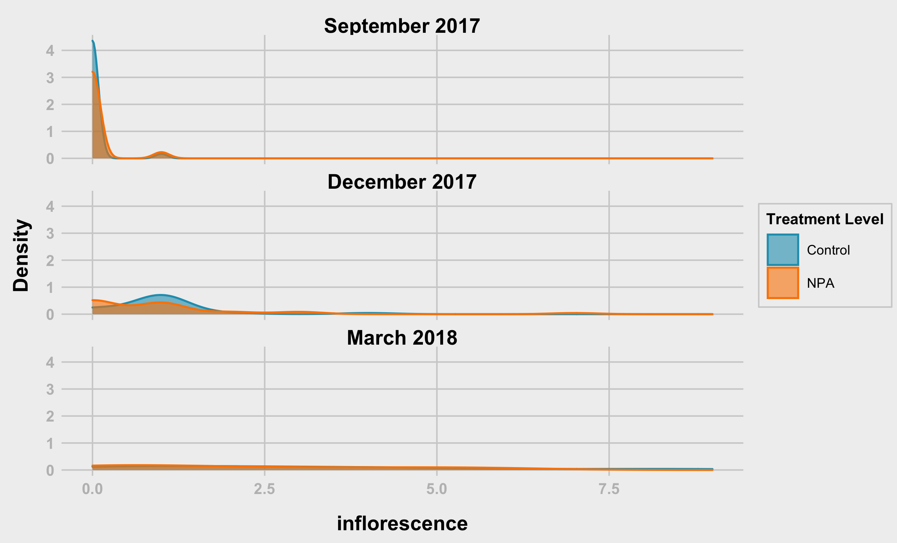
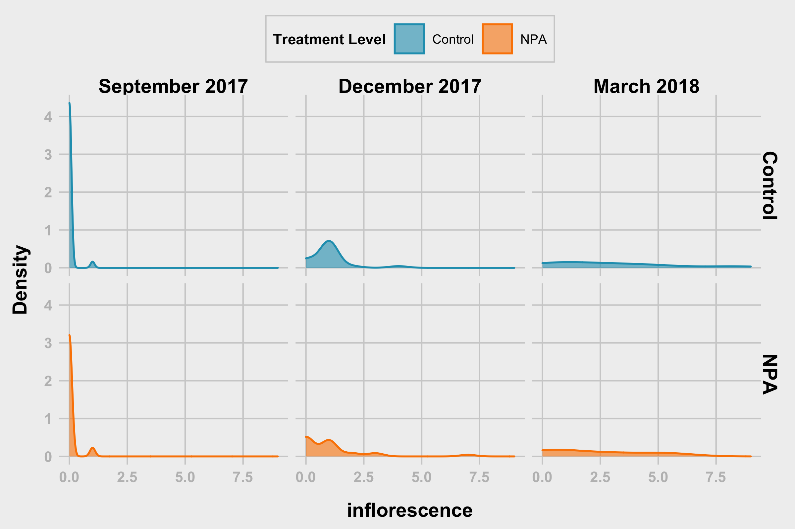
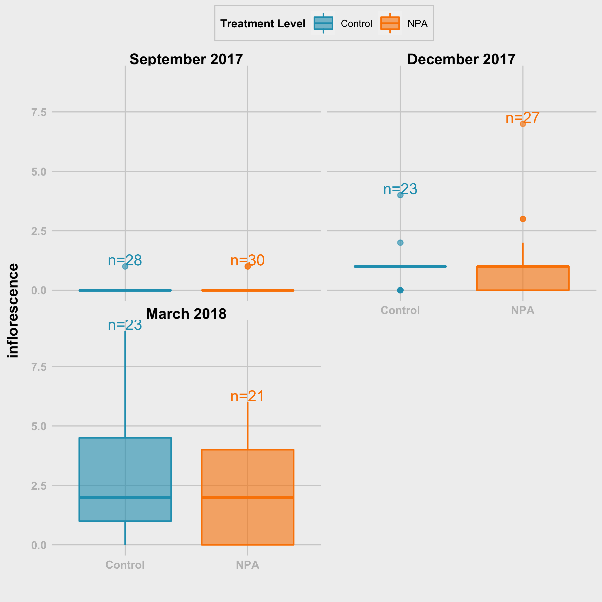
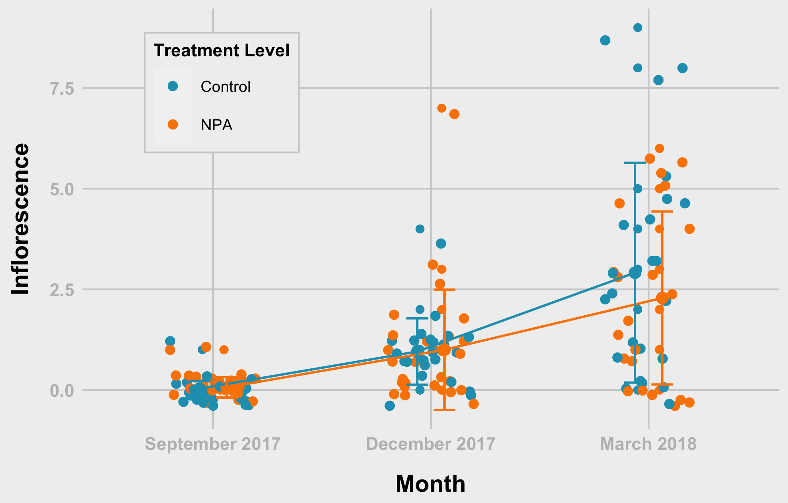

Analysis of Inflorescence treatment level.
================
Bishwa
2022-03-22

-   [Section 01 - Get Data and Prepare the
    data](#section-01---get-data-and-prepare-the-data)
    -   [1.1 Upload Packages](#11-upload-packages)
    -   [1.2 Check Data Structures](#12-check-data-structures)
    -   [Prepare the data](#prepare-the-data)
    -   [Section 02 - Overall Summary
        statistics](#section-02---overall-summary-statistics)
-   [Section 03 - Plots and Anlysis](#section-03---plots-and-anlysis)
-   [inflorescence - Treatmnent Level
    (tl)](#inflorescence---treatmnent-level-tl)
-   [inflorescence - Treatment Level (tl) -
    Points](#inflorescence---treatment-level-tl---points)
-   [since interaction is not
    significant](#since-interaction-is-not-significant)
-   [model 1 (ls1) estimates](#model-1-ls1-estimates)

# Section 01 - Get Data and Prepare the data

I downloaded data and placed on my computer. You should change the path
for the data following packges are necessary for your work 1.
`tidyverse` 2. `car` 3. `nlme` 4. `lme4` 5. `rstatix`

When I am using function from specific packages I am using namespace
atleast at the first time of its usage

``` r
library(tidyr)
library(dplyr)
```

    ## 
    ## Attaching package: 'dplyr'

    ## The following objects are masked from 'package:stats':
    ## 
    ##     filter, lag

    ## The following objects are masked from 'package:base':
    ## 
    ##     intersect, setdiff, setequal, union

``` r
library(ggplot2)
library(rstatix)
```

    ## 
    ## Attaching package: 'rstatix'

    ## The following object is masked from 'package:stats':
    ## 
    ##     filter

## 1.1 Upload Packages

``` r
#set working directory
path<- "../data/"


sep2017<- readxl::read_excel(path = paste0(path, "/09_18_2017_Data.xlsx"), sheet = "Sheet1", na = "NA")
dec2017<- readxl::read_excel(path = paste0(path, "/12_18_2017_Data.xlsx"), sheet = "Sheet1", na = "NA")
mar2018<- readxl::read_excel(path = paste0(path, "/03_28_2018_Data.xlsx"), sheet = "Sheet1", na = "NA")
```

## 1.2 Check Data Structures

### September 2017

``` r
str(sep2017)
```

    ## tibble [59 × 15] (S3: tbl_df/tbl/data.frame)
    ##  $ Date            : chr [1:59] "09_18_2017" "09_18_2017" "09_18_2017" "09_18_2017" ...
    ##  $ Plant_ID        : chr [1:59] "M-14-08-A" "M-14-08-B" "M-14-08-C" "M-14-08-D" ...
    ##  $ Family          : num [1:59] 8 8 8 8 8 8 8 8 8 8 ...
    ##  $ Diameter(inches): num [1:59] 2.2 2.5 2.6 1.7 1.5 3 2.7 3.5 1.7 2.7 ...
    ##  $ Lat_Shoot_R     : num [1:59] 0 0 0 0 1 0 1 0 0 0 ...
    ##  $ Inflorescence   : num [1:59] 0 0 0 0 1 0 0 0 0 0 ...
    ##  $ Leaf_Shape      : num [1:59] 3 3 3 3 3 3 3 3 3 3 ...
    ##  $ Trichomes_int   : num [1:59] 2 2 2 3 2 1 2 2 2 2 ...
    ##  $ TreatmentLevel  : chr [1:59] "Auxin" "Auxin" "Control" "Control" ...
    ##  $ Treatment       : chr [1:59] "Aux_Drop" "Aux_Spray" "DMSO" "Water" ...
    ##  $ Population      : chr [1:59] "My" "My" "My" "My" ...
    ##  $ Bolting         : num [1:59] 0 0 0 0 1 0 0 0 0 0 ...
    ##  $ Flowering       : num [1:59] 0 0 0 0 1 0 0 0 0 0 ...
    ##  $ Remarks_01      : chr [1:59] NA NA NA NA ...
    ##  $ Remarks_02      : chr [1:59] NA NA NA NA ...

### December 2017

``` r
str(dec2017)
```

    ## tibble [59 × 15] (S3: tbl_df/tbl/data.frame)
    ##  $ Date            : chr [1:59] "12_18_2017" "12_18_2017" "12_18_2017" "12_18_2017" ...
    ##  $ Plant_ID        : chr [1:59] "M-14-08-A" "M-14-08-B" "M-14-08-C" "M-14-08-D" ...
    ##  $ Family          : num [1:59] 8 8 8 8 8 8 8 8 8 8 ...
    ##  $ Diameter(inches): num [1:59] NA 3.7 NA 4.2 2.6 3.7 4 5.2 5.4 3.4 ...
    ##  $ Lat_Shoot_R     : chr [1:59] NA "2" NA "2" ...
    ##  $ Inflorescence   : num [1:59] NA 1 NA 4 7 0 0 1 0 1 ...
    ##  $ Leaf_Shape      : chr [1:59] NA "2" NA "3" ...
    ##  $ Trichomes_int   : chr [1:59] NA "1" NA "1" ...
    ##  $ TreatmentLevel  : chr [1:59] "Auxin" "Auxin" "Control" "Control" ...
    ##  $ Treatment       : chr [1:59] "Aux_Drop" "Aux_Spray" "DMSO" "Water" ...
    ##  $ Population      : chr [1:59] "My" "My" "My" "My" ...
    ##  $ Bolting         : num [1:59] NA 1 NA 1 1 0 0 1 0 1 ...
    ##  $ Flowering       : num [1:59] NA 1 NA 1 1 0 0 1 0 1 ...
    ##  $ Remarks_01      : chr [1:59] "Missing - I think we extracted RNA out of it ??" "LCU" NA "Foliage out of frame" ...
    ##  $ Remarks_02      : chr [1:59] NA NA NA NA ...

### October 2018

``` r
str(mar2018)
```

    ## tibble [59 × 15] (S3: tbl_df/tbl/data.frame)
    ##  $ Date            : chr [1:59] "03_28_2018" "03_28_2018" "03_28_2018" "03_28_2018" ...
    ##  $ Plant_ID        : chr [1:59] "M-14-08-A" "M-14-08-B" "M-14-08-C" "M-14-08-D" ...
    ##  $ Family          : num [1:59] 8 8 8 8 8 8 8 8 8 8 ...
    ##  $ Diameter(inches): num [1:59] NA 4.2 NA 3.6 3.4 4.6 5.2 4.7 5.2 5.2 ...
    ##  $ Lat_Shoot_R     : num [1:59] NA 3 NA 3 3 3 4 3 4 4 ...
    ##  $ Inflorescence   : num [1:59] NA 3 NA 5 6 0 0 0 3 0 ...
    ##  $ Leaf_Shape      : num [1:59] NA 2 NA 3 3 2 3 3 3 3 ...
    ##  $ Trichomes_int   : num [1:59] NA 2 NA 1 2 1 1 1 1 1 ...
    ##  $ TreatmentLevel  : chr [1:59] "Auxin" "Auxin" "Control" "Control" ...
    ##  $ Treatment       : chr [1:59] "Aux_Drop" "Aux_Spray" "DMSO" "Water" ...
    ##  $ Population      : chr [1:59] "My" "My" "My" "My" ...
    ##  $ Bolting         : num [1:59] NA 1 NA 1 1 0 0 0 1 0 ...
    ##  $ Flowering       : num [1:59] NA 1 NA 1 1 0 0 0 1 0 ...
    ##  $ Remarks_01      : chr [1:59] NA NA NA NA ...
    ##  $ Remarks_02      : logi [1:59] NA NA NA NA NA NA ...

## Prepare the data

### ID’s & Column for Month

``` r
# ID's
sep2017$id<- row.names(sep2017)
dec2017$id<- row.names(dec2017)
mar2018$id<- row.names(mar2018)

# Month column
sep2017$Month <- "Sep"
dec2017$Month <- "Dec"
mar2018$Month <- "Mar"
```

### Combine the sets & and change column names

``` r
fdata<- rbind(sep2017,dec2017,mar2018)

# changing the name when necessary
names(fdata)<- c("date", "plantID", "family", "diaIn", "latShootRating", 
                 "inflorescence", "leafShape", "trichomesInt", "treatmentLevel", 
                 "treatment", "population", "bolting", "flowering", "remarks_01", 
                 "remarks_02", "id", "month")
```

### Convert inches to mm

``` r
fdata$diaIn <- fdata$diaIn * 25.4

fdata <- fdata %>%
  mutate(treatmentLevel = replace(treatmentLevel, treatmentLevel == "Auxin", "NPA"))
```

### Get rid of unnecessary columns and check the amount of missing values in each column

``` r
library(tidyverse)
```

    ## ── Attaching packages ─────────────────────────────────────── tidyverse 1.3.1 ──

    ## ✓ tibble  3.1.6     ✓ stringr 1.4.0
    ## ✓ readr   2.1.2     ✓ forcats 0.5.1
    ## ✓ purrr   0.3.4

    ## ── Conflicts ────────────────────────────────────────── tidyverse_conflicts() ──
    ## x rstatix::filter() masks dplyr::filter(), stats::filter()
    ## x dplyr::lag()      masks stats::lag()

``` r
mvdata<- fdata %>% select( - c(remarks_01, remarks_02))

mvdata %>% summarise_all(funs(sum(is.na(.))))
```

    ## Warning: `funs()` was deprecated in dplyr 0.8.0.
    ## Please use a list of either functions or lambdas: 
    ## 
    ##   # Simple named list: 
    ##   list(mean = mean, median = median)
    ## 
    ##   # Auto named with `tibble::lst()`: 
    ##   tibble::lst(mean, median)
    ## 
    ##   # Using lambdas
    ##   list(~ mean(., trim = .2), ~ median(., na.rm = TRUE))
    ## This warning is displayed once every 8 hours.
    ## Call `lifecycle::last_lifecycle_warnings()` to see where this warning was generated.

    ## # A tibble: 1 × 15
    ##    date plantID family diaIn latShootRating inflorescence leafShape trichomesInt
    ##   <int>   <int>  <int> <int>          <int>         <int>     <int>        <int>
    ## 1     0       0      0    25             25            25        25           25
    ## # … with 7 more variables: treatmentLevel <int>, treatment <int>,
    ## #   population <int>, bolting <int>, flowering <int>, id <int>, month <int>

### Delete rows with missing values

``` r
fndata <- mvdata %>% drop_na()

#fndata <- fdata %>%  mutate(across(where(is.character), ~na_if(., "NA")))
```

### Specify correct data types

``` r
# Not numeric variables
char_var<- c("date","plantID","treatmentLevel","treatment","population", "month", "family")

# Numeric variables
num_var<- names(fndata[, !(names(fndata) %in% char_var)])

#convert characters to numeric vector
fndata[, num_var]<- sapply(fndata[, num_var], as.numeric)
```

    ## Warning in lapply(X = X, FUN = FUN, ...): NAs introduced by coercion

    ## Warning in lapply(X = X, FUN = FUN, ...): NAs introduced by coercion

    ## Warning in lapply(X = X, FUN = FUN, ...): NAs introduced by coercion

``` r
#convert characters to factors
fndata$dateFac   <- factor(fndata$date,       labels =  c("September 2017", "December 2017", "March 2018" ),
                           levels =  c("09_18_2017", "12_18_2017", "03_28_2018" ))

fndata$treatment <- factor(fndata$treatment,  labels =  c("NPA Drop", "NPA Spray", "DMSO", "Water"))

fndata$treatmentLevel <- as.factor(fndata$treatmentLevel)

fndata$plantID<- as.factor(fndata$plantID)

# Check 
sapply(fndata, class)
```

    ##           date        plantID         family          diaIn latShootRating 
    ##    "character"       "factor"      "numeric"      "numeric"      "numeric" 
    ##  inflorescence      leafShape   trichomesInt treatmentLevel      treatment 
    ##      "numeric"      "numeric"      "numeric"       "factor"       "factor" 
    ##     population        bolting      flowering             id          month 
    ##    "character"      "numeric"      "numeric"      "numeric"    "character" 
    ##        dateFac 
    ##       "factor"

## Section 02 - Overall Summary statistics

### Choose variables of interest

``` r
# extract variables that are important
sel_var<- c("date", "plantID", "treatment", "treatmentLevel","diaIn",
            "latShootRatio", "inflorescence", "leafShape"  )

#---------- mean
# mean_diaInflo<- fndata %>% select(sel_var) %>% 
#   group_by(treatment) %>% 
#   summarise_at(.vars = vars(diaIn, inflorescence),.funs = c(mean = "mean"))
# 
# sd_diaInflo<- fndata %>% select(sel_var) %>% 
#   group_by(treatment) %>% 
#   summarise_at(.vars = vars(diaIn, inflorescence),.funs = c(sd = "mean"))
# 
# sumdat<- cbind(mean_diaInflo, sd_diaInflo[, 2:3])

# Stats for Diameter
mean_diaInflo<- fndata %>% 
  group_by(treatment) %>% 
  summarise(mean = mean(diaIn, na.rm = TRUE),
            sd   = sd(diaIn, na.rm = TRUE)
  )

# Stats for inflorescence
mean_inflo<- fndata %>% 
  group_by(treatment) %>% 
  summarise(
    mean = mean(inflorescence, na.rm = TRUE),
    sd   = sd(inflorescence, na.rm = TRUE)
  )

# Stats for Lat_Shoot
mean_latShoot<- fndata %>% 
  group_by(treatment) %>% 
  summarise(mean = mean(latShootRating, na.rm = TRUE),
            sd   = sd(latShootRating, na.rm = TRUE)
  )

#------- apply variable name and combine
mean_diaInflo$var <- "Diameter"
mean_inflo$var    <- "Inflorescence"
mean_latShoot$var <- "LatShoot"


sumdata<- rbind(mean_diaInflo,mean_inflo, mean_latShoot)
sumdata
```

    ## # A tibble: 12 × 4
    ##    treatment   mean     sd var          
    ##    <fct>      <dbl>  <dbl> <chr>        
    ##  1 NPA Drop  82.0   35.1   Diameter     
    ##  2 NPA Spray 70.5   31.4   Diameter     
    ##  3 DMSO      90.0   35.1   Diameter     
    ##  4 Water     88.7   32.4   Diameter     
    ##  5 NPA Drop   1.33   2.02  Inflorescence
    ##  6 NPA Spray  0.583  0.996 Inflorescence
    ##  7 DMSO       0.973  1.86  Inflorescence
    ##  8 Water      1.46   2.09  Inflorescence
    ##  9 NPA Drop   1.68   1.23  LatShoot     
    ## 10 NPA Spray  1.51   1.29  LatShoot     
    ## 11 DMSO       1.49   1.12  LatShoot     
    ## 12 Water      1.54   1.10  LatShoot

# Section 03 - Plots and Anlysis

### Theme Function

``` r
theme_538 <- function(base_size = 8, base_family = "Arial") {
  theme_grey(base_size = base_size, base_family = base_family) %+replace%
    theme(
      # drop minor gridlines and axis-ticks
      panel.grid.minor = element_blank(),
      axis.ticks = element_blank(),
      # change font elements/family
      text = element_text(family = "Arial", size = base_size),
      axis.text = element_text(face = "bold", color = "grey", size = base_size),
      axis.title = element_text(face = "bold", size = rel(1.33)),
      axis.title.x = element_text(margin = margin(0.3, 0, 0, 0, unit = "cm")),
      axis.title.y = element_text(margin = margin(0, 0.3, 0, 0, unit = "cm"), angle =90),
      plot.title = element_text(face = "bold", size = rel(1.67), hjust = 0),
      plot.title.position = "plot",
      plot.subtitle = element_text(size = 12, margin = margin(0.2, 0, 1, 0, unit = "cm"), hjust = 0),
      plot.caption = element_text(size = 8, margin = margin(1, 0, 0, 0, unit = "cm"), hjust = 1),
      # change plot colors for the background/panel elements
      plot.background = element_rect(fill = "#f0f0f0", color = NA),
      panel.background = element_rect(fill = "#f0f0f0", color = NA),
      panel.grid.major =  element_line(color = "#d0d0d0"),
      panel.border = element_blank(),
      # shrinks margin and simplify the strip/facet elements
      strip.background = element_blank(),
      strip.text = element_text(size = rel(1.33), face = "bold")
    )
}
```

# inflorescence - Treatmnent Level (tl)

### inflorescence - Treatment Level (tl) - Density Function

``` r
grDevices::png(filename = "plots/hist_infl_tl.png",  width = 16.5, height = 10, units = 'cm', res = 400)

hist_infl <- fndata %>%
  ggplot(aes(inflorescence, fill = treatmentLevel, colour = treatmentLevel)) +
  geom_density(alpha = 0.6) +
  scale_fill_manual("Treatment Level", values = c("#219ebc", "#fb8500")) +
  scale_colour_manual("Treatment Level", values = c("#219ebc", "#fb8500")) + 
  facet_wrap(~dateFac, nrow = 3) + 
  labs(x = "inflorescence", y = "Density") +
  #coord_flip() + 
  theme_538() +
  theme(
    #legend.position = "top",
    legend.background = element_rect(fill = "#f0f0f0", color = "#d0d0d0"),
    legend.title = element_text(family = "Arial", size = 8, face = "bold"),
    legend.title.align = 0.5,
    legend.text = element_text(size=7),
    plot.margin = margin(0.3, 0.1, 0.2, 0.2, unit = "cm"),
    )
  

hist_infl

dev.off()
```

    ## quartz_off_screen 
    ##                 2

``` r

```

<!-- -->

### inflorescence - Treatment Level (tl) - Density Function version 2

``` r
grDevices::png(filename = "plots/hist_infl2.png",  width = 6, height = 4, units = 'in', res = 400)

hist_infl2 <- fndata %>%
  ggplot(aes(inflorescence, fill = treatmentLevel, colour = treatmentLevel)) +
  geom_density(alpha = 0.6) +
  scale_fill_manual("Treatment Level", values = c("#219ebc", "#fb8500")) +
  scale_colour_manual("Treatment Level", values = c("#219ebc", "#fb8500")) + 
  facet_grid(treatmentLevel ~ dateFac) + 
  labs(x = "inflorescence", y = "Density") +
  #coord_flip() + 
  theme_538() +
  theme(
    legend.position = "top",
    legend.background = element_rect(fill = "#f0f0f0", color = "#d0d0d0"),
    legend.title = element_text(family = "Arial", size = 8, face = "bold"),
    legend.title.align = 0.5,
    legend.text = element_text(size=7),
    plot.margin = margin(0.3, 0.3, 0.2, 0.2, unit = "cm"),
    )
  

hist_infl2

dev.off()
```

    ## quartz_off_screen 
    ##                 2

``` r

```

<!-- -->

### inflorescence - Treatment Level (tl) - Boxplot

``` r
grDevices::png(filename = "plots/violin_infl.png",  width = 6, height = 6, units = 'in', res = 400)

violin_infl <- fndata %>%
  group_by(treatmentLevel, dateFac) %>% mutate(N=n()) %>%
  mutate(N=ifelse(inflorescence==max(inflorescence,na.rm=T),paste0('n=',N),NA)) %>%
  ggplot(aes(x = treatmentLevel, y = inflorescence, fill = treatmentLevel, colour = treatmentLevel, label = N)) +
  #geom_violin(alpha = 0.6) +
  geom_boxplot(#width = 0.1, 
               alpha = 0.6) +
  geom_text(vjust = -0.1, hjust = 0.5, show.legend = FALSE) +
  scale_fill_manual("Treatment Level", values = c("#219ebc", "#fb8500")) +
  scale_colour_manual("Treatment Level", values = c("#219ebc", "#fb8500")) +
  facet_wrap(~dateFac, nrow = 2, ncol = 2) + 
  labs(x = "Treatment Level", y = "inflorescence") +
  xlab("") +
  #coord_flip() +
  theme_538() +
  theme(
    legend.position = "top",
    legend.background = element_rect(fill = "#f0f0f0", color = "#d0d0d0"),
    legend.title = element_text(family = "Arial", size = 8, face = "bold"),
    legend.title.align = 0.5,
    legend.text = element_text(size=7)
    )
  

violin_infl
```

    ## Warning: Removed 144 rows containing missing values (geom_text).

``` r
dev.off()
```

    ## quartz_off_screen 
    ##                 2

``` r

```

<!-- -->

# inflorescence - Treatment Level (tl) - Points

``` r
grDevices::png(filename = "plots/dots_infl_tl.png",  width = 12.5, height = 8, units = 'cm', res = 400)

dots_infl_tl <- fndata %>% ggplot(aes(x = dateFac, y = inflorescence, group = treatmentLevel, color = treatmentLevel))+
  #geom_point()
  geom_point(size = 2,shape = 20, 
             position = position_dodge(0.2)) +
             #position = "jitter") +
             
  geom_jitter(width = 0.2) +
  #geom_line(position = position_dodge(0.25 ))+
  stat_summary(fun =  mean, size = 2, geom = "point", 
               position = position_dodge(0.25), show.legend = FALSE)+
  
  stat_summary(fun = mean, size = 0.5, geom = "line",
               position = position_dodge(0.25), show.legend = FALSE)+
    
  stat_summary(fun.data = mean_sdl, fun.args = list(mult=1), 
               geom = "errorbar", width=0.2,
               position = position_dodge(0.25), show.legend = FALSE) +
  
  theme_bw(base_size = 14,base_family = "Serif")+
  xlab("Month")+
  ylab("Inflorescence")+
  # labs(fill = "Treatment")
  # guides(fill=guide_legend(title = "Treatment"))
  scale_color_manual("Treatment Level",values = c("#219ebc", "#fb8500"))+
  theme_538() + 
  theme(
    legend.position = c(0.2, 0.8),
    legend.background = element_rect(fill = "#f0f0f0", color = "#d0d0d0"),
    legend.title = element_text(family = "Arial", size = 8, face = "bold"),
    legend.title.align = 0.5,
    legend.text = element_text(size=7)
  )
  
dots_infl_tl

dev.off()
```

    ## quartz_off_screen 
    ##                 2

``` r

```

<!-- -->

``` r
table(fndata$treatmentLevel, fndata$inflorescence, fndata$dateFac)
```

    ## , ,  = September 2017
    ## 
    ##          
    ##            0  1  2  3  4  5  6  7  8  9
    ##   Control 27  1  0  0  0  0  0  0  0  0
    ##   NPA     28  2  0  0  0  0  0  0  0  0
    ## 
    ## , ,  = December 2017
    ## 
    ##          
    ##            0  1  2  3  4  5  6  7  8  9
    ##   Control  5 16  1  0  1  0  0  0  0  0
    ##   NPA     12 10  2  2  0  0  0  1  0  0
    ## 
    ## , ,  = March 2018
    ## 
    ##          
    ##            0  1  2  3  4  5  6  7  8  9
    ##   Control  5  4  3  3  2  3  0  0  2  1
    ##   NPA      6  4  2  3  1  3  2  0  0  0

### inflorescence - Treatment Level (tl) - Checking for Normality

Shapiro-Test for each group p-values is less than 0.05, hence, we reject
hypothesis about normal distribution.

``` r
fndata %>% group_by(treatmentLevel) %>% 
  shapiro_test(inflorescence)
```

    ## # A tibble: 2 × 4
    ##   treatmentLevel variable      statistic        p
    ##   <fct>          <chr>             <dbl>    <dbl>
    ## 1 Control        inflorescence     0.652 5.76e-12
    ## 2 NPA            inflorescence     0.652 2.69e-12

### inflorescence - Treatment Level (tl) - Checking for Normality by Month

If we divide by both month and treatment, distribution can be assumed to
be normal

``` r
fndata %>% group_by(treatmentLevel, dateFac) %>%
  shapiro_test(inflorescence) %>%
  left_join(fndata %>% 
              group_by(treatmentLevel, dateFac) %>%
              summarise(n = n()),
            by = c("treatmentLevel", "dateFac"))
```

    ## `summarise()` has grouped output by 'treatmentLevel'. You can override using
    ## the `.groups` argument.

    ## # A tibble: 6 × 6
    ##   treatmentLevel dateFac        variable      statistic        p     n
    ##   <fct>          <fct>          <chr>             <dbl>    <dbl> <int>
    ## 1 Control        September 2017 inflorescence     0.188 2.25e-11    28
    ## 2 Control        December 2017  inflorescence     0.639 2.49e- 6    23
    ## 3 Control        March 2018     inflorescence     0.885 1.28e- 2    23
    ## 4 NPA            September 2017 inflorescence     0.275 4.40e-11    30
    ## 5 NPA            December 2017  inflorescence     0.655 9.75e- 7    27
    ## 6 NPA            March 2018     inflorescence     0.872 1.06e- 2    21

### inflorescence - Treatment Level (tl) - Pairwise T-test

``` r
ph_infl_tl <- fndata %>% 
  pairwise_t_test(
    inflorescence~treatmentLevel, paired = FALSE, # due to sample difference
    p.adjust.method = "holm"       # with treatment not so much of difference
  )

# print
print(ph_infl_tl)
```

    ## # A tibble: 1 × 9
    ##   .y.           group1  group2    n1    n2     p p.signif p.adj p.adj.signif
    ## * <chr>         <chr>   <chr>  <int> <int> <dbl> <chr>    <dbl> <chr>       
    ## 1 inflorescence Control NPA       74    78  0.44 ns        0.44 ns

### inflorescence - Treatment Level (tl) - Pairwise T-test - For September 2017

``` r
ph_infl_tl_sep <- fndata %>% 
  filter(dateFac == "September 2017") %>%
  pairwise_t_test(
    inflorescence~treatmentLevel, paired = FALSE, # due to sample difference
    p.adjust.method = "holm"       # with treatment not so much of difference
  )

# print
print(ph_infl_tl_sep)
```

    ## # A tibble: 1 × 9
    ##   .y.           group1  group2    n1    n2     p p.signif p.adj p.adj.signif
    ## * <chr>         <chr>   <chr>  <int> <int> <dbl> <chr>    <dbl> <chr>       
    ## 1 inflorescence Control NPA       28    30 0.602 ns       0.602 ns

### inflorescence - Treatment Level (tl) - Pairwise T-test - For December 2017

``` r
ph_infl_tl_dec <- fndata %>% 
  filter(dateFac == "December 2017") %>%
  pairwise_t_test(
    inflorescence~treatmentLevel, paired = FALSE, # due to sample difference
    p.adjust.method = "holm"       # with treatment not so much of difference
  )

# print
print(ph_infl_tl_dec)
```

    ## # A tibble: 1 × 9
    ##   .y.           group1  group2    n1    n2     p p.signif p.adj p.adj.signif
    ## * <chr>         <chr>   <chr>  <int> <int> <dbl> <chr>    <dbl> <chr>       
    ## 1 inflorescence Control NPA       23    27 0.902 ns       0.902 ns

### inflorescence - Treatment Level (tl) - Pairwise T-test - For March 2018

``` r
ph_infl_tl_mar <- fndata %>% 
  filter(dateFac == "March 2018") %>%
  pairwise_t_test(
    inflorescence~treatmentLevel, paired = FALSE, # due to sample difference
    p.adjust.method = "holm"       # with treatment not so much of difference
  )

# print
print(ph_infl_tl_mar)
```

    ## # A tibble: 1 × 9
    ##   .y.           group1  group2    n1    n2     p p.signif p.adj p.adj.signif
    ## * <chr>         <chr>   <chr>  <int> <int> <dbl> <chr>    <dbl> <chr>       
    ## 1 inflorescence Control NPA       23    21 0.405 ns       0.405 ns

### inflorescence - Treatment Level (tl) - repeated Anova

``` r
aov_infl_tl <- aov(inflorescence~treatmentLevel*dateFac + Error(id), data = fndata)
summary(aov_infl_tl)
```

    ## 
    ## Error: id
    ##                Df Sum Sq Mean Sq
    ## treatmentLevel  1  5.678   5.678
    ## 
    ## Error: Within
    ##                         Df Sum Sq Mean Sq F value   Pr(>F)    
    ## treatmentLevel           1    2.1    2.08   0.923    0.338    
    ## dateFac                  2  162.9   81.43  36.069 1.93e-13 ***
    ## treatmentLevel:dateFac   2    3.5    1.76   0.780    0.460    
    ## Residuals              145  327.4    2.26                     
    ## ---
    ## Signif. codes:  0 '***' 0.001 '**' 0.01 '*' 0.05 '.' 0.1 ' ' 1

### inflorescence - Treatment Level (tl) - Mixed effects for repeated data 1

``` r
lme1_infl_tl<- nlme::lme(inflorescence~1, random = ~1|treatmentLevel, method = "REML", na.action = na.omit,
          data = fndata)

summary(lme1_infl_tl)
```

    ## Linear mixed-effects model fit by REML
    ##   Data: fndata 
    ##        AIC    BIC    logLik
    ##   620.7981 629.85 -307.3991
    ## 
    ## Random effects:
    ##  Formula: ~1 | treatmentLevel
    ##          (Intercept) Residual
    ## StdDev: 0.0001007376  1.82245
    ## 
    ## Fixed effects:  inflorescence ~ 1 
    ##                Value Std.Error  DF  t-value p-value
    ## (Intercept) 1.098684 0.1478202 150 7.432571       0
    ## 
    ## Standardized Within-Group Residuals:
    ##        Min         Q1        Med         Q3        Max 
    ## -0.6028612 -0.6028612 -0.6028612 -0.0541492  4.3355468 
    ## 
    ## Number of Observations: 152
    ## Number of Groups: 2

### inflorescence - Treatment Level (tl) - Mixed effects for repeated data 2

``` r
lme2_infl_tl<- nlme::lme(inflorescence~treatmentLevel, random = ~1|dateFac,
                method = "REML", na.action = na.omit,
                data = fndata)
summary(lme2_infl_tl)
```

    ## Linear mixed-effects model fit by REML
    ##   Data: fndata 
    ##        AIC      BIC    logLik
    ##   572.2522 584.2948 -282.1261
    ## 
    ## Random effects:
    ##  Formula: ~1 | dateFac
    ##         (Intercept) Residual
    ## StdDev:    1.274864 1.505264
    ## 
    ## Fixed effects:  inflorescence ~ treatmentLevel 
    ##                        Value Std.Error  DF    t-value p-value
    ## (Intercept)        1.2927103 0.7566396 148  1.7084887  0.0896
    ## treatmentLevelNPA -0.1578806 0.2445636 148 -0.6455604  0.5196
    ##  Correlation: 
    ##                   (Intr)
    ## treatmentLevelNPA -0.165
    ## 
    ## Standardized Within-Group Residuals:
    ##         Min          Q1         Med          Q3         Max 
    ## -1.75790247 -0.42923170 -0.04745044  0.05743521  4.22111597 
    ## 
    ## Number of Observations: 152
    ## Number of Groups: 3

### inflorescence - Treatment Level (tl) - Mixed effects for repeated data 3

``` r
lme3_infl_tl<- nlme::lme(inflorescence~treatmentLevel*dateFac, random = ~1|id,
                method = "REML", na.action = na.omit,
                data = fndata)

summary(lme3_infl_tl)
```

    ## Linear mixed-effects model fit by REML
    ##   Data: fndata 
    ##        AIC      BIC    logLik
    ##   566.2813 590.1502 -275.1407
    ## 
    ## Random effects:
    ##  Formula: ~1 | id
    ##         (Intercept) Residual
    ## StdDev:   0.5850967 1.386565
    ## 
    ## Fixed effects:  inflorescence ~ treatmentLevel * dateFac 
    ##                                             Value Std.Error DF   t-value
    ## (Intercept)                             0.0357143 0.2844104 89  0.125573
    ## treatmentLevelNPA                       0.0164818 0.3953355 57  0.041691
    ## dateFacDecember 2017                    0.9201663 0.3929882 89  2.341460
    ## dateFacMarch 2018                       2.8764384 0.3929882 89  7.319401
    ## treatmentLevelNPA:dateFacDecember 2017  0.0320669 0.5399057 89  0.059394
    ## treatmentLevelNPA:dateFacMarch 2018    -0.6268446 0.5610031 89 -1.117364
    ##                                        p-value
    ## (Intercept)                             0.9004
    ## treatmentLevelNPA                       0.9669
    ## dateFacDecember 2017                    0.0214
    ## dateFacMarch 2018                       0.0000
    ## treatmentLevelNPA:dateFacDecember 2017  0.9528
    ## treatmentLevelNPA:dateFacMarch 2018     0.2668
    ##  Correlation: 
    ##                                        (Intr) trLNPA dFD201 dFM201 tLNPA:FD2
    ## treatmentLevelNPA                      -0.719                               
    ## dateFacDecember 2017                   -0.614  0.442                        
    ## dateFacMarch 2018                      -0.614  0.442  0.456                 
    ## treatmentLevelNPA:dateFacDecember 2017  0.447 -0.623 -0.728 -0.332          
    ## treatmentLevelNPA:dateFacMarch 2018     0.430 -0.600 -0.319 -0.701  0.450   
    ## 
    ## Standardized Within-Group Residuals:
    ##         Min          Q1         Med          Q3         Max 
    ## -1.85720393 -0.45234317 -0.02420875  0.19193507  3.88030553 
    ## 
    ## Number of Observations: 152
    ## Number of Groups: 59

### inflorescence - Treatment Level (tl) - Mixed effects for repeated data 4

``` r
lme4_infl_tl <- nlme::lme(inflorescence~treatmentLevel, random = ~1|id,
                method = "REML", na.action = na.omit,
                data = fndata)

lme4_infl_tl
```

    ## Linear mixed-effects model fit by REML
    ##   Data: fndata 
    ##   Log-restricted-likelihood: -307.3983
    ##   Fixed: inflorescence ~ treatmentLevel 
    ##       (Intercept) treatmentLevelNPA 
    ##         1.2162162        -0.2290367 
    ## 
    ## Random effects:
    ##  Formula: ~1 | id
    ##          (Intercept) Residual
    ## StdDev: 0.0001900058 1.824879
    ## 
    ## Number of Observations: 152
    ## Number of Groups: 59

### inflorescence - Treatment Level (tl) - Mixed effects for repeated data 5

``` r
dglme_infl_tl<- lme4::lmer(inflorescence~treatmentLevel*dateFac +(1|id), data = fndata)


anova(dglme_infl_tl, type = 3)
```

    ## Warning in anova.merMod(dglme_infl_tl, type = 3): additional arguments ignored:
    ## 'type'

    ## Analysis of Variance Table
    ##                        npar  Sum Sq Mean Sq F value
    ## treatmentLevel            1   1.333   1.333  0.6933
    ## dateFac                   2 162.945  81.472 42.3770
    ## treatmentLevel:dateFac    2   3.163   1.581  0.8225

``` r
summary(dglme_infl_tl)
```

    ## Linear mixed model fit by REML ['lmerMod']
    ## Formula: inflorescence ~ treatmentLevel * dateFac + (1 | id)
    ##    Data: fndata
    ## 
    ## REML criterion at convergence: 550.3
    ## 
    ## Scaled residuals: 
    ##     Min      1Q  Median      3Q     Max 
    ## -1.8572 -0.4523 -0.0242  0.1919  3.8803 
    ## 
    ## Random effects:
    ##  Groups   Name        Variance Std.Dev.
    ##  id       (Intercept) 0.3423   0.5851  
    ##  Residual             1.9226   1.3866  
    ## Number of obs: 152, groups:  id, 59
    ## 
    ## Fixed effects:
    ##                                        Estimate Std. Error t value
    ## (Intercept)                             0.03571    0.28441   0.126
    ## treatmentLevelNPA                       0.01648    0.39534   0.042
    ## dateFacDecember 2017                    0.92017    0.39299   2.341
    ## dateFacMarch 2018                       2.87644    0.39299   7.319
    ## treatmentLevelNPA:dateFacDecember 2017  0.03207    0.53991   0.059
    ## treatmentLevelNPA:dateFacMarch 2018    -0.62684    0.56100  -1.117
    ## 
    ## Correlation of Fixed Effects:
    ##             (Intr) trLNPA dFD201 dFM201 tLNPA:FD2
    ## trtmntLvNPA -0.719                               
    ## dtFcDcm2017 -0.614  0.442                        
    ## dtFcMrc2018 -0.614  0.442  0.456                 
    ## tLNPA:FD201  0.447 -0.623 -0.728 -0.332          
    ## tLNPA:FM201  0.430 -0.600 -0.319 -0.701  0.450

``` r
table(fndata$dateFac, fndata$inflorescence, fndata$treatmentLevel)
```

    ## , ,  = Control
    ## 
    ##                 
    ##                   0  1  2  3  4  5  6  7  8  9
    ##   September 2017 27  1  0  0  0  0  0  0  0  0
    ##   December 2017   5 16  1  0  1  0  0  0  0  0
    ##   March 2018      5  4  3  3  2  3  0  0  2  1
    ## 
    ## , ,  = NPA
    ## 
    ##                 
    ##                   0  1  2  3  4  5  6  7  8  9
    ##   September 2017 28  2  0  0  0  0  0  0  0  0
    ##   December 2017  12 10  2  2  0  0  0  1  0  0
    ##   March 2018      6  4  2  3  1  3  2  0  0  0

``` r
# five counts are only five
```

``` r
library(lme4)
```

    ## Loading required package: Matrix

    ## 
    ## Attaching package: 'Matrix'

    ## The following objects are masked from 'package:tidyr':
    ## 
    ##     expand, pack, unpack

``` r
library(car)
```

    ## Loading required package: carData

    ## 
    ## Attaching package: 'car'

    ## The following object is masked from 'package:purrr':
    ## 
    ##     some

    ## The following object is masked from 'package:dplyr':
    ## 
    ##     recode

``` r
ls1<- lme4::glmer(inflorescence~treatment*dateFac +(1|id), family = "poisson", 
            data = fndata,
            control = glmerControl(check.conv.singular = .makeCC(
              action = "ignore",  tol = 1e-4)))
```

    ## Warning in checkConv(attr(opt, "derivs"), opt$par, ctrl = control$checkConv, : Model is nearly unidentifiable: large eigenvalue ratio
    ##  - Rescale variables?

``` r
car::Anova(ls1, type = "III") # sequantial sums of square
```

    ## Analysis of Deviance Table (Type III Wald chisquare tests)
    ## 
    ## Response: inflorescence
    ##                     Chisq Df Pr(>Chisq)    
    ## (Intercept)        9.4536  1   0.002107 ** 
    ## treatment          0.2087  3   0.976167    
    ## dateFac           26.8657  2  1.466e-06 ***
    ## treatment:dateFac  4.0427  6   0.670894    
    ## ---
    ## Signif. codes:  0 '***' 0.001 '**' 0.01 '*' 0.05 '.' 0.1 ' ' 1

``` r
# Interaction effects are not significant
```

``` r
ls2<- lme4::glmer(inflorescence~treatmentLevel +(1|id), 
                  family = "poisson", 
                  data   = fndata,
                  control = glmerControl(check.conv.singular = .makeCC(
                    action = "ignore",  tol = 1e-4)))
# difference between model 2 (ls2) and ls1
```

# since interaction is not significant

``` r
summary(ls2)
```

    ## Generalized linear mixed model fit by maximum likelihood (Laplace
    ##   Approximation) [glmerMod]
    ##  Family: poisson  ( log )
    ## Formula: inflorescence ~ treatmentLevel + (1 | id)
    ##    Data: fndata
    ## Control: glmerControl(check.conv.singular = .makeCC(action = "ignore",  
    ##     tol = 1e-04))
    ## 
    ##      AIC      BIC   logLik deviance df.resid 
    ##    508.5    517.5   -251.2    502.5      149 
    ## 
    ## Scaled residuals: 
    ##    Min     1Q Median     3Q    Max 
    ## -1.623 -0.884 -0.680  0.496  3.923 
    ## 
    ## Random effects:
    ##  Groups Name        Variance Std.Dev.
    ##  id     (Intercept) 0.4973   0.7052  
    ## Number of obs: 152, groups:  id, 59
    ## 
    ## Fixed effects:
    ##                   Estimate Std. Error z value Pr(>|z|)
    ## (Intercept)       -0.07534    0.19104  -0.394    0.693
    ## treatmentLevelNPA -0.24092    0.25693  -0.938    0.348
    ## 
    ## Correlation of Fixed Effects:
    ##             (Intr)
    ## trtmntLvNPA -0.651

``` r
anova(ls2, ls1) # model 1
```

    ## Data: fndata
    ## Models:
    ## ls2: inflorescence ~ treatmentLevel + (1 | id)
    ## ls1: inflorescence ~ treatment * dateFac + (1 | id)
    ##     npar    AIC    BIC  logLik deviance  Chisq Df Pr(>Chisq)    
    ## ls2    3 508.46 517.54 -251.23   502.46                         
    ## ls1   13 352.14 391.45 -163.07   326.14 176.32 10  < 2.2e-16 ***
    ## ---
    ## Signif. codes:  0 '***' 0.001 '**' 0.01 '*' 0.05 '.' 0.1 ' ' 1

# model 1 (ls1) estimates

``` r
mm     <- model.matrix(ls1)
sumls1 <- summary(ls1)
bhat   <- cbind(sumls1$coef[,1])
elogod <- as.data.frame( mm %*% bhat)
```

``` r
nadat<-  na.omit(fndata[, c("treatmentLevel", "dateFac", "inflorescence", "diaIn")])
estmean<- cbind(elogod$V1, nadat)
  
estavg <-  estmean %>% 
  group_by(treatmentLevel, dateFac) %>%
  summarise(mean = mean(inflorescence),
            sd = sd(inflorescence))
```

    ## `summarise()` has grouped output by 'treatmentLevel'. You can override using
    ## the `.groups` argument.

``` r
estavg
```

    ## # A tibble: 6 × 4
    ## # Groups:   treatmentLevel [2]
    ##   treatmentLevel dateFac          mean    sd
    ##   <fct>          <fct>           <dbl> <dbl>
    ## 1 Control        September 2017 0.0357 0.189
    ## 2 Control        December 2017  0.957  0.825
    ## 3 Control        March 2018     2.91   2.73 
    ## 4 NPA            September 2017 0.0667 0.254
    ## 5 NPA            December 2017  1      1.49 
    ## 6 NPA            March 2018     2.29   2.15

``` r
ls0<- lme4::glmer(inflorescence~0+treatment +(1|id), 
                        family = "poisson", 
                        data   = fndata,
                        control = glmerControl(check.conv.singular = .makeCC(
                          action = "ignore",  tol = 1e-4)))
lcom<- rbind(c(-1, -1, 1,1)) # null beta == 0 NPA vs DMSO+Water 

linearHypothesis(ls0, lcom)
```

    ## Linear hypothesis test
    ## 
    ## Hypothesis:
    ## - treatmentNPA Drop - treatmentNPA Spray  + treatmentDMSO  + treatmentWater = 0
    ## 
    ## Model 1: restricted model
    ## Model 2: inflorescence ~ 0 + treatment + (1 | id)
    ## 
    ##   Df  Chisq Pr(>Chisq)
    ## 1                     
    ## 2  1 1.4565     0.2275

``` r
infl0<- lme4::glmer(inflorescence~treatmentLevel*dateFac +(1|id), 
                        family = "poisson", 
                        data   = fndata,
                        control = glmerControl(check.conv.singular = .makeCC(
                          action = "ignore",  tol = 1e-4)))

sjPlot::tab_model(infl0, file = "infl_tl.doc")
```

<table style="border-collapse:collapse; border:none;">
<tr>
<th style="border-top: double; text-align:center; font-style:normal; font-weight:bold; padding:0.2cm;  text-align:left; ">
 
</th>
<th colspan="3" style="border-top: double; text-align:center; font-style:normal; font-weight:bold; padding:0.2cm; ">
inflorescence
</th>
</tr>
<tr>
<td style=" text-align:center; border-bottom:1px solid; font-style:italic; font-weight:normal;  text-align:left; ">
Predictors
</td>
<td style=" text-align:center; border-bottom:1px solid; font-style:italic; font-weight:normal;  ">
Incidence Rate Ratios
</td>
<td style=" text-align:center; border-bottom:1px solid; font-style:italic; font-weight:normal;  ">
CI
</td>
<td style=" text-align:center; border-bottom:1px solid; font-style:italic; font-weight:normal;  ">
p
</td>
</tr>
<tr>
<td style=" padding:0.2cm; text-align:left; vertical-align:top; text-align:left; ">
(Intercept)
</td>
<td style=" padding:0.2cm; text-align:left; vertical-align:top; text-align:center;  ">
0.03
</td>
<td style=" padding:0.2cm; text-align:left; vertical-align:top; text-align:center;  ">
0.00 – 0.21
</td>
<td style=" padding:0.2cm; text-align:left; vertical-align:top; text-align:center;  ">
<strong>\<0.001</strong>
</td>
</tr>
<tr>
<td style=" padding:0.2cm; text-align:left; vertical-align:top; text-align:left; ">
treatmentLevel \[NPA\]
</td>
<td style=" padding:0.2cm; text-align:left; vertical-align:top; text-align:center;  ">
1.77
</td>
<td style=" padding:0.2cm; text-align:left; vertical-align:top; text-align:center;  ">
0.16 – 20.12
</td>
<td style=" padding:0.2cm; text-align:left; vertical-align:top; text-align:center;  ">
0.643
</td>
</tr>
<tr>
<td style=" padding:0.2cm; text-align:left; vertical-align:top; text-align:left; ">
dateFac [December 2017](#december-2017)
</td>
<td style=" padding:0.2cm; text-align:left; vertical-align:top; text-align:center;  ">
26.67
</td>
<td style=" padding:0.2cm; text-align:left; vertical-align:top; text-align:center;  ">
3.58 – 198.46
</td>
<td style=" padding:0.2cm; text-align:left; vertical-align:top; text-align:center;  ">
<strong>0.001</strong>
</td>
</tr>
<tr>
<td style=" padding:0.2cm; text-align:left; vertical-align:top; text-align:left; ">
dateFac \[March 2018\]
</td>
<td style=" padding:0.2cm; text-align:left; vertical-align:top; text-align:center;  ">
81.24
</td>
<td style=" padding:0.2cm; text-align:left; vertical-align:top; text-align:center;  ">
11.24 – 587.08
</td>
<td style=" padding:0.2cm; text-align:left; vertical-align:top; text-align:center;  ">
<strong>\<0.001</strong>
</td>
</tr>
<tr>
<td style=" padding:0.2cm; text-align:left; vertical-align:top; text-align:left; ">
treatmentLevel \[NPA\] \*<br>dateFac [December 2017](#december-2017)
</td>
<td style=" padding:0.2cm; text-align:left; vertical-align:top; text-align:center;  ">
0.58
</td>
<td style=" padding:0.2cm; text-align:left; vertical-align:top; text-align:center;  ">
0.05 – 6.84
</td>
<td style=" padding:0.2cm; text-align:left; vertical-align:top; text-align:center;  ">
0.664
</td>
</tr>
<tr>
<td style=" padding:0.2cm; text-align:left; vertical-align:top; text-align:left; ">
treatmentLevel \[NPA\] \*<br>dateFac \[March 2018\]
</td>
<td style=" padding:0.2cm; text-align:left; vertical-align:top; text-align:center;  ">
0.44
</td>
<td style=" padding:0.2cm; text-align:left; vertical-align:top; text-align:center;  ">
0.04 – 5.07
</td>
<td style=" padding:0.2cm; text-align:left; vertical-align:top; text-align:center;  ">
0.513
</td>
</tr>
<tr>
<td colspan="4" style="font-weight:bold; text-align:left; padding-top:.8em;">
Random Effects
</td>
</tr>
<tr>
<td style=" padding:0.2cm; text-align:left; vertical-align:top; text-align:left; padding-top:0.1cm; padding-bottom:0.1cm;">
σ<sup>2</sup>
</td>
<td style=" padding:0.2cm; text-align:left; vertical-align:top; padding-top:0.1cm; padding-bottom:0.1cm; text-align:left;" colspan="3">
0.80
</td>
</tr>
<tr>
<td style=" padding:0.2cm; text-align:left; vertical-align:top; text-align:left; padding-top:0.1cm; padding-bottom:0.1cm;">
τ<sub>00</sub> <sub>id</sub>
</td>
<td style=" padding:0.2cm; text-align:left; vertical-align:top; padding-top:0.1cm; padding-bottom:0.1cm; text-align:left;" colspan="3">
0.45
</td>
<tr>
<td style=" padding:0.2cm; text-align:left; vertical-align:top; text-align:left; padding-top:0.1cm; padding-bottom:0.1cm;">
ICC
</td>
<td style=" padding:0.2cm; text-align:left; vertical-align:top; padding-top:0.1cm; padding-bottom:0.1cm; text-align:left;" colspan="3">
0.36
</td>
<tr>
<td style=" padding:0.2cm; text-align:left; vertical-align:top; text-align:left; padding-top:0.1cm; padding-bottom:0.1cm;">
N <sub>id</sub>
</td>
<td style=" padding:0.2cm; text-align:left; vertical-align:top; padding-top:0.1cm; padding-bottom:0.1cm; text-align:left;" colspan="3">
59
</td>
<tr>
<td style=" padding:0.2cm; text-align:left; vertical-align:top; text-align:left; padding-top:0.1cm; padding-bottom:0.1cm; border-top:1px solid;">
Observations
</td>
<td style=" padding:0.2cm; text-align:left; vertical-align:top; padding-top:0.1cm; padding-bottom:0.1cm; text-align:left; border-top:1px solid;" colspan="3">
152
</td>
</tr>
<tr>
<td style=" padding:0.2cm; text-align:left; vertical-align:top; text-align:left; padding-top:0.1cm; padding-bottom:0.1cm;">
Marginal R<sup>2</sup> / Conditional R<sup>2</sup>
</td>
<td style=" padding:0.2cm; text-align:left; vertical-align:top; padding-top:0.1cm; padding-bottom:0.1cm; text-align:left;" colspan="3">
0.709 / 0.813
</td>
</tr>
</table>

``` r
summary(infl0)
```

    ## Generalized linear mixed model fit by maximum likelihood (Laplace
    ##   Approximation) [glmerMod]
    ##  Family: poisson  ( log )
    ## Formula: inflorescence ~ treatmentLevel * dateFac + (1 | id)
    ##    Data: fndata
    ## Control: glmerControl(check.conv.singular = .makeCC(action = "ignore",  
    ##     tol = 1e-04))
    ## 
    ##      AIC      BIC   logLik deviance df.resid 
    ##    350.6    371.7   -168.3    336.6      145 
    ## 
    ## Scaled residuals: 
    ##     Min      1Q  Median      3Q     Max 
    ## -1.2278 -0.3639 -0.1882  0.2132  3.4315 
    ## 
    ## Random effects:
    ##  Groups Name        Variance Std.Dev.
    ##  id     (Intercept) 0.4456   0.6676  
    ## Number of obs: 152, groups:  id, 59
    ## 
    ## Fixed effects:
    ##                                        Estimate Std. Error z value Pr(>|z|)    
    ## (Intercept)                             -3.5320     1.0101  -3.497 0.000471 ***
    ## treatmentLevelNPA                        0.5734     1.2389   0.463 0.643484    
    ## dateFacDecember 2017                     3.2836     1.0240   3.207 0.001343 ** 
    ## dateFacMarch 2018                        4.3974     1.0091   4.358 1.31e-05 ***
    ## treatmentLevelNPA:dateFacDecember 2017  -0.5478     1.2603  -0.435 0.663814    
    ## treatmentLevelNPA:dateFacMarch 2018     -0.8129     1.2435  -0.654 0.513265    
    ## ---
    ## Signif. codes:  0 '***' 0.001 '**' 0.01 '*' 0.05 '.' 0.1 ' ' 1
    ## 
    ## Correlation of Fixed Effects:
    ##             (Intr) trLNPA dFD201 dFM201 tLNPA:FD2
    ## trtmntLvNPA -0.813                               
    ## dtFcDcm2017 -0.967  0.788                        
    ## dtFcMrc2018 -0.981  0.800  0.970                 
    ## tLNPA:FD201  0.785 -0.961 -0.812 -0.788          
    ## tLNPA:FM201  0.795 -0.974 -0.787 -0.811  0.961
