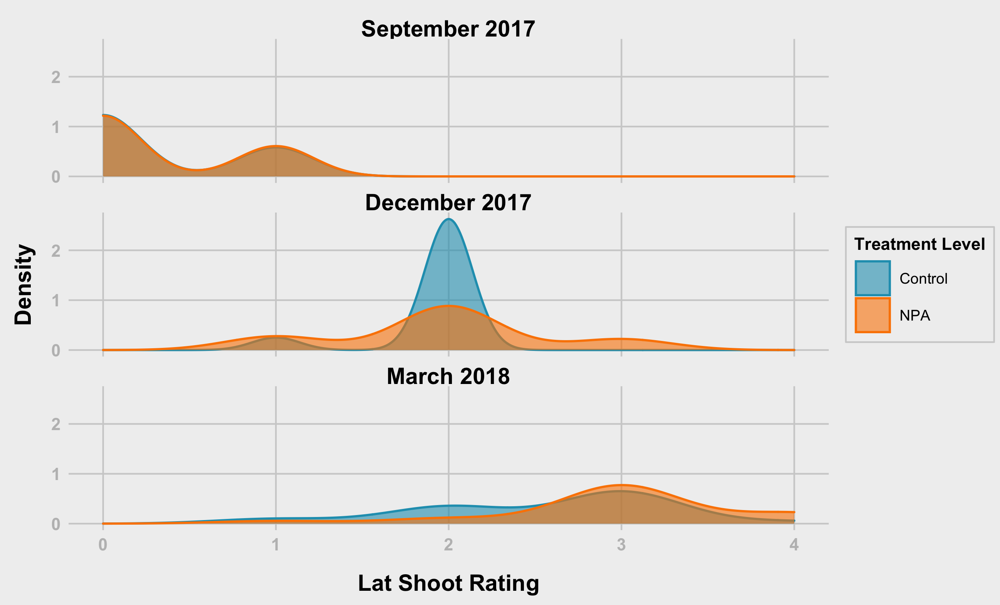
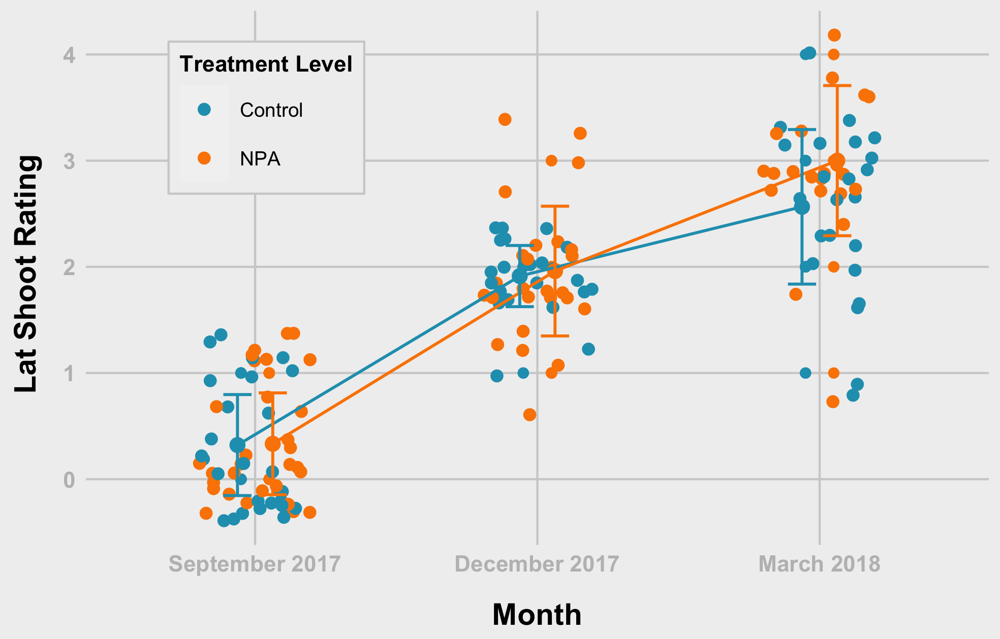

R Notebook
================
Bishwa
2022-03-22

-   [Section 01 - Get Data and Prepare the
    data](#section-01---get-data-and-prepare-the-data)
    -   [1.1 Upload Packages](#11-upload-packages)
    -   [1.2 Check Data Structures](#12-check-data-structures)
    -   [Prepare the data](#prepare-the-data)
    -   [Section 02 - Overall Summary
        statistics](#section-02---overall-summary-statistics)
-   [Section 03 - Plots and Anlysis](#section-03---plots-and-anlysis)
-   [Lat Shoot Rating - Treatmnent Level
    (tl)](#lat-shoot-rating---treatmnent-level-tl)
-   [Lat Shoot Rating - Treatment Level (tl) -
    Points](#lat-shoot-rating---treatment-level-tl---points)
-   [](#section)
-   [since interaction is not
    significant](#since-interaction-is-not-significant)
-   [model 1 (ls1) estimates](#model-1-ls1-estimates)

# Section 01 - Get Data and Prepare the data

I downloaded data and placed on my computer. You should change the path
for the data following packges are necessary for your work 1.
`tidyverse` 2. `car` 3. `nlme` 4. `lme4` 5. `rstatix`

When I am using function from specific packages I am using namespace
atleast at the first time of its usage

``` r
library(tidyr)
library(dplyr)
```

    ## 
    ## Attaching package: 'dplyr'

    ## The following objects are masked from 'package:stats':
    ## 
    ##     filter, lag

    ## The following objects are masked from 'package:base':
    ## 
    ##     intersect, setdiff, setequal, union

``` r
library(ggplot2)
library(rstatix)
```

    ## 
    ## Attaching package: 'rstatix'

    ## The following object is masked from 'package:stats':
    ## 
    ##     filter

## 1.1 Upload Packages

``` r
#set working directory
path<- "../data/"

sep2017<- readxl::read_excel(path = paste0(path, "/09_18_2017_Data.xlsx"), sheet = "Sheet1", na = "NA")
dec2017<- readxl::read_excel(path = paste0(path, "/12_18_2017_Data.xlsx"), sheet = "Sheet1", na = "NA")
mar2018<- readxl::read_excel(path = paste0(path, "/03_28_2018_Data.xlsx"), sheet = "Sheet1", na = "NA")
```

## 1.2 Check Data Structures

### September 2017

``` r
str(sep2017)
```

    ## tibble [59 × 15] (S3: tbl_df/tbl/data.frame)
    ##  $ Date            : chr [1:59] "09_18_2017" "09_18_2017" "09_18_2017" "09_18_2017" ...
    ##  $ Plant_ID        : chr [1:59] "M-14-08-A" "M-14-08-B" "M-14-08-C" "M-14-08-D" ...
    ##  $ Family          : num [1:59] 8 8 8 8 8 8 8 8 8 8 ...
    ##  $ Diameter(inches): num [1:59] 2.2 2.5 2.6 1.7 1.5 3 2.7 3.5 1.7 2.7 ...
    ##  $ Lat_Shoot_R     : num [1:59] 0 0 0 0 1 0 1 0 0 0 ...
    ##  $ Inflorescence   : num [1:59] 0 0 0 0 1 0 0 0 0 0 ...
    ##  $ Leaf_Shape      : num [1:59] 3 3 3 3 3 3 3 3 3 3 ...
    ##  $ Trichomes_int   : num [1:59] 2 2 2 3 2 1 2 2 2 2 ...
    ##  $ TreatmentLevel  : chr [1:59] "Auxin" "Auxin" "Control" "Control" ...
    ##  $ Treatment       : chr [1:59] "Aux_Drop" "Aux_Spray" "DMSO" "Water" ...
    ##  $ Population      : chr [1:59] "My" "My" "My" "My" ...
    ##  $ Bolting         : num [1:59] 0 0 0 0 1 0 0 0 0 0 ...
    ##  $ Flowering       : num [1:59] 0 0 0 0 1 0 0 0 0 0 ...
    ##  $ Remarks_01      : chr [1:59] NA NA NA NA ...
    ##  $ Remarks_02      : chr [1:59] NA NA NA NA ...

### December 2017

``` r
str(dec2017)
```

    ## tibble [59 × 15] (S3: tbl_df/tbl/data.frame)
    ##  $ Date            : chr [1:59] "12_18_2017" "12_18_2017" "12_18_2017" "12_18_2017" ...
    ##  $ Plant_ID        : chr [1:59] "M-14-08-A" "M-14-08-B" "M-14-08-C" "M-14-08-D" ...
    ##  $ Family          : num [1:59] 8 8 8 8 8 8 8 8 8 8 ...
    ##  $ Diameter(inches): num [1:59] NA 3.7 NA 4.2 2.6 3.7 4 5.2 5.4 3.4 ...
    ##  $ Lat_Shoot_R     : chr [1:59] NA "2" NA "2" ...
    ##  $ Inflorescence   : num [1:59] NA 1 NA 4 7 0 0 1 0 1 ...
    ##  $ Leaf_Shape      : chr [1:59] NA "2" NA "3" ...
    ##  $ Trichomes_int   : chr [1:59] NA "1" NA "1" ...
    ##  $ TreatmentLevel  : chr [1:59] "Auxin" "Auxin" "Control" "Control" ...
    ##  $ Treatment       : chr [1:59] "Aux_Drop" "Aux_Spray" "DMSO" "Water" ...
    ##  $ Population      : chr [1:59] "My" "My" "My" "My" ...
    ##  $ Bolting         : num [1:59] NA 1 NA 1 1 0 0 1 0 1 ...
    ##  $ Flowering       : num [1:59] NA 1 NA 1 1 0 0 1 0 1 ...
    ##  $ Remarks_01      : chr [1:59] "Missing - I think we extracted RNA out of it ??" "LCU" NA "Foliage out of frame" ...
    ##  $ Remarks_02      : chr [1:59] NA NA NA NA ...

### October 2018

``` r
str(mar2018)
```

    ## tibble [59 × 15] (S3: tbl_df/tbl/data.frame)
    ##  $ Date            : chr [1:59] "03_28_2018" "03_28_2018" "03_28_2018" "03_28_2018" ...
    ##  $ Plant_ID        : chr [1:59] "M-14-08-A" "M-14-08-B" "M-14-08-C" "M-14-08-D" ...
    ##  $ Family          : num [1:59] 8 8 8 8 8 8 8 8 8 8 ...
    ##  $ Diameter(inches): num [1:59] NA 4.2 NA 3.6 3.4 4.6 5.2 4.7 5.2 5.2 ...
    ##  $ Lat_Shoot_R     : num [1:59] NA 3 NA 3 3 3 4 3 4 4 ...
    ##  $ Inflorescence   : num [1:59] NA 3 NA 5 6 0 0 0 3 0 ...
    ##  $ Leaf_Shape      : num [1:59] NA 2 NA 3 3 2 3 3 3 3 ...
    ##  $ Trichomes_int   : num [1:59] NA 2 NA 1 2 1 1 1 1 1 ...
    ##  $ TreatmentLevel  : chr [1:59] "Auxin" "Auxin" "Control" "Control" ...
    ##  $ Treatment       : chr [1:59] "Aux_Drop" "Aux_Spray" "DMSO" "Water" ...
    ##  $ Population      : chr [1:59] "My" "My" "My" "My" ...
    ##  $ Bolting         : num [1:59] NA 1 NA 1 1 0 0 0 1 0 ...
    ##  $ Flowering       : num [1:59] NA 1 NA 1 1 0 0 0 1 0 ...
    ##  $ Remarks_01      : chr [1:59] NA NA NA NA ...
    ##  $ Remarks_02      : logi [1:59] NA NA NA NA NA NA ...

## Prepare the data

### ID’s & Column for Month

``` r
# ID's
sep2017$id<- row.names(sep2017)
dec2017$id<- row.names(dec2017)
mar2018$id<- row.names(mar2018)

# Month column
sep2017$Month <- "Sep"
dec2017$Month <- "Dec"
mar2018$Month <- "Mar"
```

### Combine the sets & and change column names

``` r
fdata<- rbind(sep2017,dec2017,mar2018)

# changing the name when necessary
names(fdata)<- c("date", "plantID", "family", "diaIn", "latShootRating", 
                 "inflorescence", "leafShape", "trichomesInt", "treatmentLevel", 
                 "treatment", "population", "bolting", "flowering", "remarks_01", 
                 "remarks_02", "id", "month")
```

### Convert inches to mm

``` r
fdata$diaIn <- fdata$diaIn * 25.4

fdata <- fdata %>%
  mutate(treatmentLevel = replace(treatmentLevel, treatmentLevel == "Auxin", "NPA"))
```

### Get rid of unnecessary columns and check the amount of missing values in each column

``` r
library(tidyverse)
```

    ## ── Attaching packages ─────────────────────────────────────── tidyverse 1.3.1 ──

    ## ✓ tibble  3.1.6     ✓ stringr 1.4.0
    ## ✓ readr   2.1.2     ✓ forcats 0.5.1
    ## ✓ purrr   0.3.4

    ## ── Conflicts ────────────────────────────────────────── tidyverse_conflicts() ──
    ## x rstatix::filter() masks dplyr::filter(), stats::filter()
    ## x dplyr::lag()      masks stats::lag()

``` r
mvdata<- fdata %>% select( - c(remarks_01, remarks_02))

mvdata %>% summarise_all(funs(sum(is.na(.))))
```

    ## Warning: `funs()` was deprecated in dplyr 0.8.0.
    ## Please use a list of either functions or lambdas: 
    ## 
    ##   # Simple named list: 
    ##   list(mean = mean, median = median)
    ## 
    ##   # Auto named with `tibble::lst()`: 
    ##   tibble::lst(mean, median)
    ## 
    ##   # Using lambdas
    ##   list(~ mean(., trim = .2), ~ median(., na.rm = TRUE))
    ## This warning is displayed once every 8 hours.
    ## Call `lifecycle::last_lifecycle_warnings()` to see where this warning was generated.

    ## # A tibble: 1 × 15
    ##    date plantID family diaIn latShootRating inflorescence leafShape trichomesInt
    ##   <int>   <int>  <int> <int>          <int>         <int>     <int>        <int>
    ## 1     0       0      0    25             25            25        25           25
    ## # … with 7 more variables: treatmentLevel <int>, treatment <int>,
    ## #   population <int>, bolting <int>, flowering <int>, id <int>, month <int>

### Delete rows with missing values

``` r
fndata <- mvdata %>% drop_na()

#fndata <- fdata %>%  mutate(across(where(is.character), ~na_if(., "NA")))
```

### Specify correct data types

``` r
# Not numeric variables
char_var<- c("date","plantID","treatmentLevel","treatment","population", "month", "family")

# Numeric variables
num_var<- names(fndata[, !(names(fndata) %in% char_var)])

#convert characters to numeric vector
fndata[, num_var]<- sapply(fndata[, num_var], as.numeric)
```

    ## Warning in lapply(X = X, FUN = FUN, ...): NAs introduced by coercion

    ## Warning in lapply(X = X, FUN = FUN, ...): NAs introduced by coercion

    ## Warning in lapply(X = X, FUN = FUN, ...): NAs introduced by coercion

``` r
#convert characters to factors
fndata$dateFac   <- factor(fndata$date,       labels =  c("September 2017", "December 2017", "March 2018" ),
                           levels =  c("09_18_2017", "12_18_2017", "03_28_2018" ))

fndata$treatment <- factor(fndata$treatment,  labels =  c("NPA Drop", "NPA Spray", "DMSO", "Water"))

fndata$treatmentLevel <- as.factor(fndata$treatmentLevel)

fndata$plantID<- as.factor(fndata$plantID)

# Check 
sapply(fndata, class)
```

    ##           date        plantID         family          diaIn latShootRating 
    ##    "character"       "factor"      "numeric"      "numeric"      "numeric" 
    ##  inflorescence      leafShape   trichomesInt treatmentLevel      treatment 
    ##      "numeric"      "numeric"      "numeric"       "factor"       "factor" 
    ##     population        bolting      flowering             id          month 
    ##    "character"      "numeric"      "numeric"      "numeric"    "character" 
    ##        dateFac 
    ##       "factor"

## Section 02 - Overall Summary statistics

### Choose variables of interest

``` r
# extract variables that are important
sel_var<- c("date", "plantID", "treatment", "treatmentLevel","diaIn",
            "latShootRatio", "inflorescence", "leafShape"  )

#---------- mean
# mean_diaInflo<- fndata %>% select(sel_var) %>% 
#   group_by(treatment) %>% 
#   summarise_at(.vars = vars(diaIn, inflorescence),.funs = c(mean = "mean"))
# 
# sd_diaInflo<- fndata %>% select(sel_var) %>% 
#   group_by(treatment) %>% 
#   summarise_at(.vars = vars(diaIn, inflorescence),.funs = c(sd = "mean"))
# 
# sumdat<- cbind(mean_diaInflo, sd_diaInflo[, 2:3])

# Stats for Diameter
mean_diaInflo<- fndata %>% 
  group_by(treatment) %>% 
  summarise(mean = mean(diaIn, na.rm = TRUE),
            sd   = sd(diaIn, na.rm = TRUE)
  )

# Stats for inflorescence
mean_inflo<- fndata %>% 
  group_by(treatment) %>% 
  summarise(
    mean = mean(inflorescence, na.rm = TRUE),
    sd   = sd(inflorescence, na.rm = TRUE)
  )

# Stats for Lat_Shoot
mean_latShoot<- fndata %>% 
  group_by(treatment) %>% 
  summarise(mean = mean(latShootRating, na.rm = TRUE),
            sd   = sd(latShootRating, na.rm = TRUE)
  )

#------- apply variable name and combine
mean_diaInflo$var <- "Diameter"
mean_inflo$var    <- "Inflorescence"
mean_latShoot$var <- "LatShoot"


sumdata<- rbind(mean_diaInflo,mean_inflo, mean_latShoot)
sumdata
```

    ## # A tibble: 12 × 4
    ##    treatment   mean     sd var          
    ##    <fct>      <dbl>  <dbl> <chr>        
    ##  1 NPA Drop  82.0   35.1   Diameter     
    ##  2 NPA Spray 70.5   31.4   Diameter     
    ##  3 DMSO      90.0   35.1   Diameter     
    ##  4 Water     88.7   32.4   Diameter     
    ##  5 NPA Drop   1.33   2.02  Inflorescence
    ##  6 NPA Spray  0.583  0.996 Inflorescence
    ##  7 DMSO       0.973  1.86  Inflorescence
    ##  8 Water      1.46   2.09  Inflorescence
    ##  9 NPA Drop   1.68   1.23  LatShoot     
    ## 10 NPA Spray  1.51   1.29  LatShoot     
    ## 11 DMSO       1.49   1.12  LatShoot     
    ## 12 Water      1.54   1.10  LatShoot

# Section 03 - Plots and Anlysis

### Theme Function

``` r
theme_538 <- function(base_size = 8, base_family = "Arial") {
  theme_grey(base_size = base_size, base_family = base_family) %+replace%
    theme(
      # drop minor gridlines and axis-ticks
      panel.grid.minor = element_blank(),
      axis.ticks = element_blank(),
      # change font elements/family
      text = element_text(family = "Arial", size = base_size),
      axis.text = element_text(face = "bold", color = "grey", size = base_size),
      axis.title = element_text(face = "bold", size = rel(1.33)),
      axis.title.x = element_text(margin = margin(0.3, 0, 0, 0, unit = "cm")),
      axis.title.y = element_text(margin = margin(0, 0.3, 0, 0, unit = "cm"), angle =90),
      plot.title = element_text(face = "bold", size = rel(1.67), hjust = 0),
      plot.title.position = "plot",
      plot.subtitle = element_text(size = 12, margin = margin(0.2, 0, 1, 0, unit = "cm"), hjust = 0),
      plot.caption = element_text(size = 8, margin = margin(1, 0, 0, 0, unit = "cm"), hjust = 1),
      # change plot colors for the background/panel elements
      plot.background = element_rect(fill = "#f0f0f0", color = NA),
      panel.background = element_rect(fill = "#f0f0f0", color = NA),
      panel.grid.major =  element_line(color = "#d0d0d0"),
      panel.border = element_blank(),
      # shrinks margin and simplify the strip/facet elements
      strip.background = element_blank(),
      strip.text = element_text(size = rel(1.33), face = "bold")
    )
}
```

# Lat Shoot Rating - Treatmnent Level (tl)

### Lat Shoot Rating - Treatment Level (tl) - Density Function

``` r
grDevices::png(filename = "plots/hist_lsr_tl.png",  width = 16.5, height = 10, units = 'cm', res = 400)

hist_lsr <- fndata %>%
  ggplot(aes(latShootRating, fill = treatmentLevel, colour = treatmentLevel)) +
  geom_density(alpha = 0.6) +
  scale_fill_manual("Treatment Level", values = c("#219ebc", "#fb8500")) +
  scale_colour_manual("Treatment Level", values = c("#219ebc", "#fb8500")) + 
  facet_wrap(~dateFac, nrow = 3) + 
  labs(x = "Lat Shoot Rating", y = "Density") +
  #coord_flip() + 
  theme_538() +
  theme(
    #legend.position = "top",
    legend.background = element_rect(fill = "#f0f0f0", color = "#d0d0d0"),
    legend.title = element_text(family = "Arial", size = 8, face = "bold"),
    legend.title.align = 0.5,
    legend.text = element_text(size=7),
    plot.margin = margin(0.3, 0.1, 0.2, 0.2, unit = "cm"),
    )
  

hist_lsr
```

    ## Warning: Removed 2 rows containing non-finite values (stat_density).

``` r
dev.off()
```

    ## quartz_off_screen 
    ##                 2

``` r

```

<!-- -->

### Lat Shoot Rating - Treatment Level (tl) - Density Function version 2

``` r
grDevices::png(filename = "plots/hist_lsr2.png",  width = 6, height = 4, units = 'in', res = 400)

hist_lsr2 <- fndata %>%
  ggplot(aes(latShootRating, fill = treatmentLevel, colour = treatmentLevel)) +
  geom_density(alpha = 0.6) +
  scale_fill_manual("Treatment Level", values = c("#219ebc","#fb8500" )) +
  scale_colour_manual("Treatment Level", values = c("#219ebc","#fb8500")) + 
  facet_grid(treatmentLevel ~ dateFac) + 
  labs(x = "Lat Shoot Rating", y = "Density") +
  #coord_flip() + 
  theme_538() +
  theme(
    legend.position = "top",
    legend.background = element_rect(fill = "#f0f0f0", color = "#d0d0d0"),
    legend.title = element_text(family = "Arial", size = 8, face = "bold"),
    legend.title.align = 0.5,
    legend.text = element_text(size=7),
    plot.margin = margin(0.3, 0.3, 0.2, 0.2, unit = "cm"),
    )
  

hist_lsr2
```

    ## Warning: Removed 2 rows containing non-finite values (stat_density).

``` r
dev.off()
```

    ## quartz_off_screen 
    ##                 2

``` r
knitr::include_graphics("plots/hist_lsr2.png")
```

<!-- -->

### Lat Shoot Rating - Treatment Level (tl) - Boxplot

``` r
grDevices::png(filename = "plots/violin_lsr.png",  width = 12.5, height = 8, units = 'cm', res = 400)

violin_lsr <- fndata %>%
  group_by(treatmentLevel, dateFac) %>% mutate(N=n()) %>%
  mutate(N=ifelse(latShootRating==max(latShootRating,na.rm=T),paste0('n=',N),NA)) %>%
  ggplot(aes(x = treatmentLevel, y = latShootRating, fill = treatmentLevel, colour = treatmentLevel, label = N)) +
  #geom_violin(alpha = 0.6) +
  geom_boxplot(#width = 0.1, 
               alpha = 0.6) +
  geom_text(vjust = -0.1, hjust = 0.5, show.legend = FALSE) +
  scale_fill_manual("Treatment Level", values = c("#219ebc","#fb8500" )) +
  scale_colour_manual("Treatment Level", values = c("#219ebc","#fb8500" )) +
  facet_wrap(~dateFac, nrow = 1, ncol = 3) + 
  labs(x = "Treatment Level", y = "Lat Shoot Rating") +
  xlab("") +
  #coord_flip() +
  theme_538() +
  theme(
    legend.position = "top",
    legend.background = element_rect(fill = "#f0f0f0", color = "#d0d0d0"),
    legend.title = element_text(family = "Arial", size = 8, face = "bold"),
    legend.title.align = 0.5,
    legend.text = element_text(size=7)
    )
  

violin_lsr
```

    ## Warning: Removed 2 rows containing non-finite values (stat_boxplot).

    ## Warning: Removed 103 rows containing missing values (geom_text).

``` r
dev.off()
```

    ## quartz_off_screen 
    ##                 2

``` r
knitr::include_graphics("plots/violin_lsr.png")
```

<!-- -->

# Lat Shoot Rating - Treatment Level (tl) - Points

``` r
grDevices::png(filename = "plots/dots_lsr_tl.png",  width = 12.5, height = 8, units = 'cm', res = 400)

dots_lsr_tl <- fndata %>% ggplot(aes(x = dateFac, y = latShootRating, group = treatmentLevel, color = treatmentLevel))+
  #geom_point()
  geom_point(size = 2,shape = 20, 
             position = position_dodge(0.2)) +
             #position = "jitter") +
             
  geom_jitter(width = 0.2) +
  #geom_line(position = position_dodge(0.25 ))+
  stat_summary(fun =  mean, size = 2, geom = "point", 
               position = position_dodge(0.25), show.legend = FALSE)+
  
  stat_summary(fun = mean, size = 0.5, geom = "line",
               position = position_dodge(0.25), show.legend = FALSE)+
    
  stat_summary(fun.data = mean_sdl, fun.args = list(mult=1), 
               geom = "errorbar", width=0.2,
               position = position_dodge(0.25), show.legend = FALSE) +
  
  theme_bw(base_size = 14,base_family = "Serif")+
  xlab("Month")+
  ylab(" Lat Shoot Rating")+
  # labs(fill = "Treatment")
  # guides(fill=guide_legend(title = "Treatment"))
  scale_color_manual("Treatment Level",values = c("#219ebc","#fb8500"))+
  theme_538() + 
  theme(
    legend.position = c(0.2, 0.8),
    legend.background = element_rect(fill = "#f0f0f0", color = "#d0d0d0"),
    legend.title = element_text(family = "Arial", size = 8, face = "bold"),
    legend.title.align = 0.5,
    legend.text = element_text(size=7)
  )
  
dots_lsr_tl
```

    ## Warning: Removed 2 rows containing non-finite values (stat_summary).
    ## Removed 2 rows containing non-finite values (stat_summary).
    ## Removed 2 rows containing non-finite values (stat_summary).

    ## Warning: Removed 2 rows containing missing values (geom_point).
    ## Removed 2 rows containing missing values (geom_point).

``` r
dev.off()
```

    ## quartz_off_screen 
    ##                 2

``` r

```

<!-- -->

# 

``` r
table(fndata$treatmentLevel, fndata$latShootRating, fndata$dateFac)
```

    ## , ,  = September 2017
    ## 
    ##          
    ##            0  1  2  3  4
    ##   Control 19  9  0  0  0
    ##   NPA     20 10  0  0  0
    ## 
    ## , ,  = December 2017
    ## 
    ##          
    ##            0  1  2  3  4
    ##   Control  0  2 21  0  0
    ##   NPA      0  5 16  4  0
    ## 
    ## , ,  = March 2018
    ## 
    ##          
    ##            0  1  2  3  4
    ##   Control  0  2  7 13  1
    ##   NPA      0  1  2 14  4

### Lat Shoot Rating - Treatment Level (tl) - Checking for Normality

Shapiro-Test for each group p-values is less than 0.05, hence, we reject
hypothesis about normal distribution.

``` r
fndata %>% group_by(treatmentLevel) %>% 
  shapiro_test(latShootRating)
```

    ## # A tibble: 2 × 4
    ##   treatmentLevel variable       statistic          p
    ##   <fct>          <chr>              <dbl>      <dbl>
    ## 1 Control        latShootRating     0.873 0.00000220
    ## 2 NPA            latShootRating     0.887 0.00000571

### Lat Shoot Rating - Treatment Level (tl) - Checking for Normality by Month

If we divide by both month and treatment, distribution can be assumed to
be normal

``` r
fndata %>% group_by(treatmentLevel, dateFac) %>%
  shapiro_test(latShootRating) %>%
  left_join(fndata %>% 
              group_by(treatmentLevel, dateFac) %>%
              summarise(n = n()),
            by = c("treatmentLevel", "dateFac"))
```

    ## `summarise()` has grouped output by 'treatmentLevel'. You can override using
    ## the `.groups` argument.

    ## # A tibble: 6 × 6
    ##   treatmentLevel dateFac        variable       statistic             p     n
    ##   <fct>          <fct>          <chr>              <dbl>         <dbl> <int>
    ## 1 Control        September 2017 latShootRating     0.591 0.000000112      28
    ## 2 Control        December 2017  latShootRating     0.324 0.00000000257    23
    ## 3 Control        March 2018     latShootRating     0.808 0.000521         23
    ## 4 NPA            September 2017 latShootRating     0.597 0.0000000664     30
    ## 5 NPA            December 2017  latShootRating     0.770 0.0000753        27
    ## 6 NPA            March 2018     latShootRating     0.762 0.000182         21

### Lat Shoot Rating - Treatment Level (tl) - Pairwise T-test

``` r
ph_lsr_tl <- fndata %>% 
  pairwise_t_test(
    latShootRating~treatmentLevel, paired = FALSE, # due to sample difference
    p.adjust.method = "holm"       # with treatment not so much of difference
  )

# print
print(ph_lsr_tl)
```

    ## # A tibble: 1 × 9
    ##   .y.            group1  group2    n1    n2     p p.signif p.adj p.adj.signif
    ## * <chr>          <chr>   <chr>  <int> <int> <dbl> <chr>    <dbl> <chr>       
    ## 1 latShootRating Control NPA       74    78 0.635 ns       0.635 ns

### Lat Shoot Rating - Treatment Level (tl) - Pairwise T-test - For September 2017

``` r
ph_lsr_tl_sep <- fndata %>% 
  filter(dateFac == "September 2017") %>%
  pairwise_t_test(
    latShootRating~treatmentLevel, paired = FALSE, # due to sample difference
    p.adjust.method = "holm"       # with treatment not so much of difference
  )

# print
print(ph_lsr_tl_sep)
```

    ## # A tibble: 1 × 9
    ##   .y.            group1  group2    n1    n2     p p.signif p.adj p.adj.signif
    ## * <chr>          <chr>   <chr>  <int> <int> <dbl> <chr>    <dbl> <chr>       
    ## 1 latShootRating Control NPA       28    30 0.925 ns       0.925 ns

### Lat Shoot Rating - Treatment Level (tl) - Pairwise T-test - For December 2017

``` r
ph_lsr_tl_dec <- fndata %>% 
  filter(dateFac == "December 2017") %>%
  pairwise_t_test(
    latShootRating~treatmentLevel, paired = FALSE, # due to sample difference
    p.adjust.method = "holm"       # with treatment not so much of difference
  )

# print
print(ph_lsr_tl_dec)
```

    ## # A tibble: 1 × 9
    ##   .y.            group1  group2    n1    n2     p p.signif p.adj p.adj.signif
    ## * <chr>          <chr>   <chr>  <int> <int> <dbl> <chr>    <dbl> <chr>       
    ## 1 latShootRating Control NPA       23    27 0.739 ns       0.739 ns

### Lat Shoot Rating - Treatment Level (tl) - Pairwise T-test - For March 2018

``` r
ph_lsr_tl_mar <- fndata %>% 
  filter(dateFac == "March 2018") %>%
  pairwise_t_test(
    latShootRating~treatmentLevel, paired = FALSE, # due to sample difference
    p.adjust.method = "holm"       # with treatment not so much of difference
  )

# print
print(ph_lsr_tl_mar)
```

    ## # A tibble: 1 × 9
    ##   .y.            group1  group2    n1    n2      p p.signif  p.adj p.adj.signif
    ## * <chr>          <chr>   <chr>  <int> <int>  <dbl> <chr>     <dbl> <chr>       
    ## 1 latShootRating Control NPA       23    21 0.0513 ns       0.0513 ns

### Lat Shoot Rating - Treatment Level (tl) - repeated Anova

``` r
aov_lsr_tl <- aov(latShootRating~treatmentLevel*dateFac + Error(id), data = fndata)
summary(aov_lsr_tl)
```

    ## 
    ## Error: id
    ##                Df Sum Sq Mean Sq
    ## treatmentLevel  1  2.039   2.039
    ## 
    ## Error: Within
    ##                         Df Sum Sq Mean Sq F value Pr(>F)    
    ## treatmentLevel           1   0.29    0.29   0.934  0.336    
    ## dateFac                  2 159.53   79.76 260.188 <2e-16 ***
    ## treatmentLevel:dateFac   2   1.27    0.63   2.071  0.130    
    ## Residuals              143  43.84    0.31                   
    ## ---
    ## Signif. codes:  0 '***' 0.001 '**' 0.01 '*' 0.05 '.' 0.1 ' ' 1

### Lat Shoot Rating - Treatment Level (tl) - Mixed effects for repeated data 1

``` r
lme1_lsr_tl<- nlme::lme(latShootRating~1, random = ~1|treatmentLevel, method = "REML", na.action = na.omit,
          data = fndata)

summary(lme1_lsr_tl)
```

    ## Linear mixed-effects model fit by REML
    ##   Data: fndata 
    ##        AIC      BIC    logLik
    ##   482.8126 491.8245 -238.4063
    ## 
    ## Random effects:
    ##  Formula: ~1 | treatmentLevel
    ##          (Intercept) Residual
    ## StdDev: 4.159296e-05 1.178556
    ## 
    ## Fixed effects:  latShootRating ~ 1 
    ##             Value  Std.Error  DF  t-value p-value
    ## (Intercept)  1.56 0.09622867 148 16.21139       0
    ## 
    ## Standardized Within-Group Residuals:
    ##        Min         Q1        Med         Q3        Max 
    ## -1.3236542 -1.3236541  0.3733383  0.3733384  2.0703308 
    ## 
    ## Number of Observations: 150
    ## Number of Groups: 2

### Lat Shoot Rating - Treatment Level (tl) - Mixed effects for repeated data 2

``` r
lme2_lsr_tl<- nlme::lme(latShootRating~treatmentLevel, random = ~1|dateFac,
                method = "REML", na.action = na.omit,
                data = fndata)
summary(lme2_lsr_tl)
```

    ## Linear mixed-effects model fit by REML
    ##   Data: fndata 
    ##        AIC      BIC    logLik
    ##   278.2916 290.2804 -135.1458
    ## 
    ## Random effects:
    ##  Formula: ~1 | dateFac
    ##         (Intercept)  Residual
    ## StdDev:    1.243003 0.5643842
    ## 
    ## Fixed effects:  latShootRating ~ treatmentLevel 
    ##                       Value Std.Error  DF  t-value p-value
    ## (Intercept)       1.6046080 0.7206536 146 2.226601  0.0275
    ## treatmentLevelNPA 0.1468735 0.0922381 146 1.592330  0.1135
    ##  Correlation: 
    ##                   (Intr)
    ## treatmentLevelNPA -0.065
    ## 
    ## Standardized Within-Group Residuals:
    ##        Min         Q1        Med         Q3        Max 
    ## -3.2679537 -0.7145537  0.2482230  0.5359686  2.3078113 
    ## 
    ## Number of Observations: 150
    ## Number of Groups: 3

### Lat Shoot Rating - Treatment Level (tl) - Mixed effects for repeated data 3

``` r
lme3_lsr_tl<- nlme::lme(latShootRating~treatmentLevel*dateFac, random = ~1|id,
                method = "REML", na.action = na.omit,
                data = fndata)

summary(lme3_lsr_tl)
```

    ## Linear mixed-effects model fit by REML
    ##   Data: fndata 
    ##        AIC      BIC    logLik
    ##   276.6366 300.3951 -130.3183
    ## 
    ## Random effects:
    ##  Formula: ~1 | id
    ##         (Intercept)  Residual
    ## StdDev:   0.1406257 0.5424349
    ## 
    ## Fixed effects:  latShootRating ~ treatmentLevel * dateFac 
    ##                                            Value Std.Error DF   t-value p-value
    ## (Intercept)                            0.3214286 0.1058994 87  3.035225  0.0032
    ## treatmentLevelNPA                      0.0080294 0.1472387 57  0.054533  0.9567
    ## dateFacDecember 2017                   1.5883970 0.1531116 87 10.374115  0.0000
    ## dateFacMarch 2018                      2.2396727 0.1531116 87 14.627717  0.0000
    ## treatmentLevelNPA:dateFacDecember 2017 0.0447227 0.2125862 87  0.210374  0.8339
    ## treatmentLevelNPA:dateFacMarch 2018    0.4306424 0.2181217 87  1.974322  0.0515
    ##  Correlation: 
    ##                                        (Intr) trLNPA dFD201 dFM201 tLNPA:FD2
    ## treatmentLevelNPA                      -0.719                               
    ## dateFacDecember 2017                   -0.648  0.466                        
    ## dateFacMarch 2018                      -0.648  0.466  0.453                 
    ## treatmentLevelNPA:dateFacDecember 2017  0.467 -0.650 -0.720 -0.326          
    ## treatmentLevelNPA:dateFacMarch 2018     0.455 -0.633 -0.318 -0.702  0.444   
    ## 
    ## Standardized Within-Group Residuals:
    ##         Min          Q1         Med          Q3         Max 
    ## -3.45034339 -0.57727919  0.01323663  0.68460257  2.42502819 
    ## 
    ## Number of Observations: 150
    ## Number of Groups: 59

### Lat Shoot Rating - Treatment Level (tl) - Mixed effects for repeated data 4

``` r
lme4_lsr_tl <- nlme::lme(latShootRating~treatmentLevel, random = ~1|id,
                method = "REML", na.action = na.omit,
                data = fndata)

lme4_lsr_tl
```

    ## Linear mixed-effects model fit by REML
    ##   Data: fndata 
    ##   Log-restricted-likelihood: -239.0205
    ##   Fixed: latShootRating ~ treatmentLevel 
    ##       (Intercept) treatmentLevelNPA 
    ##        1.51351351        0.09174964 
    ## 
    ## Random effects:
    ##  Formula: ~1 | id
    ##         (Intercept) Residual
    ## StdDev: 3.59383e-05 1.181628
    ## 
    ## Number of Observations: 150
    ## Number of Groups: 59

### Lat Shoot Rating - Treatment Level (tl) - Mixed effects for repeated data 5

``` r
dglme_lsr_tl<- lme4::lmer(latShootRating~treatmentLevel*dateFac +(1|id), data = fndata)


anova(dglme_lsr_tl, type = 3)
```

    ## Warning in anova.merMod(dglme_lsr_tl, type = 3): additional arguments ignored:
    ## 'type'

    ## Analysis of Variance Table
    ##                        npar  Sum Sq Mean Sq  F value
    ## treatmentLevel            1   0.246   0.246   0.8348
    ## dateFac                   2 158.447  79.224 269.2520
    ## treatmentLevel:dateFac    2   1.310   0.655   2.2260

``` r
summary(dglme_lsr_tl)
```

    ## Linear mixed model fit by REML ['lmerMod']
    ## Formula: latShootRating ~ treatmentLevel * dateFac + (1 | id)
    ##    Data: fndata
    ## 
    ## REML criterion at convergence: 260.6
    ## 
    ## Scaled residuals: 
    ##     Min      1Q  Median      3Q     Max 
    ## -3.4503 -0.5773  0.0132  0.6846  2.4250 
    ## 
    ## Random effects:
    ##  Groups   Name        Variance Std.Dev.
    ##  id       (Intercept) 0.01978  0.1406  
    ##  Residual             0.29424  0.5424  
    ## Number of obs: 150, groups:  id, 59
    ## 
    ## Fixed effects:
    ##                                        Estimate Std. Error t value
    ## (Intercept)                            0.321429   0.105899   3.035
    ## treatmentLevelNPA                      0.008029   0.147239   0.055
    ## dateFacDecember 2017                   1.588397   0.153112  10.374
    ## dateFacMarch 2018                      2.239673   0.153112  14.628
    ## treatmentLevelNPA:dateFacDecember 2017 0.044723   0.212586   0.210
    ## treatmentLevelNPA:dateFacMarch 2018    0.430642   0.218122   1.974
    ## 
    ## Correlation of Fixed Effects:
    ##             (Intr) trLNPA dFD201 dFM201 tLNPA:FD2
    ## trtmntLvNPA -0.719                               
    ## dtFcDcm2017 -0.648  0.466                        
    ## dtFcMrc2018 -0.648  0.466  0.453                 
    ## tLNPA:FD201  0.467 -0.650 -0.720 -0.326          
    ## tLNPA:FM201  0.455 -0.633 -0.318 -0.702  0.444

``` r
table(fndata$dateFac, fndata$latShootRating, fndata$treatmentLevel)
```

    ## , ,  = Control
    ## 
    ##                 
    ##                   0  1  2  3  4
    ##   September 2017 19  9  0  0  0
    ##   December 2017   0  2 21  0  0
    ##   March 2018      0  2  7 13  1
    ## 
    ## , ,  = NPA
    ## 
    ##                 
    ##                   0  1  2  3  4
    ##   September 2017 20 10  0  0  0
    ##   December 2017   0  5 16  4  0
    ##   March 2018      0  1  2 14  4

``` r
# five counts are only five
```

``` r
library(lme4)
```

    ## Loading required package: Matrix

    ## 
    ## Attaching package: 'Matrix'

    ## The following objects are masked from 'package:tidyr':
    ## 
    ##     expand, pack, unpack

``` r
library(car)
```

    ## Loading required package: carData

    ## 
    ## Attaching package: 'car'

    ## The following object is masked from 'package:purrr':
    ## 
    ##     some

    ## The following object is masked from 'package:dplyr':
    ## 
    ##     recode

``` r
ls1<- lme4::glmer(latShootRating~treatment*dateFac +(1|id), family = "poisson", 
            data = fndata,
            control = glmerControl(check.conv.singular = .makeCC(
              action = "ignore",  tol = 1e-4)))


car::Anova(ls1, type = "III") # sequantial sums of square
```

    ## Analysis of Deviance Table (Type III Wald chisquare tests)
    ## 
    ## Response: latShootRating
    ##                     Chisq Df Pr(>Chisq)    
    ## (Intercept)        5.0374  1    0.02481 *  
    ## treatment          0.5172  3    0.91510    
    ## dateFac           20.8448  2  2.976e-05 ***
    ## treatment:dateFac  1.0625  6    0.98313    
    ## ---
    ## Signif. codes:  0 '***' 0.001 '**' 0.01 '*' 0.05 '.' 0.1 ' ' 1

``` r
# Interaction effects are not significant
```

``` r
ls2<- lme4::glmer(latShootRating~treatmentLevel +(1|id), 
                  family = "poisson", 
                  data   = fndata,
                  control = glmerControl(check.conv.singular = .makeCC(
                    action = "ignore",  tol = 1e-4)))
# difference between model 2 (ls2) and ls1
```

# since interaction is not significant

``` r
summary(ls2)
```

    ## Generalized linear mixed model fit by maximum likelihood (Laplace
    ##   Approximation) [glmerMod]
    ##  Family: poisson  ( log )
    ## Formula: latShootRating ~ treatmentLevel + (1 | id)
    ##    Data: fndata
    ## Control: glmerControl(check.conv.singular = .makeCC(action = "ignore",  
    ##     tol = 1e-04))
    ## 
    ##      AIC      BIC   logLik deviance df.resid 
    ##    472.3    481.4   -233.2    466.3      147 
    ## 
    ## Scaled residuals: 
    ##     Min      1Q  Median      3Q     Max 
    ## -1.2670 -1.2303  0.3115  0.3954  2.0211 
    ## 
    ## Random effects:
    ##  Groups Name        Variance Std.Dev.
    ##  id     (Intercept) 0        0       
    ## Number of obs: 150, groups:  id, 59
    ## 
    ## Fixed effects:
    ##                   Estimate Std. Error z value Pr(>|z|)    
    ## (Intercept)        0.41443    0.09449   4.386 1.15e-05 ***
    ## treatmentLevelNPA  0.05885    0.13086   0.450    0.653    
    ## ---
    ## Signif. codes:  0 '***' 0.001 '**' 0.01 '*' 0.05 '.' 0.1 ' ' 1
    ## 
    ## Correlation of Fixed Effects:
    ##             (Intr)
    ## trtmntLvNPA -0.722

``` r
anova(ls2, ls1) # model 1
```

    ## Data: fndata
    ## Models:
    ## ls2: latShootRating ~ treatmentLevel + (1 | id)
    ## ls1: latShootRating ~ treatment * dateFac + (1 | id)
    ##     npar    AIC    BIC  logLik deviance Chisq Df Pr(>Chisq)    
    ## ls2    3 472.32 481.36 -233.16   466.32                        
    ## ls1   13 369.52 408.66 -171.76   343.52 122.8 10  < 2.2e-16 ***
    ## ---
    ## Signif. codes:  0 '***' 0.001 '**' 0.01 '*' 0.05 '.' 0.1 ' ' 1

# model 1 (ls1) estimates

``` r
mm     <- model.matrix(ls1)
sumls1 <- summary(ls1)
bhat   <- cbind(sumls1$coef[,1])
elogod <- as.data.frame( mm %*% bhat)
```

``` r
nadat<-  na.omit(fndata[, c("treatmentLevel", "dateFac", "latShootRating", "diaIn")])
estmean<- cbind(elogod$V1, nadat)
  
estavg <-  estmean %>% 
  group_by(treatmentLevel, dateFac) %>%
  summarise(mean = mean(latShootRating),
            sd = sd(latShootRating))
```

    ## `summarise()` has grouped output by 'treatmentLevel'. You can override using
    ## the `.groups` argument.

``` r
estavg
```

    ## # A tibble: 6 × 4
    ## # Groups:   treatmentLevel [2]
    ##   treatmentLevel dateFac         mean    sd
    ##   <fct>          <fct>          <dbl> <dbl>
    ## 1 Control        September 2017 0.321 0.476
    ## 2 Control        December 2017  1.91  0.288
    ## 3 Control        March 2018     2.57  0.728
    ## 4 NPA            September 2017 0.333 0.479
    ## 5 NPA            December 2017  1.96  0.611
    ## 6 NPA            March 2018     3     0.707

``` r
ls0<- lme4::glmer(latShootRating~0+treatment +(1|id), 
                        family = "poisson", 
                        data   = fndata,
                        control = glmerControl(check.conv.singular = .makeCC(
                          action = "ignore",  tol = 1e-4)))
lcom<- rbind(c(-1, -1, 1,1)) # null beta == 0 NPA vs DMSO+Water 

linearHypothesis(ls0, lcom)
```

    ## Linear hypothesis test
    ## 
    ## Hypothesis:
    ## - treatmentNPA Drop - treatmentNPA Spray  + treatmentDMSO  + treatmentWater = 0
    ## 
    ## Model 1: restricted model
    ## Model 2: latShootRating ~ 0 + treatment + (1 | id)
    ## 
    ##   Df  Chisq Pr(>Chisq)
    ## 1                     
    ## 2  1 0.1655     0.6841

``` r
summary(ls0)
```

    ## Generalized linear mixed model fit by maximum likelihood (Laplace
    ##   Approximation) [glmerMod]
    ##  Family: poisson  ( log )
    ## Formula: latShootRating ~ 0 + treatment + (1 | id)
    ##    Data: fndata
    ## Control: glmerControl(check.conv.singular = .makeCC(action = "ignore",  
    ##     tol = 1e-04))
    ## 
    ##      AIC      BIC   logLik deviance df.resid 
    ##      476      491     -233      466      145 
    ## 
    ## Scaled residuals: 
    ##     Min      1Q  Median      3Q     Max 
    ## -1.2973 -1.2192  0.2444  0.4212  2.0616 
    ## 
    ## Random effects:
    ##  Groups Name        Variance Std.Dev.
    ##  id     (Intercept) 0        0       
    ## Number of obs: 150, groups:  id, 59
    ## 
    ## Fixed effects:
    ##                    Estimate Std. Error z value Pr(>|z|)    
    ## treatmentNPA Drop    0.5205     0.1204   4.324 1.53e-05 ***
    ## treatmentNPA Spray   0.4149     0.1374   3.021  0.00252 ** 
    ## treatmentDMSO        0.3964     0.1348   2.940  0.00328 ** 
    ## treatmentWater       0.4321     0.1325   3.263  0.00110 ** 
    ## ---
    ## Signif. codes:  0 '***' 0.001 '**' 0.01 '*' 0.05 '.' 0.1 ' ' 1
    ## 
    ## Correlation of Fixed Effects:
    ##             trNPAD trNPAS trDMSO
    ## trtmntNPASp 0.000               
    ## tretmntDMSO 0.000  0.000        
    ## treatmntWtr 0.000  0.000  0.000

``` r
ls0<- lme4::glmer(latShootRating~treatmentLevel*dateFac +(1|id), 
                        family = "poisson", 
                        data   = fndata,
                        control = glmerControl(check.conv.singular = .makeCC(
                          action = "ignore",  tol = 1e-4)))

sjPlot::tab_model(ls0, file = "lsr_tl.doc")
```

<table style="border-collapse:collapse; border:none;">
<tr>
<th style="border-top: double; text-align:center; font-style:normal; font-weight:bold; padding:0.2cm;  text-align:left; ">
 
</th>
<th colspan="3" style="border-top: double; text-align:center; font-style:normal; font-weight:bold; padding:0.2cm; ">
latShootRating
</th>
</tr>
<tr>
<td style=" text-align:center; border-bottom:1px solid; font-style:italic; font-weight:normal;  text-align:left; ">
Predictors
</td>
<td style=" text-align:center; border-bottom:1px solid; font-style:italic; font-weight:normal;  ">
Incidence Rate Ratios
</td>
<td style=" text-align:center; border-bottom:1px solid; font-style:italic; font-weight:normal;  ">
CI
</td>
<td style=" text-align:center; border-bottom:1px solid; font-style:italic; font-weight:normal;  ">
p
</td>
</tr>
<tr>
<td style=" padding:0.2cm; text-align:left; vertical-align:top; text-align:left; ">
(Intercept)
</td>
<td style=" padding:0.2cm; text-align:left; vertical-align:top; text-align:center;  ">
0.32
</td>
<td style=" padding:0.2cm; text-align:left; vertical-align:top; text-align:center;  ">
0.17 – 0.62
</td>
<td style=" padding:0.2cm; text-align:left; vertical-align:top; text-align:center;  ">
<strong>0.001</strong>
</td>
</tr>
<tr>
<td style=" padding:0.2cm; text-align:left; vertical-align:top; text-align:left; ">
treatmentLevel \[NPA\]
</td>
<td style=" padding:0.2cm; text-align:left; vertical-align:top; text-align:center;  ">
1.04
</td>
<td style=" padding:0.2cm; text-align:left; vertical-align:top; text-align:center;  ">
0.42 – 2.55
</td>
<td style=" padding:0.2cm; text-align:left; vertical-align:top; text-align:center;  ">
0.937
</td>
</tr>
<tr>
<td style=" padding:0.2cm; text-align:left; vertical-align:top; text-align:left; ">
dateFac [December 2017](#december-2017)
</td>
<td style=" padding:0.2cm; text-align:left; vertical-align:top; text-align:center;  ">
5.95
</td>
<td style=" padding:0.2cm; text-align:left; vertical-align:top; text-align:center;  ">
2.91 – 12.19
</td>
<td style=" padding:0.2cm; text-align:left; vertical-align:top; text-align:center;  ">
<strong>\<0.001</strong>
</td>
</tr>
<tr>
<td style=" padding:0.2cm; text-align:left; vertical-align:top; text-align:left; ">
dateFac \[March 2018\]
</td>
<td style=" padding:0.2cm; text-align:left; vertical-align:top; text-align:center;  ">
7.98
</td>
<td style=" padding:0.2cm; text-align:left; vertical-align:top; text-align:center;  ">
3.96 – 16.09
</td>
<td style=" padding:0.2cm; text-align:left; vertical-align:top; text-align:center;  ">
<strong>\<0.001</strong>
</td>
</tr>
<tr>
<td style=" padding:0.2cm; text-align:left; vertical-align:top; text-align:left; ">
treatmentLevel \[NPA\] \*<br>dateFac [December 2017](#december-2017)
</td>
<td style=" padding:0.2cm; text-align:left; vertical-align:top; text-align:center;  ">
0.99
</td>
<td style=" padding:0.2cm; text-align:left; vertical-align:top; text-align:center;  ">
0.37 – 2.65
</td>
<td style=" padding:0.2cm; text-align:left; vertical-align:top; text-align:center;  ">
0.981
</td>
</tr>
<tr>
<td style=" padding:0.2cm; text-align:left; vertical-align:top; text-align:left; ">
treatmentLevel \[NPA\] \*<br>dateFac \[March 2018\]
</td>
<td style=" padding:0.2cm; text-align:left; vertical-align:top; text-align:center;  ">
1.13
</td>
<td style=" padding:0.2cm; text-align:left; vertical-align:top; text-align:center;  ">
0.43 – 2.97
</td>
<td style=" padding:0.2cm; text-align:left; vertical-align:top; text-align:center;  ">
0.808
</td>
</tr>
<tr>
<td colspan="4" style="font-weight:bold; text-align:left; padding-top:.8em;">
Random Effects
</td>
</tr>
<tr>
<td style=" padding:0.2cm; text-align:left; vertical-align:top; text-align:left; padding-top:0.1cm; padding-bottom:0.1cm;">
σ<sup>2</sup>
</td>
<td style=" padding:0.2cm; text-align:left; vertical-align:top; padding-top:0.1cm; padding-bottom:0.1cm; text-align:left;" colspan="3">
0.50
</td>
</tr>
<tr>
<td style=" padding:0.2cm; text-align:left; vertical-align:top; text-align:left; padding-top:0.1cm; padding-bottom:0.1cm;">
τ<sub>00</sub> <sub>id</sub>
</td>
<td style=" padding:0.2cm; text-align:left; vertical-align:top; padding-top:0.1cm; padding-bottom:0.1cm; text-align:left;" colspan="3">
0.00
</td>
<tr>
<td style=" padding:0.2cm; text-align:left; vertical-align:top; text-align:left; padding-top:0.1cm; padding-bottom:0.1cm;">
N <sub>id</sub>
</td>
<td style=" padding:0.2cm; text-align:left; vertical-align:top; padding-top:0.1cm; padding-bottom:0.1cm; text-align:left;" colspan="3">
59
</td>
<tr>
<td style=" padding:0.2cm; text-align:left; vertical-align:top; text-align:left; padding-top:0.1cm; padding-bottom:0.1cm; border-top:1px solid;">
Observations
</td>
<td style=" padding:0.2cm; text-align:left; vertical-align:top; padding-top:0.1cm; padding-bottom:0.1cm; text-align:left; border-top:1px solid;" colspan="3">
150
</td>
</tr>
<tr>
<td style=" padding:0.2cm; text-align:left; vertical-align:top; text-align:left; padding-top:0.1cm; padding-bottom:0.1cm;">
Marginal R<sup>2</sup> / Conditional R<sup>2</sup>
</td>
<td style=" padding:0.2cm; text-align:left; vertical-align:top; padding-top:0.1cm; padding-bottom:0.1cm; text-align:left;" colspan="3">
0.652 / NA
</td>
</tr>
</table>

``` r
summary(ls0)
```

    ## Generalized linear mixed model fit by maximum likelihood (Laplace
    ##   Approximation) [glmerMod]
    ##  Family: poisson  ( log )
    ## Formula: latShootRating ~ treatmentLevel * dateFac + (1 | id)
    ##    Data: fndata
    ## Control: glmerControl(check.conv.singular = .makeCC(action = "ignore",  
    ##     tol = 1e-04))
    ## 
    ##      AIC      BIC   logLik deviance df.resid 
    ##    358.4    379.5   -172.2    344.4      143 
    ## 
    ## Scaled residuals: 
    ##      Min       1Q   Median       3Q      Max 
    ## -1.15470 -0.56695  0.02857  0.27146  1.19689 
    ## 
    ## Random effects:
    ##  Groups Name        Variance Std.Dev.
    ##  id     (Intercept) 0        0       
    ## Number of obs: 150, groups:  id, 59
    ## 
    ## Fixed effects:
    ##                                        Estimate Std. Error z value Pr(>|z|)    
    ## (Intercept)                            -1.13498    0.33334  -3.405 0.000662 ***
    ## treatmentLevelNPA                       0.03637    0.45947   0.079 0.936912    
    ## dateFacDecember 2017                    1.78368    0.36584   4.876 1.09e-06 ***
    ## dateFacMarch 2018                       2.07702    0.35786   5.804 6.47e-09 ***
    ## treatmentLevelNPA:dateFacDecember 2017 -0.01212    0.50423  -0.024 0.980826    
    ## treatmentLevelNPA:dateFacMarch 2018     0.12020    0.49390   0.243 0.807717    
    ## ---
    ## Signif. codes:  0 '***' 0.001 '**' 0.01 '*' 0.05 '.' 0.1 ' ' 1
    ## 
    ## Correlation of Fixed Effects:
    ##             (Intr) trLNPA dFD201 dFM201 tLNPA:FD2
    ## trtmntLvNPA -0.725                               
    ## dtFcDcm2017 -0.911  0.661                        
    ## dtFcMrc2018 -0.931  0.676  0.849                 
    ## tLNPA:FD201  0.661 -0.911 -0.726 -0.616          
    ## tLNPA:FM201  0.675 -0.930 -0.615 -0.725  0.848
